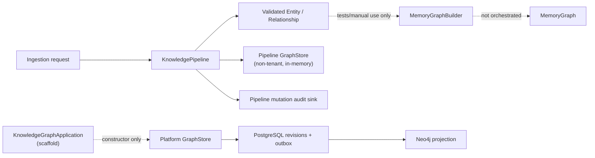
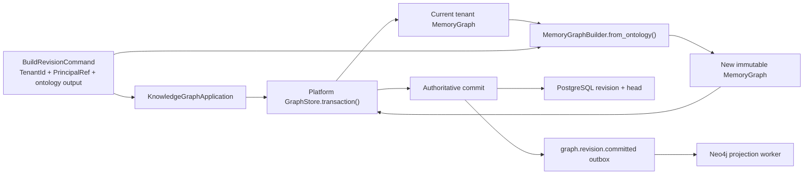
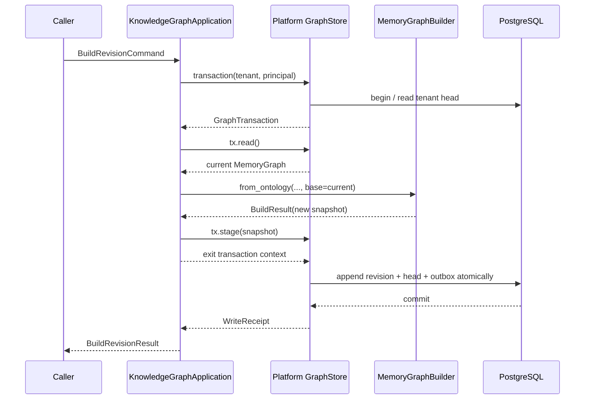

# ADR-022 — Knowledge Graph Revision Build Workflow

**Status:** Accepted

**Owner:** EMG Founder
**Architect:** EMG Founder
**Decision Authority:** Project Architect
**Decision Date:** 2026-08-03

**Date:** 2026-07-26 (original proposal)

**Deciders:** Product / Architecture (EMG Platform)

> **Ratification note — 2026-08-03.** This ADR was authored as a proposal on
> 2026-07-26 and implemented without its status ever being changed. The
> Architecture Baseline Review recorded that omission as finding MAJ-1: live
> code was operating under a document still marked *Proposed*, contrary to
> GR-001 Rules 2 and 6.
>
> **Acceptance is retrospective ratification of the decisions exactly as
> written below. No architectural decision is added, removed, or altered by
> this note, and no new implementation authority is created.** Each of the nine
> §5 decisions was verified against the repository before ratification:
>
> - §5.1 — `emg_platform_core.ports.graph_store.GraphStore` is the sole port
>   implemented by `emg-persistence` and consumed by `services/knowledge-graph`.
> - §5.2 — `emg_knowledge_pipeline.graph_store` remains present but is used by
>   no service; `services/knowledge-graph/tests/test_dependency_boundary.py:57`
>   actively forbids importing it.
> - §5.4 — `KnowledgeGraphApplication.build_revision`
>   (`services/knowledge-graph/src/emg_knowledge_graph/service.py:303`) performs
>   validate → transaction → `from_ontology` → stage → receipt, exactly as
>   specified.
> - §5.5 — `BuildRevisionCommand` carries an explicit `TenantId`; no default or
>   implicit tenant substitution exists.
> - §5.6 — the application never writes revision, head, or outbox rows; the
>   adapter's `transaction()` owns the commit.
> - §5.7 — `MemoryGraphBuilder.from_ontology()` is the sole translation step and
>   receives the transaction's current graph as `base` (`service.py:312-317`).
> - §5.8 — mutation-audit intents and `graph.revision.committed` outbox events
>   remain distinct artifacts.
> - §5.9 — `build_revision` has no HTTP route and is not a production mutation
>   ingress. The five ADR-027 mutation routes are governed by ADR-027, whose
>   Stage 5 record states it claims no production readiness.
>
> The one divergence found is naming only and changes no behaviour: §5.3's
> narrowing of `emg-knowledge-pipeline` is enforced by boundary test rather than
> by removal of the legacy module, which §5.2 expressly permits ("remains
> temporarily so current pipeline behavior and tests continue to work").

**Supersedes:** none

**Related:** ADR-020 (Knowledge Ingestion Layer), Module 7 (FEAT-05-2),
`PHASE2_ARCHITECTURE.md`,
`docs/engineering/memory-graph-architecture.md`

---

## 1. Context

The repository contains two unrelated Python protocols named `GraphStore`.

1. `emg_platform_core.ports.graph_store.GraphStore` persists immutable,
   tenant-scoped `MemoryGraph` snapshots. Its contract requires `TenantId` and
   `PrincipalRef`, exposes an atomic read/stage transaction, and is implemented
   by both `InMemoryGraphStore` and `PostgresNeo4jGraphStore`.
   `PostgresNeo4jGraphStore` makes PostgreSQL authoritative, appends immutable
   revisions, applies optimistic head checks, and writes a
   `graph.revision.committed` transactional outbox event with the revision.
2. `emg_knowledge_pipeline.graph_store.GraphStore` stores individual ontology
   `Entity` and `Relationship` objects. It is append-oriented, has no tenant
   parameter, and has only an in-memory implementation. `KnowledgePipeline`
   currently validates requests, constructs ontology objects, commits them to
   this store, then submits mutation-audit contracts.

The repository also contains:

- validated, immutable ontology `Entity` and `Relationship` models;
- `MemoryGraphBuilder.from_ontology()`, which deterministically converts those
  models and their provenance into an immutable `MemoryGraph`;
- a `KnowledgeGraphApplication` scaffold already typed against the platform-core
  `GraphStore`;
- completed PostgreSQL revision, transactional outbox, and Neo4j projection
  infrastructure.

No production application workflow currently joins these capabilities.

### Current disconnected architecture

## 2. Problem Statement

The duplicate name obscures two different aggregate boundaries and leaves no
canonical route from validated ontology output to tenant-scoped durable graph
revisions. Adapting or extending the wrong contract could bypass tenant
isolation, duplicate persistence responsibilities, weaken the authoritative
transaction, or emit audit and revision events with misleading semantics.

This ADR decides the production persistence contract, responsibility boundaries,
tenant and transaction ownership, event semantics, compatibility treatment of
the pipeline store, and the smallest first implementation sprint.

## 3. Decision Drivers

- PostgreSQL must remain authoritative for production graph revisions.
- Every production graph operation must be explicitly tenant-scoped.
- `MemoryGraph` snapshots and historical revisions remain immutable.
- Deterministic ontology-to-graph conversion must be preserved.
- A revision and its outbox event must commit atomically.
- Optimistic concurrency must remain inside the persistence implementation.
- Mutation-audit events and revision-commit events must retain distinct meanings.
- Existing pipeline tests and callers must not be broken by an unrelated
  orchestration sprint.
- The application layer must depend on the platform port, not on
  `emg-persistence`.
- No new storage abstraction is justified where an implemented production port
  already exists.

## 4. Considered Options

### Option A — Platform GraphStore is canonical; pipeline store is transitional

`emg_platform_core.ports.graph_store.GraphStore` becomes the sole production
graph-persistence contract. The pipeline is narrowed over time to validation and
ontology construction. `KnowledgeGraphApplication` orchestrates conversion and
commit. The pipeline store remains temporarily for legacy tests and compatibility
and is deprecated through a dedicated later migration.

**Assessment:** selected. It uses the implemented tenant, revision, concurrency,
outbox, and projection contracts without weakening them.

### Option B — Adapt the pipeline GraphStore to the platform GraphStore

An adapter could buffer individual ontology objects and translate them into a
snapshot at the pipeline transaction boundary.

**Assessment:** rejected as the canonical design. The source contract lacks
tenant and principal inputs, has explicit `commit()` semantics different from
the platform context-managed transaction, and models individual records rather
than a snapshot aggregate. An adapter would have to invent missing context or
grow a second orchestration layer. A temporary migration adapter may be proposed
later, but is not part of this decision.

### Option C — Keep both stores as independent production systems of record

Ontology records would be persisted in one store and memory revisions in another.

**Assessment:** rejected. This creates dual authority, cross-store atomicity and
reconciliation problems, and an undefined answer when their states diverge.

### Option D — Make the pipeline GraphStore canonical

The append-oriented ontology store would replace the platform port.

**Assessment:** rejected. It discards tenant scoping, immutable revision
semantics, PostgreSQL authority, optimistic concurrency, transactional outbox,
and the implemented Neo4j projection path.

### Option E — Replace both with a new combined abstraction

**Assessment:** rejected. The platform port already expresses the production
aggregate and is implemented across memory and persistence. A new abstraction
would broaden scope without adding a missing domain capability.

## 5. Decision

1. `emg_platform_core.ports.graph_store.GraphStore` is the sole canonical
   production contract for graph persistence.
2. `emg_knowledge_pipeline.graph_store.GraphStore` is classified as a
   **legacy/test compatibility abstraction**. It remains temporarily so current
   pipeline behavior and tests continue to work. It is not used by new
   production workflows and is scheduled for deprecation and later removal in a
   dedicated migration.
3. `emg-knowledge-pipeline` will be narrowed to request validation,
   deterministic identity/resolution, ontology `Entity`/`Relationship`
   construction, and construction of mutation-audit contracts. It will not own
   production graph persistence or the authoritative commit. Dispatch policy for
   those audit contracts belongs to application orchestration.
4. `KnowledgeGraphApplication` owns the revision-build use case: command
   validation at the application boundary, tenant/principal propagation,
   loading the current snapshot through a transaction, invoking
   `MemoryGraphBuilder.from_ontology()`, staging the result, and returning a
   use-case result.
5. `TenantId` enters explicitly in the application command. The
   platform-core `TenantId` value type validates its syntax; the application
   boundary is responsible for requiring it and preventing implicit/default
   tenant substitution. Authorization of a principal for that tenant is outside
   this ADR.
6. The concrete implementation of the platform `GraphStore.transaction()` owns
   the authoritative commit. The application owns transaction orchestration but
   never directly writes revision, head, or outbox records.
7. `MemoryGraphBuilder.from_ontology()` is the sole translation step from
   ontology objects to the memory-graph snapshot in this workflow. It receives
   the transaction's current graph as `base`; it is not duplicated in the
   application or persistence layer.
8. Pipeline mutation-audit events and `graph.revision.committed` outbox events
   are distinct and neither substitutes for the other.
9. In the first implementation sprint, the revision outbox event is required
   when the persistent adapter creates a revision because it is already part of
   the authoritative transaction. Mutation-audit dispatch/reconciliation is
   deferred. Consequently, that sprint is an internal orchestration slice and
   **must not be enabled as a production mutation ingress** until the audit
   requirement is implemented or separately approved.

## 6. Detailed Responsibility Boundaries

| Component | Owns | Does not own |
| --- | --- | --- |
| Ingress adapter (future) | Transport decoding; authenticated context handoff | Graph construction, persistence, authorization policy |
| `KnowledgeGraphApplication` | Command boundary; explicit tenant/principal; workflow orchestration; typed result/error mapping | SQL, Neo4j, revision numbering, outbox rows, ontology rules |
| `emg-knowledge-pipeline` (target) | Request conformance; deterministic IDs; endpoint resolution; ontology construction; mutation-audit contract construction | Production `MemoryGraph` persistence; PostgreSQL/Neo4j; authoritative commit |
| `MemoryGraphBuilder` | Deterministic ontology-to-snapshot conversion; evidence bridging; immutable merge rules | Tenant validation; persistence; event publication |
| Platform `GraphStore` port | Tenant-scoped snapshot read/write contract and atomic transaction boundary | Ontology validation; transport; authorization |
| `PostgresNeo4jGraphStore` | PostgreSQL revision/head update; optimistic concurrency; revision outbox in the same DB transaction | Application workflow; pipeline mutation-audit semantics |
| Projection worker | Applies committed revision events to Neo4j | Authoritative graph mutation |

The application service may be injected with the platform port and builder. It
must not import `emg_persistence` or the pipeline `GraphStore`.

## 7. Canonical Revision Build Lifecycle

Canonical behavior:

1. The caller supplies already validated ontology objects in the first sprint.
2. The application validates the command envelope and requires explicit
   `TenantId`, `PrincipalRef`, and deterministic `as_of`.
3. The application opens `GraphStore.transaction(tenant, principal)`.
4. It reads the current tenant snapshot from the transaction.
5. It calls `MemoryGraphBuilder.from_ontology(..., base=current)`.
6. It stages the returned immutable graph on the same transaction.
7. Successful context exit delegates commit to the store implementation.
8. The persistent adapter appends a revision and its outbox event atomically
   when content changed. A deterministic no-op creates neither a new revision
   nor an outbox event under the existing persistence contract.
9. The application returns a typed result based on `BuildResult` and the
   transaction `WriteReceipt`; it does not manufacture a revision number that
   the port does not expose.

## 8. Tenant Boundary

`TenantId` is part of the application command, not a value inferred from an
entity, relationship, principal, environment variable, or store default.

- The transport layer will eventually obtain the raw tenant identifier from
  authenticated request context.
- The application boundary constructs or receives `TenantId` and rejects a
  missing tenant before opening a transaction.
- `TenantId` performs shared syntactic validation.
- Future authorization policy determines whether `PrincipalRef` may act for the
  tenant; this is not delegated to `MemoryGraphBuilder`.
- The platform `GraphStore` and persistence adapter enforce that all reads,
  heads, revisions, and writes use the supplied tenant.

## 9. Transaction Boundary

The canonical sequence is:

The application does not call a pipeline transaction and platform transaction
for the same mutation. There is one authoritative graph commit. Exceptions from
validation, graph merge, concurrency, or persistence abort the platform
transaction and produce no partial revision.

## 10. Event Semantics

### Pipeline mutation-audit events

Events such as `entity.created`, `relationship.created`, and supersession events
describe governed domain mutations and support audit/provenance requirements.
The current pipeline builds and submits them after its in-memory ontology-store
commit. Their subject is an entity or relationship, and their identifiers are
referenced by ontology provenance.

### Revision outbox event

`graph.revision.committed` describes one successfully committed tenant graph
revision. It carries tenant, revision number, hashes, principal, counts, and
timestamp. `PostgresNeo4jGraphStore` writes it in the same PostgreSQL transaction
as the revision and head. Its immediate consumer is projection infrastructure.

### Reconciliation decision

Both event families are required in the eventual production workflow because
they answer different questions:

- mutation audit: what governed assertion changed, with which provenance;
- revision event: which tenant snapshot durably committed and is ready for
  projection.

The first implementation sprint requires only the revision event path, which is
already guaranteed behind the persistent store. It does not add mutation-audit
dispatch. Before production ingress is enabled, a follow-up decision or sprint
must define idempotency, ordering, failure handling, and whether audit submission
uses its own durable outbox. The application must never claim a submitted audit
event merely because a revision event exists.

## 11. Migration / Compatibility Strategy

1. Keep the pipeline `GraphStore`, its in-memory adapter, and current tests
   unchanged during the first sprint.
2. Mark the contract as legacy/test-only in a later dedicated deprecation change;
   do not silently alter its runtime semantics in this ADR.
3. New application code must not import or accept the pipeline store.
4. Add dependency-boundary tests preventing the service from importing
   `emg_knowledge_pipeline.graph_store` or concrete persistence modules.
5. In a later migration, extract a pure validation/ontology-construction result
   from `KnowledgePipeline`. Migrate callers to pass that result to
   `KnowledgeGraphApplication`.
6. Design audit reconciliation before removing the pipeline's existing
   post-commit audit path.
7. Remove the legacy store only after repository call sites and compatibility
   tests show that no supported consumer depends on it.

No existing graph revision, graph head, outbox record, ontology identifier, or
public graph ID is rewritten by this strategy.

## 12. Consequences

### Positive

- One production graph authority and one production persistence contract.
- Tenant scoping is explicit and type-checked at every workflow invocation.
- Existing immutable revision, concurrency, outbox, and projection behavior is
  reused rather than reimplemented.
- Ontology construction remains separated from snapshot construction.
- Tests can use the core in-memory store through the same production port.
- Duplicate `GraphStore` names no longer imply equal production status.

### Negative

- The pipeline temporarily retains a legacy store while migration is incomplete.
- The first sprint accepts validated ontology output rather than completing the
  full request-to-revision path.
- Mutation-audit reconciliation remains a production-enablement dependency.
- `WriteReceipt` does not expose a revision number, so the first application
  result cannot promise one without changing the port.

## 13. Risks and Mitigations

| Risk | Mitigation |
| --- | --- |
| Developers import the pipeline store into new service code | Dependency-boundary tests and explicit deprecation documentation |
| Missing or implicit tenant causes cross-tenant writes | Require `TenantId` in the command and transaction; no default tenant |
| Concurrent builds lose updates | Use one platform `GraphStore.transaction()` read/stage/commit cycle |
| Builder output diverges from ontology identity | Use `from_ontology()` directly and retain deterministic regression tests |
| Audit and revision events are treated as substitutes | Separate types, semantics, and acceptance tests; production gate on audit reconciliation |
| A no-op is reported as a new revision | Result wording follows existing receipt/build semantics; do not invent revision metadata |
| Legacy pipeline removal breaks tests or callers | Dedicated, measured migration after call-site inventory |
| Application couples to PostgreSQL or Neo4j | Inject only the platform port; retain forbidden-import tests |

## 14. Deferred Work

- Pipeline request-validation extraction/refactoring.
- Pipeline `GraphStore` deprecation annotation and removal.
- Mutation-audit durability, reconciliation, and retry design.
- External outbox relay and broker integration.
- HTTP/API transport.
- Authentication and tenant authorization gateway integration.
- Changes to the platform `GraphStore`, `GraphTransaction`, or `WriteReceipt`.
- Persistence, PostgreSQL migration, and Neo4j projection changes.
- Bulk rebuilds, historical migration, or temporal-edge repair.
- Cross-tenant batch commands.
- Supersession lifecycle redesign.

## 15. Implementation Guardrails

- Depend on `emg_platform_core.ports.graph_store.GraphStore`, never the pipeline
  store or a concrete persistence adapter.
- Require `TenantId`, `PrincipalRef`, and `as_of` explicitly.
- Open exactly one platform graph transaction per command.
- Read the base snapshot and stage the result through that transaction.
- Invoke `MemoryGraphBuilder.from_ontology()`; do not reproduce conversion logic.
- Preserve ontology relationship IDs, evidence, validity, and graph immutability.
- Do not catch and translate errors so broadly that validation, merge conflict,
  concurrency, and persistence failures become indistinguishable.
- Do not publish audit or revision events from the application service.
- Do not infer revision numbers from content hashes or tenant state.
- Do not introduce HTTP, persistence wiring, authorization, or migration work.
- Do not enable the first slice as production ingress before audit reconciliation.

## 16. First Implementation Sprint Scope

### In scope

1. Add immutable command, result, and typed application-error models under
   `services/knowledge-graph`.
2. Define a command containing:
   - explicit `TenantId`;
   - explicit `PrincipalRef`;
   - validated ontology `Entity` and `Relationship` tuples;
   - explicit `as_of`;
   - optional deterministic labels supported by the existing builder.
3. Inject `MemoryGraphBuilder` into `KnowledgeGraphApplication`, with a default
   instance only if repository dependency conventions permit it.
4. Implement the single transaction lifecycle:
   `transaction` → `read` → `from_ontology(base=current)` → `stage` → commit on
   context exit → result from `BuildResult` and `WriteReceipt`.
5. Add unit tests using `emg_platform_core.InMemoryGraphStore` for:
   - first build;
   - incremental build;
   - deterministic replay/no-op;
   - tenant isolation;
   - relationship-version identity and evidence preservation;
   - merge conflict rollback;
   - error/result behavior;
   - explicit tenant/principal propagation.
6. Extend dependency-boundary tests to prohibit pipeline-store and concrete
   persistence imports and to confirm the platform port annotation.
7. Document that this slice is internal-only pending audit reconciliation.

### Acceptance criteria

- No service module imports `emg_persistence` or
  `emg_knowledge_pipeline.graph_store`.
- Every command carries a validated tenant and principal.
- One transaction contains read, build, and stage.
- Failed builds leave the prior graph unchanged.
- Identical inputs remain deterministic and do not create false mutation claims.
- Tests pass against the core in-memory adapter without PostgreSQL or Neo4j.
- No existing pipeline, memory-graph, platform-core, or persistence behavior is
  modified.

## 17. Explicit Non-Goals

- HTTP endpoints or API schemas.
- Authentication, authorization, or policy enforcement.
- A new GraphStore protocol or changes to either existing protocol.
- Changes to `emg-persistence`, PostgreSQL schemas, outbox schemas, or Neo4j.
- External event relay.
- Mutation-audit reconciliation implementation.
- Deletion of the pipeline store.
- Large pipeline refactoring.
- Graph migration, repair, rebuild, or backfill.
- Entity-resolution redesign.
- Service deployment or production enablement.

## 18. Evidence

The decision is based on these repository paths and symbols:

- `libs/python/emg-platform-core/src/emg_platform_core/ports/graph_store.py`
  — canonical `GraphStore`, `GraphTransaction`, and `WriteReceipt`.
- `libs/python/emg-platform-core/src/emg_platform_core/adapters/in_memory.py`
  — tenant-scoped in-memory implementation used by contract tests.
- `libs/python/emg-platform-core/src/emg_platform_core/identity/tenant.py`
  — validated `TenantId`.
- `libs/python/emg-persistence/src/emg_persistence/store.py`
  — `PostgresNeo4jGraphStore.transaction()`, `_persist()`, `_revision_for()`,
  and `_outbox_event_for()`.
- `libs/python/emg-persistence/src/emg_persistence/projection/worker.py`
  — consumer of `graph.revision.committed`.
- `libs/python/emg-knowledge-pipeline/src/emg_knowledge_pipeline/graph_store.py`
  — non-tenant ontology-object store and only concrete in-memory adapter.
- `libs/python/emg-knowledge-pipeline/src/emg_knowledge_pipeline/pipeline.py`
  — validation, legacy persistence, and post-commit mutation-audit dispatch.
- `libs/python/emg-memory-graph/src/emg_memory_graph/builder.py`
  — deterministic `MemoryGraphBuilder.from_ontology()`.
- `services/knowledge-graph/src/emg_knowledge_graph/service.py`
  — current application scaffold using the platform port.
- `services/knowledge-graph/tests/test_dependency_boundary.py`
  — existing platform-port and forbidden-import boundary tests.

## 19. Decision Summary

The platform-core `GraphStore` is the sole production persistence contract.
`KnowledgeGraphApplication` owns tenant-scoped orchestration,
`MemoryGraphBuilder` owns deterministic translation, and the concrete platform
store owns the authoritative commit and revision outbox. The pipeline is narrowed
over time to validation and ontology/audit-contract construction; its store is
temporarily retained as legacy/test compatibility and later removed through a
dedicated migration. Revision and mutation-audit events remain distinct. The
first sprint implements only the internal revision-build slice and is not
production-enabled until audit reconciliation is resolved.

## 20. Approval

This ADR is **Accepted** — ratified 2026-08-03 by the Project Architect; see the
ratification note in the header. *(This section originally read "This ADR is
**Proposed**. Implementation may begin only after architecture approval." It is
corrected here solely to remove a factual contradiction with the ratified
status; the approval conditions below are unchanged.)*

**Production enablement is unchanged and still conditional.** It additionally
requires the mutation-audit condition in sections 5, 10, 14, and 16 to be
resolved or explicitly waived by the designated deciders. That condition is
**not** resolved: ADR-028 (Audit Reconciliation) remains Draft and no consumer
of the `mutation_dispatch` `audit` channel exists. Ratification of this ADR
grants no production enablement.
