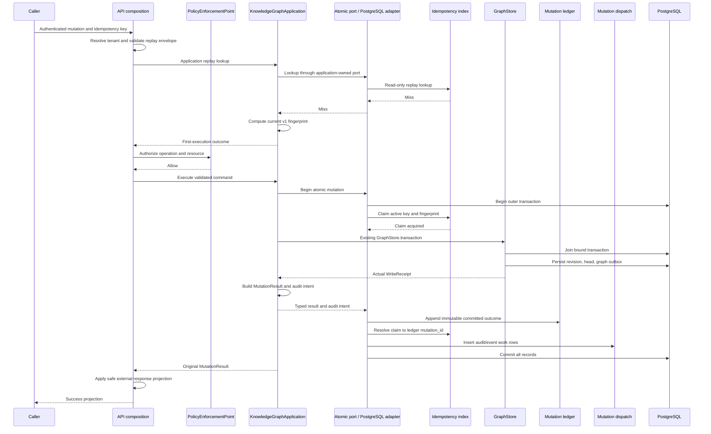
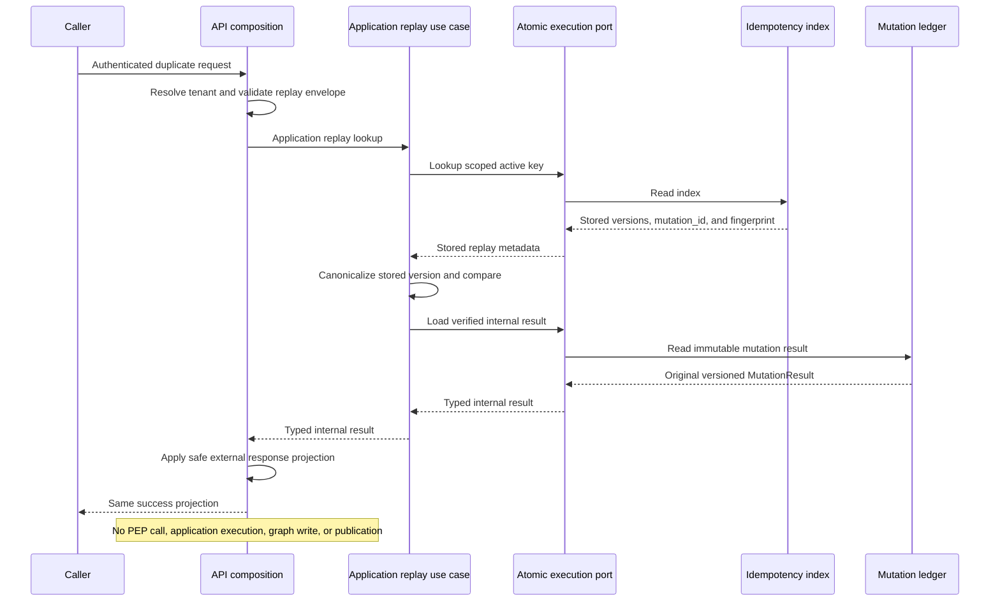
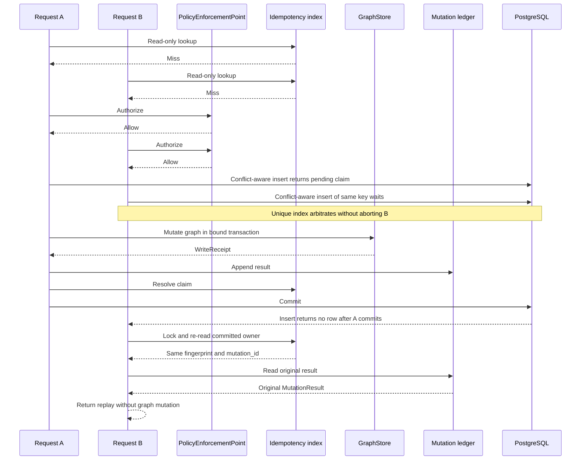
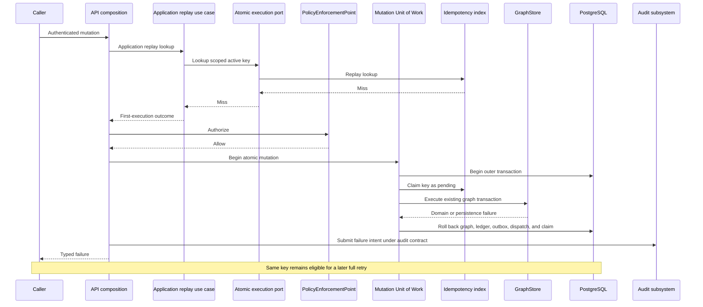

# ADR-030 — Mutation Ledger & Atomic Idempotency

## 1. Title

Mutation Ledger & Atomic Idempotency

## 2. Status

**Approved — Revision 3.**

**Architecture Board approval:** 2026-07-28 — **APPROVED WITH MINOR
CHANGES**, confidence **97/100**. Revision 3 incorporates all three approved
editorial clarifications; no architectural behavior changed.

**Date:** 2026-07-28

**Deciders:** Principal Software Architect / Architecture Board (EMG
Platform)

**Depends on:** ADR-022 (Revision Build Workflow), ADR-023 (Revision History
and Navigation), ADR-027 Revision 3 (Knowledge Graph Mutation API), ADR-029
(Canonical Entity and Relationship Identity, Lifecycle, and Supersession
Model)

**Related:** ADR-025 (Tenant and Authorization Model), ADR-026 Revision 2
(Classification Enforcement Model), ADR-028 (Audit reconciliation, when
approved)

This ADR resolves the atomicity, concurrency, deterministic-replay, audit
foundation, and event-publication blockers for ADR-027 Stage 3. It does not
modify or supersede ADR-027 or ADR-029. As approved, ADR-027
continues to own mutation commands and orchestration, while this ADR owns the
durable mutation ledger and atomic idempotency mechanism.

Revision 2 retains Revision 1's architectural direction and applies every
required correction from the independent Principal Enterprise Architecture
review. In particular, it removes UUID ordering assumptions, makes database
WAL commit position authoritative for CDC, defines non-skipping polling,
separates ledger completion time from graph-revision time, makes the claim
protocol executable under PostgreSQL `READ COMMITTED`, restores dependency
inversion, supports ADR-027 batches without synthetic resources, separates
internal replay state from the external response, completes fingerprint
version 1, defines scalar/JSON integrity, specifies a single-writer
multi-region model, and makes V004 rolling-deployment compatible.

Revision 3 finalizes the approved ADR by clarifying transport versus ontology
correlation identifiers, limiting `IdempotencyContentionError` to
idempotency-claim contention, and removing an unintended batch-resource
uniqueness rule. No implementation is authorized by this status change.

## 3. Context

ADR-027 defines caller-supplied idempotency keys, a 24-hour configurable
replay window, replay before repeated authorization, and storage in
`mutation_idempotency`. Its Stage 0 migration, V003, creates that table with
a unique key on `(tenant_id, principal_id, idempotency_key)`. ADR-027 also
states that only successful mutations receive an idempotency record.

The current application mutation path returns an immutable `MutationResult`
derived from the committed `WriteReceipt` and includes build statistics and
`MutationAuditIntent` values. The existing PostgreSQL GraphStore atomically
persists a graph revision, advances the tenant head using optimistic
concurrency, and writes the graph-revision outbox event inside its own
`TransactionProvider.transaction()` scope.

Those individually correct decisions leave a Stage 3 atomicity gap:

1. Writing the idempotency record after `GraphStore.transaction()` commits
   permits the graph mutation to succeed while the replay record fails.
2. Looking up a key before mutation and inserting its result after mutation
   is a check-then-act race. Two concurrent requests can both observe a miss
   and both attempt the graph mutation.
3. The V003 record stores only a `WriteReceipt`; the public Stage 1
   application contract is `MutationResult`. Reconstructing missing build
   statistics or audit intents during replay would not return the original
   result deterministically.
4. V003 is a time-limited replay index, not an immutable record. Expiry and
   deletion would erase mutation history.
5. No committed command-level record exists from which audit persistence,
   event publication, CDC, analytics, or recovery can be built without
   coupling those concerns to GraphStore or reconstructing intent from graph
   snapshots.
6. A standalone reservation transaction or process-local lock would not be
   atomic with the authoritative graph revision and would not be safe across
   service instances.

The repository already contains the required transaction seam. The
PostgreSQL GraphStore depends on the internal `TransactionProvider`
abstraction rather than acquiring connections directly. An
application-owned atomic-execution port with a PostgreSQL adapter can
therefore bind one transaction and inject a provider that lets the unchanged
GraphStore join it. The public `GraphStore` and `GraphTransaction` contracts
require no change, and no persistence dependency crosses into the
application.

## 4. Decision

### 4.1 Decision summary

The platform shall use two related but distinct persistence structures:

1. **`mutation_ledger`** is a permanent, append-only record of every
   successfully committed or successful no-op mutation. It is the canonical
   command-level mutation history and the foundation for audit, events, CDC,
   analytics, recovery, and replay.
2. **`mutation_idempotency`** remains the bounded-lifetime coordination and
   replay index. It owns the unique active key claim and points to the
   immutable ledger record containing the result.

A third, operational structure, **`mutation_dispatch`**, shall contain
durable per-channel work rows inserted atomically with each ledger record.
It is mutable delivery state, not mutation history. Polling consumers claim
these rows rather than advancing a high-water cursor over ledger identifiers;
therefore a transaction that commits late cannot be skipped.

One application-owned atomic-execution port, implemented by a
persistence-owned PostgreSQL **Mutation Unit of Work**, shall atomically
encompass:

- the active idempotency-key claim;
- the graph revision, tenant-head update, and existing graph outbox write
  performed by the unchanged GraphStore;
- the immutable mutation-ledger insert; and
- resolution of the idempotency index to the committed ledger record; and
- creation of the mutation's audit/event dispatch work rows.

The database unique constraint on
`(tenant_id, principal_id, idempotency_key)`, not an application lock, is the
concurrency authority. PostgreSQL is the authoritative transaction boundary.
PostgreSQL WAL commit position, not a UUID, sequence allocation, or wall-clock
timestamp, is the authoritative ordering for CDC.

### 4.2 Authority boundaries

- **ADR-029** remains the sole authority for entity and relationship
  identity, lifecycle, supersession, merge behavior, temporal validity, and
  immutable replacement construction.
- **ADR-027** remains the authority for mutation command DTOs, command
  validation, application orchestration, operation names, authorization
  sequencing, and the 24-hour default idempotency window.
- **ADR-025/026 and the Policy Engine** remain the sole authorization and
  classification-decision path.
- **ADR-022/023 and GraphStore** remain the authority for graph revision
  construction, optimistic head advancement, receipts, and immutable
  revision history.
- **ADR-030** owns only the durable mutation record, fingerprint contract,
  replay contract, and the transaction composition required to make
  idempotency atomic with GraphStore.

No ledger component may interpret lifecycle, merge, authorization, or graph
domain rules.

### 4.3 Mutation history semantics

The ledger records **committed mutation outcomes**, not every request
attempt. Its initial status vocabulary is:

- `succeeded`: the command committed a new graph revision;
- `no_op`: the command completed successfully but the authoritative graph
  content was unchanged and GraphStore returned the existing head.

Validation failures, authorization denials, domain failures, optimistic
conflicts, and infrastructure failures do not produce ledger rows or durable
idempotency claims. They remain failed attempts and may be recorded by the
Audit subsystem under its own contract. This preserves ADR-027's requirement
that a failed request may safely retry with the same key.

`status` is deliberately not used for `pending`. Pending is coordination
state in the idempotency index, not immutable mutation history. Delivery
state for audit or events is also excluded from the ledger and belongs to
consumer checkpoints or delivery records.

### 4.4 Immutability

Once inserted, a `mutation_ledger` row shall never be updated or deleted by
normal application roles. Database privileges shall deny `UPDATE` and
`DELETE`; a database guard shall enforce the append-only invariant even if a
repository defect issues either operation.

The ledger is not subject to the idempotency TTL. Expiring an active replay
key removes only its `mutation_idempotency` index row. The historical ledger
row remains. After expiry, reuse of the same literal key is a new mutation
attempt with a new `mutation_id`; the ledger therefore must not impose
permanent uniqueness on `(tenant_id, principal_id, idempotency_key)`.

## 5. Data Model

### 5.1 Immutable `mutation_ledger`

| Field | Type/constraint | Purpose |
|---|---|---|
| `mutation_id` | UUID, primary key | Globally unique identity for one committed mutation outcome. Generated by the server and never supplied by a caller. It has no ordering semantics. |
| `tenant_id` | text, not null | Tenant boundary of the mutation and mandatory partition/filter key. |
| `principal_id` | text, not null | Stable identity of the authenticated principal that caused the original mutation. |
| `principal_kind` | text, not null | Distinguishes human and service identities without storing mutable roles or claims. |
| `idempotency_key` | text, not null | Opaque caller key associated with the original execution. It is historical data here, not the permanent uniqueness key. |
| `command_fingerprint` | char(64), not null | Lowercase hexadecimal SHA-256 digest of the canonical command envelope. |
| `fingerprint_version` | small integer, not null | Identifies the exact canonicalization and normalization contract used to produce the fingerprint. Initial value: `1`. |
| `command_schema_version` | small integer, not null | Identifies the semantic command-envelope schema stored by this mutation. Initial value: `1`. |
| `operation` | text, not null | ADR-027 resource/action operation, such as `entity.create` or `relationship.close`. It is a closed application vocabulary, not an arbitrary event name. |
| `status` | text, not null, constrained | Committed outcome: `succeeded` or `no_op`. |
| `graph_revision` | integer, not null | Authoritative graph revision identified by the committed receipt. For `no_op`, this is the unchanged current head. |
| `graph_content_hash` | text, not null | Authoritative content hash from the committed receipt, enabling reconciliation without recomputation. |
| `write_receipt` | JSONB, not null | Lossless, versioned serialization of the actual GraphStore `WriteReceipt`; never manually recomputed. |
| `mutation_result` | JSONB, not null | Lossless, versioned serialization of the exact application `MutationResult` returned by the original execution. This is the replay source. |
| `audit_intents` | JSONB, not null | Exact immutable `MutationAuditIntent` collection generated by the application for the committed mutation. Empty only where the command contract permits it. |
| `resource_count` | integer, not null, positive | Count of immutable child resource-reference rows. A batch has one row per affected resource; a single-resource mutation has one. |
| `requested_at` | timestamptz, not null | Server-observed request time after authentication and tenant resolution. It is trace data, not commit ordering. |
| `ledger_completed_at` | timestamptz, not null | Database-generated time at which the complete ledger outcome is finalized immediately before outer commit. It is the authoritative business completion time and the origin of the replay TTL, but not a total commit-order cursor. |
| `graph_revision_at` | timestamptz, not null | Exact `WriteReceipt.committed_at`. For a no-op this is intentionally the existing graph revision's earlier creation time. |
| `replay_expires_at` | timestamptz, not null | `ledger_completed_at` plus the configured replay duration, calculated by PostgreSQL from one database-time value. Retained historically after index reclamation. |

Serialized `write_receipt`, `mutation_result`, and `audit_intents` shall each
carry an explicit payload schema version. The JSON values are immutable
evidence of the response and intent at commit time; they are not an
alternative source of graph truth.

`tenant_id`, `principal_id`, `principal_kind`, revision, content hash, and
`graph_revision_at` shall be taken from the authenticated context and actual
GraphStore receipt, not trusted from client JSON. `ledger_completed_at` and
`replay_expires_at` shall be calculated by PostgreSQL, never by an
application host clock.

`ledger_completed_at` is authoritative for human-facing mutation completion
time. It is deliberately distinct from `graph_revision_at`; the latter may
predate a no-op mutation. Neither timestamp establishes total database commit
order. Logical CDC uses WAL commit position as specified in §10.6.

### 5.2 Immutable `mutation_ledger_resource`

One mutation may affect one or many real resources. Resources shall be
represented by immutable child rows rather than a synthetic "batch"
resource:

| Field | Type/constraint | Purpose |
|---|---|---|
| `mutation_id` | UUID, foreign key | Parent mutation. |
| `ordinal` | integer, non-negative | Stable position in the command's canonical resource list. |
| `resource_type` | text, not null | ADR-027 resource category. |
| `resource_id` | text, not null | Actual affected resource identity. |
| `action` | text, not null | Action applied to this resource. |
| `classification` | text, not null | Classification captured for this resource in its committed audit intent; never an authorization decision. |
| `reason` | text, nullable | Exact reason associated with this resource's audit intent. |

The primary key is `(mutation_id, ordinal)`. There is no uniqueness
constraint on `(mutation_id, resource_type, resource_id, action)`: if
ADR-027 command validation accepts repeated occurrences, each occurrence is
represented without loss by its distinct ordinal. The ledger does not
introduce an additional batch-validation rule. The parent `resource_count`
must equal the number of child rows; the persistence adapter validates this
before insertion and a deferred database constraint/guard validates it at
outer commit.

ADR-027 batch order is preserved in `ordinal`; no resource identity is
invented. Multiple audit intents remain attached to the one parent mutation
and one graph revision.

### 5.3 Active `mutation_idempotency` index

V004 shall evolve the V003 table into an active-key index with:

- its existing composite primary key
  `(tenant_id, principal_id, idempotency_key)`;
- `operation_type`;
- `command_fingerprint`;
- `fingerprint_version`;
- `state`, constrained to `pending`, `succeeded`, or
  `legacy_succeeded`; the third value exists only for rows created before
  ADR-030 and may never be written by ADR-030 application code;
- nullable `mutation_id`, referencing `mutation_ledger` once succeeded;
- `requested_at` and `expires_at`;
- outcome columns retained for V003 compatibility, nullable while pending
  and required when succeeded.

Database constraints shall enforce:

- a pending row has no `mutation_id` or outcome payload;
- a succeeded row has a `mutation_id`, revision, content hash, and receipt;
- a legacy-succeeded row preserves its V003 outcome but has no fabricated
  fingerprint, ledger reference, or full mutation result;
- a `mutation_id` references a ledger row in the same tenant and principal
  scope;
- an unexpired key has at most one owner by virtue of the existing primary
  key.

The index is operational state. It may be updated from `pending` to
`succeeded` inside the creating transaction and may be deleted after expiry.
It is not the audit or history system.

At claim insertion, a pending row receives a provisional `expires_at` from
the database claim cutoff plus the configured duration solely to satisfy the
V003-compatible non-null column. Before outer commit, resolution to
`succeeded` replaces it with the authoritative
`ledger_completed_at + replay duration`. Because a valid pending row is
never committed or externally visible, the provisional value never defines
a replay window.

### 5.4 Mutable `mutation_dispatch`

V004 shall create a durable dispatch table separate from the immutable
ledger. Each successful/no-op ledger insertion creates, in the same outer
transaction, one work row for each configured foundation channel:
`audit` and `event`.

Its primary key is `(channel, mutation_id)`. It contains `tenant_id`,
`available_at`, a bounded attempt counter, claim ownership/expiry, and
`delivered_at`. These fields are mutable operational state and are never
copied into the ledger.

Polling is work-set based, not cursor based:

- a worker claims undelivered rows for its channel using row locks with
  skip-locked semantics;
- claim and delivery transitions are transactional;
- an expired worker claim becomes eligible for another worker;
- delivery is idempotent using `(channel, mutation_id)` as the external
  event identity; and
- a row remains queryable until delivery is durably acknowledged.

Because every committed mutation has its dispatch rows and polling searches
the remaining work set, transaction commit reordering cannot cause a
mutation to be skipped. This table is a foundation only; ADR-030 does not
implement a publisher or audit worker.

### 5.5 Relational integrity

The ledger shall have indexes supporting:

- ordered mutation display by tenant and
  `ledger_completed_at`/`mutation_id`;
- lookup by graph revision;
- lookup by principal.

It shall also declare a unique candidate key on
`(tenant_id, principal_id, mutation_id)` so the idempotency index can enforce
its same-tenant, same-principal composite foreign key rather than relying on
repository code alone.

The idempotency index retains its expiry index for reclamation. All
tenant-scoped repository operations shall include `tenant_id`; a ledger
repository may not expose an unscoped read method.

### 5.6 Scalar and JSON authority

The representations have separate, explicit authority:

- the immutable GraphStore revision is authoritative graph state;
- `write_receipt` is the canonical serialized receipt returned by
  GraphStore;
- `mutation_result` is the canonical internal application replay object;
- relational ledger columns and resource child rows are the canonical
  query, reconciliation, and analytics projection of those typed objects;
  and
- `audit_intents` is the canonical internal audit handoff and must equal the
  audit-intent member stored in `mutation_result`.

The application-owned execution port accepts typed, immutable receipt,
result, and audit-intent values. Its persistence adapter serializes each
value once and derives scalar columns from those same typed instances. It
must reject the transaction before insertion if tenant, principal, revision,
hash, graph timestamp, status, resource count, per-resource
classification/reason, or audit intents disagree.

V004 shall add database checks for JSON schema version, receipt/result tenant
and principal, revision, hash, graph timestamp, `revision_created` versus
ledger status, and equality of the duplicated audit-intent JSON. It shall
also add the candidate key necessary for a composite foreign key from
`(tenant_id, graph_revision, graph_content_hash)` to the authoritative graph
revision. A constraint that cannot be expressed declaratively shall be
enforced by one narrowly scoped database guard and tested by deliberate
corrupt inserts.

On read, a schema-version or consistency failure is corruption: replay fails
closed, no payload is returned, and an operational integrity alert is
raised. A reader never chooses one disagreeing representation heuristically.

## 6. Fingerprint Contract

### 6.1 Canonical representation

Fingerprint version 1 uses one closed envelope with exactly these members:

| Member | Canonical value |
|---|---|
| `schema` | Literal `emg.kg.mutation-command`. |
| `schema_version` | Integer `1`. |
| `fingerprint_version` | Integer `1`. |
| `operation` | ADR-027 canonical operation string. |
| `tenant_id` | Exact validated `TenantId.value`. |
| `principal` | Object containing exact validated `principal_id` and `kind`. |
| `as_of` | UTC datetime in the format defined in §6.2. |
| `payload` | Command-specific object defined below, with every declared member present. |

The envelope is serialized with RFC 8785 JSON Canonicalization Scheme (JCS),
encoded as UTF-8, and hashed with SHA-256. The stored fingerprint is exactly
64 lowercase hexadecimal characters. SHA-256 is used only as a deterministic
equality digest; it grants no authorization and is not a MAC.

Version 1 command payloads are closed:

- **Create entity:** canonical ontology entity, including every declared
  entity field with validated defaults materialized.
- **Replace entity:** canonical replacement `MemoryNode`, replacement
  action, and exact validated optional reason.
- **Replace relationship:** canonical replacement `MemoryEdge`.
- **Close relationship:** exact edge identity and exact validated required
  reason.
- **Merge entities:** exact survivor identity, source identities sorted by
  Unicode code-point order because ADR-029 defines them as an unordered set,
  and exact validated required reason.
- **ADR-027 batch:** ordered sequence of canonical batch items. Caller item
  order is preserved because ADR-027 validation and dependency processing
  may make order semantic. Each item uses its corresponding single-operation
  payload above. No synthetic batch resource is added.

Canonical ontology and memory-graph objects contain exactly their declared,
public, persisted domain fields. Private attributes, Python representations,
computed caches, and fields unknown to the declared schema are forbidden.
Nested metadata is recursively normalized under §6.2.

The fingerprint excludes:

- `idempotency_key`;
- `mutation_id`;
- server timestamps;
- HTTP headers and transport-level request, trace, and correlation
  identifiers;
- roles, scopes, clearance, token contents, and policy decisions;
- generated audit intents;
- receipts, revision numbers, content hashes, build statistics, and any
  other execution result;
- transport spelling of omitted defaults, because every declared default is
  materialized before serialization; and
- delivery or retry metadata.

Transport correlation identifiers are excluded because they describe a
delivery attempt, not the mutation command. In contrast, the declared
ontology `Entity.correlation_id` and `Relationship.correlation_id` fields are
part of their canonical command payloads and **are included** in fingerprint
version 1. The same distinction applies recursively: only correlation fields
declared by the versioned ontology/domain payload schema are included.

Excluding mutable authorization claims is necessary because replay is a
lookup of a previously authorized committed result, not a new policy
decision. Including the principal identity prevents the canonical content
from being portable across principals even though the database key already
provides that isolation.

### 6.2 Normalization rules

- **Unicode:** no NFC, NFD, compatibility, case, whitespace, or locale
  normalization is performed. Exact validated Unicode scalar sequences are
  preserved so values that the domain considers distinct cannot collapse to
  one fingerprint. Unpaired surrogates are rejected. Existing command/domain
  validation remains authoritative for control and bidirectional characters;
  fingerprinting adds no broader semantic rejection. JCS escaping and UTF-8
  encoding then apply.
- **Datetimes:** every datetime must be timezone-aware. It is converted to UTC
  and encoded as exactly `YYYY-MM-DDTHH:MM:SS.ffffffZ`, always including six
  microsecond digits. Leap-second strings are not accepted by version 1.
- **Integers:** JSON numbers are permitted only in the interoperable exact
  range `[-9007199254740991, 9007199254740991]`.
- **Floating point:** only finite IEEE-754 binary64 values are accepted and
  serialized under RFC 8785/ECMAScript number rules. Negative zero
  canonicalizes to zero. NaN and infinities are rejected. Decimal,
  arbitrary-precision numeric, and numeric-string coercion are not part of
  version 1.
- **Booleans and null:** serialize as their JSON values without coercion.
- **Enums:** serialize to their exact declared string value.
- **Objects:** contain only schema-declared keys; unknown keys are rejected.
  JCS supplies recursive lexicographic property ordering.
- **Collections:** tuples and lists preserve order unless §6.1 explicitly
  declares the field set-like. Only merge `source_ids` are set-like in
  version 1 and are sorted by exact Unicode code-point order. Batch items,
  evidence, histories, aliases, supersession lists, relationship endpoints,
  and every other collection preserve validated order.
- **Defaults:** the versioned command schema materializes every declared
  default. Omission and an explicitly supplied equal default produce the
  same fingerprint. `None`, an empty collection, an empty string, and an
  omitted value remain distinct unless existing command validation already
  makes them equivalent.
- **Strings:** no trimming occurs. Existing validation may inspect a stripped
  value to reject blank input, but the exact accepted value consumed by the
  command is fingerprinted.

Transport parsing sufficient to obtain these typed values is not a second
authorization or domain execution. A successful replay still skips PEP,
graph reads, ADR-029 validation, and mutation execution.

### 6.3 Stability and evolution

Fingerprint version 1 is immutable after release. Changes in command DTO
layout, Python serialization libraries, map insertion order, or deployment
platform must not alter its bytes.

Any semantic canonicalization change requires a new
`fingerprint_version`. Any command-envelope shape change requires a new
`command_schema_version`. Existing ledger rows retain their versions and
remain replayable from their stored `mutation_result`; they are never
re-fingerprinted using a newer algorithm. During an active replay window,
the service must support every fingerprint version present in the
idempotency index.

### 6.4 Version lookup sequence

Version selection occurs in this fixed order:

1. authenticate and resolve tenant/principal;
2. validate only idempotency-key and transport-envelope shape;
3. look up the scoped active key without a fingerprint;
4. on a miss or expired key, canonicalize with current version 1;
5. on a succeeded hit, canonicalize with the row's stored fingerprint and
   command-schema versions, then compare;
6. on an unsupported but unexpired version, fail closed with a retryable
   service-version error, never a mismatch; and
7. on `legacy_succeeded`, return the non-disclosing legacy conflict in
   §11.2 without attempting a fingerprint.

The service therefore never computes a “stored-version fingerprint” before
learning the stored version. Every version that can remain inside the
configured replay window must have a deployed reader and canonicalizer.
Comparison consumes the complete fixed-length digest; no stored command or
digest is returned to the caller.

## 7. Atomic Commit and Concurrency

### 7.1 Mutation Unit of Work

The application layer shall own a storage-agnostic
**`AtomicMutationExecutionPort`**. Its contract is expressed only in
application types: the scoped idempotency identity, versioned fingerprint,
immutable command outcome, replay outcome, and an application operation to
execute atomically. It exposes no connection, SQL, repository, transaction
provider, or persistence DTO.

`KnowledgeGraphApplication` depends on that port. `emg-persistence` provides
the PostgreSQL adapter. An in-memory adapter supports application unit tests.
The service and API packages must not import `emg_persistence`; dependency
injection occurs only in the composition root.

The PostgreSQL adapter opens one connection and one outer transaction.
Within that scope:

1. the idempotency repository claims or resolves the active key;
2. the existing GraphStore transaction joins the already-bound connection;
3. GraphStore performs its unchanged revision, tenant-head, optimistic
   concurrency, and graph-outbox work;
4. the application constructs the receipt-derived `MutationResult` and audit
   intents;
5. the ledger repository appends the immutable record;
6. the idempotency repository marks the claim succeeded and associates it
   with the ledger record; and
7. the adapter inserts the audit/event dispatch work rows; and
8. the outer transaction commits.

Inside the persistence adapter, joining is provided by a context-bound
implementation of the existing internal `TransactionProvider` protocol.
When no atomic mutation is active, it behaves as the existing provider does
and owns a new transaction. When an atomic mutation is active, it yields the
bound connection and a nested scope/savepoint where required, without
committing the outer transaction.

This is transaction composition, not a GraphStore redesign:

- the public `GraphStore` and `GraphTransaction` protocols do not change;
- the PostgreSQL GraphStore implementation does not gain ledger knowledge;
- GraphStore continues to call its injected transaction provider exactly as
  it does today; and
- in-memory GraphStore tests remain valid because atomic ledger behavior is
  tested at the persistence composition boundary.

No database transaction or connection context may leak across threads,
tasks, tenants, or requests.

### 7.2 Active-key arbitration

The database primary key is the sole arbitration mechanism. The required
isolation level is PostgreSQL `READ COMMITTED`; correctness does not depend
on `SERIALIZABLE`. The fixed lock order is active idempotency key first,
tenant graph head second. Every mutation, including a batch, has exactly one
active key and one tenant.

An ordinary replay performs a read-only lookup after authentication and
tenant resolution and before authorization, as required by ADR-027. A miss
does not grant ownership. After the first-time request is authorized, the
Mutation Unit of Work performs the authoritative in-transaction claim.

The authoritative claim protocol is:

1. PostgreSQL supplies one database-time cutoff for the claim attempt after
   the outer transaction opens.
2. The adapter attempts a conflict-aware insert of a `pending` row using
   `ON CONFLICT DO NOTHING` and observes whether the row was returned.
   This form is mandatory: an ordinary uniqueness exception would abort the
   transaction and cannot be followed by a re-read.
3. If insertion succeeds, this transaction owns the key.
4. If insertion returns no row, the adapter selects the existing primary-key
   row `FOR UPDATE`. Under `READ COMMITTED`, this waits for an uncommitted
   owner and then reads that owner's committed result using a fresh statement
   snapshot.
5. After the row lock is acquired, PostgreSQL supplies a fresh database-time
   cutoff. If `expires_at` is later than that cutoff, the row is active.
   Matching fingerprint/schema versions and digest return the stored replay;
   any difference returns the non-disclosing mismatch.
6. If `expires_at` is at or before that cutoff, the adapter deletes the
   locked expired row and inserts the new `pending` row before releasing the
   lock. A competitor cannot reclaim the same row concurrently.
7. A newly owned row is resolved to `succeeded` and linked to the ledger
   before outer commit. A normally committed `pending` row is forbidden by
   the state constraint. Encountering one during recovery indicates
   corruption and fails closed.

`ON CONFLICT DO NOTHING` naturally waits on an uncommitted conflicting
insert. If the owner rolls back, the waiting insert may acquire the key. If
the owner commits, the waiting request follows steps 4–6. Thus the loser
never enters GraphStore before ownership or replay has been resolved.

The preliminary replay lookup also obtains its expiry cutoff from PostgreSQL
in the same statement. It is an optimization only; the authoritative claim
protocol is repeated after authorization on every miss.

Claim-acquisition lock and statement timeouts are bounded deployment
settings. A timeout while inserting, waiting for, locking, or reclaiming the
idempotency claim rolls back the entire outer transaction and returns a
typed, retryable `IdempotencyContentionError`, mapped by a future HTTP layer
to 503 with `Retry-After`. It is never treated as a fingerprint mismatch,
never falls through to GraphStore, and triggers no automatic application
retry.

This error classification applies only to idempotency-claim acquisition and
waiting. A timeout after claim ownership, during GraphStore execution,
retains GraphStore's existing persistence error model; it is not translated
to `IdempotencyContentionError`. The outer transaction still rolls back the
claim, graph, ledger, dispatch, and idempotency outcome atomically.

No process-local mutex, distributed lock, advisory lock, retry engine, or
second graph write path is introduced.

### 7.3 Commit invariant

The following invariant is mandatory:

> A client-observable successful first execution exists if and only if the
> graph outcome, immutable mutation-ledger row, and succeeded idempotency
> index row and dispatch work rows committed in the same PostgreSQL
> transaction.

If ledger insertion or idempotency resolution fails, the graph revision,
tenant-head update, and graph outbox write roll back. If GraphStore fails,
the pending claim and ledger insert roll back. A receipt or result may be
constructed inside the process before the outer commit, but it must not be
returned or published until that commit succeeds.

## 8. Replay Semantics

### 8.1 Lookup

The replay key is the existing tuple
`(tenant_id, principal_id, idempotency_key)`. Lookup occurs only after
authentication and tenant resolution, so a caller cannot query another
principal's or tenant's key.

The service compares both the stored `fingerprint_version` and
`command_fingerprint` with the incoming canonical command:

- unexpired, same version and fingerprint, succeeded: return the stored
  result;
- unexpired, different version or fingerprint: reject as an idempotency-key
  mismatch;
- absent or expired: treat as a new attempt;
- committed `pending`: fail closed as an integrity violation; normal
  concurrent pending work is uncommitted and resolves only through the
  authoritative claim arbitration in §7.2.

Expiry uses database time. Cleanup is an optimization; an expired row is
logically absent even before physical deletion. Reclaiming an expired row
and claiming the replacement must occur atomically.

### 8.2 Replay response

The application replay contract returns the original stored
**`MutationResult`**, not only `WriteReceipt`.

This is required because `MutationResult` is the application-level contract
already returned by ADR-027 Stage 1. It contains receipt fields, immutable
build statistics, and audit intents. Returning only `WriteReceipt` would
either narrow the public result on replay or require nondeterministic
reconstruction from a later graph state.

The stored `write_receipt` remains separately available for persistence
reconciliation and consumers whose contract is specifically receipt-based.
The internal replay result is deserialized from the versioned
`mutation_result`; it is not rebuilt, reauthorized, or recomputed.

The external API contract is a separate immutable **mutation response
projection** containing only:

- `tenant_id`;
- `revision_number`;
- `content_hash`;
- `node_count`;
- `edge_count`;
- `revision_created`;
- `nodes_created`;
- `edges_created`;
- `node_inputs_merged`; and
- `edge_inputs_merged`.

It explicitly excludes `MutationAuditIntent`, principal provenance, reason,
classification, related-resource identities, internal ledger status,
fingerprint, and dispatch state. The API applies the same pure projection to
the original and replayed internal `MutationResult`; it never serializes the
application dataclass or stored JSON directly.

Replay is externally observationally equivalent to the first success. The
application-level execution outcome identifies replay so composition
suppresses duplicate dispatch creation, but that flag is never public. No
HTTP/API component has direct ledger-table access; it reaches replay only
through the application-owned port.

### 8.3 Mismatch

Reusing an unexpired key for a command whose fingerprint differs is a
conflict, not a replay. It produces ADR-027's typed duplicate/idempotency
conflict and maps to HTTP 409 when the HTTP stage exists. It performs no
authorization decision, graph read, graph mutation, audit-intent
publication, or event publication.

The response must not disclose the stored command, fingerprint, resource,
revision, or result.

### 8.4 Failed mutation

Any validation, authorization, domain, optimistic-concurrency, or
infrastructure failure produces no committed ledger row and no succeeded
idempotency record. If a pending claim was created inside the outer
transaction, rollback removes it.

A retry with the same key therefore runs as a new first attempt. Failure and
denial audit events, if required, are recorded through the Audit subsystem
after the failed transaction and are not replay receipts. Failure recording
cannot convert a failed attempt into a claimed idempotency key.

## 9. Transaction Sequence Diagrams

### 9.1 First mutation



### 9.2 Successful replay



### 9.3 Fingerprint mismatch

```mermaid
sequenceDiagram
    participant C as Caller
    participant API as API composition
    participant APP as Application replay use case
    participant PORT as Atomic execution port
    participant IDX as Idempotency index

    C->>API: Authenticated request reusing active key
    API->>API: Resolve tenant and validate replay envelope
    API->>APP: Application replay lookup
    APP->>PORT: Lookup scoped active key
    PORT->>IDX: Read index
    IDX-->>PORT: Stored versions and fingerprint
    PORT-->>APP: Stored replay metadata
    APP->>APP: Canonicalize stored version; fingerprint differs
    APP-->>API: Typed non-disclosing mismatch
    API-->>C: Typed idempotency conflict
    Note over API: No stored command or outcome is disclosed
    Note over API: No PEP call, graph read, graph write, audit, or event
```

### 9.4 Concurrent duplicate requests



Both racing requests may reach authorization because both observed a
pre-claim miss. Only one reaches graph mutation. This preserves ADR-027's
authorization-before-transaction rule while eliminating duplicate
successful mutations. Ordinary later replays remain authorization-free.

### 9.5 Failed mutation



An authorization denial occurs before the Mutation Unit of Work and follows
the same durable-idempotency result: no claim and no ledger row. The Audit
subsystem may record the denial independently.

## 10. Integration Boundaries

### 10.1 GraphStore

GraphStore remains unaware of the mutation ledger, idempotency keys,
fingerprints, audit intents, and event delivery. Its protocol and
implementation remain unchanged. It continues to:

- read the authoritative current graph;
- stage one immutable replacement graph;
- enforce optimistic revision concurrency;
- persist the revision/head and existing graph outbox; and
- produce the authoritative `WriteReceipt`.

Transaction participation is achieved solely through its existing injected
`TransactionProvider` seam.

### 10.2 Policy Engine and PEP

The Policy Engine remains the only authorization decision engine.
`PolicyEnforcementPoint` remains the only application-facing enforcement
adapter. Ledger and idempotency components never inspect roles,
classification dominance, policies, or resource attributes.

For a first execution, authorization occurs after a read-only replay miss
and before the Mutation Unit of Work is opened. A successful replay returns
the previously authorized committed result without a new policy decision,
as ADR-027 requires. A fingerprint mismatch is rejected without disclosing
stored resource data.

### 10.3 Application service

`KnowledgeGraphApplication` continues to validate commands and orchestrate
ADR-029 builder operations. It does not issue SQL, decide authorization,
canonicalize HTTP payloads, publish events, or implement locks.

For mutations, it depends only on the application-owned
`AtomicMutationExecutionPort`, maps the actual receipt to the existing
`MutationResult`, generates the existing audit intents, and supplies typed
immutable values to that port. The persistence adapter owns transaction
composition and serialization behind the port.

### 10.4 HTTP/API layer

When ADR-027's HTTP stage is implemented, the API composition layer shall:

- authenticate the caller;
- resolve tenant and principal;
- validate transport shape;
- invoke the application replay use case, which performs lookup and
  versioned fingerprinting through application-owned contracts;
- invoke the existing PEP on a miss;
- call the application service; and
- map both original and replayed typed outcomes through the safe external
  projection in §8.2.

It shall contain no SQL, graph mutation, fingerprint rules, policy rules,
audit storage, or event-delivery logic.

### 10.5 Audit subsystem

The ledger stores the exact committed `MutationAuditIntent` as the durable
handoff foundation. A future audit projector maps that intent to the
existing `SubmittedAuditEvent`/`AuditSink` contract. The audit event identity
must be deterministically derived from `mutation_id`, so retries by the
projector do not duplicate audit records.

The `audit` dispatch row is the polling work item. Its delivery state remains
outside the ledger and is acknowledged only after the existing Audit
subsystem durably accepts the deterministic event.

Authorization denials and failed attempts have no committed ledger record;
their audit events continue through the existing direct failure/denial
audit path. The Audit subsystem does not update the ledger and cannot affect
whether a graph mutation committed.

### 10.6 Event subsystem

The append-only ledger is the canonical command-level CDC source. Future
event publishers may:

- consume committed ledger inserts through PostgreSQL logical decoding; or
- poll the `event` work set in `mutation_dispatch`.

The ledger contains stable operation, resource, result, revision, principal,
classification, and timestamp fields so these consumers do not require a
schema redesign. Publication state, attempts, errors, and consumer offsets
must never be written into immutable ledger rows.

For CDC, authoritative order is PostgreSQL WAL commit order. The consumer
checkpoint is the replication stream identity plus timeline and commit LSN,
with the logical-decoding intra-transaction change order where multiple
ledger rows share one commit. `mutation_id`, database sequences,
`ledger_completed_at`, and UUID lexical order are explicitly forbidden as
commit cursors because allocation/insertion may precede commit and
transactions may commit in another order.

For polling, no high-water ledger cursor is permitted. Workers claim the
durable remaining work rows under §5.4. A late commit creates a new
undelivered row and therefore cannot fall behind a cursor that has already
advanced. Polling guarantees no committed work is skipped and supports
at-least-once delivery; it does not claim global commit-order delivery.
A consumer that requires commit order must use logical CDC.

The existing GraphStore outbox remains the graph-revision publication
mechanism. It describes revision persistence; the mutation ledger describes
the command that caused or resolved to that revision. Neither replaces the
other.

### 10.7 Multi-region and disaster recovery

ADR-030 supports exactly one fenced authoritative PostgreSQL write region
per tenant. All mutation execution, active-key lookup, replay lookup, ledger
read, and expiry/reclamation for that tenant are routed to that region's
write primary. Read replicas and secondary regions must not answer mutation
replay lookups because replication lag could turn a committed hit into a
false miss. Active-active or multi-primary mutation execution is not
supported by this ADR.

An acknowledged mutation retains ADR-030's idempotency guarantee across
regional failover only when:

- graph revisions, graph outbox, mutation ledger, idempotency index, and
  dispatch rows share the same synchronously replicated PostgreSQL commit;
- the promoted region has confirmed receipt of that commit;
- a strongly consistent fencing/leadership mechanism prevents the old
  primary from accepting writes before the new primary is enabled; and
- routing does not enable the new writer until fencing and recovery complete.

DNS or load-balancer routing alone is not fencing. If deployment chooses
asynchronous replication with non-zero acknowledged-write RPO, it cannot
claim ADR-030 atomic-idempotency preservation after failover; the Mutation
API must remain disabled in that topology or its reduced guarantee must be
approved by a later ADR.

CDC checkpoints consist of database-system identity, PostgreSQL timeline,
commit LSN, and intra-transaction position. After promotion, consumers start
from the promoted timeline's verified recovery point and deduplicate by
`mutation_id`; they never compare LSNs across timelines as if globally
ordered.

Backups and point-in-time recovery must restore graph revisions, graph head,
graph outbox, ledger, idempotency index, and dispatch tables to one
transactionally consistent recovery point. Restoring only the graph or only
the ledger is unsupported and fails integrity reconciliation before writes
are enabled.

## 11. Migration Strategy

### 11.1 V004 is required

**V003 remains immutable. V004 is required.**

V003 is an accepted, completed ADR-027 Stage 0 migration. Editing it would
make environments that already applied V003 diverge from fresh
installations and violate the repository's forward-only migration model.
The fact that application wiring may not yet use the table does not make an
applied migration safely editable.

V004 shall:

1. create `mutation_ledger`, `mutation_ledger_resource`, and
   `mutation_dispatch` with their indexes, foreign keys, and append-only
   protections;
2. add the graph-revision candidate key required by §5.6 without changing
   GraphStore behavior;
3. add `state text NOT NULL DEFAULT 'legacy_succeeded'` to
   `mutation_idempotency`;
4. add nullable `command_fingerprint`, `fingerprint_version`,
   `command_schema_version`, `mutation_id`, and `mutation_result_json`;
5. retain `operation_type`, `requested_at`, `expires_at`, the existing
   composite primary key, and expiry index;
6. relax `revision_number`, `content_hash`, and `receipt_json` from `NOT
   NULL` because a transaction-local pending claim has no outcome;
7. backfill every pre-existing row to `legacy_succeeded`;
8. add state-dependent checks initially without validating historical rows,
   then validate them after the backfill; and
9. preserve every V003 row and graph revision without rewriting history.

State-dependent nullability is exact:

| State | Fingerprint/version | Mutation reference/result | V003 receipt/revision/hash |
|---|---|---|---|
| `pending` | Required | Null | Null |
| `succeeded` | Required | Required | Required |
| `legacy_succeeded` | Null | Null | Required |

`expires_at` and `operation_type` remain required in every state. New
ADR-030 code always writes `state` explicitly and never relies on the
legacy default. The default exists solely so an older binary that writes
only the V003 columns remains valid during a rolling deployment.

### 11.2 Existing V003 rows

Repository evidence shows no current application path that writes V003, but
the migration must not assume every deployed database is empty.

Any existing row, and any row written by an older binary during the rolling
window, shall be preserved with `state = legacy_succeeded`. Because
V003 contains no command fingerprint or complete `MutationResult`, it cannot
safely prove an ADR-030 replay. Such a row remains protected from duplicate
execution until its existing `expires_at`, but replay must return a typed
legacy-record conflict instructing the caller to retry with a new key; it
must not fabricate a fingerprint, audit intent, or `MutationResult`.

After all pre-ADR-030 rows expire, the compatibility state may be removed by
a later forward migration after every older binary is permanently retired.
V004 itself leaves the compatibility default in place so code rollback is
safe. No graph revision is rewritten and no historical revision is deleted.

### 11.3 Deployment order

1. Apply V004 everywhere before any Revision 2 writer is deployed. Existing
   binaries continue to write V003-shaped rows because new fields are either
   nullable or have the `legacy_succeeded` default.
2. Validate the backfill and state constraints, then deploy the
   application-owned port and PostgreSQL adapter with mutation execution
   disabled at the composition root.
3. Run mixed-version tests proving an old writer, a new reader, a new writer,
   and an old rollback binary all operate against V004 without schema errors.
4. Validate atomic rollback, conflict-aware claim/re-read, expiry
   replacement, batch resources, safe replay projection, dispatch creation,
   and legacy-row behavior against PostgreSQL.
5. Drain all older binaries. New binaries always supply state and all
   versioned fields explicitly.
6. Enable application composition, then HTTP only in ADR-027's designated
   stage.
7. Enable audit/event consumers independently after their contracts are
   approved.

Rolling back application code leaves ledger rows and V004 columns intact.
An old binary can still create only `legacy_succeeded` rows, which fail
closed on new replay and expire normally. Schema rollback is neither
required nor permitted and must not delete immutable history.

## 12. Stage 3 Blocker Resolution

| Blocker | Resolution |
|---|---|
| Graph commit can succeed before idempotency persistence | GraphStore joins the outer PostgreSQL unit of work; graph, ledger, and succeeded index commit together. |
| Concurrent check-then-insert can duplicate success | Conflict-aware insertion, row-lock re-read, and locked expiry replacement under `READ COMMITTED` use the existing composite primary key without aborting the competitor transaction. |
| GraphStore must not be redesigned | Its public protocol and implementation remain unchanged; the application owns an atomic-execution port and its persistence adapter uses the existing injected transaction-provider seam. |
| V003 expires and cannot be immutable history | Permanent append-only `mutation_ledger` is separated from the TTL replay index. |
| V003 cannot validate same-key/different-command use | Versioned canonical SHA-256 command fingerprint is mandatory. |
| V003 stores only a receipt while the application returns `MutationResult` | The ledger stores both the actual receipt and exact versioned internal `MutationResult`; HTTP returns the same safe external projection for original execution and replay. |
| A failed attempt could poison a key | Pending claims are in the rolled-back unit of work; failures commit neither ledger nor index outcome. |
| Audit persistence could duplicate on replay or miss committed intent | Exact audit intents and the `audit` dispatch row commit once with the mutation; delivery is keyed by `mutation_id`. |
| Event publication could require coupling to application/GraphStore | WAL/LSN CDC or durable `event` dispatch work consumes the ledger; no UUID cursor is permitted and the graph outbox remains unchanged. |
| Fingerprints could vary by runtime or DTO representation | RFC 8785, fixed normalization rules, SHA-256, and immutable version identifiers define stable bytes. |
| Legacy V003 rows cannot satisfy the new replay contract | V004 preserves them but fails closed with a typed legacy conflict until their TTL expires. |
| A batch cannot be represented by one synthetic resource | Immutable child rows retain every real resource and its action under one mutation/revision. |
| Multi-region failover could admit two writers or lose replay state | One fenced write region per tenant and synchronous replication of the complete transaction are required for the ADR-030 guarantee. |

## 13. Alternatives Considered

### A. Keep V003 and write it after GraphStore commit

**Rejected.** This preserves the crash window and concurrent duplicate race.
A successful graph revision may exist without its replay receipt.

### B. Reserve the idempotency key in a separate transaction before mutation

**Rejected.** A crash can leave an orphaned reservation, graph commit and
reservation are not atomic, and recovery requires timeout/lease semantics
that amount to a retry or distributed-lock subsystem.

### C. Store idempotency inside GraphStore or extend its protocol

**Rejected.** Idempotency is command orchestration, not graph persistence.
This would make GraphStore know HTTP/application concepts, broaden the
platform-core port, and violate the explicit constraint not to redesign
GraphStore.

### D. Add a mutation-specific graph writer

**Rejected.** A second writer would duplicate revision, head, outbox,
optimistic-concurrency, and receipt logic and could diverge from the
authoritative GraphStore.

### E. Use only the existing graph outbox as the mutation ledger

**Rejected.** The graph outbox is revision-oriented and intentionally absent
for no-op writes. It does not contain command fingerprint, idempotency
identity, application result, resource intent, or audit intent.

### F. Use only an immutable ledger row as the active idempotency lock

**Rejected.** Pending mutable coordination conflicts with immutable history,
and permanent key uniqueness would prevent reuse after ADR-027's TTL. The
separate active index gives each concern one coherent lifecycle.

### G. Use process locks, PostgreSQL advisory locks, or distributed locks

**Rejected.** Process locks do not coordinate service replicas. Advisory or
distributed locks introduce a second correctness mechanism and failure
model. The database unique key already provides durable arbitration in the
same transaction as the authoritative write.

### H. Replay only `WriteReceipt`

**Rejected.** It does not match the existing application contract and lacks
the original build statistics and audit intents. Reconstructing them would
not be deterministic.

### I. Persist failed attempts in the mutation ledger

**Rejected for this ADR.** A failed graph transaction has no authoritative
receipt or revision outcome, and persisting failure requires a separate
transaction that cannot share the mutation's rollback guarantee. Failed
attempt and denial history belongs to the Audit subsystem. The mutation
ledger remains an exact record of committed mutation outcomes.

## 14. Consequences

### 14.1 Positive

- A successful mutation cannot exist without its durable replay record.
- Concurrent identical requests produce at most one graph mutation.
- Same-key/different-command reuse fails closed.
- Replay returns the exact original internal application result and the same
  safe external projection.
- Mutation history survives replay-index expiry.
- GraphStore, MemoryGraphBuilder, ADR-029, and Policy Engine remain
  unchanged.
- Audit, eventing, CDC, analytics, and recovery gain one stable committed
  source without owning graph transaction logic.
- No-op mutations are represented even though the graph outbox correctly
  emits no new revision event.

### 14.2 Negative

- Persistence gains transaction composition, permanent ledger/resource
  tables, and mutable dispatch work.
- The context-bound transaction provider requires strict execution-context
  isolation and integration testing against PostgreSQL.
- Serialized result schemas require explicit version support.
- Permanent ledger retention creates storage, partitioning, and privacy
  obligations.
- Concurrent racing duplicates can both incur authorization before database
  arbitration, although only one can mutate the graph.
- Existing V003 rows cannot be replayed as full `MutationResult` values and
  must fail closed until expiry.

## 15. Risks and Mitigations

| Risk | Impact | Mitigation |
|---|---|---|
| A joined GraphStore scope accidentally commits the outer transaction | Ledger and graph can diverge | The bound provider alone owns join behavior; integration tests inject failure after graph persistence and prove no revision, head, outbox, ledger, or index row commits. |
| Transaction context leaks across async tasks or threads | Cross-request/tenant corruption | Use execution-context-local binding with ownership tokens; reject nested use from a different request; clear binding in a guaranteed finalizer. |
| Competing claims deadlock or wait indefinitely | Availability degradation | Keep one fixed lock order: active key before tenant graph head; use database statement/lock timeouts mapped to typed transient conflicts. No application retry loop. |
| Result schema changes make old rows unreadable | Replay failure | Store payload schema versions and retain readers for every version that can remain in the configured replay window. |
| Canonicalization changes silently alter fingerprints | False mismatch or duplicate execution | Freeze each fingerprint version with golden vectors across supported runtimes; new rules require a new version. |
| Ledger JSON contains excessive or sensitive data | Privacy and storage exposure | Store only the existing result and audit-intent contracts; never store tokens, claims, evidence payload bodies, request headers, or policy inputs. Apply tenant-scoped access and encryption controls used by PostgreSQL persistence. |
| Ledger growth degrades queries | Operational cost | Use append-oriented indexes and tenant/time partitioning when volume requires it; partitioning does not change the logical schema or identifiers. |
| CDC or publisher retries duplicate external events | Downstream duplication | Derive event identity from `mutation_id`; CDC checkpoints WAL position and polling uses durable dispatch state. |
| A UUID/timestamp cursor skips a late commit | Permanent missed publication | Such cursors are forbidden; CDC uses timeline/commit LSN/intra-transaction position and polling consumes the remaining dispatch work set. |
| No-op graph timestamp predates the mutation | Incorrect audit ordering | `ledger_completed_at` is separate and authoritative for mutation completion; `graph_revision_at` preserves receipt semantics only. |
| Policy changes after original success | Replay returns result no longer newly authorized | This is intentional ADR-027 replay semantics; replay is scoped to the authenticated original principal and active TTL, and the external projection contains no audit intent or protected resource payload. |
| Legacy V003 data lacks fingerprints | Unsafe replay | Preserve rows, block replay with a typed non-disclosing conflict, and allow natural TTL expiry. |
| Regional failover admits two writers | Duplicate or divergent mutation history | One synchronously replicated write region per tenant plus strong fencing is mandatory; active-active is unsupported. |

## 16. Future Compatibility

The ledger supports future capabilities without altering its core schema:

- **Audit persistence:** project stored `audit_intents` to the existing audit
  contract using deterministic event identities derived from `mutation_id`.
- **Event publication:** emit command-level events from ledger inserts;
  retain the existing revision outbox for graph-revision events.
- **CDC:** stream committed inserts in WAL commit order using
  system/timeline/LSN/intra-transaction checkpoints and deduplicate by
  `mutation_id`.
- **Analytics:** aggregate immutable operation, resource, principal, tenant,
  classification, status, revision, and timing fields.
- **Recovery:** reconcile each successful mutation against its graph revision
  and content hash, and rebuild downstream projections from committed
  records.
- **Replay:** deserialize the exact versioned `MutationResult` while the
  active idempotency index remains unexpired.

These are supported foundations, not implementations authorized by this
ADR. No audit worker, event bus, CDC connector, analytics pipeline, recovery
command, or replay HTTP route is created here.

## 17. Open Questions

The following are implementation/operations choices and do not reopen the
atomicity decision:

1. Whether the first event consumer uses logical-decoding CDC or
   `mutation_dispatch` polling. Both correctness models are fixed; the
   operational choice does not affect ledger schema.
2. The physical partition threshold and archive tier for permanent ledger
   retention. Logical retention is permanent unless a later compliance ADR
   defines cryptographic erasure or legal-hold behavior.
3. The maximum serialized `MutationResult` size. The implementation must set
   a bounded operational limit before HTTP enablement without omitting
   fields from the replay contract.
4. The exact name of the typed legacy-V003 conflict. Its behavior is fixed:
   non-disclosing conflict, no mutation, and a new key is required.
5. Exact claim-acquisition lock/statement timeout durations and HTTP
   `Retry-After` value. Their semantics are fixed in §7.2; only
   environment-specific durations remain open.

## 18. Implementation Guidance

This section defines sequencing only. It does not authorize implementation
under this architecture task.

1. **Schema:** add forward-only V004 with immutable ledger/resource tables,
   mutable dispatch work, V003 evolution, mixed-version defaults, integrity
   constraints, indexes, and append-only privileges.
2. **Fingerprint contract:** add versioned canonical command serialization
   and golden compatibility vectors at the application boundary.
3. **Port and adapter:** define `AtomicMutationExecutionPort` in the
   application package; add tenant-scoped ledger/idempotency repositories,
   PostgreSQL adapter, and context-bound transaction-provider implementation
   in persistence. Do not change GraphStore or introduce an upward
   persistence dependency.
4. **Atomic application composition:** execute existing Stage 1 commands
   inside the unit of work, store receipt-derived results, and prove rollback
   at every failure point.
5. **Concurrency verification:** use real PostgreSQL integration tests with
   same-key/same-fingerprint and same-key/different-fingerprint races.
6. **HTTP composition:** only in ADR-027's approved HTTP stage, add preflight
   replay lookup and typed response mapping; do not place persistence or
   policy logic in routers.
7. **Audit/event consumers:** implement only under their approved stages or
   ADRs, keyed by `mutation_id` and maintaining delivery state outside the
   ledger.

Minimum acceptance evidence for a future implementation includes:

- failure injection after graph persistence but before ledger insertion;
- failure injection after ledger insertion but before outer commit;
- two-process concurrent duplicate tests;
- mismatch non-disclosure tests;
- no-op replay tests;
- no-op completion-time versus graph-revision-time tests;
- replay equivalence tests for every `MutationResult` field;
- external projection tests proving audit intents and provenance are absent;
- fingerprint golden vectors;
- fingerprint vectors for Unicode, microseconds, numeric edges, defaults,
  collection order, and every command/batch envelope;
- tenant/principal isolation tests;
- V003 legacy-row migration tests;
- mixed old/new binary migration contract tests;
- expiry/reclaim race tests;
- WAL-order/late-commit CDC tests plus non-skipping dispatch tests;
- batch resource-integrity tests;
- simulated fenced failover and transactionally consistent restore tests;
  and
- proof that GraphStore, MemoryGraphBuilder, and Policy Engine interfaces and
  behavior remain unchanged.

## 19. Architecture Consistency

| ADR | Preserved contract | ADR-030 interaction |
|---|---|---|
| ADR-022 | Graph revisions are immutable and committed through GraphStore | Ledger references the actual committed receipt/revision; it never constructs graph state. |
| ADR-023 | Revision numbers, hashes, no-op behavior, and optimistic history semantics | Ledger copies receipt values, preserves old revision time separately for no-op, and distinguishes `succeeded` from `no_op`; it never rewrites history. |
| ADR-025 | Authentication, tenant resolution, PEP enforcement, default deny | Replay starts only after authentication/tenant resolution; first execution still uses the PEP. |
| ADR-026 | Policy Engine is the sole classification decision engine | Classification is stored as committed audit data; ledger never compares or ranks it. |
| ADR-027 Revision 3 | Commands, batch semantics, orchestration, idempotency scope/TTL, replay-before-authorization, failure retry | ADR-030 supplies atomic persistence, multi-resource ledger rows, and internal/full versus external/safe replay contracts Stage 3 lacked. |
| ADR-029 | Identity, lifecycle, supersession, merge, temporal closure, immutable replacement | Ledger records outcomes only and neither duplicates nor interprets ADR-029 rules. |

## 20. Change Log

### 20.1 Revision 3 — Architecture Board finalization

Revision 3 applies only the three editorial clarifications approved by the
Architecture Board:

1. distinguishes excluded transport correlation identifiers from included
   ontology `Entity.correlation_id` and `Relationship.correlation_id`
   payload fields;
2. limits `IdempotencyContentionError` to claim acquisition/waiting and
   preserves GraphStore's existing persistence error model for execution
   timeouts; and
3. removes the extra resource/action uniqueness rule so every batch item
   accepted by ADR-027 is represented by its ordinal without adding domain
   validation in the ledger.

The Architecture Board decision was **APPROVED WITH MINOR CHANGES**
(confidence **97/100**). With those clarifications incorporated, ADR-030 is
**Approved — Revision 3**. No architectural behavior changed.

### 20.2 Revision 2 — Independent review corrections

Revision 2 makes these architecture-only changes:

1. Removes UUIDv7/time-sort ordering and defines WAL
   system/timeline/commit-LSN/intra-transaction position as CDC order.
2. Adds durable `mutation_dispatch` work so polling cannot skip a late
   commit.
3. Replaces ambiguous `committed_at` with `ledger_completed_at` and
   `graph_revision_at`, with database-derived TTL.
4. Defines the complete `READ COMMITTED` claim, lock, expiry, re-read, and
   timeout protocol.
5. Introduces an application-owned `AtomicMutationExecutionPort` implemented
   by persistence.
6. Replaces singular resource columns with immutable real-resource child
   rows supporting ADR-027 batches.
7. Separates stored internal `MutationResult` from a fixed safe external
   mutation response projection.
8. Completes fingerprint version 1 and corrects the version-lookup order.
9. Defines authority and integrity across scalar columns, receipt JSON,
   result JSON, audit JSON, and graph revisions.
10. Defines single-writer multi-region routing, synchronous replication,
    fencing, timeline-aware CDC, and transactionally consistent recovery.
11. Completes V004 defaults, nullable-state matrix, legacy handling, mixed
    deployment, and rollback compatibility.

No ADR, GraphStore, MemoryGraphBuilder, Policy Engine, or implementation code
is changed by this revision.

## 21. Independent Review Resolution Mapping

| Original issue | ADR change | Resolution |
|---|---|---|
| UUIDv7 is not commit ordered and a high-water poller can skip late commits | §§5.4 and 10.6 remove identifier ordering, use WAL commit position for CDC, and use durable remaining-work dispatch rows for polling | **Resolved.** Neither CDC nor polling advances by UUID, sequence allocation, or timestamp. |
| No-op `WriteReceipt.committed_at` is the old revision time | §5.1 adds database `ledger_completed_at`, preserves receipt time as `graph_revision_at`, and derives expiry from completion | **Resolved.** Mutation completion/order is no longer inferred from graph-revision time. |
| Unique conflict, expiry replacement, time cutoff, isolation, and timeout behavior were ambiguous | §7.2 mandates `READ COMMITTED`, conflict-aware insert, `FOR UPDATE` re-read, locked delete/replace, database-time cutoffs, fixed lock order, and a claim-phase-only typed 503 contention timeout | **Resolved.** Every race has one database-owned deterministic outcome without an aborted uniqueness transaction; GraphStore timeouts retain the persistence error model. |
| A persistence-owned unit of work could invert dependencies | §§7.1 and 10.3 define the application-owned `AtomicMutationExecutionPort`; persistence implements it and composition injects it | **Resolved.** Application/API packages import no persistence types or repositories. |
| Singular resource fields cannot represent ADR-027 batches | §§5.1–5.2 add `resource_count` and immutable child rows for every real resource/action with preserved batch ordinal | **Resolved.** One batch maps to one mutation/revision and every accepted occurrence is retained by ordinal, without a synthetic ID or ledger-owned validation rule. |
| Returning stored `MutationResult` could expose internal audit intent | §8.2 distinguishes internal replay from an exact external projection and forbids direct JSON/dataclass serialization | **Resolved.** Original and replayed HTTP responses exclude audit, provenance, reason, classification, resource, fingerprint, and dispatch internals. |
| Fingerprint v1 omitted exact Unicode, datetime, numeric, collection, default, and version-selection rules | §§6.1–6.4 close the envelope, enumerate commands/batches, define every normalization category, and look up stored version before canonicalization | **Resolved.** Version 1 has no intentionally unspecified serialization behavior. |
| Scalar and duplicated JSON values could disagree | §5.6 assigns authority, requires single-source serialization, database checks/composite FK, pre-insert validation, and fail-closed reads | **Resolved.** Corrupt or inconsistent representations are rejected rather than selected heuristically. |
| Multi-region behavior and failover guarantees were undefined | §10.7 requires one fenced writer per tenant, synchronous replication for acknowledged-write guarantees, timeline-aware CDC, and whole-database recovery | **Resolved.** Active-active is explicitly unsupported and asynchronous failover cannot claim ADR-030 guarantees. |
| V004 rolling deployment lacked defaults/nullability/backward compatibility | §11 defines the full state matrix, legacy default, nullable fields, backfill/constraint order, mixed-version validation, and code rollback behavior | **Resolved.** V003 remains immutable and old/new binaries coexist without fabricating replay data. |

## 22. Final Decision

Adopt a permanent append-only `mutation_ledger` and evolve V003's
`mutation_idempotency` table into a TTL-bound active-key index through a new
forward-only V004 migration. Add immutable real-resource rows and mutable
per-channel dispatch work. Compose them with the unchanged GraphStore
through an application-owned atomic-execution port whose PostgreSQL adapter
uses the existing transaction-provider dependency seam.

Use database uniqueness for concurrency, RFC 8785 plus SHA-256 for versioned
command fingerprints, the exact stored internal `MutationResult` for replay,
and one safe external response projection. Use PostgreSQL WAL commit position
for CDC and durable dispatch work for polling. Commit successful/no-op
outcomes only; roll failed claims back completely.
Treat the ledger as the immutable command-level foundation for future audit,
event, CDC, analytics, recovery, and replay consumers, while keeping all
authorization, graph-domain, lifecycle, merge, transport, and delivery logic
in their existing architectural owners.

Approval of this ADR does not itself authorize Stage 3 implementation.
