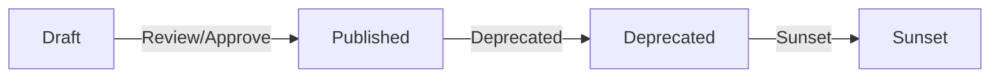
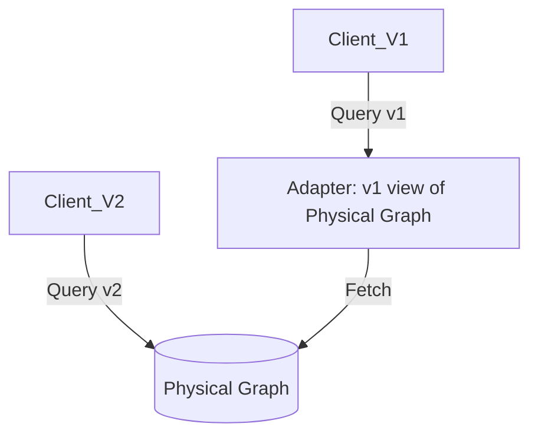

# ADR-032: Knowledge Graph Schema Versioning & Evolution

**Status:** Accepted
**Context:** The EMG Platform’s Knowledge Graph (KG) is its foundational operating system. As organizational memory evolves, the underlying ontology and schema must evolve. Without a rigorous, versioned evolution strategy, the platform will face catastrophic breaking changes or permanent architectural stagnation.

---

## 1. Context
The platform must support concurrent, long-running AI agents and legacy clients during schema transitions. The KG schema must be treated as a rigid public contract, not an internal implementation detail.

## 2. Decision
The EMG Platform will adopt a **"Multi-Versioned Semantic Schema"** strategy, enforced by an Ontology Registry.

### 2.1 Schema Versioning Philosophy
*   **Immutable Versions:** Once a schema version is published to the Registry, it is immutable. Changes require a new version.
*   **Versioning:** Semantic Versioning (SemVer 2.0.0). Major updates denote breaking changes (e.g., entity removal), Minor updates denote additive changes, Patch updates denote non-breaking constraint tweaks.
*   **Version Lifecycle:** Draft → Published → Deprecated → Sunset.

### 2.2 Ontology Evolution
*   **Additive Only:** New entity types, relationship types, or properties must be optional.
*   **Removal/Renaming:** Entities/relationships are marked as `Deprecated` for a mandatory cooling-off period (e.g., 6 months) before being `Sunset`.
*   **Versioning Registry:** All ontology changes are registered in an immutable ledger (referencing ADR-030).

### 2.3 Compatibility & Migration
*   **Mixed-Version Deployments:** The query engine *must* support multi-versioned access. Clients negotiate the schema version via a `Schema-Negotiation` lifecycle pattern. The server publishes its authoritative list of supported schema versions and defines a bounded compatibility window. Clients express a preferred schema version as part of their interaction request context. The Query Engine validates the requested/preferred version against the server's compatibility policy before execution. Requests for unsupported, retired, or incompatible versions are rejected deterministically, failing before any query or mutation execution. The selected effective schema version is returned in response metadata and recorded for auditability, ensuring security and classification controls remain coupled to the effective version.
*   **Lazy/Background Migrations:** Data is migrated in the background. The Query Engine uses **Compatibility Adapters** to present the data in the version requested by the client, even if the underlying physical structure hasn't been migrated yet.
*   **Zero-Downtime:** Mandatory. Migrations are performed as multi-phase background tasks.

## 2.4 Ontology Compatibility Matrix

The Query Engine maintains an authoritative compatibility policy. Compatibility is deterministic; the server rejects any request violating these constraints before execution.

| Producer Version | Consumer Preferred | Compatibility Class | Server Behavior |
| :--- | :--- | :--- | :--- |
| N | N | Fully compatible | Execute |
| N | N-1 | Backward compatible | Execute |
| N | N-2 | Adapter required | Execute via Compatibility Adapter |
| N | N-3 | Migration required | Reject - Trigger Migration Alert |
| N | N-X | Incompatible | Reject - Version Not Supported |
| N | Retired | Retired version | Reject - Version Retired |

**Governing Rules:**
*   The server’s compatibility policy is authoritative.
*   Compatibility adapters cannot weaken security or classification rules.
*   Breaking changes cannot be silently exposed to incompatible consumers.
*   Rejected requests fail before query or mutation execution.
*   The effective schema version is included in all audit records.
*   Retired versions are not reactivated merely because a client requests them.

### 2.5 Governance & Operational
*   **Approval Workflow:** Schema changes require a multi-party review (Ontology Architect + Security Architect + AI Governance Lead).
*   **Tooling:** All migrations must be idempotent. The Query Engine logs metrics on "Translation Latency" to monitor the performance cost of compatibility adapters.

---

## 3. Rationale
By decoupling the *physical* representation of the graph from the *logical* view requested by the client (via adapters), we enable zero-downtime evolution. Versioned schemas ensure that AI agents, which are highly sensitive to schema drift, operate against deterministic structures, preventing "semantic drift."

## 4. Consequences
*   **Positive:** Enables continuous evolution without breaking clients; provides clear governance for ontology changes.
*   **Negative:** Increased complexity in the Query Engine; performance overhead due to the necessity of compatibility adapters; higher storage requirements for supporting multiple logical schema views.

## 5. Alternatives Considered
*   **Eager/Full Migration:** Rejected. Incompatible with the 99.999% availability requirements of government/infrastructure clients.
*   **Branching Graphs (Per Tenant/Version):** Rejected. Explosion of infrastructure costs and impossible to maintain data consistency/cross-tenant analytics.

## 6. Future Work
*   Develop automated "Ontology Linter" for CI/CD pipelines to block breaking schema changes.
*   Implement automated deprecation notifications for agents using outdated schema versions.

---

## Architecture Diagrams

### A. Lifecycle Diagram

### B. Compatibility/Translation Diagram

---

## Future Compatibility
*   **ADR-027:** The Mutation API must validate mutations against the versioned ontology registry.
*   **ADR-029:** Identity context is used to determine if a client is authorized to access a specific schema version.
*   **ADR-030:** Schema migration events are logged in the Mutation Ledger for auditability.
*   **ADR-031:** Backups must include the schema version metadata to allow for accurate point-in-time recovery to the correct ontology version.
