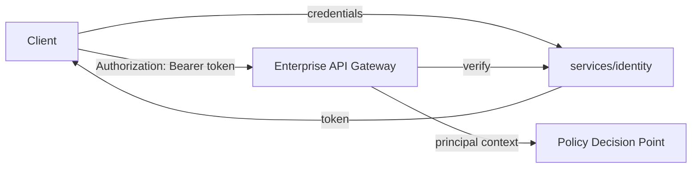
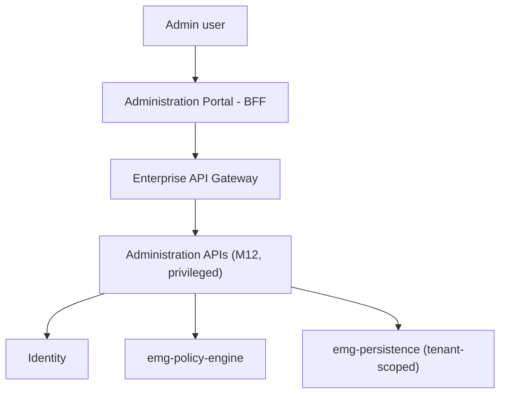
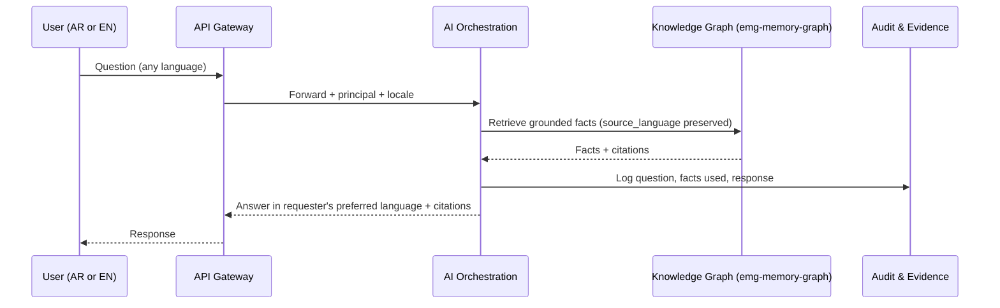
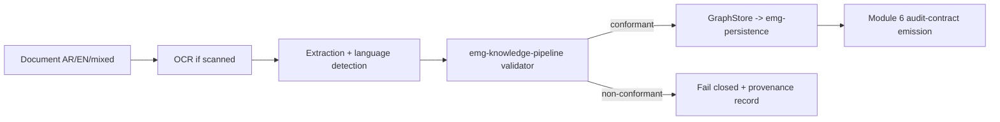
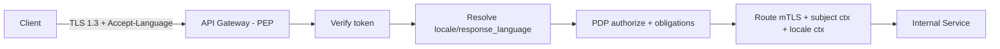
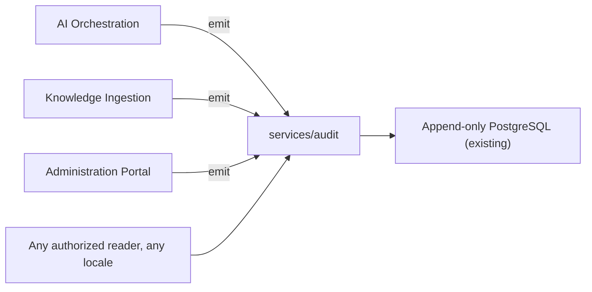
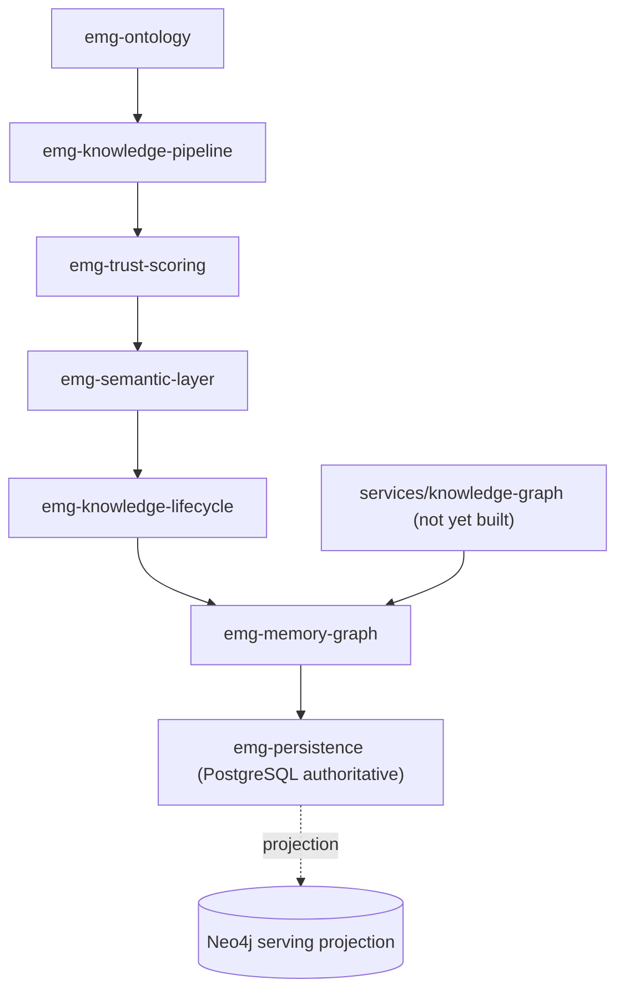
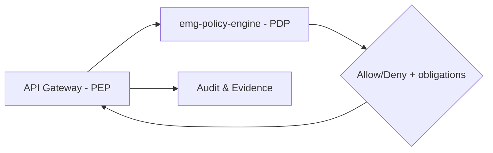

# Phase 3 — Enterprise Platform Architecture

**Status:** Draft — architecture and contracts only, no implementation code
**Date:** 2026-07-25
**Scope:** Identity & IAM, Administration Portal, AI Orchestration Layer,
Knowledge Ingestion Layer, Enterprise API Gateway, Governance & Compliance
Layer, Audit & Evidence Layer, Knowledge Graph Expansion
**Depends on:** `IMPLEMENTATION_GAP_ANALYSIS.md` (repository ground truth),
`EMG_ADR-018_Bilingual_Enterprise_Architecture.md` (binding invariant)
**Builds on, does not replace:** `docs/architecture/reference/api/EMG-Enterprise-API-Architecture.md`,
`docs/architecture/reference/enterprise/EMG-v2-Enterprise-Intelligence-Platform-Architecture.md`,
`docs/architecture/reference/system/EMG-System-Architecture-Design-SAD.md`,
`docs/architecture/reference/data/EMG-Enterprise-Data-Architecture.md`

---

## 0. How This Document Relates to Existing Architecture

`IMPLEMENTATION_GAP_ANALYSIS.md` §6 found that a large, detailed reference
architecture corpus already exists and already covers most of what this
document was asked to define — API Gateway design, Administration APIs,
AI/Decision/Knowledge APIs, and a full Enterprise Intelligence Platform
reference model. That corpus uses a third module-numbering scheme (`M##`)
that does not match `ARCHITECTURE_STATUS.md`'s Module 1–10 scheme or the
Phase 0/1/2 scheme used for the persistence engine. This document does not
attempt to pick a winner among the three schemes — that is a documentation-
governance decision flagged in the gap analysis (Gap 4a) — but it must still
let a reader map between them. The table below is the reconciliation this
document relies on:

| This document's layer | `ARCHITECTURE_STATUS.md` Module | Reference corpus `(M##)` | Actually implemented today |
| --- | --- | --- | --- |
| Identity & IAM | Module 4 (Identity & Authentication) | — | **Live**: `services/identity`, `emg-auth-client` |
| Governance & Compliance (authorization/policy half) | Module 5 (Authorization & Policy) | — | Library-first: `emg-policy-engine`; `services/authz` scaffolded |
| Audit & Evidence Layer | Module 6 (Audit) | Audit APIs (M18) | **Live**: `services/audit`, `emg-audit-client`, `emg-audit-pipeline` |
| Knowledge Graph Expansion | Module 7 (Knowledge Graph) | Graph APIs (M04), Knowledge APIs (M02) | Libraries complete (`emg-ontology`, `emg-knowledge-pipeline`, `emg-trust-scoring`, `emg-semantic-layer`, `emg-knowledge-lifecycle`, `emg-memory-graph`); `services/knowledge-graph` scaffolded |
| Knowledge Ingestion Layer | Module 7 (ingestion sub-scope) | Knowledge APIs (M02) | Library complete (`emg-knowledge-pipeline`); no live ingestion service |
| Enterprise API Gateway | (not modeled as its own Module) | API Gateway Design (§16), Administration APIs (M12) | Not started — no gateway process exists |
| AI Orchestration Layer | Module 9 (AI Orchestration) | AI APIs (M07/M08), AI Agent Ecosystem (v2 Ch. 34) | `services/ai-orchestration` scaffolded, zero LOC |
| Administration Portal | (not modeled as its own Module in 1–10) | Administration APIs (M12) | Not started |

The persistence engine (`emg-platform-core`, `emg-persistence`) underlies
every layer below that reads or writes graph state — it is the Phase 2
foundation this Phase 3 layer set binds to. Per the standing constraint
carried into this phase, **no changes are made to `emg-platform-core` or
`emg-persistence` in this document** — every reference to persistence below
is a consumer-side binding against the already-approved Phase 2 contracts
(`GraphStore`, `RevisionRepository`, Outbox), not a modification of them.

---

## 1. ADR-018 Alignment — Data Model Requirements

This section is Task 2's required cross-cutting section: it applies once,
platform-wide, rather than being repeated identically under all eight layers
below. Each layer section instead states only what is layer-specific about
applying it.

ADR-018 requires that entities, relationships, documents, questions, and
answers be able to carry: **original language** (`source_language`),
**translated representations** (`translations`), a **locale** for
presentation formatting, and a way to resolve approved bilingual terminology
(`terminology_reference`). None of these four concepts exist as shared types
anywhere in the repository today (`IMPLEMENTATION_GAP_ANALYSIS.md` §8, Gap
5). This document's binding decision is where each one belongs:

| Concept | Home | Rationale |
| --- | --- | --- |
| `source_language` | **Ontology layer** (`emg-ontology`), as a required field alongside the existing `classification`, `trust_score`, `provenance_reference` fields every `Entity`/`Relationship`/`Event` already carries "by construction" (Module 7, FEAT-05-1) | Original language is a fact about the assertion itself, established at ingestion time and never re-derived — it belongs where `classification` and `provenance_reference` already live, not bolted onto a presentation or API type |
| `translations` | **Knowledge ingestion** (`emg-knowledge-pipeline`) as an enrichment step producing language-tagged representations that attach to the ontology entity, with the underlying `graph_json`/Neo4j `content_json` persistence carrying them opaquely per ADR-018 §1 (already guaranteed by Phase 2) | Translation is a pipeline output, not an ontology-authoring input; it must never overwrite `source_language` or the original-language content |
| `locale` | **API contracts** (`emg-api-contracts`) as a request-scoped concern (an `Accept-Language`-equivalent field/header on every API surface — Search, Graph, Decision, AI, Administration) and **frontend presentation** as the resolved RTL/LTR + formatting context (ADR-018 §4) | Locale is about how a *response* is rendered for a *requester*, not a property of the stored fact — it must not be persisted onto ontology entities |
| `terminology_reference` | **Ontology layer** as a reference (not a copy) into a governed AR/EN term-pair registry, resolved at the API/AI-response boundary for display | Mirrors how `provenance_reference` already works (a reference into Module 6, never a copy) — terminology governance is a separate concern from any single entity |

A shared `LanguageCode` / `Locale` value type is the recommended vehicle for
all four, added to `emg-common-types` alongside the existing `Classification`
enum (same package, same "cross-cutting, storage- and domain-agnostic" scope
per that package's own charter). This is a **recommendation carried forward
from the gap analysis**, not implemented in this pass — Task 5/6 (this pass
is architecture-only; `emg-common-types` is currently stable and untouched)
apply.

Each of the eight layers below states, in its own "ADR-018 Alignment" line,
which of these four concepts it consumes and how.

---

## 2. Identity & IAM

**Purpose.** Authenticate every human, service, and agent principal
platform-wide and issue the identity context every other layer's Policy
Enforcement Point relies on.

**Architecture.** Already live: `services/identity` (2,332 LOC), backed by
`emg-auth-client`. Module 4 in `ARCHITECTURE_STATUS.md` is "Implemented
through Sprint 3." Phase 3 does not redesign this — it defines how the
remaining seven layers consume it.

**Components.** `services/identity` (token issuance/verification),
`emg-auth-client` (shared client library consumed by every other service),
Keycloak (per the Docker Compose environment already running).

**Responsibilities.** Authentication (OAuth2/OIDC as already established),
session/token lifecycle, principal resolution (`PrincipalRef` /
`PrincipalKind`, already defined in `emg-platform-core` from Phase 1). Identity
does **not** make authorization decisions — that is Governance & Compliance
(§6) — consistent with the API reference corpus's Policy Enforcement
Point / Policy Decision Point split (§16 of the API architecture reference).



**API example.**
```
POST /api/v1/auth/token
{ "grant_type": "password", "username": "...", "password": "..." }
→ 200 { "access_token": "...", "token_type": "Bearer", "expires_in": 3600 }
```

**Database model.** Unchanged — `services/identity` owns its own principal
store; no new schema introduced by Phase 3.

**Security considerations.** Token verification must happen at the gateway
(§5) on every request, never trusted from a downstream service claim alone.

**Scalability considerations.** Already horizontally scalable per the
existing Docker Compose topology (stateless token verification).

**Performance considerations.** Token verification is the highest-frequency
operation platform-wide; caching verified-token results at the gateway
(bounded TTL, no longer than token expiry) is the standard mitigation and is
consistent with the API reference corpus's gateway design (§16).

**Future extensibility.** SAML/Azure AD/Google Workspace federation, MFA, and
passwordless are extension points on the existing `emg-auth-client` contract,
not a new layer.

**ADR-018 alignment.** Identity carries no `source_language`/`translations` —
it does carry the requester's preferred `locale` as part of session
preference, consumed by every downstream layer's presentation/response
formatting (see §1 table).

---

## 3. Administration Portal

**Purpose.** A single, governed surface for Global Admin, Tenant Admin,
Security Admin, and Auditor operations across every module — the concept the
API reference corpus calls "Administration APIs (M12) — privileged."

**Architecture.** Genuinely new: no `services/administration` exists, no
Administration Portal frontend exists, and no top-level ADR governs it yet
(the reference corpus treats it as a privileged API group, not a full
portal). This is the one layer in this document with no existing service
scaffold at all — it is not even in the five `status: scaffolded` services
inspected in the gap analysis (§3). **Recommendation:** scaffold
`services/administration` via `tools/scripts/new-service.sh` following the
same ADR-016 ownership pattern as the other five scaffolded services, before
implementation begins, so it is governed identically.

**Components.** A BFF-style portal frontend (per ADR-014's BFF pattern,
§3/§4), consuming privileged Administration APIs (M12) fronted by the
Enterprise API Gateway (§5), never calling module APIs directly (ADR-014
§3).

**Responsibilities.** Tenant provisioning/lifecycle (binds to the
multi-tenancy model already defined at the persistence layer — `TenantId` in
`emg-platform-core`), user/role management (delegates to Governance &
Compliance, §6, for the actual policy decisions), platform-wide
configuration, and license/seat management (out of scope for this pass —
flagged for a future ADR, not decided here).



**API example** (per existing reference corpus §31 conventions):
```
GET /api/v1/admin/tenants/{tenant_id}
→ 200 { "tenant_id": "...", "status": "active", "seat_limit": 500,
         "locale_default": "ar-SA", "classification_ceiling": "SECRET" }
```

**Database model.** Tenant metadata (status, limits, default locale) is a new
concern, not yet backed by any table; it must be layered onto the existing
`TenantId`-scoped persistence model, not a parallel store.

**Security considerations.** Every Administration Portal action is
inherently privileged and consequential — it must route through the same
Zero Trust / Policy Enforcement Point posture as any other API (ADR-014 §6),
with no standing elevated credential for the portal itself.

**Scalability considerations.** Low request volume relative to Search/Graph
APIs; correctness and audit completeness matter more than throughput here.

**Performance considerations.** Not latency-sensitive; every write should
prioritize audit-emission completeness (§7) over response time.

**Future extensibility.** Multi-region tenant placement, delegated admin
(tenant-scoped admins who cannot see other tenants), and a Developer Portal
(API key issuance, usage dashboards) are extensions of this same BFF, not new
layers.

**ADR-018 alignment.** Every tenant record must carry a `locale_default`, and
every admin-facing screen must render in the admin's own session `locale`
(ADR-018 §4) independent of the tenant's default — an admin managing an
Arabic-default tenant may still work in an English (or Arabic) UI themselves.

---

## 4. AI Orchestration Layer

**Purpose.** Accept Arabic, English, and mixed-language questions; ground
answers in the Knowledge Graph and Evidence/Audit layers; return
citation-backed, language-invariant-auditable answers in the user's
preferred response language (ADR-018 §3).

**Architecture.** `services/ai-orchestration` is scaffolded (`service.yaml`:
owner "Chief AI Officer," steward "AI Platform Team," `status: scaffolded`)
with **zero lines of code** (gap analysis §3). The reference corpus already
defines an "AI Agent Ecosystem" (v2 Ch. 34) and AI APIs (M07/M08) at a vision
level. This document does not redesign that vision; ADR-019 (companion
document, this pass) makes the concrete, binding decision for how it is
built against the artifacts that actually exist today (`emg-persistence`,
`emg-memory-graph`, `emg-semantic-layer`) rather than against artifacts that
don't exist yet.

**Components.** Question intake, retrieval-augmented grounding (binds to
Knowledge Graph Expansion, §7, and a future Retrieval service — `services/retrieval`
is also a zero-LOC scaffold, out of this pass's scope but noted as a
dependency), an evidence/citation assembler (binds to Audit & Evidence, §7),
and a response formatter that honors the requester's `locale`.

**Responsibilities.** See ADR-019 for the full Context/Decision/Alternatives
treatment. Summary: AI orchestration never originates a fact — every claim in
a response must resolve to a citation the Audit & Evidence layer can produce
independently of the AI layer's own memory.



**API example.**
```
POST /api/v1/ai/ask
{ "question": "من وافق على هذا القرار؟", "response_language": "ar" }
→ 200 { "answer": "...", "citations": [{ "source_ref": "...",
         "provenance_id": "..." }], "response_language": "ar" }
```

**Database model.** No new system of record — AI Orchestration is stateless
over the Knowledge Graph and Audit layers; any session/conversation memory it
holds is bounded and session-scoped (mirrors ADR-014 §4's state-scoping
principle), not a new durable store.

**Security considerations.** Classification-aware retrieval only — an answer
must never surface a fact the requester's clearance would not permit them to
read directly (same guarantee the Search APIs reference section already
requires, §23 of the API architecture reference).

**Scalability considerations.** Stateless request handling scales
horizontally; the bottleneck is the retrieval/grounding call into the
Knowledge Graph, not the orchestration layer itself.

**Performance considerations.** Citation assembly must not be an
afterthought bolted on after generation — it should be part of the retrieval
step so an ungrounded claim is structurally impossible to emit, not merely
discouraged.

**Future extensibility.** Multi-agent workflows, tool use, and the
"Enterprise Copilot" concept from the v2 reference corpus (Ch. 35) build on
this layer's grounding contract rather than replacing it.

**ADR-018 alignment.** Accepts `source_language`-tagged facts from the
Knowledge Graph, accepts questions in either language, and must honor
`response_language` (a locale-like field distinct from UI `locale` — a user
may browse in English but ask a question in Arabic and want an Arabic
answer). See ADR-019 §Data Model Requirements for the full treatment.

---

## 5. Knowledge Ingestion Layer

**Purpose.** Accept Arabic, English, and mixed-language source documents;
extract, classify, and validate knowledge; hand off to the Ontology/Knowledge
Graph layer with full provenance.

**Architecture.** The processing library already exists and is complete:
`emg-knowledge-pipeline` (1,407 LOC, 7 tests, Module 7 FEAT-05-2, "Complete"
per `ARCHITECTURE_STATUS.md`). What's missing is the live ingestion
**service** that accepts real documents (files, emails, API payloads) and
invokes this library — `services/knowledge-graph` remains scaffolded with
zero LOC. ADR-020 (companion document, this pass) makes the binding decision
for how that service is built.

**Components.** Document intake (multi-format, multi-language), OCR (for
scanned Arabic/English documents), extraction/classification/chunking,
`emg-knowledge-pipeline`'s existing ingestion validator and `GraphStore`
abstraction, and Module-6 audit-contract emission (already specified by
`emg-knowledge-pipeline`, per `ARCHITECTURE_STATUS.md` Sprint 10 notes).

**Responsibilities.** Language detection and `source_language` tagging at
the point of extraction (this is where `source_language` is first assigned —
see §1); explicit fail-closed behavior with provenance when a document's
language cannot be processed (ADR-018 §2), rather than silently
mis-processing it.



**API example.**
```
POST /api/v1/knowledge/ingest
{ "document_ref": "...", "declared_language": "auto" }
→ 202 { "ingestion_id": "...", "status": "processing" }
GET /api/v1/knowledge/ingest/{ingestion_id}
→ 200 { "status": "complete", "entities_created": 12,
         "source_language": "ar", "provenance_reference": "..." }
```

**Database model.** No new persistence contract — ingestion writes through
the existing `GraphStore` abstraction (`emg-persistence`, PostgreSQL-
authoritative per Phase 2 ADR-1/ADR-5) exactly as `emg-knowledge-pipeline`
already assumes; `source_language`/`translations` ride inside the same
opaque `graph_json` payload ADR-018 §1 already guarantees round-trips.

**Security considerations.** Server-assigned `owner`, `provenance_reference`,
and `trust_score` (already enforced by `emg-knowledge-pipeline` per Sprint 10
notes) — caller-supplied values remain untrusted; this extends unchanged to
`source_language` (server-detected/confirmed, not caller-asserted, to prevent
mislabeling attacks).

**Scalability considerations.** Ingestion is naturally batchable and
asynchronous (already modeled as `202 Accepted` + polling above); OCR/extraction
for Arabic content may have different throughput characteristics than English
and should be capacity-planned separately, not assumed identical.

**Performance considerations.** Bilingual/mixed-language documents must not
silently degrade to "process only the majority language" — ADR-018 §2 makes
this a correctness requirement, not a performance optimization to relax under
load.

**Future extensibility.** Additional source connectors (`emg-connectors`,
already complete as a contracts-only framework per EPIC-13) plug into this
same intake point without modifying the ingestion pipeline itself.

**ADR-018 alignment.** Owns the point where `source_language` is first
assigned and where `translations` are produced as an enrichment step (see §1
table). Full treatment in ADR-020.

---

## 6. Enterprise API Gateway

**Purpose.** The single external entry point and Policy Enforcement Point
for every API surface in this document.

**Architecture.** Already fully specified at the design level by the
reference corpus (API Architecture reference §16, "API Gateway Design") —
TLS termination, authentication verification, PDP-authorization delegation,
routing, rate limiting, response-obligation (mask/redact) application,
correlation-id injection, audit emission. **This document does not redefine
that design.** ADR-021 (companion document, this pass) makes the one binding
decision the reference design does not yet make: how the gateway handles
`locale`/`response_language` negotiation consistently across every API group
it fronts, which did not exist as a concern when §16 was written (before
ADR-018).

**Components.** As already specified in the reference corpus §16 (unchanged
here): gateway process (≥3 replicas, fail-closed), GraphQL gateway (per-field
authZ), WebSocket upgrade handling.

**Responsibilities.** No business logic in the gateway (it enforces, it does
not decide) — unchanged from the reference design. Net new for this pass:
resolve a per-request `locale` (from an `Accept-Language`-style header or
session preference) and attach it to the forwarded request context so every
downstream service receives it uniformly, rather than each service parsing
locale independently.



**API example.** Unchanged request/response envelope from the reference
corpus (§18/§19); net-new header:
```
Accept-Language: ar
X-Response-Language: ar   (explicit override, takes precedence over Accept-Language)
```

**Database model.** No new persistence — the gateway is stateless.

**Security considerations.** Unchanged from reference corpus §16/§36 — this
document adds no new attack surface, but notes that locale-string parsing
must be strictly allow-listed (BCP 47 language tags only) to avoid header-
injection via a malformed locale value.

**Scalability considerations.** Unchanged from reference corpus (HA,
health-gated replicas).

**Performance considerations.** Locale resolution is a cheap, synchronous
lookup and must not add measurable latency to the existing gateway hot path.

**Future extensibility.** Additional locales beyond Arabic/English are additive
to the same negotiation mechanism, not a redesign.

**ADR-018 alignment.** This is the layer where `locale` (§1) is resolved
platform-wide, exactly once, so every downstream service consumes an already-
resolved value rather than re-implementing negotiation logic.

---

## 7. Audit & Evidence Layer

**Purpose.** Immutable, language-invariant audit and evidence trail for
every consequential action platform-wide.

**Architecture.** Already live and complete: `services/audit` (1,205 LOC),
`emg-audit-client`, `emg-audit-pipeline` (Module 6, EPIC-04, complete through
FEAT-04-4 per `ARCHITECTURE_STATUS.md`). This document makes no change here
— it states how the other seven layers must use what already exists.

**Components.** Unchanged: `services/audit`'s append-only PostgreSQL store,
provenance record model, digital evidence chain-of-custody, and the existing
classification-aware query/reporting interface.

**Responsibilities.** Per ADR-018 §3, citations, evidence references,
confidence indicators, and auditability are **language-invariant** — an
audit record must be retrievable and verifiable regardless of the language
the original question or answer was in. This is a binding constraint on how
every other layer calls into the existing audit contract, not a new
capability of the audit service itself.



**API example.** Unchanged existing contract (Audit APIs, reference corpus
§32/M18) — no new endpoint required for bilingual support, since audit
records store the same opaque, language-tagged content the persistence layer
already round-trips.

**Database model.** Unchanged — no schema change to the existing append-only
audit store.

**Security considerations.** Unchanged — classification-aware read
authorization remains the documented existing follow-up
(`docs/engineering/security-limitations.md`, per `ARCHITECTURE_STATUS.md`
Sprint 8 note), not something this document alters or resolves.

**Scalability/Performance considerations.** Unchanged from the existing,
already-operational service.

**Future extensibility.** Unchanged.

**ADR-018 alignment.** Audit records must preserve `source_language` on
whatever content they capture, and must never require translation to be
verifiable — a bilingual auditor must be able to verify an Arabic-original
decision without a translation step being trusted as the source of truth.

---

## 8. Knowledge Graph Expansion

**Purpose.** The governed enterprise ontology and memory graph every other
layer reads from and writes to.

**Architecture.** The library stack is complete: `emg-ontology`,
`emg-knowledge-pipeline`, `emg-trust-scoring`, `emg-semantic-layer`,
`emg-knowledge-lifecycle`, `emg-memory-graph` (Module 7, FEAT-05-1 through
05-5, all "Complete" per `ARCHITECTURE_STATUS.md`). `services/knowledge-graph`
remains scaffolded with zero LOC — the live service binding these libraries
to Neo4j (per Master Plan Technology Choice #4) and exposing Graph APIs
(reference corpus §24, M04) has not been built. This is the single largest
"library exists, service doesn't" gap in the repository (gap analysis §3).

**Components.** The six libraries above, `emg-persistence` (Phase 2,
PostgreSQL-authoritative / Neo4j serving-projection per ADR-1 and ADR-5), and
the not-yet-built `services/knowledge-graph` process that exposes them.

**Responsibilities.** Per ADR-018 §1: ontology entities, relationships, and
metadata must carry Arabic and English content, preserve `source_language`,
carry `translations` when they exist, and support multilingual relationships
(the same real-world entity linked across language representations without
collapsing provenance) — none of which exist as fields today (gap analysis
§8, Gap 5). This is the layer where the `LanguageCode`/`Locale` type
recommendation in §1 has the most direct effect.



**API example.** Unchanged existing contract shape (Graph APIs, reference
corpus §24) — net-new fields only:
```
GET /api/v1/graph/nodes/{id}
→ 200 { "id": "...", "type": "Entity", "source_language": "ar",
         "translations": { "en": { "label": "..." } },
         "classification": "INTERNAL", "citations": [...] }
```

**Database model.** No new table — `source_language`/`translations` live
inside the already-opaque `graph_json` / Neo4j `content_json` payloads
(ADR-018's Phase 2 implication, already guaranteed). The ontology layer's
Python models (`emg-ontology`) are where the typed fields are added when this
becomes implementation work.

**Security considerations.** Property-level redaction (Module 7 §21,
referenced by ADR-014 §6) must apply per-language — a redacted entity must
be redacted in both its original-language and translated representations,
not just one.

**Scalability considerations.** Unchanged from Phase 2's existing
projection/read-repair model (ADR-6) — multilingual fields add payload size,
not a new scaling dimension.

**Performance considerations.** Search/retrieval across mixed-language
corpora (ADR-018 §1) is a Knowledge Graph Expansion + future Retrieval
service concern; this document notes the requirement but does not design
the retrieval ranking algorithm (out of scope — `services/retrieval` is a
separate, still-empty scaffold).

**Future extensibility.** Additional languages beyond Arabic/English are
additive to the same `source_language`/`translations` shape.

**ADR-018 alignment.** This layer owns the canonical home for
`source_language` and `terminology_reference` (see §1 table) and is the
layer every other section's grounding/citation guarantee ultimately traces
back to.

---

## 9. Governance & Compliance Layer

**Purpose.** Authorization, policy evaluation, and compliance enforcement
consumed by every other layer's Policy Enforcement Point.

**Architecture.** Library-first and already substantially built:
`emg-policy-engine` (573 LOC, 6 tests, "Authorization baseline complete
through FEAT-03-4" per `ARCHITECTURE_STATUS.md`). `services/authz` remains
scaffolded — a deliberate library-first approach per the existing Sprint 4/5
design docs, not a gap this document introduces.

**Components.** `emg-policy-engine` (Policy Decision Point logic), the
Enterprise API Gateway (Policy Enforcement Point, §5), and compliance
reporting (binds to Audit & Evidence, §7, for evidentiary export).

**Responsibilities.** RBAC (enterprise roles, permission inheritance) and
ABAC (policy engine, conditions, dynamic permissions) as already scoped by
`emg-policy-engine`'s existing FEAT-03-4 authorization testing harness. This
document adds no new authorization model — it states that policy conditions
must be able to reference `locale`/`source_language` where a compliance rule
is language-sensitive (e.g., "only Arabic-cleared reviewers may approve
Arabic-original classified decisions"), which is a **future policy-condition
extension point**, not a decision made here.



**API example.** Unchanged existing policy-evaluation contract.

**Database model.** Unchanged — policy rules remain wherever
`emg-policy-engine` currently defines them; no new schema in this pass.

**Security considerations.** Fail-closed on any policy-evaluation error
(existing principle, unchanged).

**Scalability/Performance considerations.** Unchanged — policy evaluation
remains on the synchronous request path per the gateway design (§5, §16 of
the reference corpus).

**Future extensibility.** Language-sensitive policy conditions (above) are
the concrete extension point this document identifies but does not design.

**ADR-018 alignment.** Terminology governance (ADR-018 "Terminology
governance becomes a product capability," Consequences section) is owned
here jointly with the Administration Portal (§3) — Governance & Compliance
evaluates policy, the Administration Portal is where the terminology
registry itself is curated.

---

## 10. Recommended Implementation Sequence

This document defines architecture, not a sprint plan. Consistent with the
library-first pattern already used for every completed module, the
recommended order (subject to the same sprint-by-sprint approval discipline
used for Phase 2) is tracked verbatim in
`EMG_ARCHITECTURE_DECISION_REGISTER.md` ("Approved Implementation Sequence")
so that approval status stays in one place rather than drifting between
documents:

1. Extend `docker/dependencies.yaml` to cover all 18 libraries (gap analysis
   Gap 2) before any new service is scaffolded, so drift detection covers new
   work from day one.
2. Add `LanguageCode`/`Locale` to `emg-common-types` (§1) — the one shared
   type every other layer's bilingual field depends on.
3. Build `services/knowledge-graph` (§8) — the largest existing
   library-to-service gap, and the dependency every AI Orchestration and
   Retrieval capability needs.
4. Build the Enterprise API Gateway (§6) with locale negotiation — needed
   before any new service is exposed externally.
5. Build `services/ai-orchestration` (§4) and `services/administration`
   (§3, after scaffolding) in parallel, since neither depends on the other.
6. Resolve Gap 1 (`emg-entity-resolution`'s ambiguous scope) before it
   accumulates any dependent code.

---

## 11. Risks Discovered (Carried from Gap Analysis)

- Three parallel module-numbering schemes exist (Gap 4a); this document
  reconciles them for its own purposes (§0) but does not resolve which is
  authoritative platform-wide. **Tracked as `EMG_ARCHITECTURE_DECISION_REGISTER.md`
  D-A-001 (Open) — not resolved by this document.**
- The v2.0 Enterprise Intelligence Platform reference document is marked
  "Draft ... no code until sign-off," while the System Architecture Design
  claims to derive from an "approved" v2.0 — an unresolved internal
  inconsistency in the pre-existing corpus, not introduced by this document.
  Recorded under D-A-001's evidence.
- `ARCHITECTURE_STATUS.md` does not yet reflect the Phase 2 persistence
  engine at all; this document's §0 table is the first place the two are
  connected.
- `emg-entity-resolution`'s ownership is unresolved (gap analysis Gap 1).
  **Tracked as `EMG_ARCHITECTURE_DECISION_REGISTER.md` D-A-002 (Open) — no
  implementation in §10's sequence may depend on it until resolved, per
  D-A-002's binding constraint.**
