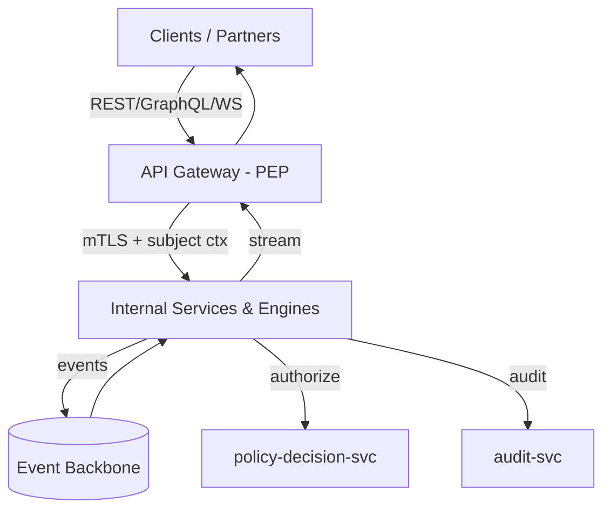
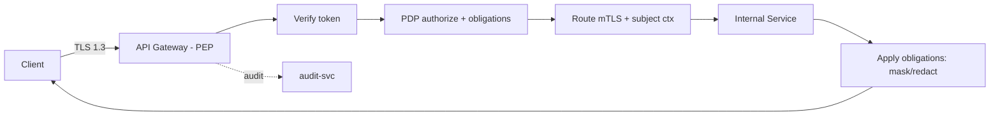

# EMG™ — Enterprise API Architecture & API Specification
### Official API Contract · Version 1.0

| Field | Value |
|---|---|
| Document | Enterprise API Architecture & Specification v1.0 |
| Derives from | Enterprise Architecture v2.0 · System Architecture Design v1.0 · Enterprise Data Architecture v1.0 (all approved) |
| Governing authority | Accepted ADRs (`EMG_ARCHITECTURE_DECISION_REGISTER.md`) govern architecture; `docs/product/EMG_PRODUCT_ARCHITECTURE_FREEZE.md` governs product scope. The EA/SAD/EDA/API precedence stated below applies **only among these reference documents** and is subordinate to accepted ADRs and the Freeze. This document is L4 reference material under GR-001 §8.2. |
| Relationship | **Complements, does not modify** the EA, SAD, or EDA. Where an API contract and the SAD/EDA differ, those documents prevail and a governed change request is raised. |
| Status | **For Architecture / API Governance Board** — no code, no FastAPI, no OpenAPI YAML |
| Owners | Chief API Architect · Enterprise Integration Architect · Principal Backend Architect · Principal Platform Architect · API Governance Lead |
| Audience | API governance board, enterprise architects, security architects, integration partners, government/defense technical review |

> **Scope discipline.** This document defines **API architecture, standards, and contracts** — principles, communication model, protocol standards, security, versioning, and per-domain endpoint specifications expressed as **field/behavior tables**. It contains **no implementation code, no framework endpoints, and no OpenAPI YAML**. Endpoint specifications here are the authoritative *contract*; OpenAPI/GraphQL SDL/AsyncAPI artifacts are generated by engineering under §39 from these standards.

> **Conventions.** REST paths are `/api/v{major}/…`. Identifiers are ULIDs. Times are UTC ISO-8601. Every request is authenticated, PDP-authorized, correlated (`X-Correlation-Id`), and audited. Every response is classification-aware. "Subject" = an authenticated principal (human, service, or agent). "PEP" = the API gateway; "PDP" = `policy-decision-svc`.

---

## 1. API Architecture Principles

1. **Contract-first.** The API contract (this document → generated specs) is authored and reviewed *before* implementation. Consumers bind to contracts, not to services.
2. **Secure by default.** No endpoint is anonymous, unauthorized, unlogged, or unclassified. Authorization and audit are in-path, never optional.
3. **Zero-Trust at the edge and internally.** External calls terminate at the PEP; internal calls use mTLS and carry propagated subject context; every call is re-authorized (SAD §11).
4. **Classification-aware.** Every request and response respects data classification; unauthorized fields are denied/masked, and unauthorized *existence* is not disclosed.
5. **Least privilege & purpose-bound.** Scopes are minimal; access is bound to a declared purpose that is logged.
6. **Explicit over implicit.** Versioning, pagination, filtering, errors, and idempotency follow one platform-wide standard — no per-team dialects.
7. **Backward compatibility.** Changes are additive within a major version; breaking changes require a new major version and a migration window.
8. **Grounded & auditable AI.** AI endpoints return citations, confidence, and (where consequential) a proposal id routed to human-in-the-loop; they never execute consequential actions.
9. **Sovereign & air-gap capable.** No API depends on external services in the air-gapped profile; external egress is governed and optional.
10. **Observable.** Every API is traced, measured against SLOs, and governed through its full lifecycle.

---

## 2. Service Communication Model

EMG uses **four complementary interaction styles**, each with a defined purpose and standard. No service invents its own transport.

| Style | Purpose | Standard | Examples |
|---|---|---|---|
| **Synchronous REST** | Commands, admin, integration, resource CRUD | §3 | Create decision, register ingest job, admin |
| **Synchronous GraphQL** | Graph-shaped reads, entity profiles, traversals | §4 | Entity profile, link expansion, timeline |
| **Asynchronous events** | Pipeline, propagation, audit streaming | §5 | Ingestion→resolution→graph, audit→SIEM |
| **Streaming (WebSocket/SSE)** | Real-time push to clients | §6 | Dashboard updates, copilot streaming, alerts |

**Boundaries & rules:**
- **External ↔ platform:** only through the **API gateway (PEP)**; only REST/GraphQL/streaming; never direct to internal services.
- **Internal ↔ internal:** REST/gRPC-class calls over **mTLS** via the service mesh, plus events for decoupled flows; **no service reads another service's database** (SAD §3).
- **Authorization:** every call — external or internal — is PDP-authorized; internal calls propagate the original subject context (no privilege laundering).
- **Reliability:** async uses the **outbox pattern + idempotent consumers**; multi-step writes use **sagas with compensation**.

---

## 3. REST API Standards

**Resource orientation.** Nouns, plural collections: `/api/v1/decisions`, `/api/v1/cases/{case_id}`. Actions that are not CRUD use a sub-resource verb-as-noun (`/api/v1/decisions/{id}/replay`) — never RPC-style verbs in paths.

**Methods & semantics:** `GET` (safe, idempotent, no side effects) · `POST` (create / non-idempotent action) · `PUT` (full replace, idempotent) · `PATCH` (partial update) · `DELETE` (logical delete/tombstone — never hard purge via API; §EDA 16).

**Mandatory request headers:** `Authorization` (bearer token), `X-Correlation-Id`, `Accept`, `Content-Type` (`application/json`), `X-Purpose` (declared purpose for audit/least-privilege). Writes additionally require `Idempotency-Key`.

**Mandatory response headers:** `X-Correlation-Id` (echoed), `X-Classification` (classification of the returned representation), `X-API-Version`, `Deprecation`/`Sunset` (when applicable), rate-limit headers (§35).

**Status codes (authoritative set):** `200/201/202/204`; `400` validation · `401` unauthenticated · `403` denied by policy · `404` not found / **not disclosable** · `409` conflict (concurrency) · `422` semantic validation · `429` rate limited · `500` internal · `503` dependency unavailable (`Retry-After`).

**Idempotency.** Every unsafe operation accepts `Idempotency-Key`; the platform guarantees at-most-once effect per key within a retention window.

**Media & encoding:** JSON only for payloads; UTF-8; ISO-8601 UTC times; ULIDs for ids; monetary values as value+ISO-4217; quantities as value+unit (EDA §10).

---

## 4. GraphQL Architecture

**Purpose.** GraphQL serves **graph-shaped reads** where REST would require many round-trips (entity profiles, neighborhoods, timelines). It is **read-primary**; consequential writes go through REST commands + HITL.

**Standards:**
- **Schema = ontology.** The GraphQL schema is generated from and versioned with the enterprise ontology (EDA §5, §7); types mirror node/edge types.
- **Per-field authorization.** Authorization is enforced **per field** via the PDP; an unauthorized field resolves to an explicit `restricted` state (masked/denied), never a silent null, and never discloses unauthorized existence.
- **Bounded queries.** Depth, complexity, and node limits are enforced to protect latency (SAD §17); expensive traversals accept `max_depth`/`max_nodes` arguments and return `truncated` flags.
- **As-of arguments.** Read queries accept a `time_as_of` argument for bitemporal reads (EDA §17, §32).
- **No breaking changes.** Schema evolves additively; fields are deprecated with `@deprecated` + sunset, never removed within a major version.
- **Citations.** Graph reads that back AI/answers include provenance references.
- **Persisted queries.** Production clients use allow-listed persisted queries to bound attack surface and cost.

**Boundary vs REST:** GraphQL never performs consequential mutations; it exposes reads and non-consequential curation only. All mutations that could drive action are REST + workflow.

---

## 5. Event-Driven APIs

**Purpose.** Decoupled, reliable propagation across the pipeline and to external sinks (SIEM). Documented with **AsyncAPI** (generated under §39).

**Topic naming:** `emg.<domain>.<event>` (e.g., `emg.ingest.document-received`, `emg.graph.fact-asserted`, `emg.decision.recorded`, `emg.audit.access-decision`).

**Event envelope (mandatory fields):** `event_id` (ULID), `type`, `occurred_at`, `producer`, `subject_context` (propagated identity), `classification` (Label-Set), `correlation_id`, `schema_version`, `payload`, `provenance_id`. Events are **classified**; consumers must be authorized for an event's classification.

**Standards:**
- **Outbox + idempotency:** producers emit via the outbox pattern; consumers are idempotent (dedupe on `event_id`).
- **Schema governance:** event schemas are versioned and backward-compatible; breaking changes create a new versioned topic.
- **Ordering & partitioning:** partition by entity/domain key where ordering matters; consumer groups scale with lag.
- **Dead-letter & replay:** poison messages go to a dead-letter topic; governed replay is supported and audited.
- **No sensitive payload leakage:** events carry references/ids and classification, not unnecessary sensitive content; downstream resolves under authorization.

**External event egress** (e.g., audit→SIEM) is governed, classification-filtered, and disabled by default in air-gap unless an internal SIEM is present.

---

## 6. WebSocket APIs

**Purpose.** Server→client real-time push where polling is inadequate: dashboard/twin updates, copilot token streaming, alerts/notifications, live investigation collaboration. (Server-Sent Events is the fallback where only one-way push is needed.)

**Channels:** `/ws/v1/dashboard`, `/ws/v1/copilot/{session_id}`, `/ws/v1/notifications`, `/ws/v1/twins/{twin_id}`.

**Standards:**
- **Authenticated handshake:** the connection upgrade carries a valid short-lived token; the session is PDP-authorized at connect **and** re-checked on subscription; tokens expiring mid-session trigger re-auth or disconnect.
- **Classification-filtered streams:** every pushed message carries `classification`; the server filters to the subject's clearance/compartments continuously.
- **Subscription model:** clients subscribe to scoped topics; server enforces authorization per subscription; no wildcard subscriptions that would leak existence.
- **Backpressure & limits:** per-connection message rate limits, heartbeats, idle timeouts, and max connections per subject.
- **Auditability:** subscriptions and significant pushes are audited (streams are access events).
- **Delivery semantics:** at-least-once with client-side dedupe by message id; no guarantee of exactly-once at the socket layer.

---

## 7. Internal APIs

**Definition.** Service-to-service contracts inside the boundary, not exposed externally.

**Standards:**
- **Transport:** mTLS via the mesh; REST/gRPC-class synchronous + events (§5).
- **Identity:** workload identity per service/agent; **subject context propagation** carries the original human/agent principal so the PDP authorizes on the *real* subject, never the calling service's identity (no privilege escalation by proxy).
- **Contracts:** consumer-driven contract tests in CI (SAD §18); internal contracts are versioned like external ones.
- **PDP everywhere:** every internal data-touching call authorizes via the PDP (no self-authorization).
- **No shared DB:** integration only via APIs/events (SAD §3).
- **Resilience:** timeouts, retries with jitter, circuit breakers, bulkheads; idempotency on internal writes.
- **Least exposure:** internal APIs are not routable from the edge; the gateway exposes only the curated external surface (§8).

---

## 8. External APIs

**Definition.** The curated, governed surface exposed to authorized human clients, partner systems, and the owning organization's own systems — always through the PEP.

**Standards:**
- **Surface curation:** only explicitly published resources are external; internal APIs are never directly reachable.
- **Strong authN/Z:** OAuth2/OIDC (§13–14), short-lived JWTs (§15), PDP authorization, per-purpose scoping.
- **Contract & lifecycle governance:** every external API has an owner, an OpenAPI/GraphQL contract, a version, a deprecation policy, and published SLAs (§17, §38).
- **Tenant & classification isolation:** responses are tenant- and classification-scoped; cross-tenant access is impossible by contract.
- **Rate limiting & quotas** per client/tenant (§35); **abuse protection** and anomaly detection (§36).
- **Partner onboarding:** partners are provisioned via the connector framework (§10) under owner-authorized data contracts (EDA §38); no vendor- or platform-initiated integrations.
- **Air-gap:** the external surface functions fully within the sovereignty boundary with no outbound dependency.

---
## 9. Government Integration APIs

**Principle (authoritative).** EMG provides **platform-agnostic integration capability**; it defines, assumes, and requires **no specific government or external integration**. Every integration is **configured and authorized solely by the owning organization** under its own security policy and legal authority (EA Ch. 40, EDA §38). Nothing is hard-coded to any external or national system.

**Standards for owner-authorized integrations:**
- **Data-contract gated:** each integration is defined by a data contract (schema, classification-at-ingress, purpose, allowed use, retention, quality SLA, owner, `authorized_by`) reviewed by the organization's governance (EDA §38).
- **Zero-Trust ingress/egress:** all flows pass the PEP; mTLS, classification assertion at ingress, ABAC authorization, egress control, and full audit apply.
- **Least data / purpose limited / residency aware:** integrations pull the minimum necessary data for a declared purpose; virtualization avoids unnecessary copies and honors residency (EDA §38).
- **Directionality controls:** inbound (ingest) and outbound (share) are separately authorized; outbound sharing is a consequential action subject to governance and audit.
- **Sovereignty:** in air-gapped deployments no external integration exists; integration APIs operate wholly within the boundary.
- **No platform-initiated integration:** the platform never establishes an integration on its own; capability ≠ connection.

**Explicit constraint restated:** this section specifies *how* an organization may securely integrate its own systems. It does not describe or presume integration with any named external or national system; all such decisions rest solely with the owning organization.

---

## 10. Enterprise Connector Framework

**Purpose.** A typed, governed framework through which the owning organization connects its authorized sources — the API-level realization of Data Fabric ingress (EDA §36, §38).

**Connector contract (logical):**
| Element | Meaning |
|---|---|
| `connector_id` | Identifier |
| `adapter_type` | database / REST / file / message-bus / streaming |
| `data_contract_ref` | Governing contract (schema, classification, purpose, retention, SLA) |
| `direction` | inbound / outbound (separately authorized) |
| `auth_profile` | Credentials held in vault; never in config or code |
| `mapping` | Source → canonical model mapping (EDA §2) |
| `classification_policy` | Classification asserted at ingress |
| `authorized_by` | Owning-org authority record |

**Standards:** adapters are configuration, not bespoke code per source; credentials live in the vault with rotation; every connector run emits `emg.ingest.*` events with provenance; classification is asserted at ingress and enforced thereafter; contract violations quarantine data and alert; connectors are catalogued (EDA §4) and audited. Connector lifecycle (register → authorize → activate → monitor → retire) is governed and fully audited.

---

## 11. Authentication Model

**Principals:** humans, services (workload identity), and AI agents (agent identity with a clearance ceiling, EDA §8).

**Standards:**
- **Humans:** OIDC against federated IdPs (§14), MFA enforced; short-lived tokens (§15).
- **Services:** workload identity issued by the mesh/identity plane; mTLS certificates rotated automatically.
- **Agents:** agent identity bound to a signed charter; agents authenticate as themselves and act under **propagated subject context** (never as an unbounded superuser).
- **Federation:** multiple enterprise/government IdPs brokered under the owning org's trust policy; claims mapped to EMG clearance labels (SAD §11.6).
- **Fail-closed:** IdP unavailable → no new sessions; existing short-lived tokens valid until expiry; JWKS cached.
- **Privileged access:** administrative operations require JIT PAM with session recording (EA Ch. 39).

---

## 12. Authorization Model

**Model:** RBAC (coarse roles) + **ABAC + mandatory classification labels** (fine-grained, to node/edge/property/field granularity) evaluated by the PDP per request (EDA §11, SAD §11.2).

**Decision inputs:** subject attributes (roles, clearance, compartments, purpose, risk/context), resource labels (classification + compartments), action, and environmental context. **Outputs:** allow/deny + **obligations** (mask, redact, deny-field, log-elevated).

**Standards:**
- **PEP at the edge, PDP central:** the gateway enforces; the PDP decides; services never self-authorize.
- **Per-field/per-object:** GraphQL per-field and REST per-object authorization; unauthorized existence not disclosed (return `404`/`restricted`).
- **Purpose binding:** `X-Purpose` is part of the decision and the audit record; least-privilege is purpose-aware.
- **Consequential actions:** authorization to *propose* is separate from authority to *approve*; approval flows through HITL (EA Ch. 24), and the approver's authority is checked at approval time.
- **Fail-closed:** PDP unavailable → deny; decision cache has a short TTL only.
- **Every decision audited** (allow and deny) with obligations applied.

---

## 13. OAuth2

**Grant types (allow-listed):**
| Grant | Use |
|---|---|
| Authorization Code + PKCE | Human interactive clients (web/desktop/mobile) |
| Client Credentials | Service-to-service / partner-system (workload) access |
| Token Exchange (RFC 8693) | Subject-context propagation / delegation across services & agents |
| Device Code | Constrained-input operator devices (where applicable) |

**Prohibited:** Implicit and Resource-Owner-Password grants (insecure for this class of system).

**Standards:** scopes are minimal, resource-specific, and purpose-aware; refresh tokens are rotated and revocable; token exchange enables an agent/service to act **on behalf of** the original subject without accumulating standing privilege; all token issuance/refresh/revocation is audited.

---

## 14. OpenID Connect

**Role:** OIDC provides human authentication and identity claims on top of OAuth2, brokered across federated IdPs.

**Standards:** ID tokens carry mapped claims (identity, roles, **clearance level + compartments**, tenant); claim→label mapping is governed configuration; `nonce`/`state` and PKCE enforced; discovery/JWKS cached for air-gap and IdP-outage resilience; MFA/assurance level surfaced as a claim and usable in ABAC (e.g., step-up required for high-consequence actions); logout/session-termination propagated. Clearance claims are authoritative inputs to the PDP but are re-validated server-side (never trusted from the client).

---

## 15. JWT Strategy

**Token design:**
| Property | Standard |
|---|---|
| Type | Signed JWT (asymmetric); encrypted (JWE) where token contents are sensitive |
| Lifetime | Short (minutes); refresh via rotation |
| Claims | subject id, tenant, roles, clearance level + compartments, purpose (if bound), assurance level, `jti` |
| Audience/Issuer | Validated on every request |
| Revocation | `jti` denylist + short lifetime; refresh-token rotation/revocation |
| Signing keys | In vault/HSM, rotated; JWKS published and cached |

**Rules:** tokens are validated at the PEP **and** re-validated for sensitive internal hops; clearance in the token is a claim, not the authorization decision — the PDP re-evaluates against current policy and resource labels; no sensitive data beyond identity/authorization context is placed in tokens; tokens are never logged.

---

## 16. API Gateway Design

**Role:** the single external entry point and **Policy Enforcement Point**.

**Responsibilities:** TLS termination (TLS 1.3), authentication verification, PDP-authorization delegation, request validation/shaping, routing to internal services (mTLS), rate limiting/quotas (§35), response obligation application (mask/redact), correlation-id injection, and audit emission. It also hosts the GraphQL gateway (per-field authZ) and WebSocket upgrade handling.

**Standards:** HA (≥3 replicas, health-gated, **fail-closed**); no business logic in the gateway (it enforces, it does not decide); the gateway never exposes internal services directly; observability (traces/metrics) on every request; separate ingress classes for interactive vs partner vs admin traffic with distinct policies.

---

## 17. API Versioning Strategy

**REST:** URI major versioning `/api/v{major}`. Minor/additive changes do not bump the major version. **GraphQL:** single evolving schema with additive fields and `@deprecated` + sunset. **Events:** `schema_version` in the envelope; breaking changes create a new versioned topic.

**Rules:** breaking changes require a **new major version + published migration window + parallel run**; deprecations announce `Deprecation`/`Sunset` headers and a catalog notice; consumers pin a major version; no silent breaking change is ever permitted. Version lifecycle (preview → stable → deprecated → retired) is governed (§38) with minimum support windows suited to government/defense procurement timelines.

---

## 18. Request Standards

- **Headers (mandatory):** `Authorization`, `X-Correlation-Id`, `X-Purpose`, `Accept`, `Content-Type`; `Idempotency-Key` on writes; `X-API-Version` optional override.
- **Validation:** strict schema validation; reject unknown fields (`400`); enforce types/units/enums per EDA §10; distinguish "unknown" from "asserted absent".
- **Size & safety limits:** max payload size, max query depth/complexity (GraphQL), max page size — all bounded (§21, §35).
- **Time & ids:** ISO-8601 UTC; ULIDs; monetary/quantity typed values.
- **As-of:** read endpoints accept `time_as_of` for bitemporal reads.
- **Purpose:** `X-Purpose` is required for data-access endpoints and recorded in audit (least-privilege, EDA §12).

---

## 19. Response Standards

- **Envelope:** consistent structure with `data`, `meta` (paging, version, timing), and `classification`; collections return `items` + paging (`§21`).
- **Headers:** `X-Correlation-Id`, `X-Classification`, `X-API-Version`, rate-limit headers, `Deprecation`/`Sunset` when applicable.
- **Classification:** every representation is labeled; masked/denied fields are explicit `restricted` markers, never silent nulls; unauthorized existence is not revealed.
- **Citations:** answers/derived content include provenance references (EDA §13).
- **Determinism:** stable field ordering irrelevant; stable id and pagination semantics required.
- **No sensitive leakage:** errors and metadata never leak internal structure, stack traces, or unauthorized existence.

---

## 20. Error Standards

**Format:** RFC 7807 `application/problem+json` with fields: `type` (stable URI), `title`, `status`, `detail` (safe, non-leaking), `instance`, `correlation_id`, and optional `errors[]` (field-level validation). Errors are catalogued and stable.

**Taxonomy (authoritative):**
| Status | Meaning | Notes |
|---|---|---|
| 400 | Malformed/invalid request | Field errors listed |
| 401 | Unauthenticated | No/invalid token |
| 403 | Denied by policy | Authorization failure (no detail on why, to avoid leakage) |
| 404 | Not found / **not disclosable** | Used where existence is sensitive |
| 409 | Conflict | Optimistic-concurrency/version conflict |
| 422 | Semantic validation failed | Well-formed but invalid per rules |
| 429 | Rate limited | `Retry-After` + limit headers |
| 500 | Internal error | No internal detail leaked; correlation id for support |
| 503 | Dependency unavailable | `Retry-After`; fail-closed for authZ deps |

**Rules:** never leak internal detail or unauthorized existence; `403` vs `404` chosen deliberately by classification; every error carries a `correlation_id` traceable in observability (§37).

---
## 21. Pagination

**Standard: cursor-based** (opaque cursor), not offset (offset is unstable over versioned, concurrently-written data).

- **Request:** `limit` (bounded, default 25, max 100), `cursor` (opaque).
- **Response `meta`:** `next_cursor` (null when exhausted), `has_more`, and a bounded `total_estimate` only when cheaply available (never a full count on large graphs).
- **Rules:** cursors are stable and classification-consistent (a cursor never resurfaces items the subject can't see); paging respects `time_as_of` for bitemporal consistency; server enforces max `limit`; GraphQL uses connection-style pagination (edges + pageInfo).

---

## 22. Filtering

- **Syntax:** structured filter objects (field, operator, value); operators are an allow-listed set (`eq`, `neq`, `in`, `range`, `contains`, `before`/`after` for time). Free-form query strings are rejected in favor of typed filters to prevent injection and to enable authorization-aware planning.
- **Authorization-aware:** filters cannot be used to infer unauthorized data (e.g., a filter matching a restricted field returns no evidence of its existence).
- **Temporal:** `time_as_of` and valid/transaction-time range filters supported (EDA §17, §32).
- **Taxonomy & classification:** filter by taxonomy tags and (within a subject's clearance) classification.
- **Bounded:** filters combine with pagination and complexity limits; expensive filters are rejected or require narrowing.

---

## 23. Search APIs (M17)

| Method | Path | Purpose | AuthZ |
|---|---|---|---|
| POST | `/api/v1/search` | Hybrid retrieval (graph+vector+lexical), policy-filtered, cited | Subject-scoped; Policy Filter pre-rank |
| POST | `/api/v1/search/semantic` | Vector-forward semantic search | Same |
| POST | `/api/v1/search/entities` | Entity-typed search | Same |

**Request fields:** `query`, `filters` (§22, incl. `type`, taxonomy, `time_as_of`), `limit`, `cursor`, `mode`. **Response fields:** `items[]` each with `ref`, `type`, `snippet`, `score`, **`citations[]`** (`source_ref`, `provenance_id`), `classification`; `meta` paging. **Guarantee:** unauthorized facts never appear (pre-rank Policy Filter, SAD §8.2); every result is cited.

---

## 24. Graph APIs (M04)

Primarily **GraphQL** (§4) for reads; REST for bounded operations.
| Method | Path | Purpose |
|---|---|---|
| POST | `/api/v1/graph/traverse` | Bounded neighborhood/path traversal (`start`, `max_depth`, `edge_types`, `max_nodes`, `time_as_of`) |
| POST | `/api/v1/graph/paths` | Shortest/weighted paths (classification-aware edges) |
| GET | `/api/v1/graph/nodes/{id}` | Node profile (policy-filtered) |
| POST | `/api/v1/graph/assertions` | Propose an assertion (→ review/HITL where consequential) |

**Rules:** traversals are bounded and policy-pruned **per hop** (unauthorized nodes/edges pruned before expansion, EDA §7); reads accept `time_as_of`; writes are proposals when consequential; responses include `truncated` and citations.

---

## 25. Decision APIs (M05)

| Method | Path | Purpose |
|---|---|---|
| POST | `/api/v1/decisions` | Create a Decision framing |
| GET | `/api/v1/decisions/{id}` | Retrieve Decision Record |
| GET | `/api/v1/decisions/{id}/options` | Scored options (explicit weights) + predictions + steelman |
| GET | `/api/v1/decisions/{id}/analogues` | Historical analogous decisions |
| POST | `/api/v1/decisions/{id}/record` | Record human decision + rationale (routes through HITL) |
| GET | `/api/v1/decisions/{id}/quality` | Decision-quality vs outcome-quality |

**Rules:** options carry explicit, versioned scoring weights and per-option uncertainty (EDA §24); recording a decision is a **consequential action** (HITL, EA Ch. 24); Decision Records are bitemporal/immutable-by-versioning; every option and prediction is cited.

---

## 26. AI APIs (M07/M08)

| Method | Path | Purpose |
|---|---|---|
| POST | `/api/v1/copilot/ask` | Grounded Q&A (`answer`/`brief`/`investigate` modes) |
| POST | `/api/v1/copilot/sessions` | Create a session (ephemeral, classified) |
| WS | `/ws/v1/copilot/{session_id}` | Streaming grounded responses |
| POST | `/api/v1/agents/missions` | Submit a mission to the agent ecosystem |
| GET | `/api/v1/agents/missions/{id}` | Mission status + proposals |

**Response guarantees:** every AI response includes `citations[]`, `confidence`, and an `insufficient_evidence` flag when unsupported; consequential outputs return a `proposal_id` routed to HITL; **no AI endpoint executes a consequential action**; all prompts/contexts/outputs are audited (SAD §8.8). Agent tool calls are PDP-authorized and budget-bounded (EA Ch. 34). Retrieved content is treated as data, not instructions (injection defense).

---

## 27. Replay APIs (M06)

| Method | Path | Purpose |
|---|---|---|
| GET | `/api/v1/decisions/{id}/replay` | Full as-of reconstruction |
| GET | `/api/v1/decisions/{id}/replay/timeline` | Bitemporal decision timeline |
| GET | `/api/v1/decisions/{id}/replay/export` | After-action package export (governed) |

**Response fields:** `timeline`, `information_available` (**as-of**, no hindsight leakage), `options`, `rejected`, `reasoning`, `approvals`, `outcome`, `lessons`, and **`gaps[]`** (explicitly reported, never fabricated). **Rules:** replay is read-only and itself audited; reconstruction uses information available at the decision's transaction-time (EDA §17, §32); export is a consequential/governed action.

---

## 28. Knowledge APIs (M02)

| Method | Path | Purpose |
|---|---|---|
| POST | `/api/v1/knowledge/products` | Create a knowledge product (draft) |
| GET | `/api/v1/knowledge/products/{id}` | Retrieve (versioned, cited) |
| POST | `/api/v1/knowledge/products/{id}/publish` | Publish (governed; human approval) |
| GET | `/api/v1/knowledge/lessons` | Retrieve institutional lessons (cited, versioned) |
| GET | `/api/v1/ontology/{version}` | Retrieve ontology/taxonomy (governed reference) |

**Rules:** knowledge products are versioned, owned, cited, and classification-inheriting (EDA §26); publishing is governed (human approval); lessons carry provenance to their source decisions (EDA §25); ontology/taxonomy are read as governed, versioned reference data.

---

## 29. Investigation APIs (M10)

| Method | Path | Purpose |
|---|---|---|
| POST | `/api/v1/cases` | Open a case |
| GET | `/api/v1/cases/{id}` | Case detail (policy-filtered) |
| POST | `/api/v1/cases/{id}/members` | Add entities/events/documents to case |
| POST | `/api/v1/cases/{id}/hypotheses` | Record/update a hypothesis (supporting/contradicting evidence) |
| POST | `/api/v1/cases/{id}/evidence` | Attach cited evidence package |

**Rules:** consequential assertions (new links/identity) are **proposals routed to review** (SAD §5.10); evidence retains citations; case and element classification enforced; all edits are versioned (non-destructive, EDA §29).

---

## 30. Risk APIs (M09)

| Method | Path | Purpose |
|---|---|---|
| GET | `/api/v1/risk/assessments` | Risk assessments (filter by area/type) |
| GET | `/api/v1/risk/{id}` | Risk detail + drivers + controls |
| GET | `/api/v1/risk/{id}/prediction` | Predicted risk: value + **uncertainty + calibration + attribution** |
| GET | `/api/v1/risk/register` | Risk register (paged, filtered) |

**Rules:** predictions are advisory and carry uncertainty/calibration/attribution (EDA §28); staleness is marked when a predictor is unavailable; risk links to mitigating policies and to the risk twin; no autonomous action.

---

## 31. Administration APIs (M12) — privileged

| Method | Path | Purpose |
|---|---|---|
| POST | `/api/v1/admin/roles` | Manage roles (RBAC) |
| POST | `/api/v1/admin/assignments` | Assign subjects↔roles/clearance |
| POST | `/api/v1/admin/feature-flags` | Manage feature flags |
| POST | `/api/v1/admin/connectors` | Register/authorize connectors (owner-authorized) |
| POST | `/api/v1/admin/policies` | Author/version/simulate policy |

**Rules:** all admin APIs are **PAM-gated (JIT, session-recorded)**, require elevated assurance (step-up MFA), enforce two-person rule for privileged config, and are fully audited; policy changes are simulated before rollout (EDA §30); connector authorization is owner-only (§9–10).

---

## 32. Audit APIs (M18) — privileged

| Method | Path | Purpose |
|---|---|---|
| GET | `/api/v1/audit/reconstruct` | Reconstruct who-saw/asserted/decided-what-when for an entity/time window |
| GET | `/api/v1/audit/records` | Query audit records (filtered, paged) |
| GET | `/api/v1/audit/verify` | Verify hash-chain integrity for a range |

**Rules:** audit APIs are privileged (governance/audit roles), themselves audited (access to audit is an audited event), classification-aware, and **read-only** (audit is append-only and cannot be edited/deleted via any API); `verify` exposes tamper-evidence (EDA §33).

---

## 33. Monitoring APIs (M13)

| Method | Path | Purpose |
|---|---|---|
| GET | `/api/v1/health/live` · `/ready` | Liveness/readiness (per service) |
| GET | `/api/v1/metrics` | Metrics (scrape endpoint; internal) |
| GET | `/api/v1/status` | Aggregate platform status (role-scoped) |
| GET | `/api/v1/ai/monitoring` | AI health: grounding/refusal rate, calibration, drift (privileged) |

**Rules:** health endpoints are minimal and safe; metrics endpoints are internal-only (not externally routable); AI and security monitoring are privileged and classification-aware; monitoring never exposes sensitive payloads (SAD §14).

---

## 34. Notification APIs (M16)

| Method | Path | Purpose |
|---|---|---|
| GET | `/api/v1/notifications` | List notifications/tasks (paged) |
| POST | `/api/v1/notifications/{id}/ack` | Acknowledge |
| GET | `/api/v1/workflows/tasks` | HITL approval tasks assigned to subject |
| POST | `/api/v1/workflows/tasks/{id}/decision` | Approve/reject/override (with rationale) |
| WS | `/ws/v1/notifications` | Real-time notification stream |

**Rules:** approval decisions are **consequential** — authority is checked at approval time; approve/reject/override records proposal, approver identity, decision, and rationale to immutable audit (EA Ch. 24); overrides require justification; notifications are classification-filtered.

---
## 35. Rate Limiting

**Model:** multi-dimensional limits by subject, client, tenant, endpoint class, and cost. Interactive, partner, admin, and AI traffic classes carry distinct budgets.

| Concern | Standard |
|---|---|
| Algorithm | Token-bucket (burst + sustained) per dimension |
| Cost weighting | Expensive operations (deep traversals, AI inference, simulation) consume more budget |
| Headers | `RateLimit-Limit`, `RateLimit-Remaining`, `RateLimit-Reset`; `429` + `Retry-After` on exceed |
| Quotas | Longer-window quotas per tenant/partner (daily/monthly) beyond short-window rate limits |
| AI/agent budgets | Step/time/cost budgets for agents (EA Ch. 34) enforced at the API and runtime |
| Fairness | Per-tenant isolation prevents noisy-neighbor starvation |
| DoS protection | Coordinated with gateway/WAF (§36) |

**Rules:** limits are governed configuration; breaching does not leak internal state; critical safety paths (audit, HITL approval) have protected capacity.

---

## 36. API Security

Consolidates security standards across all API styles (aligned to SAD §11, EDA §11).

- **Transport:** TLS 1.3 external, mTLS internal; HSTS; modern cipher policy; FIPS option.
- **AuthN/Z:** OAuth2/OIDC + short-lived JWT + PDP (RBAC+ABAC+labels); per-field/per-object; purpose-bound; fail-closed.
- **Input security:** strict schema validation; typed filters (no free-form query injection); size/depth/complexity limits; content-type enforcement; reject unknown fields.
- **Output security:** classification obligations (mask/redact/deny-field); no unauthorized existence disclosure; no internal detail in errors.
- **Injection & AI-specific:** retrieved content treated as data, not instructions; prompt-injection/exfiltration guardrails on AI endpoints; egress control; tool allow-lists for agents.
- **Abuse protection:** WAF, anomaly detection, bot/DoS mitigation, rate limits/quotas (§35).
- **Secrets:** vault-managed, rotated, never in tokens/logs/config.
- **Threat model:** STRIDE mitigations per SAD §11.8 apply to every endpoint; negative (authorization) tests are mandatory (§40).
- **Air-gap:** full security posture holds with no external dependency.

---

## 37. API Observability

- **Tracing:** every request carries `X-Correlation-Id`; distributed traces (OpenTelemetry) span gateway → services → engines; trace attributes include endpoint, version, decision id, model version.
- **Metrics:** RED (rate/errors/duration) per endpoint + business KPIs (grounding rate, citation coverage, authZ deny rate, rate-limit hits).
- **Logging:** structured, correlated, classification-aware; **no sensitive payloads or tokens logged**.
- **SLO monitoring:** dashboards + error budgets against §performance targets (SAD §17); regressions alert and can block release.
- **Audit linkage:** every access decision and consequential action is both traced and written to immutable audit (EDA §33), correlatable by id.
- **API analytics:** usage per client/tenant/endpoint for capacity, deprecation planning, and governance.

---

## 38. API Governance

**Operating model for the API estate.**
| Instrument | Purpose |
|---|---|
| API catalog | Every API registered with owner, version, classification, SLA, contract, lifecycle state |
| Contract review | Contract-first review by the API Governance Board before build |
| Design standards conformance | Automated linting of specs against these standards (naming, versioning, errors, pagination) |
| Lifecycle management | preview → stable → deprecated → retired, with minimum support windows suited to gov/defense procurement |
| Change control | Additive-by-default; breaking changes require new major version + migration window + approval |
| Consumer contracts | Consumer-driven contract tests gate releases (SAD §18) |
| Deprecation policy | `Deprecation`/`Sunset` headers + catalog notices + parallel run |
| Security & privacy review | Mandatory for external APIs and any classification-affecting change |

**Principle:** no API is exposed (internal or external) without a catalog entry, an owner, a reviewed contract, a version, and conformance to these standards. Governance is enforced in CI (spec linting + contract tests), not by convention.

---

## 39. OpenAPI Specification Guidelines

*(Guidelines for the specs engineering generates from this contract — this document contains no OpenAPI YAML itself.)*

- **Source of truth:** these standards + the ontology-derived schema are authoritative; OpenAPI (REST), GraphQL SDL, and AsyncAPI (events) are **generated/maintained** to match and are versioned in `contracts/` (SAD §15).
- **Completeness:** every endpoint documents auth scopes, request/response schemas, all error responses (§20 taxonomy), pagination/filtering params, idempotency, versioning, and classification behavior.
- **Consistency:** shared components (error object, paging meta, classification, citation) are defined once and referenced everywhere; naming per §3.
- **Security schemes:** OAuth2/OIDC flows and scopes declared; per-operation scopes specified; no operation without a security scheme.
- **Examples:** representative (non-sensitive) examples for requests/responses/errors; never real classified data.
- **Governance binding:** specs are linted against these standards in CI; a spec that violates a standard fails the pipeline.
- **Generated clients/servers:** typed SDKs and server stubs are generated from the contracts to prevent drift (SAD §12) — the contract leads, code follows.

---

## 40. API Acceptance Criteria (measurable)

| Area | Acceptance criteria |
|---|---|
| Principles | No anonymous/unauthorized/unlogged/unclassified endpoint exists (scan passes) |
| Communication model | External traffic only via gateway; internal only via mTLS + subject-context propagation; no cross-service DB access |
| REST standards | Naming, methods, status codes, headers, idempotency conform (spec lint passes) |
| GraphQL | Per-field authorization enforced; unauthorized field → `restricted` (negative test passes); depth/complexity bounded |
| Events | Envelope + versioning + classification present; idempotent consumers; dead-letter + governed replay; no sensitive payload leakage |
| WebSocket | Authenticated handshake + per-subscription authZ; classification-filtered pushes; audited |
| Internal/External | Internal APIs not edge-routable; external surface curated, tenant- & classification-isolated |
| Government integration | Integrations owner-authorized + contract-gated only; no hard-coded/platform-initiated integration; air-gap functions with none |
| Connector framework | Typed adapters; credentials in vault; classification at ingress; violations quarantined + alerted; catalogued + audited |
| AuthN | Federated OIDC + MFA; workload & agent identity; fail-closed on IdP outage; PAM for privileged |
| AuthZ | RBAC+ABAC+labels to field level; purpose-bound; propagate on-behalf-of without privilege gain; PDP fail-closed; every decision audited |
| OAuth2/OIDC/JWT | Only allow-listed grants; short-lived rotated tokens; clearance claim re-validated server-side; tokens never logged |
| Gateway | HA + fail-closed; no business logic; obligations applied; every request traced + audited |
| Versioning | Additive within major; breaking change → new major + migration window; deprecation headers present |
| Request/Response/Error | Envelope + classification + citations; RFC 7807 errors; no internal/existence leakage; correlation id on every error |
| Pagination/Filtering | Cursor-based, bounded; typed filters; authorization-aware (no inference of unauthorized data) |
| Domain APIs (Search…Notification) | Each conforms to its spec; search/graph policy-filtered pre-rank + cited; AI returns citations/confidence/insufficient-evidence + proposal-on-consequence; replay as-of with gaps; consequential actions via HITL |
| Rate limiting | Multi-dimensional limits + headers + `429`/`Retry-After`; per-tenant fairness; protected capacity for audit/HITL |
| API security | TLS 1.3/mTLS; input/output security; injection & AI guardrails; STRIDE negative tests pass |
| Observability | Every request traced + measured; access decisions + consequential actions audited & correlatable; no tokens/sensitive payloads logged |
| Governance | Every API catalogued, owned, versioned, reviewed; CI lints specs + runs consumer contract tests |
| OpenAPI guidelines | Generated specs complete, consistent, security-scheme-declared, lint-clean; contract leads, code follows |

Security, classification, authorization, and audit criteria accept **no partial credit**.

---

## Appendix — Cross-References
EA v2.0: platform/engine model, Zero-Trust (Ch. 39), integration framework (Ch. 40), HITL (Ch. 24). · SAD v1.0: services (§3), API design (§10), security (§11), performance SLOs (§17). · EDA v1.0: classification (§11), governance (§12), lineage (§13), versioning (§17), data models (§21–36). This API document is the contract layer over those; on any conflict, EA/SAD/EDA prevail and a change request is raised.

---

## Sign-off

This Enterprise API Architecture & Specification is the **official API contract** for every current and future EMG™ service. It complements — and does not modify — the approved EA v2.0, SAD v1.0, and EDA v1.0.

**No code, framework endpoints, or OpenAPI YAML are included** — engineering generates the OpenAPI/GraphQL SDL/AsyncAPI artifacts from these standards (§39), lints them in CI against this document, and gates releases with consumer-driven contract tests. On approval, the recommended next step is to establish the **API catalog and the CI spec-linting + contract-test gates** (so governance is mechanical from day one), then author the first contracts for the walking-skeleton services before any implementation.
