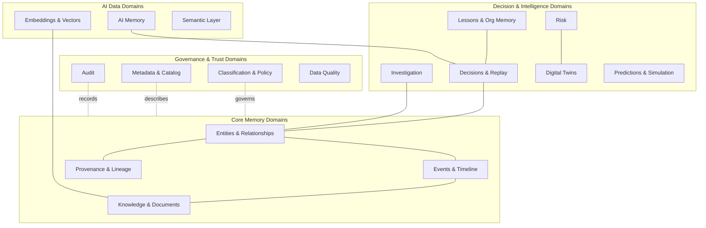
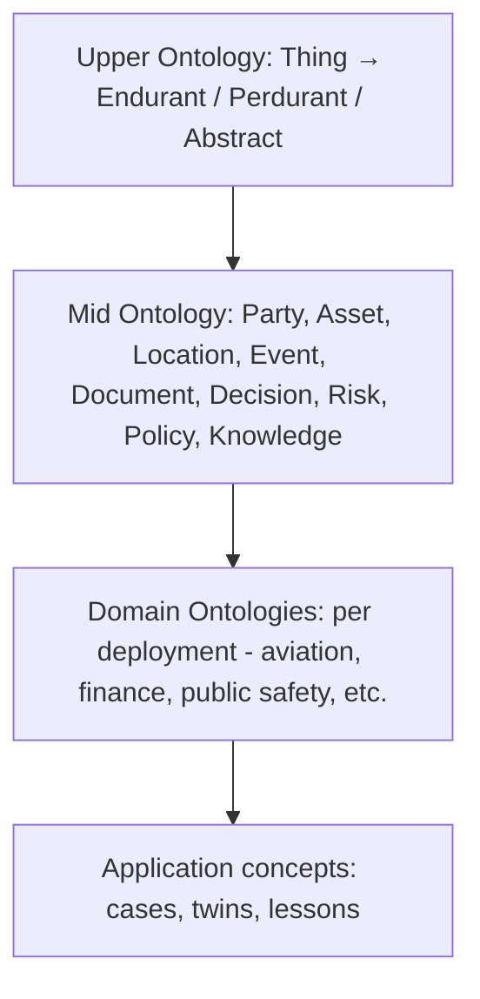
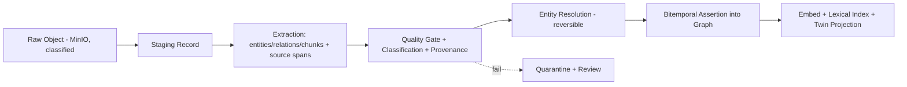
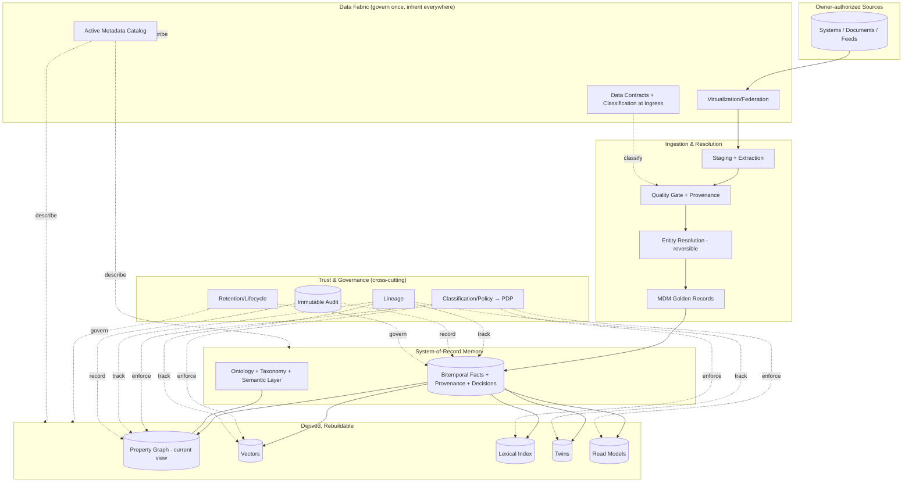

# EMG™ — Enterprise Data Architecture (EDA)
### Authoritative Data Specification · Version 1.0

| Field | Value |
|---|---|
| Document | Enterprise Data Architecture (EDA) v1.0 |
| Derives from | Enterprise Architecture v2.0 (approved) · System Architecture Design v1.0 (approved) |
| Governing authority | Accepted ADRs (`EMG_ARCHITECTURE_DECISION_REGISTER.md`) govern architecture; `docs/product/EMG_PRODUCT_ARCHITECTURE_FREEZE.md` governs product scope. The EA/SAD/EDA/API precedence stated below applies **only among these reference documents** and is subordinate to accepted ADRs and the Freeze. This document is L4 reference material under GR-001 §8.2. |
| Relationship | **Complements, does not modify** the EA or SAD. Where a data structure and the SAD differ, the SAD's service contract prevails and a change request is raised. |
| Status | **For Architecture Review Board** — no code, no SQL, no Cypher |
| Owners | Chief Data Architect · Enterprise Information Architect · Knowledge Graph Architect · Master Data Architect · AI Data Architect |
| Audience | Architecture & data review boards, CDO, CISO, government/defense technical review, data governance council |

> **Scope discipline.** This EDA specifies *information models, canonical structures, ontology, metadata, governance, lineage, quality, lifecycle, and every domain data model* to a level sufficient to govern all data in the platform. It uses **logical data types** (String, Integer, Timestamp, ULID, Enum, Float, Label-Set, Document, Ref) and conceptual/logical **entity-relationship diagrams** as design artifacts. It contains **no implementation code, no SQL, and no Cypher** — physical schema realization lives in engineering under the SAD.

> **Conventions.** Identifiers are ULIDs. Times are UTC ISO-8601. Every fact is **bitemporal** (valid-time + transaction-time) and **provenance-bearing**. Every data element carries a **classification label-set**. "Fact" = any node, edge, or property assertion. "Golden record" = the mastered, canonical representation of a master entity. Logical layers: **Conceptual** (business meaning) → **Logical** (structure, technology-neutral) → **Physical** (realized in stores, governed by the SAD).

---

## 1. Enterprise Information Model (EIM)

The EIM is the top-level, technology-neutral map of the information the platform governs, organized into **information domains**. Every lower model in this document specializes one or more domains.

**Information-domain register (authoritative):**
| Domain | Owns | Primary consumers |
|---|---|---|
| Entities & Relationships | Canonical entities, edges (the memory graph) | All engines |
| Events & Timeline | Occurrences, temporal sequencing | Replay, twins, investigation |
| Knowledge & Documents | Documents, knowledge products, extractions | Copilot, knowledge fabric |
| Provenance & Lineage | Source, transformation, assertion chains | Governance, audit, replay |
| Decisions & Replay | Decision Records, options, outcomes | Decision intelligence, brain |
| Lessons & Org Memory | Institutional lessons, patterns | Brain, executives |
| Risk | Risk register, exposure, drivers | Risk intelligence |
| Investigation | Cases, hypotheses, evidence | Investigation |
| Digital Twins | Governed projections/state models | Predictive, simulation, command center |
| Predictions & Simulation | Model outputs, scenario results | Decision intelligence, risk |
| Classification & Policy | Labels, policies, obligations | Security (PDP) |
| Metadata & Catalog | Technical/business/operational metadata | Governance, discovery |
| Audit | Immutable access/decision trail | Governance, accountability |
| Data Quality | Rules, scores, remediation | Stewardship |
| Embeddings & Vectors | Semantic vectors + payload | Retrieval, AI |
| AI Memory | Session/working/long-term memory | AI orchestration, agents |
| Semantic Layer | Business semantics over data/graph | Copilot, reporting, analysts |

**Principle:** the EIM is the single source of *what information exists and who owns it*. No data element may exist in the platform without a home domain, an owner, a classification, and provenance.

---

## 2. Canonical Data Model (CDM)

The CDM defines the **shared canonical entities** every service references, so that "Person" means the same thing everywhere. Canonical entities are *logical*; physical realization is governed by the SAD (graph + relational).

**Canonical entity catalog (core):** `Party` (specializes to `Person`, `Organization`), `Asset`, `Location`, `Event`, `Document`, `Case`, `DecisionRecord`, `Risk`, `Policy`, `KnowledgeProduct`, `Twin`, `Source`, `Agent`, `Lesson`.

**Canonical entity — common structure (every canonical entity carries):**
| Attribute | Logical type | Description |
|---|---|---|
| `id` | ULID | Canonical identifier |
| `entity_type` | Enum | Canonical type |
| `classification` | Label-Set | Level + compartments/caveats |
| `valid_from` / `valid_to` | Timestamp | Valid-time window |
| `tx_from` / `tx_to` | Timestamp | Transaction-time window |
| `confidence` | Float [0,1] | Assertion confidence |
| `provenance_id` | Ref | Provenance record |
| `created_by` | Ref (Subject) | Asserting identity/agent |
| `status` | Enum | active / superseded / tombstoned |

**Canonical relationships** are first-class (see §9), carry the same common structure, and connect canonical entities. The CDM is **normalized at the conceptual level** and deliberately connected (graph-native) rather than flattened; analytical/denormalized read models are derived (§37).

**Golden-record linkage:** canonical `Party`, `Asset`, and `Location` entities are **mastered** (see §3); their canonical `id` is the golden-record id, and source-specific representations link to it via provenance rather than duplication.

---

## 3. Master Data Management (MDM)

MDM establishes **single, governed, canonical representations** ("golden records") for the master domains, reconciled from many sources without destroying source identity.

**Mastered domains:** Party (Person/Organization), Asset, Location, and reference/lookup domains (e.g., role types, event types, classifications) as **reference data**.

**MDM model:**
| Concept | Definition |
|---|---|
| Golden record | The canonical, mastered entity (a canonical entity per §2) |
| Source record link | A provenance-bearing link from a source-system representation to the golden record |
| Survivorship | Rules that determine which attribute value "wins" per attribute, with provenance and confidence retained for all candidates |
| Match assertion | Reversible `SAME_AS` / `DIFFERENT_FROM` assertion produced by Entity Resolution (§35) |
| Steward action | Human merge/split/override, fully audited and reversible |

**Survivorship principle:** EMG uses **non-destructive mastering** — conflicting source values are *retained as coexisting assertions*, and the golden value is a *derived, explainable selection* (by rule: highest trust, most recent valid-time, highest confidence), never a silent overwrite. This preserves the ability to unmerge and to replay decisions on the data as it was.

**Reference data** is versioned, centrally owned, classification-tagged, and distributed to all services from one catalog; no service maintains private copies of shared reference values.

**MDM governance:** each master domain has a data owner and steward; match thresholds and survivorship rules are versioned configuration reviewed by governance; every mastering decision is auditable and reversible.

---

## 4. Metadata Architecture

EMG treats metadata as **active** — it drives discovery, governance, and access, not merely documentation.

**Metadata planes:**
| Plane | Contents | Example |
|---|---|---|
| Technical | Structure, types, physical location, indexes | "Party.id is a ULID, mastered, graph+relational" |
| Business | Meaning, ownership, definitions, glossary terms | "Party = any legal or natural person of interest" |
| Operational | Freshness, volume, quality scores, lineage status | "Risk twin last reconciled 4 min ago" |
| Governance | Classification, retention, contracts, policy bindings | "Document class C2, retain 7y, legal-hold aware" |
| Semantic | Ontology terms, taxonomy nodes, embeddings metadata | "Event ⊂ Occurrence; embedded with model v3" |

**Active metadata catalog** is the discovery and governance backbone: every data element (canonical entity, node/edge type, twin, model, knowledge product, dataset) has a catalog entry with owner, classification, definition, lineage pointer, quality score, and retention. **Metadata is itself classified** (a metadata entry may reveal the existence of sensitive data) and access-controlled.

**Principle:** if it is not in the catalog with an owner, a classification, and a definition, it does not exist in the platform.

---

## 5. Enterprise Ontology

A layered ontology gives shared, machine-usable meaning. Property-graph-native for operations; RDF/OWL-expressible for interchange and formal reasoning where required.

- **Upper ontology** — foundational distinctions (things that persist vs. things that happen vs. abstract objects), stable across all deployments.
- **Mid ontology** — the canonical concepts (§2), shared across sectors.
- **Domain ontologies** — sector/deployment specializations, co-developed with SMEs, additive to the mid ontology.
- **Application concepts** — decision records, twins, lessons, cases.

Each ontology class declares: allowed properties + logical types, default classification, default retention, cardinality constraints, and entity-resolution matching rules. Ontology is versioned; changes are **additive and reversible** (§18). The ontology is the *ubiquitous language* referenced by services, APIs, and the semantic layer.

---

## 6. Taxonomy

Taxonomies are controlled hierarchical vocabularies used to classify and organize data; they complement the ontology (which defines *types and relationships*) by providing *categorization*.

**Governed taxonomies:**
| Taxonomy | Purpose | Example hierarchy |
|---|---|---|
| Subject/Topic | Categorize knowledge & documents | Domain → Topic → Subtopic |
| Security classification | Drive access control | Level (e.g., C0…C4) + Compartment/Caveat sets |
| Event type | Categorize occurrences | Category → Type → Subtype |
| Risk taxonomy | Categorize risks | Risk domain → Category → Driver |
| Asset taxonomy | Categorize assets | Class → Type → Model |
| Document type | Categorize sources | Class → Format → Genre |
| Decision type | Categorize decisions | Domain → Class → Pattern |

Taxonomies are **versioned reference data** (§3), centrally owned, classification-tagged, and bound to ontology classes and catalog entries. A data element may carry multiple taxonomy tags (e.g., a document has a subject tag, a document-type tag, and a security label). Taxonomy nodes are stable, deprecation-managed, and mapped to embeddings for semantic navigation.

---

## 7. Knowledge Graph Ontology

The operational ontology of the memory graph — how the enterprise ontology (§5) is realized as a governed property graph.

**Structure:**
- **Classes → Node types** (§8): each mid/domain ontology class maps to a node type with a defined property set.
- **Object properties → Relationship types** (§9): first-class, time-scoped, provenance-bearing edges.
- **Data properties → Node/edge properties** (§10): typed, unit-standardized, classification-inheriting.
- **Constraints:** cardinality, allowed-endpoint types per relationship, mandatory system properties, classification defaults.

**Dual label planes (per SAD §6.3):**
| Plane | Role |
|---|---|
| Type labels | Ontology class membership (drives structure & queries) |
| Security labels | Classification level + compartments (drives access; enforcement handle for the PDP) |

**Reasoning support:** the graph supports transitive/hierarchical reasoning (e.g., type subsumption, part-of, same-as transitivity) with **classification-aware boundaries** — inference may not fuse across compartments a subject is not cleared for. RDF/OWL export is provided for formal reasoning or interchange without making it the operational store.

---

## 8. Node Types

Authoritative catalog of node types. Every node carries the common canonical structure (§2) plus type-specific properties. Domain deployments add specialized subtypes additively.

| Node type | Meaning | Key type-specific properties (logical) | Mastered? |
|---|---|---|---|
| `Person` | Natural person of interest | names[], identifiers[], attributes | Yes |
| `Organization` | Legal/formal entity | names[], identifiers[], org_type | Yes |
| `Asset` | Physical/logical asset | asset_class, identifiers[], criticality | Yes |
| `Location` | Place/geo-object | geo, address, location_type | Yes |
| `Event` | Occurrence in time | event_type, occurred_at (valid-time), participants[] | No |
| `Document` | Source document/artifact | doc_type, format, source_ref, content_refs[] | No |
| `Case` | Investigation container | case_type, status, owner | No |
| `DecisionRecord` | A decision + context (§24) | framing, options_ref, outcome_ref | No |
| `Risk` | A risk (§28) | risk_type, exposure, drivers[] | No |
| `Policy` | A governing rule (§30) | policy_type, applicability, effective_window | No |
| `KnowledgeProduct` | Curated knowledge (§26/§33-KF) | product_type, version, topic_tags[] | No |
| `Lesson` | Institutional lesson (§25) | context_features, insight, applicability | No |
| `Twin` | Digital-twin projection root (§27) | twin_type, freshness, baseline_version | No |
| `Prediction` | A model output (§28/§21) | target, value, uncertainty, model_version | No |
| `Source` | A data source/system | system_ref, contract_ref | No |
| `Agent` | An AI agent identity | charter_ref, clearance_ceiling | No |

**Node governance:** new node types require ontology approval (§18), classification defaults, retention defaults, matching rules (if mastered), and a catalog entry (§4) before activation.

---
## 9. Relationship Types

Relationships are **first-class**: time-scoped, provenance-bearing, classification-labeled, and carry the common canonical structure (§2). Each type declares allowed endpoint node types and cardinality.

| Relationship type | From → To | Meaning | Cardinality |
|---|---|---|---|
| `SAME_AS` / `DIFFERENT_FROM` | Party↔Party, Asset↔Asset | Reversible identity assertions (§35) | many-many |
| `MEMBER_OF` | Person → Organization | Membership/affiliation | many-many |
| `OWNS` / `OPERATES` | Party → Asset | Ownership/operation | many-many |
| `LOCATED_AT` | Party/Asset/Event → Location | Placement (time-scoped) | many-many |
| `INVOLVED_IN` | Party/Asset → Event | Participation | many-many |
| `PART_OF_CASE` | Entity/Event/Document → Case | Case membership | many-many |
| `ASSERTED_BY` | Fact → Source/Agent | Provenance of assertion | many-one |
| `DERIVED_FROM` | Fact/Product → Fact/Document | Lineage/derivation | many-many |
| `DECIDED_IN` | Entity/Event → DecisionRecord | Subject of a decision | many-many |
| `INFORMED_BY` | DecisionRecord → Fact/Document | Evidence used | many-many |
| `MITIGATES` / `THREATENS` | Policy/Control ↔ Risk | Risk relationships | many-many |
| `GOVERNED_BY` | Entity/Action → Policy | Policy applicability | many-many |
| `PROJECTS_TO` | Fact → Twin | Twin projection membership | many-many |
| `PREDICTS` | Prediction → Entity/Event/Risk | Prediction target | many-one |
| `LEARNED_FROM` | Lesson → DecisionRecord/Event | Lesson provenance | many-many |
| `PRECEDES` / `CAUSES` | Event → Event | Temporal/causal ordering | many-many |

**Relationship governance:** endpoint-type and cardinality constraints are enforced at write; classification of an edge is at least as restrictive as its most restrictive endpoint by default; conflicting relationship assertions coexist (versioned) rather than overwrite.

---

## 10. Property Standards

**Naming:** `snake_case`; nouns for attributes; boolean prefixed `is_`/`has_`; time attributes suffixed `_at` (instant) or `_from`/`_to` (window); identifiers suffixed `_id`; taxonomy tags suffixed `_tags`.

**Mandatory system properties (every node and edge):** `id`, `type`, `classification`, `valid_from`, `valid_to`, `tx_from`, `tx_to`, `confidence`, `provenance_id`, `created_by`, `status`. These are system-managed and immutable post-assertion (a change creates a new version).

**Logical datatypes (allowed set):** String, Text, Integer, Float, Boolean, Timestamp, Date, Enum, ULID, Ref, Geo, Label-Set, Document (structured), List<T>, Money (value+currency), Quantity (value+unit).

**Standards:**
| Concern | Standard |
|---|---|
| Units | SI units; unit stored with quantity (Quantity type); no bare numbers for measured values |
| Currency | ISO 4217 code with every monetary value |
| Geo | WGS-84; standardized geo type |
| Language | BCP-47 language tags on text; original + normalized retained |
| Identifiers | Business identifiers stored as typed, provenance-bearing values (never as the canonical id) |
| Enumerations | Backed by governed reference data (§3); no free-text where an enum exists |
| Nullability | Distinguish "unknown" from "asserted absent"; both are explicit, provenance-bearing states |
| Classification inheritance | Derived properties inherit the most restrictive contributing classification |

**Data-quality binding:** every property maps to quality rules (§14); every property is describable in the catalog (§4) and the semantic layer (§20).

---

## 11. Data Classification

Classification is the enforcement handle for Zero-Trust access (EA Ch. 39, SAD §11). It is **mandatory** on every data element.

**Classification model:**
| Component | Definition |
|---|---|
| Level | Ordered sensitivity (e.g., C0 public … C4 highest), deployment-configurable |
| Compartments / caveats | Need-to-know groupings; a subject must hold *all* required compartments |
| Handling markings | Distribution, retention, and dissemination constraints |
| Origin marking | Source and originator control where required |

**Rules:**
- Classification is applied at **ingress** (asserted by the connector under the owning org's contract) and **inherited** by every derived fact, embedding, prediction, twin state, knowledge product, and AI output.
- Derived data takes the **most restrictive** classification of its inputs (high-water mark).
- Classification is immutable post-assertion; reclassification creates a new version with audit.
- **Metadata and existence** are classified too — the catalog and search indexes respect classification so that unauthorized existence is not disclosed.
- The PDP evaluates `(subject clearance + compartments) vs (resource level + compartments)` plus ABAC context to allow/deny and emit obligations (mask/redact/deny-field).

---

## 12. Data Governance

The operating model that makes every data element owned, defined, classified, contracted, and accountable.

**Roles:** Data Owner (accountable per domain) · Data Steward (operational quality, resolution) · Governance Officer (policy, classification, retention) · Custodian (technical operation under the SAD) · Consumer (least-privilege access).

**Instruments:**
| Instrument | Purpose |
|---|---|
| Data contract | Per source/integration: schema, classification, purpose, retention, quality SLAs, allowed use (§36, §38) |
| Catalog entry | Definition, owner, classification, lineage, quality, retention (§4) |
| Policy bundle | Access & governance policy, versioned & simulated (SAD §11) |
| Ontology/taxonomy change control | Additive, reversible, reviewed (§18) |
| Retention schedule | Per class, legal-hold aware (§16) |
| Stewardship workflow | Quality remediation, ER review, reclassification |

**Councils:** a Data Governance Council owns cross-domain standards, classification scheme, and contract approval; a Model/AI Governance Board owns embedding/model/prediction governance (§21, EA Ch. 23). **Principle:** governance is applied **once at the fabric/catalog** and inherited everywhere; no per-service governance drift.

---

## 13. Data Lineage

Lineage answers "where did this come from and how was it derived" for **every** fact, embedding, prediction, twin state, and AI answer — unifying with provenance (SAD §6.x).

**Lineage granularity:** element-level (a property value), record-level (an entity/edge), and dataset-level (a virtualized dataset). Every level links upstream to source and transformation and downstream to consumers.

**Lineage record (logical):**
| Attribute | Type | Description |
|---|---|---|
| `lineage_id` | ULID | Identifier |
| `target_ref` | Ref | The derived fact/product |
| `source_refs` | List<Ref> | Upstream facts/documents/sources |
| `transform_ref` | Ref | Transformation/IE/model applied |
| `asserting_subject` | Ref | Identity/agent that produced it |
| `captured_at` | Timestamp | When lineage was recorded |
| `classification` | Label-Set | Inherited high-water mark |

**Capture:** lineage is captured automatically at every derivation point (ingestion, ER, embedding, inference, twin projection, prediction, report). Lineage is **queryable forward and backward** and is a required input to Decision Replay (§24) and audit reconstruction (§33). Lineage graphs are themselves classified and access-controlled.

---

## 14. Data Quality Framework

**Quality dimensions (measured per element/dataset):** Accuracy, Completeness, Consistency, Timeliness/Freshness, Validity (conformance to type/rule), Uniqueness (no unmanaged duplicates), Provenance-completeness (every fact has a source), Classification-completeness (every element labeled).

**Model:**
| Concept | Definition |
|---|---|
| Quality rule | A validation bound to a property/type/dataset (e.g., "occurred_at ≤ now") |
| Quality score | Per-element and per-dataset composite across dimensions |
| Quarantine | Holding state for data failing critical rules (kept out of the graph/answers) |
| Remediation workflow | Steward-driven correction, reversible, audited |
| Quality SLA | Contracted freshness/completeness per source (§12 data contract) |

**Operation:** quality is checked at ingestion and continuously (observability, SAD §14). Failing-critical data is **quarantined**, never silently admitted. Low-confidence extractions route to human review (ER §35). Quality scores are catalog metadata (§4) and influence retrieval ranking and survivorship (§3). No fact without provenance and classification can pass quality gates.

---

## 15. Data Lifecycle

Every data element moves through a governed lifecycle; transitions are audited and (until disposal) reversible.

```mermaid
flowchart LR
  CAP[Capture/Ingest] --> CLASS[Classify + Provenance]
  CLASS --> QUAL[Quality Gate]
  QUAL --> RESOLVE[Resolve/Master]
  RESOLVE --> ASSERT[Assert - bitemporal version]
  ASSERT --> INDEX[Index/Embed/Project]
  INDEX --> USE[Use - retrieval, decisions, twins]
  USE --> EVOLVE[Evolve - new versions]
  EVOLVE --> RETIRE[Tombstone - logical delete]
  RETIRE --> DISPOSE[Governed hard purge - retention + legal hold]
```

**Stage guarantees:** classification and provenance are attached before any use; quality gates precede assertion; assertion is bitemporal (no overwrite); indexing/embedding/projection are derived and rebuildable; tombstoning is logical and reversible until governed disposal; disposal is the only irreversible step and is governed, audited, and legal-hold-aware.

---

## 16. Data Retention

**Model:** retention is defined **per classification/data class and per domain**, expressed as reference data (§3) and bound in the catalog (§4) and data contracts (§12).

| Concept | Definition |
|---|---|
| Retention schedule | Duration + trigger (from creation / from event / from case closure) per class |
| Legal hold | Overrides scheduled disposal; freezes elements from purge; audited |
| Disposition | Logical tombstone → eligibility window → governed hard purge |
| Audit retention | Immutable audit retained per regulatory requirement (typically multi-year), independent of business-data schedules |

**Rules:** logical deletion (tombstone) by default; **hard purge only via governed, audited process** respecting legal hold; retention respects the high-water classification; provenance and audit of a purged element are retained (the fact that data existed and was disposed is itself a governed record). Derived data (embeddings, indexes, twin state) is purged/rebuilt consistently with its source.

---

## 17. Data Versioning

Versioning is **bitemporal and universal** — the mechanism by which nothing is silently overwritten and any past state is reconstructable (foundation for Replay §24 and Timeline §32).

| Concept | Definition |
|---|---|
| Valid-time | When a fact was true in the world (`valid_from`/`valid_to`) |
| Transaction-time | When EMG knew it (`tx_from`/`tx_to`) |
| Version | An immutable fact state bounded by both time axes |
| Current version | Open `tx_to`, with valid-window containing "now" |
| As-of read | Select the version whose valid- and transaction-windows both contain the requested `(validTime, txTime)` |
| Correction | A new version that supersedes a prior one, with reason + provenance (the prior remains) |
| Tombstone | A version marking logical deletion (still visible in history) |

**Rules:** updates **close** the current version and **open** a new one; corrections are versions, not overwrites; every version carries provenance and classification; concurrency is managed by optimistic control with conflict detection; the relational store is the system-of-record for history, the graph holds the current materialized view (SAD §7). Versioning applies to ontology and reference data too (§18).

---

## 18. Graph Evolution Strategy

How the graph *schema/ontology* evolves without breaking history or consumers.

**Principles:** **additive and reversible** only. New node/edge/property types and new taxonomy nodes may be added; existing structures are never removed or repurposed without a governed migration and a deprecation window.

| Change | Handling |
|---|---|
| Add type/property/taxonomy node | Additive; default classification/retention/matching required; catalog updated |
| Deprecate type/property | Marked deprecated with sunset; consumers migrated; retained in history |
| Rename | Alias + mapping; original preserved; never destructive |
| Constraint tightening | Applied forward-only; historical data grandfathered with provenance |
| Reclassification of a type default | New version; existing elements re-evaluated via governed job, audited |

**Migrations** are versioned reference changes reviewed by the ontology authority and governance council; they are simulated (impact analysis) before rollout and are themselves audited and reversible. Consumers bind to ontology *versions*; breaking changes require a new major ontology version and a migration window.

---

## 19. Knowledge Evolution

How *knowledge* (facts, identity, interpretation, lessons) evolves over time — distinct from schema evolution (§18).

- **Facts** evolve via bitemporal versions (§17); truth is time-scoped, corrections are additive.
- **Identity** evolves via reversible `SAME_AS`/`DIFFERENT_FROM` (§35); merges/splits never destroy source identity.
- **Conflicting assertions** coexist; resolution (or explicit non-resolution) is a provenance-bearing stewardship decision.
- **Interpretation** evolves as knowledge products are versioned (§26); who interpreted what, when, and how is retained (interpretation provenance).
- **Lessons** (§25) are derived post-hoc from decisions + outcomes and feed back into memory, so the graph's *institutional understanding* improves without altering the historical record.
- **Confidence** may change as new corroborating/conflicting sources arrive; confidence changes are versioned, not overwritten.

**Guarantee:** knowledge evolution is monotonic in *history* (nothing lost) even as the *current view* changes; any past understanding is reconstructable exactly as it was.

---

## 20. Semantic Layer

A governed **business-semantic layer** that exposes data and graph in the organization's language, so consumers (Copilot, reporting, analysts) query meaning, not physical structure.

**Contents:**
| Element | Role |
|---|---|
| Business terms | Glossary terms mapped to ontology classes/properties |
| Metrics/measures | Governed, versioned definitions (e.g., "exposure", "decision quality") |
| Semantic mappings | Business term → canonical model → physical store (via SAD) |
| Access semantics | Classification + obligations expressed at the semantic level |
| Embeddings binding | Terms/taxonomy linked to vector space for semantic navigation (§21) |

**Principles:** one governed definition per business concept (no conflicting metrics); the semantic layer enforces classification (a term resolves only to authorized data); it is the interface the Copilot and reporting use to remain grounded in *approved* meaning; definitions are versioned and owned. The semantic layer is the bridge between the ontology (§5) and human/AI consumption.

---
## 21. Embedding Strategy

Governs what is embedded, how, and under what controls — so semantic retrieval is powerful *and* sovereign.

**What is embedded:** document chunks (with preserved source spans), entity summaries, knowledge products, lessons, and taxonomy/semantic terms. **What is not embedded by default:** raw sensitive identifiers and the most restricted properties (retrieved via graph, not vectors), to limit exposure surface.

**Strategy:**
| Concern | Standard |
|---|---|
| Model | Self-hosted embedding model (air-gap capable); version pinned; governed by the Model/AI Board |
| Versioning | Every vector carries `embedding_model_version`; re-embedding is a governed batch job on model change |
| Chunking | Semantic chunking with retained source spans for citation |
| Classification | Every vector carries the **high-water classification** of its source; retrieval filters on it |
| Reproducibility | Embedding inputs, model, and version are lineage-tracked (§13) |
| No training | Customer data is not used to train models by default (EA Ch. 23) |

**Principle:** embeddings are **derived and rebuildable** from the system-of-record; they are an index, not a source of truth, and are classified and access-controlled exactly like the data they represent.

---

## 22. Vector Data Model

Logical model for the semantic index (physical store per SAD §7 — Qdrant).

**Vector record (logical):**
| Attribute | Type | Description |
|---|---|---|
| `vector_id` | ULID | Identifier |
| `embedding` | Vector | The embedding |
| `source_ref` | Ref | Fact/document-chunk/product embedded |
| `chunk_span` | Document | Source span for citation |
| `embedding_model_version` | String | Model + version |
| `classification` | Label-Set | High-water classification (filter key) |
| `taxonomy_tags` | List<Ref> | Subject/type tags |
| `valid_from`/`valid_to` | Timestamp | Temporal scope (for as-of-aware retrieval) |
| `provenance_id` | Ref | Lineage |

**Collections/partitions:** organized by domain/tenant; classification stored as a **payload filter** so the Policy Filter (SAD §8.2) prunes unauthorized vectors *before* ranking. **Consistency:** vectors reconcile to their source fact's current version; stale vectors are re-embedded on version close. Vectors are never the citation of record — the linked `source_ref` is.

---

## 23. AI Memory Model

Data structures for AI memory, layered by durability and governance (SAD §8.5).

| Tier | Contents | Store (logical) | Governance |
|---|---|---|---|
| Short-term (session) | Conversation turns, transient context | Ephemeral, TTL-bound | Classified to session min-clearance; never persisted as fact |
| Working (task/mission) | Assembled, policy-filtered evidence for a task | Ephemeral, task-scoped | Min-common-clearance for multi-agent tasks (§9) |
| Long-term (institutional) | The memory graph itself | Durable, governed | Full bitemporal + provenance + classification |
| Shared agent context | Cross-agent task context | Ephemeral, TTL | Min-common-clearance; validated per hop |

**Principles:** AI has **no hidden durable memory** — anything that persists does so only as a **governed graph write** with provenance, classification, and (if consequential) human approval. Retrieved content is **data, not instructions** (injection defense). Session/working memory is classified, access-controlled, and disposed on expiry; it can never elevate a subject's effective clearance.

---

## 24. Decision Memory Model

The canonical **Decision Record** — the data substrate for Decision Intelligence and Replay (EA Ch. 29–30, SAD §5.4).

**Decision Record (logical, bitemporal, provenance-bearing):**
| Attribute | Type | Description |
|---|---|---|
| `decision_id` | ULID | Identifier |
| `framing` | Text | The question/decision framed |
| `options` | List<Document> | Options with scores, weights (explicit), and trade-offs |
| `evidence_refs` | List<Ref> | Cited facts/documents (as-of the decision) |
| `analogues_refs` | List<Ref> | Historical Decision Records compared |
| `predicted_outcomes` | List<Document> | Per-option predictions + uncertainty |
| `risk_profile` | Document | Risk factors per option |
| `stakeholders` | List<Ref> | Participants |
| `recommendation` | Ref | Recommended option (+ steelman) |
| `human_decision` | Ref | Option chosen by authorized human |
| `rationale` | Text | Recorded reasoning |
| `approval_chain_ref` | Ref | HITL workflow chain + approvers |
| `realized_outcome` | Document | Later-asserted outcome |
| `decision_quality_score` | Float | Process quality (info-available basis) |
| `outcome_quality_score` | Float | Outcome quality (separate from process) |

**Principles:** the Record captures the decision **as it was made** (evidence and predictions are as-of the decision time); **decision quality and outcome quality are separate fields** so the organization learns from good decisions with bad luck and vice versa; the Record is a first-class node (§8) linked via `DECIDED_IN`/`INFORMED_BY`; it is immutable-by-versioning and fully replayable.

---

## 25. Lessons Learned Model

Institutional lessons derived from decisions + outcomes (EA Ch. 28, SAD §5.9), stored as governed, reusable knowledge.

**Lesson (logical):**
| Attribute | Type | Description |
|---|---|---|
| `lesson_id` | ULID | Identifier |
| `context_features` | Document | The situation pattern the lesson applies to |
| `insight` | Text | The learned insight |
| `evidence_refs` | List<Ref> | Decisions/outcomes it was learned from (`LEARNED_FROM`) |
| `applicability` | Document | Conditions/domains where it applies |
| `confidence` | Float | Strength of the pattern |
| `version` | String | Lesson version (evolves as evidence grows) |
| `classification` | Label-Set | High-water of contributing evidence |

**Principles:** lessons are **cited** (traceable to the decisions/outcomes they came from), **versioned** (they strengthen or weaken as evidence accrues), classification-inheriting, and delivered as knowledge products (§26) into Copilot/Command Center. Lessons never alter the historical record; they are a learned layer over it.

---

## 26. Organizational Memory Model

The consolidated memory that powers the Organizational Brain — how memory becomes organizational understanding.

**Composition:** the organizational memory is not a separate store but a **governed composition** over: the entity/relationship graph (§2, §8–9), events/timeline (§31–32), knowledge products, decisions (§24), lessons (§25), and their provenance. It is exposed through the semantic layer (§20).

**Knowledge product (logical):**
| Attribute | Type | Description |
|---|---|---|
| `product_id` | ULID | Identifier |
| `product_type` | Enum | Brief / assessment / playbook / lesson / interpretation |
| `content_refs` | List<Ref> | Grounding facts/documents (cited) |
| `interpretation_provenance` | Document | Who interpreted, when, how |
| `topic_tags` | List<Ref> | Taxonomy tags |
| `version` | String | Versioned lifecycle |
| `classification` | Label-Set | High-water |
| `lifecycle_state` | Enum | draft / curated / published / retired |

**Principles:** organizational knowledge flows capture → curate → connect → deliver → reuse (Knowledge Fabric, EA Ch. 33); every knowledge product is owned, versioned, cited, and classified; **interpretation is itself an auditable asset** (interpretation provenance); reuse feeds institutional learning (§25).

---

## 27. Digital Twin Data Model

Twins are **governed projections** over the memory graph plus authorized feeds — models, not systems-of-record (EA Ch. 31).

**Twin (logical):**
| Attribute | Type | Description |
|---|---|---|
| `twin_id` | ULID | Identifier |
| `twin_type` | Enum | Organization/Project/Operations/Incident/Investigation/Risk/Asset/Policy/Crisis |
| `projection_def` | Document | Subgraph + feed definition (what the twin includes) |
| `state_model` | Document | Current state variables (derived) |
| `baseline_version` | String | Graph version the projection is based on |
| `freshness_at` | Timestamp | Last reconciliation |
| `freshness_sla` | Duration | Allowed staleness |
| `drift_flags` | List<Document> | Detected staleness/inconsistency |
| `classification` | Label-Set | High-water of underlying facts |

**Principles:** every twin fact **traces to a graph fact or a labeled feed** (no shadow database); twins carry a **freshness SLA and drift detection**; state is derived and rebuildable; classification is inherited; twins feed prediction (§28/§21) and simulation. Simulation and prediction outputs referencing a twin record the twin's `baseline_version` for reproducibility.

---

## 28. Risk Data Model

**Risk (logical, node type per §8):**
| Attribute | Type | Description |
|---|---|---|
| `risk_id` | ULID | Identifier |
| `risk_type` | Ref (taxonomy) | Risk category (§6) |
| `drivers` | List<Ref> | Contributing factors/entities |
| `exposure` | Quantity | Current exposure measure |
| `likelihood` | Float | Assessed/predicted likelihood + uncertainty |
| `impact` | Document | Impact assessment |
| `controls` | List<Ref> | Mitigating policies/controls (`MITIGATES`) |
| `predicted_risk_ref` | Ref | Linked Prediction (§21) with calibration |
| `twin_ref` | Ref | Risk twin projection |
| `classification` | Label-Set | High-water |

**Prediction (logical):** `prediction_id`, `target_ref`, `value`, `uncertainty`, `calibration` (e.g., reliability metadata), `feature_attributions`, `model_version`, `generated_at`, `classification`. **Principles:** every predicted risk carries **uncertainty, calibration, and attribution**; predictions are advisory (feed decisions/HITL, never autonomous action); risk state links to the risk twin and to mitigating policies; risk evolves via versions (§17).

---

## 29. Investigation Data Model

**Case (logical, node type per §8):**
| Attribute | Type | Description |
|---|---|---|
| `case_id` | ULID | Identifier |
| `case_type` | Ref (taxonomy) | Category |
| `status` | Enum | open / active / closed |
| `owner` | Ref | Case owner |
| `member_refs` | List<Ref> | Entities/events/documents (`PART_OF_CASE`) |
| `hypotheses` | List<Document> | Hypotheses with status + supporting/contradicting evidence |
| `evidence_packages` | List<Ref> | Cited evidence sets |
| `classification` | Label-Set | Case-level high-water |

**Hypothesis (logical):** `hypothesis_id`, `statement`, `status` (open/supported/refuted), `supporting_refs`, `contradicting_refs`, `confidence`, `provenance`. **Principles:** investigation artifacts are provenance-bearing; consequential assertions (e.g., new entity links) are **proposals routed to review** (SAD §5.10); evidence retains citations; classification is enforced at case and element level; nothing is destructively edited (versioned).

---

## 30. Policy Data Model

**Policy (logical, node type per §8) — governs both organizational policy and access policy semantics:**
| Attribute | Type | Description |
|---|---|---|
| `policy_id` | ULID | Identifier |
| `policy_type` | Enum | Access / governance / organizational |
| `applicability` | Document | Scope: to whom/what it applies (`GOVERNED_BY`) |
| `rule_expression` | Document | Logical rule (technology-neutral; realized by PDP for access policies) |
| `effective_from`/`effective_to` | Timestamp | Effective window |
| `version` | String | Versioned; simulated before rollout |
| `conflicts_with` | List<Ref> | Detected policy conflicts |
| `classification` | Label-Set | Policy sensitivity |

**Principles:** policies are **versioned, simulated (impact-analyzed), and conflict-checked** before rollout (SAD §11.2); access-policy semantics compile to PDP bundles; organizational policies are modeled in the graph and can be *explained* by the Policy agent (EA Ch. 34) with citations; effective windows are bitemporal-aware (a decision replay uses the policy as-of the decision).

---

## 31. Event Model

Events are first-class occurrences that anchor the timeline and causal reasoning.

**Event (logical, node type per §8):**
| Attribute | Type | Description |
|---|---|---|
| `event_id` | ULID | Identifier |
| `event_type` | Ref (taxonomy) | Category (§6) |
| `occurred_at` | Timestamp | Valid-time of occurrence (may be a range) |
| `participants` | List<Ref> | Entities `INVOLVED_IN` |
| `location_ref` | Ref | `LOCATED_AT` |
| `preceding_refs` / `causes_refs` | List<Ref> | `PRECEDES` / `CAUSES` ordering |
| `evidence_refs` | List<Ref> | Source documents/facts |
| `classification` | Label-Set | High-water |

**Principles:** events carry **occurrence (valid) time distinct from record (transaction) time**; causal/temporal ordering is explicit (`PRECEDES`/`CAUSES`) and provenance-bearing; events are the units the timeline (§32) and replay (§24) sequence; conflicting event assertions coexist (versioned).

---

## 32. Timeline Model

The timeline is a **bitemporal, classification-aware ordering** of events and fact-versions — the backbone of as-of reconstruction and the Knowledge Timeline UI (SAD §12).

**Model:** a timeline query returns, for a subject scope and a `(valid, tx)` window, the ordered sequence of events and fact-versions the subject is authorized to see, on **dual axes**: *valid-time* (what happened when) and *transaction-time* (when it became known). This enables: "what happened," "what we knew and when," and the difference between them (e.g., late-arriving knowledge).

**Guarantees:** timelines are reconstructable exactly as of any point; they are policy-filtered (unauthorized events excluded, not blanked misleadingly); they distinguish occurrence from knowledge; they are the read-model behind Decision Replay's "information available at the time."

---

## 33. Audit Data Model

The immutable, tamper-evident record of everything (SAD §11.5, EA Ch. 39).

**Audit record (logical, append-only, hash-chained):**
| Attribute | Type | Description |
|---|---|---|
| `audit_id` | ULID | Identifier |
| `prev_hash` | String | Hash of prior record (chain) |
| `record_hash` | String | Hash of this record |
| `event_type` | Enum | read / write / inference / access-decision / decision / admin |
| `subject_ref` | Ref | Actor (human/service/agent) |
| `resource_ref` | Ref | Target fact/entity/decision |
| `action` | Enum | The action taken |
| `decision` | Enum | allow / deny (for access events) + obligations |
| `context` | Document | Purpose, correlation id, session, risk context |
| `classification` | Label-Set | Audit-record sensitivity |
| `occurred_at` | Timestamp | When |

**Principles:** append-only and **hash-chained** (tamper-evident), optionally WORM-anchored and externally anchored; streamed to SIEM; covers **every** read/write/inference/access-decision/consequential decision; supports full **reconstruction** ("who saw/asserted/decided what, when"); audit is retained per regulation independent of business retention (§16) and is itself classified and access-controlled.

---
## 34. Search Index Model

Logical model for hybrid retrieval indexes (physical stores per SAD §7 — OpenSearch lexical, Qdrant vector; graph is queried directly).

**Lexical index document (logical):**
| Attribute | Type | Description |
|---|---|---|
| `index_id` | ULID | Identifier |
| `source_ref` | Ref | Fact/document-chunk indexed |
| `text` | Text | Normalized searchable text (+ original) |
| `language` | String | BCP-47 |
| `entity_refs` | List<Ref> | Linked graph entities |
| `taxonomy_tags` | List<Ref> | Subject/type tags |
| `classification` | Label-Set | **Filter key** — enforced pre-rank |
| `valid_from`/`valid_to` | Timestamp | Temporal scope |
| `provenance_id` | Ref | Lineage |

**Hybrid retrieval data flow (logical):** the Policy Filter (SAD §8.2) applies the subject's clearance/compartments to **both** lexical and vector indexes *before* fusion, so unauthorized items never reach ranking. Fusion combines graph, vector, and lexical results; each result carries citations (`source_ref` + `provenance_id`). **All three indexes are derived and rebuildable** from the system-of-record; classification is a mandatory, indexed filter field, not an afterthought.

---

## 35. Entity Resolution Strategy

Reconciles many source representations into canonical golden records (§3) — reversibly, auditably, and with human control over uncertainty.

**Strategy layers:**
| Layer | Method |
|---|---|
| Deterministic matching | Exact/rule-based on high-trust identifiers (governed reference rules) |
| Probabilistic matching | Similarity across attributes → match score with uncertainty |
| Blocking/candidate generation | Reduce comparison space by governed keys |
| Human review | Low-confidence matches routed to stewards (§14) |
| Survivorship | Non-destructive golden value derivation (§3) |

**Assertion model:** ER produces **reversible** `SAME_AS` / `DIFFERENT_FROM` assertions (§9) with confidence and provenance — **never destructive merges**. Merge/split are steward actions that are fully audited and undoable, preserving source identity and history. **Quality metrics:** precision/recall are monitored (SAD §14, §19); thresholds are governed configuration. **Principle:** identity decisions are hypotheses with evidence, not irreversible facts — essential for watchlist, KYC, and investigative integrity.

---

## 36. Knowledge Ingestion Model

The staged data model for bringing knowledge in safely (SAD §5.2–5.3).

**Staging record (logical):** `staging_id`, `source_ref`, `raw_object_ref`, `data_contract_ref`, `classification` (asserted at ingress), `ingest_job_id`, `extraction_results`, `quality_result`, `status` (received/extracted/quarantined/asserted). **Principles:** classification and provenance are attached **at ingress** under the owning org's data contract (§12, §38); low-confidence extractions and quality failures are **quarantined**, never silently admitted; every derived artifact (assertion, embedding, index, twin) traces back to the staging record and raw object (§13).

---

## 37. Data Synchronization

Keeps the derived stores consistent with the system-of-record and read models consistent with writes — deterministically.

**Model:**
| Concern | Approach |
|---|---|
| System-of-record | PostgreSQL (bitemporal facts, provenance, decisions, catalog) — authoritative |
| Derived stores | Graph (current view), vector, lexical — **rebuildable** from SoR + object store |
| Propagation | Event-driven (outbox → event backbone → idempotent consumers) on version close |
| Read models | Dashboard/analytical projections (CQRS-style) rebuilt from events |
| Consistency | Strong within a store; eventual across stores; last-write-wins avoided via versioning (§17) |
| Reconciliation | Periodic reconciliation jobs detect and repair derived-store drift; twins reconcile per freshness SLA (§27) |
| Recovery | On DR, derived stores are **rebuilt** from SoR (SAD §7.7) — no divergent truth |

**Principle:** there is exactly **one system-of-record**; everything else is a consistent, rebuildable projection. Synchronization never creates a second source of truth. Air-gap synchronization uses signed, scanned export/import bundles.

---

## 38. Data Fabric Architecture

The virtualized, governed data plane that unifies access across sources without mandatory physical consolidation (EA Ch. 32).

**Pillars (data view):**
| Pillar | Data-architecture role |
|---|---|
| Virtualization / federation | Access source data in place; materialize only when needed (graph/embeddings/performance) — honors residency |
| Active metadata | The catalog (§4) is the fabric's control plane |
| Master data | Golden records (§3) reconciled via ER (§35) |
| Lineage | Unified with provenance (§13) end-to-end |
| Governance | Classification, contracts, retention enforced **at the fabric** (§11–12, §16) |
| Quality | Profiling, validation, quarantine at ingress (§14) |

**Data contract (fabric ingress, logical):** `contract_id`, `source_ref`, `schema_def`, `classification_policy`, `purpose`, `allowed_use`, `retention`, `quality_sla`, `owner`, `authorized_by` (the owning organization). **Principles:** governance is applied **once at the fabric and inherited everywhere**; integrations are **owner-authorized only** (EA Ch. 40) and contract-governed; least-data/purpose-limited/residency-aware access; the fabric feeds the graph — it does not replace it.

---

## 39. Reference Architecture (Data)

Consolidated end-to-end data reference architecture, tying every model above into one governed flow.

**Reference principles (authoritative):**
1. One **system-of-record**; all else derived and rebuildable.
2. Every fact is **bitemporal, provenance-bearing, and classified** — no exceptions.
3. Governance applied **once at the fabric/catalog**, inherited everywhere.
4. Derived classification takes the **high-water mark**; existence is protected.
5. Identity and knowledge evolve **non-destructively** (reversible, versioned).
6. AI has **no hidden durable memory**; persistence is a governed graph write.
7. Nothing is silently overwritten or hard-deleted; disposal is the only irreversible step and is governed and audited.

---

## 40. Acceptance Criteria (per data domain, measurable)

| Data domain | Acceptance criteria (measurable) |
|---|---|
| Enterprise Information Model | Every data element maps to exactly one owning domain with owner, classification, provenance (catalog audit passes) |
| Canonical Data Model | All services reference canonical entities; no divergent private definitions (contract check) |
| MDM | Golden records exist for mastered domains; survivorship is non-destructive; merge/split reversible + audited |
| Metadata | 100% of active data elements have catalog entries (owner, class, definition, lineage, retention) |
| Ontology/Taxonomy | Versioned; changes additive/reversible; every class has classification+retention+matching defaults |
| Knowledge Graph Ontology | Dual label planes present; endpoint/cardinality constraints enforced at write |
| Node/Relationship types | Every node/edge carries all mandatory system properties (validation passes) |
| Property standards | Units/currency/geo/language standards enforced; no bare measured values; unknown vs asserted-absent distinguished |
| Classification | Every element labeled; derived data high-water enforced; metadata/existence protected (negative test passes) |
| Governance | Every source has a data contract; governance applied at fabric (no per-service drift) |
| Lineage | Backward+forward lineage complete for every fact/embedding/prediction/answer |
| Data Quality | Critical-rule failures quarantined (not admitted); provenance+classification completeness = 100% before assertion |
| Lifecycle/Retention | Retention schedules bound per class; logical-delete default; hard purge governed + legal-hold-aware + audited |
| Versioning | No overwrite (version count increments); as-of read returns correct historical state |
| Graph/Knowledge Evolution | Schema changes additive/reversible with impact simulation; history monotonic (nothing lost) |
| Semantic Layer | One governed definition per business concept; terms resolve only to authorized data |
| Embeddings/Vectors | Every vector carries model-version + high-water classification; rebuildable from SoR; Policy Filter prunes pre-rank |
| AI/Decision/Lessons/Org Memory | No hidden durable AI memory; decision quality vs outcome quality separated; lessons cited + versioned |
| Digital Twin | Every twin fact traceable; freshness SLA + drift flags present; state rebuildable |
| Risk/Investigation/Policy | Predictions carry uncertainty+calibration; consequential investigation writes routed to review; policies versioned+simulated+conflict-checked |
| Event/Timeline | Occurrence vs record time distinguished; timeline policy-filtered; as-of reconstruction exact |
| Audit | Append-only, hash-chained, tamper-evident; full reconstruction; retained per regulation |
| Search Index | Classification is a mandatory indexed filter; unauthorized items excluded pre-rank; results cited |
| Entity Resolution | Reversible assertions only; precision/recall monitored against thresholds; merge/split audited |
| Ingestion | Classification+provenance at ingress; quality failures quarantined; all derived artifacts traceable to staging+raw |
| Synchronization | Exactly one system-of-record; derived stores rebuildable; reconciliation repairs drift |
| Data Fabric | Governance enforced at fabric; integrations owner-authorized + contract-governed; residency honored |

Classification, provenance, versioning, and audit criteria accept **no partial credit**.

---

## Appendix — Glossary (data terms)
**Bitemporal** — valid-time + transaction-time on every fact. **Golden record** — mastered canonical entity. **High-water mark** — derived data takes the most restrictive contributing classification. **Label-Set** — classification level + compartments/caveats. **Lineage** — where data came from and how derived. **Non-destructive mastering/resolution** — reconciliation that never overwrites or discards source identity. **Provenance** — source/asserter/transform of a fact. **System-of-record** — the single authoritative store (all else derived). **As-of** — reading data as it was at a past time pair.

---

## Sign-off

This Enterprise Data Architecture is the authoritative specification for every data structure in EMG™. It complements — and does not modify — the approved Enterprise Architecture v2.0 and System Architecture Design v1.0; where a data structure and the SAD's service contracts differ, the SAD prevails and a governed change request is raised.

**No code, SQL, or Cypher is included** — physical realization is delivered by engineering under the SAD, with technology versions pinned in the SAD's ADRs. On approval, the recommended next step is to ratify the ontology and classification scheme with domain SMEs and the governance council, then bind the catalog, data contracts, and retention schedules before ingestion of any real data.
