# EMG™ — Enterprise Intelligence Platform
## Enterprise Architecture — Version 2.0

| Field | Value |
|---|---|
| Document | Enterprise Architecture v2.0 (Pre-Build) |
| Supersedes | Architecture Package v1.0 (carried forward in Part I, not removed) |
| Status | **Draft for Architecture-Board / Defense / Procurement Review** — no code until sign-off |
| Owners | CTO · Chief Enterprise Architect · Chief AI Architect · CISO · Principal SW Engineer · Principal Data Architect · Knowledge Graph Architect · UX Director · Product Director · Gov Digital-Transformation Consultant · Defense Enterprise Systems Architect |
| Audience | Government & defense review authorities, security accreditation authority, data governance board, enterprise procurement, architecture review board, technical investment committee |
| Classification | Structured for deployment up to controlled/classified environments (labeling per Ch. 22 / Ch. 39) |
| Deployment targets | Secure on-premises · private cloud · sovereign cloud · air-gapped |

> **Reading guide.** This document has two parts. **Part I (Ch. 1–26)** is the v1 foundation, carried forward intact and strengthened — nothing is removed. **Part II (Ch. 27–44)** is the v2.0 expansion that elevates EMG from an *Enterprise Memory Graph* to a full **Enterprise Intelligence Platform**, in which the Enterprise Memory Graph becomes one internal engine among several. Technology named below is a governed recommendation set behind pluggable adapters; final version pinning occurs in Architecture Decision Records (ADRs) after approval. No application code is included.

---

## A. Platform Reframing (v2.0 Thesis)

EMG™ is repositioned from a knowledge-graph product to an **Enterprise Intelligence Platform (EIP)**: a governed foundation on which an organization *remembers, reasons, decides, predicts, simulates, and acts* — with humans retaining authority and full auditability throughout.

The platform is composed of cooperating **engines**, each a bounded capability domain:

1. **Enterprise Memory Graph (EMG-Core)** — the temporal, provenance-tracked memory (the whole of v1).
2. **Enterprise Organizational Brain** — cross-domain reasoning and institutional learning (Ch. 28).
3. **Decision Intelligence Engine** — decision comparison, outcome prediction, quality scoring (Ch. 29).
4. **AI Decision Replay Engine** — full reconstruction of past decisions (Ch. 30).
5. **Digital Twin Engine** — living models of organization, operations, risks, incidents (Ch. 31).
6. **Enterprise Data Fabric** — virtualized, governed, lineage-tracked data plane (Ch. 32).
7. **Enterprise Knowledge Fabric** — organizational knowledge flow beyond the graph (Ch. 33).
8. **AI Agent Ecosystem** — specialized, permissioned enterprise agents (Ch. 34).
9. **Enterprise Copilot** — executive-grade grounded assistant (Ch. 35).
10. **Enterprise Command Center** — operations/decision cockpit (Ch. 36).
11. **Predictive Intelligence Engine** — forward-looking risk/threat/failure models (Ch. 37).
12. **Simulation Engine** — "what-if", scenario, crisis, and mission simulation (Ch. 38).

These engines share the same **security substrate (Zero Trust, Ch. 39)**, **governance model (Ch. 22, 23, 32)**, and **integration framework (Ch. 40)**. No engine bypasses security or provenance.

---

## B. Competitive Positioning

EMG is designed to compete in the class of platforms below, by combining their strengths under a **sovereign, provenance-first, decision-centric** thesis rather than replicating any one of them.

| Platform | Its strength | EMG's differentiated stance |
|---|---|---|
| Palantir Gotham | Investigative graph, link analysis, operational intelligence | Same investigative power, plus **bitemporal memory + decision replay + institutional learning**, sovereign-by-default, open self-hostable substrate |
| Palantir Foundry | Data integration, ontology, operational apps | Similar ontology/integration via **Data Fabric + Knowledge Fabric**, but decision-intelligence and simulation are first-class, not add-ons |
| Microsoft Fabric | Unified analytics/data estate | EMG is **decision- and reasoning-centric**, not analytics-centric; grounded AI with provenance and HITL is core |
| ServiceNow | Workflow, operations, ITSM/GRC | EMG adds **cross-domain reasoning and predictive/simulation intelligence** over an auditable memory, not just workflow automation |
| Oracle Government platforms | Systems-of-record, transactional scale | EMG **references** systems-of-record; its value is memory, reasoning, and decision accountability *across* them |

**EMG's defensible thesis:** *the only platform that remembers every decision with full provenance, can replay and learn from it, reasons across domains, predicts and simulates outcomes, and does all of this under sovereign Zero-Trust governance with humans in command.*

---

## C. Platform Capability Map

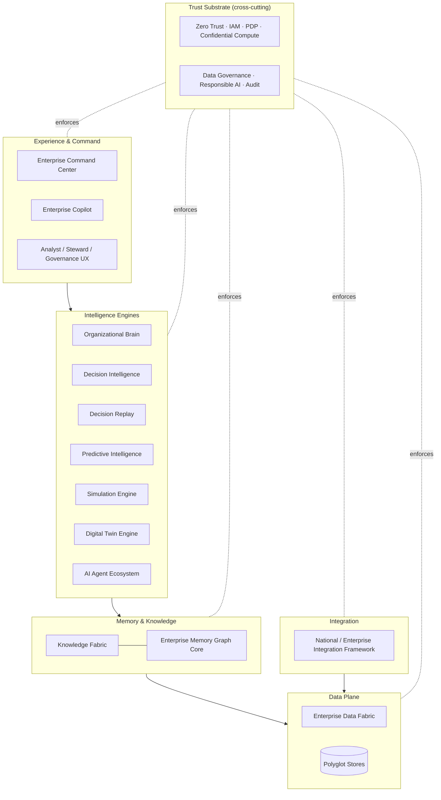

---

# PART I — FOUNDATION ARCHITECTURE (v1, carried forward & strengthened)

> Part I preserves the v1 package in full. **v2 strengthening notes** are added where the foundation is extended by Part II; no chapter is removed or simplified.

## 1. Product Vision

**Vision statement.** *EMG™ is the trusted, permanent memory — and now the reasoning core — of the enterprise: a living graph and intelligence platform that remembers what happened, who said it, when it was true, and why it matters, and that lets people and AI reason, decide, predict, and simulate over that memory safely, transparently, and with full accountability.*

**The problem.** Institutional knowledge is fragmented across databases, documents, emails, case files, sensor feeds, and people. It decays, loses provenance, and cannot be safely handed to AI systems because those systems hallucinate, cannot cite sources, and cannot respect classification. Decisions are made without full historical context; "who knew what, when, and why we chose as we did" cannot be reconstructed for audit, accountability, or learning.

**The solution.** A governed memory graph and intelligence platform that (a) unifies fragmented knowledge into one canonical, connected model; (b) preserves time and provenance so nothing is silently overwritten; (c) enforces access at the fact level so classified and sensitive data coexist safely; (d) grounds AI in that memory so outputs are cited, bounded, and auditable; and (e) — new in v2 — reasons, predicts, and simulates across domains while humans retain authority over consequential action.

**Product principles.** Truth is time-scoped · every fact has a source · security is the substrate, not a layer · AI proposes, humans decide · explainability over cleverness · sovereign by default.

**v2 strengthening:** the vision now explicitly spans *memory → reasoning → decision → prediction → simulation → action*, realized by the engines in Part II.

## 2. Product Requirements Document (PRD)

**Personas.** Analyst/Investigator · Operator/Case Officer · Data Steward · Security/Governance Officer · AI Platform Engineer · Integration Engineer · Executive/Decision-maker. **v2 adds:** Decision Owner (accountable for a decision record), Crisis Commander, Policy Author, and Risk Officer.

**Top jobs-to-be-done (v1).** Show all known about an entity with sources & time · answer NL questions grounded with citations · show and time-evolve connections · reconstruct past knowledge (as-of) · ingest a source safely with entity resolution · never disclose an unauthorized fact · AI proposes / human approves consequential action.

**v2 additional jobs.** Reconstruct and learn from a past decision (replay) · compare a proposed decision to historical analogues and predict its outcome · run a "what-if" simulation before committing · maintain a live digital twin of an operation/incident · brief an executive with a grounded, cited summary on demand.

**In scope / Out of scope** as v1 (EMG references systems-of-record; does not replace them; private/single-tenant first; no autonomous consequential action), **extended** by Part II engines.

**Success metrics.** v1 KPIs (time-to-answer, % cited answers, ER precision/recall, audit completeness, decision-latency p99, zero unauthorized disclosure) **plus v2**: decision-replay completeness, prediction calibration (Brier score), simulation fidelity vs. actuals, executive-briefing adoption.

## 3. Functional Requirements

*(v1 FR groups preserved verbatim in intent; Part II adds FR groups FR-BRAIN, FR-DIE, FR-REPLAY, FR-TWIN, FR-DF, FR-KF, FR-AGT, FR-COP, FR-CMD, FR-PRED, FR-SIM, FR-NIF — specified in their respective chapters.)*

- **FR-ING** Ingestion (1–5): structured & unstructured sources; batch/stream; NLP extraction; source metadata on every item; quarantine low-confidence.
- **FR-ER** Entity Resolution (1–4): deterministic + probabilistic matching; reversible merge/split with human review; per-type rules; same-as/different-from assertions with provenance.
- **FR-GR** Graph & Memory (1–5): property-graph CRUD/versioning; bitemporal; as-of queries; traversal/pathfinding; no hard delete (tombstone + retention).
- **FR-PROV** Provenance (1–3): trace any fact to source/job/transform/identity; represent conflicting assertions; expose lineage.
- **FR-RET** Retrieval (1–3): hybrid graph+vector+keyword; policy-filtered before ranking; citations on every answer.
- **FR-AI** AI Reasoning (1–4): grounded NL Q&A with mandatory citations; agentic workflows within tool boundaries; confidence + "insufficient evidence"; full I/O logging.
- **FR-SEC** Security/Access (1–3): ABAC + mandatory labels to node/edge/property; every access a logged decision; redaction/masking by clearance & purpose.
- **FR-HITL** Human-in-the-loop (1–3): route consequential actions by authority; record proposal→decision→rationale; audited override.
- **FR-GOV** Governance (1–3): catalog with classification/retention/contracts; retention & purge policies; policy authoring/versioning/simulation.
- **FR-AUD** Audit (1–2): immutable tamper-evident log of all reads/writes/inferences/decisions; reconstruct who-saw/asserted/decided-what-when.
- **FR-UI** Experience (1–3): entity profile / link canvas / timeline / search; copilot with citations & confidence; steward & governance consoles.

## 4. Non-Functional Requirements

| Category | Requirement |
|---|---|
| Security | Zero-Trust (NIST SP 800-207); mTLS everywhere; encryption at rest (AES-256) & transit (TLS 1.3); FIPS 140-3 crypto option; secrets in vault. **v2:** confidential computing (Ch. 39). |
| Compliance readiness | SOC 2, ISO 27001, GDPR, sector regimes; data residency & sovereignty enforceable. |
| Availability | Core read path 99.9% (private cloud); AI degrades before core graph read fails. **v2:** Command Center degrades gracefully to read-only. |
| Performance | Access-decision p99 < 50 ms; entity-profile p95 < 1.5 s; grounded AI p95 < 8 s (self-hosted). **v2:** replay reconstruction p95 < 5 s for a bounded decision; simulation is async/job-based. |
| Scalability | Stateless horizontal scale; graph partitioning/sharding path; billions of nodes/edges as design target. |
| Portability | Kubernetes on-prem, private/sovereign cloud, air-gapped; no single-cloud lock-in. |
| Observability | OTel tracing, metrics, structured logs; every request correlatable. |
| Maintainability | DDD modular services; hexagonal; contract-tested APIs; full IaC. |
| Data integrity | No silent overwrite; bitemporal history; referential + provenance integrity. |
| Recoverability | RPO ≤ 15 min; RTO ≤ 1 h core; tested backup/restore & DR. |
| Explainability | Every AI answer, prediction, and access decision explainable & reproducible from logs. |
| Interoperability | Standards-based APIs; standard graph/semantic exchange where required. |
| Accessibility | WCAG 2.1 AA. |

## 5. Enterprise Architecture (Planes)

Five horizontal planes + two cross-cutting planes (Experience · Intelligence · Knowledge · Ingestion · Foundation; Security & Trust · Governance & Ops). Separation keeps security and governance orthogonal to features — essential for accreditation.

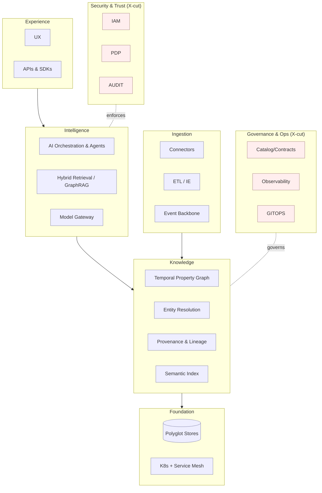

**v2 strengthening:** the Intelligence plane is expanded into the twelve engines of Part II; the Foundation plane gains the Data Fabric (Ch. 32) as a virtualization layer above the polyglot stores.

## 6. C4 Architecture (Foundation)

**L1 Context, L2 Container, L3 Component** as in v1 (System Context: analysts/stewards/gov officers, source systems, IdP, SIEM, models). L2 containers: API Gateway/BFF, Web UI, AI Orchestration, Retrieval, Model Gateway, Graph, Entity Resolution, Temporal/Memory, Provenance, Embedding, Ingestion, Governance/Catalog, Policy Decision, Audit, Workflow/HITL + stores (graph/relational/vector/object/search/event). L3 example: Retrieval Service = Query Planner · **Policy Filter (inside retrieval)** · Retrievers (graph/vector/lexical) · Fusion & Rank · Citation Assembler.

*Expanded and additional diagrams (container, deployment, sequence, context, infrastructure, integration, AI-flow, knowledge-flow, decision-flow) are in **Ch. 41**.*

## 7. Microservices Architecture (Foundation)

DDD microservices; event-driven where appropriate; hexagonal internals; independently deployable; contracts shared, no shared databases.

| Service | Responsibility |
|---|---|
| API Gateway/BFF · Ingestion · Entity Resolution · Graph · Temporal/Memory · Provenance · Embedding · Retrieval · AI Orchestration · Model Gateway · Policy Decision (PDP) · Governance/Catalog · Workflow/HITL · Audit · Admin/Config | as v1 |

Cross-service patterns: log-based event backbone · outbox + idempotent consumers · saga orchestration with compensation · PDP called by every data-touching service (no self-authorization) · contract-first (OpenAPI/GraphQL SDL/AsyncAPI) with consumer-driven contract tests · no shared DB.

**v2 strengthening:** Part II adds engine services — Brain, Decision-Intelligence, Decision-Replay, Digital-Twin, Data-Fabric (virtualization), Knowledge-Fabric, Agent-Runtime, Copilot-BFF, Command-Center-BFF, Predictive, Simulation, Integration-Gateway — each following the same patterns (Ch. 27–40).

## 8. AI Architecture (Foundation)

Grounded, cited, bounded, auditable AI. **Model Gateway** abstracts all model calls (self-hosted open models for air-gap; approved external where policy permits; version-pinned; full I/O logging). **GraphRAG** fuses graph traversal + vector + lexical. **Grounding contract**: answer only from retrieved, authorized context; "insufficient grounded evidence" otherwise. **Guardrails** input (injection/PII/jailbreak) and output (citation verification, safety, schema). **Agentic** workflows within an explicit tool allow-list; every tool call PDP-authorized and logged; agents propose, never act. **Evaluation harness** gates every model/prompt change. **No training on customer data by default.**

**v2 strengthening:** this AI substrate becomes the shared runtime for the Agent Ecosystem (Ch. 34), Copilot (Ch. 35), Decision Intelligence (Ch. 29), and Predictive/Simulation (Ch. 37–38), all bound by the same grounding and RAI controls.

## 9. Knowledge Graph Architecture (Foundation)

Labeled property graph governed by per-domain ontology; RDF/OWL supported for interchange/reasoning. Constructs: entities (nodes, typed, mandatory labels) · relationships (first-class, time-scoped, provenance-bearing) · **assertions** (value + source + asserting identity/agent + confidence + valid-time + transaction-time; conflicting assertions coexist) · **bitemporality** (valid-time + transaction-time) · provenance edges. Ontology governance: versioned, reviewed, additive/reversible migrations; new types require classification, retention, and matching defaults. ER produces reversible same-as/different-from assertions (no destructive merge).

**v2 strengthening:** the graph is one engine (EMG-Core) within the platform; the **Knowledge Fabric (Ch. 33)** governs how knowledge flows into and out of it across systems.

## 10. Security Architecture — Zero Trust (Foundation)

NIST SP 800-207. Identity (OIDC/SAML, short-lived tokens, workload identity, MFA, mesh mTLS) · ABAC + mandatory labels to node/edge/property · PEP/PDP/PIP/PAP separation (services never self-authorize) · encryption in transit/at rest + field-level for sensitive properties + FIPS option + vault/HSM keys · micro-segmentation (default-deny, egress control, air-gap) · continuous verification · secrets in vault · tamper-evident hash-chained audit · AI-specific Policy Filter guaranteeing no unauthorized fact reaches an LLM context.

**v2 expansion:** Identity Federation, PAM, Confidential Computing, immutable audit, data sovereignty, and AI governance are elaborated in **Ch. 39**.

## 11. Database Architecture (Foundation)

Polyglot, self-hostable, air-gap capable, no cross-service shared DB: property graph (Neo4j / Memgraph / Apache AGE / JanusGraph at scale) · relational (PostgreSQL: bitemporal, provenance, catalog, workflow, config) · vector (Qdrant/Milvus/pgvector) · search (OpenSearch) · object (MinIO) · event backbone (Kafka/Redpanda) · cache (Redis/Valkey) · audit (hash-chained PG or WORM). Bitemporal design: versioned rows/edges (`valid_from/to`, `tx_from/to`); updates close+open versions; graph holds current materialized view, relational store is system-of-record for history. Backup/DR per store; PITR; cross-site replication; air-gap export.

**v2 strengthening:** the Data Fabric (Ch. 32) virtualizes across these plus federated external sources without mandatory physical consolidation.

## 12. API Architecture (Foundation)

Contract-first, versioned, secure-by-default. Edge GraphQL (graph-shaped reads with **per-field authorization**) + REST (commands/admin/integration) behind a BFF. AsyncAPI events for ingestion/resolution/audit→SIEM. Every call carries a short-lived token; gateway is PEP. Semantic versioning, consumer-driven contract tests, deprecation with sunset headers. Resilience: rate limiting, quotas, timeouts, circuit breakers, idempotency keys. Generated typed SDKs.

## 13. Deployment Architecture (Foundation)

Kubernetes across on-prem, private/sovereign cloud, and air-gap — identical images, config-only differences. Environments Dev→Test→Staging→Prod + isolated **air-gap** profile. Air-gap: private registry/mirror, offline model serving, zero outbound dependency. HA: multi-replica stateless + operator-managed replicated stateful. Isolation: namespace-per-domain, default-deny network policy, separate GPU node pools. Data residency within a sovereignty boundary. *Full deployment & infrastructure diagrams in Ch. 41.*

## 14. DevOps Architecture (Foundation)

GitOps (declarative desired state; Terraform + Helm/Kustomize). CI/CD: build → unit/contract/integration tests → SAST/DAST/dependency & container scans → SBOM → sign → progressive deploy with gates; AI changes also run the eval harness. Supply-chain: signed images, SBOM, provenance attestation, pinned deps, private registry, hardened minimal base images. Progressive delivery (canary/blue-green, auto-rollback on SLO/eval regression). Secrets & policy as code (Vault; access/network policy versioned + simulated pre-merge). Observability by default (OTel, SLOs, error budgets). Air-gap promotion path exports signed, scanned bundles.

## 15. Folder Structure (Foundation)

Monorepo (polyrepo later): `docs/` (architecture, ADRs, security, governance, api) · `contracts/` (API & event schemas — source of truth) · `services/` (one dir per microservice, hexagonal: `domain/ application/ adapters/ config/ tests/`) · `web/` · `libs/` · `deploy/` (`terraform/ helm/ gitops/ policies/`) · `ml/` (`pipelines/ eval/ model-registry/`) · `tools/` · `.ci/`.

**v2 strengthening:** `services/` gains the Part II engine directories; `ml/` gains `predictive/`, `simulation/`, `twin-models/`; `docs/` gains `decision-intelligence/`, `integration-framework/`.

## 16. Development Roadmap (Foundation)

P0 Foundations (walking skeleton) → P1 Lab Prototype v1 → P2 MVP → P3 Hardening/Accreditation → P4 Production GA. *Extended in Ch. 42–44 for the platform scope.*

## 17. Lab Prototype v1 Scope (Foundation)

Core loop end-to-end, single tenant, security & provenance thin-but-real. *Superseded/expanded by the realistic Lab Prototype in **Ch. 42** (adds Decision Replay, specialized Agents, Executive Dashboard, Decision Timeline, Lessons Learned, Risk Dashboard).*

## 18. MVP Scope (Foundation)

v1 promoted to production-grade: full bitemporality, ER with reversible review, provenance UI, ABAC+labels to property level with redaction, HITL approvals, governance/catalog, tamper-evident audit, hardened UIs, observability/SLOs, backup/restore. *Redefined for enterprise readiness in **Ch. 43**.*

## 19. Production Scope (Foundation)

MVP + air-gap profile, full Zero-Trust & accreditation, DR, horizontal scale (sharding), agentic AI within HITL, RAI eval gates, multi-tenant isolation, connector framework, supply-chain security, runbooks, 24/7 operability. *Elaborated as the full production platform in **Ch. 44**.*

## 20. Key Assumptions and Constraints (Foundation)

Assumptions: sovereign self-hostable deployment · sufficient self-hosted open LLMs · enterprise IdP to federate · source systems remain systems-of-record · ontologies co-developed with SMEs · high-consequence actions require human authority. Constraints: security & audit gate every feature · air-gap has no external runtime dependency · long accreditation timelines (front-load auditability) · data cannot leave sovereignty boundary; no training on customer data by default · performance budgets hold with security in-path.

**v2 additions:** integrations are performed *only by the owning organization under its own authority* (Ch. 40) · predictive/simulation outputs are decision-support, never autonomous action · digital twins are models, not systems-of-record.

## 21. Major Technical Risks and Mitigations (Foundation)

R1 hallucination → grounding, citation verification, RAI eval gates, HITL. R2 unauthorized disclosure → Policy Filter in retrieval, property-level ABAC+labels, red-team. R3 prompt injection/exfiltration → guardrails, tool allow-lists, agents cannot act, egress control. R4 ER false-merge → reversible assertions, human review, precision/recall monitoring. R5 graph scale → partitioning, caching, planning, split current/history. R6 bitemporal complexity → encapsulated Temporal service, rigorous as-of tests. R7 lock-in → hexagonal adapters, open defaults. R8 air-gap gaps → first-class air-gap profile, offline models. R9 accreditation delay → front-load controls & artifacts. R10 scope creep → phased scopes + ADR discipline.

**v2 additions:** R11 over-trust in predictions → calibration monitoring, uncertainty display, HITL. R12 simulation misread as reality → clear labeling, fidelity caveats, provenance of assumptions. R13 agent collusion/over-reach → per-agent least privilege, PDP on every tool call, orchestration audit. R14 twin drift → freshness SLAs, reconciliation jobs, staleness flags. R15 integration abuse → owning-org-only, contract governance, egress control (Ch. 40).

## 22. Data Governance Model (Foundation)

Catalog & ownership (owner, steward, purpose, data contract) · mandatory classification/compartment labels inherited by derived facts · end-to-end lineage · automated quality checks + quarantine · per-class retention/purge (logical delete default; governed hard purge with legal-hold) · versioned data contracts & change control · privacy (DPIA, minimization, purpose limitation, masking) · roles (owner accountable, steward operational, governance officer policy, consumer least-privilege).

**v2 strengthening:** governance extends to the Data Fabric (virtual assets), Knowledge Fabric (knowledge products), Digital Twins, and model/prediction artifacts (Ch. 32, 33, 37, 39).

## 23. Responsible AI Controls (Foundation)

Grounding & citation · model governance (registry, model cards, approved list, version pinning, change board) · evaluation & red-teaming (faithfulness, citation accuracy, refusal correctness, bias, safety; injection/leakage red-team; results gate release) · bias/fairness testing · transparency (confidence, citations, AI-labeling, explainable refusals) · boundaries (tool allow-lists, no consequential agent action, full I/O logging) · data protection (no customer-data training by default; classification-aware retrieval) · accountability (named AI owner, incident process, production monitoring of grounding/refusal rates).

**v2 strengthening:** RAI extends to predictive calibration, simulation-assumption transparency, and decision-recommendation explainability (Ch. 29, 37, 38).

## 24. Human-in-the-Loop Decision Model (Foundation)

AI proposes, an authorized human decides for anything consequential. Tiers: **T0** informational (auto, cited) · **T1** low-consequence/reversible (auto-suggest, one-click) · **T2** significant/reversible (proposed, reviewer approval) · **T3** high-consequence/irreversible (**never automated**; authorized approver + rationale; often dual control). Workflow: proposal (evidence, confidence, citations) → routed by tier/authority → review-in-context → approve/reject/override-with-justification → human-authorized execution → full chain to tamper-evident audit. Configurable confidence thresholds per action/domain.

**v2 strengthening:** every Part II engine that can influence action (Decision Intelligence, Agents, Predictive, Simulation-driven recommendations) routes through this same tiered model; nothing about "more intelligence" relaxes human authority.

## 25. Prototype Acceptance Criteria (Foundation)

Binary per criterion: ingest with provenance · queryable graph & entity profile · basic as-of query · hybrid retrieval · grounded cited AI with "insufficient evidence" · access control denies + logs unauthorized fact (and keeps it out of AI context) · full audit reconstruction · explainable answer (source facts + retrieval path) · runs on K8s from IaC with mTLS + self-hosted model · answers with external network blocked. Security (6,10) and grounding (5,8) accept no partial credit. *Expanded acceptance set in **Ch. 42**.*

## 26. Recommended Implementation Sequence (Foundation)

Walking skeleton first (auth+PDP+audit+tracing in-path) → provenance & audit before features → graph + one ingestion path → retrieval + grounded AI (core value) → access control to fact level → bitemporality + ER (MVP) → HITL + governance (MVP) → hardening + air-gap + DR + accreditation → scale + agents + connectors (GA). **Guiding rule:** any feature touching data must pass authorization and land in audit *before* it is "done."

**v2 strengthening:** the platform sequence in **Ch. 44 / Ch. C** layers the intelligence engines *on top of* a proven, secured memory core — never before it.

---

# PART II — ENTERPRISE INTELLIGENCE PLATFORM (v2.0 Expansion)

## 27. Enterprise Intelligence Platform — Reference Model

EMG-Core (the whole of Part I) becomes the **memory engine** of a larger platform. The Enterprise Intelligence Platform (EIP) is defined by a **cognition stack** that turns memory into action under governance:

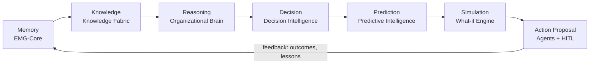

Each stage is a governed engine, each reads only what policy allows, each writes provenance, and the loop **closes** — outcomes and lessons flow back into memory, which is what makes the platform *learn institutionally* rather than merely respond.

**Engine contract (applies to every engine).** Every engine (a) consumes only policy-authorized, provenance-bearing facts; (b) emits outputs that are themselves provenance-bearing and classification-labeled; (c) calls the PDP for authorization and the Audit service for logging; (d) exposes explainability (why this output, from which facts); (e) never performs consequential action — it produces proposals routed to the HITL model (Ch. 24). This uniform contract is what makes the platform accreditable as a whole rather than engine-by-engine.

## 28. Enterprise Organizational Brain

**Purpose.** A cross-domain reasoning engine that operates over the entire memory graph and knowledge fabric to produce organizational-level understanding: situational awareness, cross-silo connections, institutional learning, and executive-grade recommendations. Where EMG-Core answers *"what do we know about X,"* the Brain answers *"what does it mean, across the organization, and what should leadership consider."*

**Capabilities.**
- **Organizational reasoning** — connect facts across domains (operations ↔ risk ↔ finance ↔ policy) that no single silo sees.
- **Decision intelligence interface** — frame situations as decisions with options, evidence, and trade-offs (delegates scoring to Ch. 29).
- **Institutional learning** — mine the decision-replay corpus and outcomes to surface patterns ("interventions of type A in context B historically underperform").
- **Executive recommendations** — grounded, cited, uncertainty-qualified options for leadership, always as proposals.
- **Cross-domain reasoning** — multi-hop reasoning that respects classification boundaries and never fuses facts a subject is not cleared to see together.

**Architecture.**

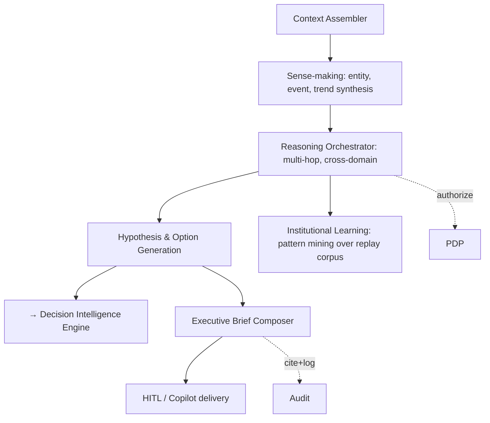

- **Context Assembler** builds a policy-filtered, provenance-tagged working set from the graph and fabric for the question at hand.
- **Reasoning Orchestrator** runs bounded multi-hop reasoning (graph algorithms + LLM reasoning within the grounding contract), producing *cited* inferences, never free-form speculation.
- **Institutional Learning** continuously mines the Decision Replay corpus (Ch. 30) and outcome data to produce reusable "organizational lessons" as first-class, governed knowledge products.
- **Boundary enforcement.** Cross-domain reasoning is the highest disclosure-risk capability; the Brain enforces *compartment-aware fusion* — it will refuse to combine facts across compartments for a subject not cleared for both, and it logs every fusion decision.

**FR-BRAIN (selected):** cross-domain multi-hop reasoning with citations · compartment-aware fusion with refusal · institutional-lesson generation as governed knowledge products · executive brief composition with uncertainty · every inference traceable to source facts.

**Guarantees.** No uncited organizational claim; no cross-compartment fusion without clearance; all recommendations are proposals under Ch. 24.

## 29. Decision Intelligence Engine (DIE)

**Purpose.** Turn a pending or hypothetical decision into a structured, evidence-based, scored object: compare it to historical analogues, predict outcomes, evaluate risk, recommend alternatives, and measure decision quality — as decision *support*, never decision *automation*.

**The Decision Record (canonical object).** DIE formalizes a decision as a first-class graph object with: framing/question, options, evidence set (cited graph facts), stakeholders, constraints, predicted outcomes + uncertainty, risk profile, recommended option(s), the human decision taken, rationale, and (later) realized outcome + quality score. This object is bitemporal and provenance-bearing like any other fact, and it is the substrate for Decision Replay (Ch. 30).

**Capabilities & method.**
- **Compare historical decisions** — retrieve analogous past Decision Records via graph + semantic similarity over context features; surface how similar situations resolved.
- **Predict outcomes** — call the Predictive Intelligence Engine (Ch. 37) for each option; return calibrated probabilities with uncertainty, not point certainties.
- **Evaluate risks** — decompose each option into risk factors mapped to the risk digital twin (Ch. 31) and predictive risk models.
- **Recommend alternatives** — generate and score option variants, including a "do nothing" baseline, with explicit trade-offs.
- **Measure decision quality** — separate *decision quality* (was the process sound given information available at the time?) from *outcome quality* (did it turn out well?), so the organization learns from good decisions with bad luck and vice-versa.

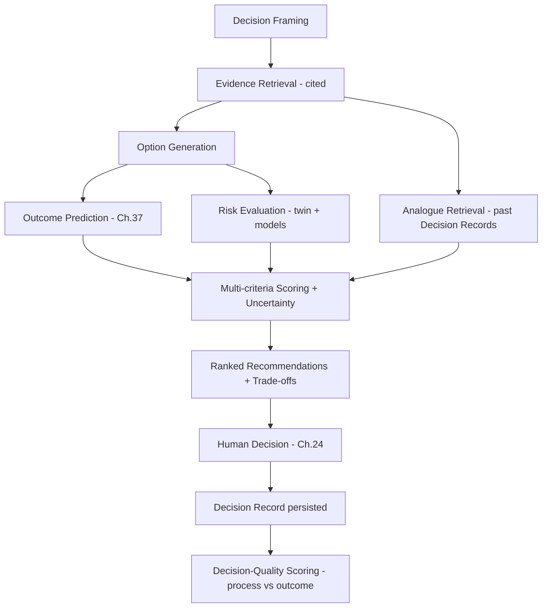

**FR-DIE (selected):** canonical Decision Record object (bitemporal, provenance) · analogue retrieval over historical decisions · per-option calibrated outcome prediction with uncertainty · multi-criteria scoring with explicit weights (auditable) · decision-quality vs outcome-quality separation · every recommendation cited and explainable · all recommendations routed to HITL by consequence tier.

**Responsible-AI ties.** Scoring weights are explicit and versioned (no hidden objective); predictions carry calibration metadata; the engine must present the strongest case *against* its own recommendation (steelman) to counter automation bias.

## 30. AI Decision Replay Engine

**Purpose.** Reconstruct any past decision completely and faithfully — a "flight recorder for decisions" — for accountability, after-action review, audit, training, and institutional learning.

**Reconstruction dimensions (all required).**
| Dimension | Reconstructed from |
|---|---|
| Participants | Decision Record stakeholders + identity/audit logs |
| Timeline | Bitemporal transaction-time across all related facts and events |
| Information available at the time | **As-of** query (Ch. 9) — the graph state *as it was known then*, not as known now |
| Rejected alternatives | Decision Record options not chosen, with their at-the-time scores |
| Reasoning | Recorded rationale + DIE scoring inputs + cited evidence set |
| Approvals | HITL workflow chain (Ch. 24) with approver identities |
| Outcomes | Later-asserted realized outcomes linked to the Record |
| Lessons learned | Institutional-learning products (Ch. 28) derived post-hoc |

**Why bitemporality is non-negotiable here.** Replay must show the decision *as it was reasonable at the time* — using only information the organization actually had at transaction-time — not with hindsight. This is the difference between accountability and scapegoating, and it is only possible because EMG-Core stores transaction-time on every fact.

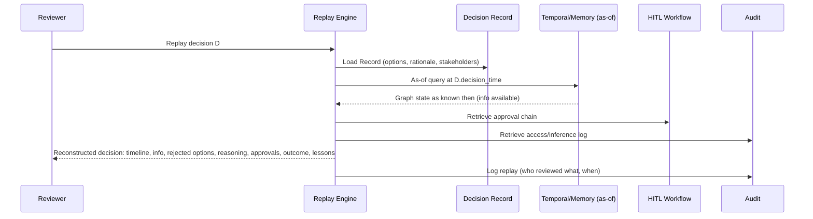

**FR-REPLAY (selected):** faithful as-of reconstruction (no hindsight leakage) · full participant/timeline/approval chain · rejected-alternative reconstruction with at-the-time scores · outcome and lessons linkage · replay is itself audited · export as an after-action package.

**Uses.** After-action review, audit defense, training simulations, and feeding the institutional-learning loop. Replay is read-only and cannot alter the historical record.

## 31. Digital Twin Architecture

**Purpose.** Maintain living, queryable models of organizational realities that update from the memory graph and external feeds, and that serve prediction (Ch. 37) and simulation (Ch. 38).

**Twin catalog.**
| Twin | Models | Primary consumers |
|---|---|---|
| Organization | structure, roles, capabilities, dependencies | Brain, executives |
| Projects | scope, milestones, resources, health | Operations, predictive (failure) |
| Operations | live processes, throughput, bottlenecks | Command Center, predictive |
| Incidents | evolving incident state, actors, impact | Crisis, investigation |
| Investigations | entities, links, hypotheses, evidence | Investigation agent, analysts |
| Risks | risk register, drivers, exposure, controls | Risk agent, DIE |
| Assets | inventory, state, criticality, dependencies | Operations, security |
| Policies | policy graph, applicability, conflicts | Policy agent, compliance |
| Crisis Management | scenario state, resources, decisions | Crisis commander, simulation |

**Twin model.** Each twin is a **governed projection** over EMG-Core plus (optionally) live feeds: a defined entity/relationship subgraph + a state model + freshness SLA + reconciliation rules. Twins are *models, not systems-of-record* — they never become an unaccountable shadow database; every twin fact traces to a graph fact or a labeled external feed.

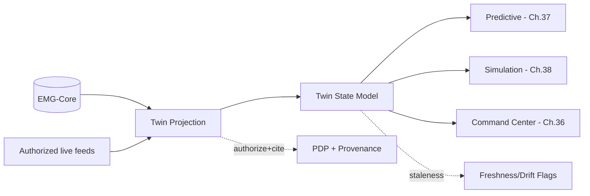

**FR-TWIN (selected):** governed projection with freshness SLA · every twin fact traceable · drift/staleness detection & flags · twin state consumable by prediction & simulation · classification inherited from underlying facts · reconciliation jobs with audit.

**Controls.** Freshness SLAs and drift detection prevent silent staleness (Risk R14); twins inherit classification and are policy-filtered like any other view.

## 32. Enterprise Data Fabric

**Purpose.** A virtualized, governed data plane that provides unified, policy-enforced access to data across systems *without mandatory physical consolidation* — the substrate that feeds ingestion, the graph, the fabric, and the twins.

**Pillars.**
- **Data virtualization** — query across heterogeneous sources through a virtualization layer; physical movement only when needed (for the graph, embeddings, or performance). Reduces copies, honors residency.
- **Metadata management** — active technical, business, and operational metadata catalog; the semantic backbone for discovery and governance.
- **Master data management (MDM)** — canonical master entities (parties, assets, locations) reconciled via the Entity Resolution engine; the graph is the natural home for mastered, connected reference data.
- **Data lineage** — end-to-end lineage from source through virtualization/transformation to graph assertion to AI answer (unifies with Ch. 9 provenance).
- **Data governance** — classification, ownership, data contracts, retention, and access enforced *at the fabric*, so governance is applied once and inherited everywhere.
- **Data quality** — profiling, validation, and observability with quarantine and stewardship workflows.

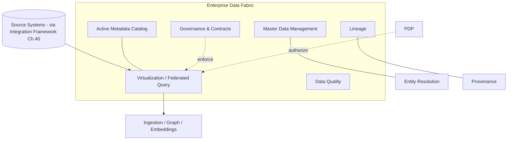

**FR-DF (selected):** federated/virtualized query with policy enforcement at the fabric · active metadata catalog · MDM reconciled via ER · unified lineage with graph provenance · data-quality profiling + quarantine · residency-aware access.

**Boundary vs. EMG-Core.** The Data Fabric governs *access to and movement of data*; EMG-Core governs *memory of resolved, connected, time-versioned facts*. The fabric feeds the graph; it does not replace it.

## 33. Enterprise Knowledge Fabric

**Purpose.** Govern how *knowledge* (not just data) flows across the organization: documents, expertise, decisions, lessons, policies, and their interpretation — connecting the Knowledge Graph to the human and system contexts where knowledge is created and consumed.

**Distinction.** *Data Fabric* = governed access to data. *Knowledge Graph* = the structured memory of facts. *Knowledge Fabric* = the flow and lifecycle of organizational knowledge across systems and people — capture, curation, connection, delivery, and reuse.

**Knowledge flow model.**
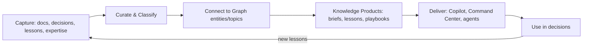

- **Knowledge products** are first-class, governed, versioned artifacts (executive briefs, lessons-learned, playbooks, policy interpretations) with owners, classification, and lineage back to source facts.
- **Expertise & provenance of interpretation** — the fabric records *who interpreted what and how*, so organizational judgment is itself an auditable asset.
- **Flow across systems** — knowledge products are delivered into the Copilot, Command Center, and agent contexts under policy, and their usage feeds institutional learning.

**FR-KF (selected):** knowledge-product lifecycle (capture→curate→connect→deliver→reuse) · versioned governed knowledge products with lineage · interpretation provenance · policy-controlled delivery into engines · lesson feedback loop into memory.

## 34. AI Agent Ecosystem

**Purpose.** Replace generic agents with a governed ecosystem of **specialized enterprise agents**, each with a bounded mission, least-privilege permissions, explicit tools, and defined collaboration — all subject to the Ch. 8 AI substrate and Ch. 24 HITL model. **No agent performs a consequential action; agents retrieve, analyze, and propose.**

**Agent specifications.**

| Agent | Responsibilities | Inputs | Outputs | Permissions (least-privilege) | Collaboration |
|---|---|---|---|---|---|
| **Executive** | Synthesize cross-domain situation, produce briefs & options | Brain outputs, twins, KPIs | Executive brief, decision options (cited) | Read broad (policy-filtered), no writes to facts | Consumes all agents; delivers via Copilot |
| **Investigation** | Explore graph, build/validate hypotheses, surface leads | Entities, links, evidence | Link analyses, hypotheses, evidence packages | Read investigative compartments; propose entity assertions (to review) | Feeds Intelligence & Risk agents |
| **Risk** | Identify, quantify, and monitor risks | Risk twin, predictive models | Risk assessments, alerts, mitigation options | Read risk + related domains | Feeds DIE & Executive |
| **Compliance** | Check actions/data against policy & regulation | Policy twin, data contracts | Compliance findings, control gaps | Read policy + subject data | Works with Audit & Policy agents |
| **Audit** | Reconstruct trails, verify controls, detect anomalies | Audit log, decision records | Audit reports, exceptions | Read audit (privileged), no data mutation | Independent; reports to governance |
| **Intelligence** | Fuse and assess information into assessments | Multi-source graph, KF products | Intelligence assessments (cited, confidence) | Read authorized compartments; compartment-aware fusion | Feeds Executive & Investigation |
| **Crisis** | Maintain crisis picture, propose response options | Incident/crisis twins, live feeds | Situation updates, response options | Read crisis scope; time-boxed elevated read (audited) | Coordinates Operations & Executive |
| **Knowledge** | Curate, connect, and deliver knowledge products | KF, documents | Curated knowledge, lessons | Read/curate knowledge (governed) | Serves all agents & Copilot |
| **Policy** | Interpret, check, and simulate policy impact | Policy twin, ontology | Policy explanations, conflict/impact analyses | Read policy graph | Works with Compliance & DIE |
| **Operations** | Monitor operations, detect bottlenecks, propose actions | Operations twin, metrics | Operational insights, action proposals | Read operations scope | Feeds Command Center & Executive |

**Ecosystem architecture.**
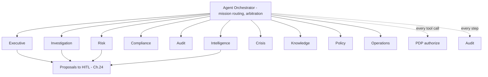

**Governance of the ecosystem.** Each agent has a signed *agent charter* (mission, allowed tools, data scope, escalation rules) reviewed by governance. The orchestrator enforces separation of duties (e.g., the Audit agent is independent of Operations), PDP-authorizes every tool call, and logs every step. Inter-agent messages are themselves provenance-bearing. This prevents agent over-reach and collusion (Risk R13).

**FR-AGT (selected):** per-agent charter with least-privilege scope · PDP on every tool call · separation-of-duties enforcement · provenance on inter-agent messages · all consequential outputs to HITL · full orchestration audit · compartment-aware operation.

## 35. Enterprise Copilot (Executive)

**Purpose.** An executive-grade, grounded assistant — the primary human interface to the platform's intelligence — spanning semantic search, briefing, reporting, investigation support, decision support, policy explanation, and operational insight, all cited and policy-filtered.

**Capabilities.**
- **Semantic search** over the graph and knowledge fabric, policy-filtered, with citations.
- **Executive briefing** — on-demand, role-tailored, cited situation briefs from the Brain and Executive agent.
- **Report generation** — structured reports (assessments, after-action, risk) with sources; drafts only, human-approved before distribution.
- **Investigation assistance** — guided exploration, hypothesis support (via Investigation agent).
- **Decision support** — surfaces DIE options, analogues, predictions, and trade-offs; presents the steelman against its own recommendation.
- **Policy explanation** — plain-language, cited policy interpretation (via Policy agent), never a substitute for authoritative legal/policy sign-off.
- **Operational insights** — bottlenecks, anomalies, and status from the Operations twin.

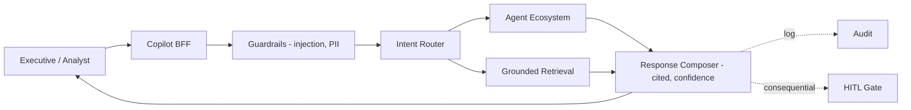

**FR-COP (selected):** every response cited & policy-filtered · role/clearance-tailored output · report drafts require human approval before distribution · confidence + "insufficient evidence" behavior · steelman on recommendations · full session audit.

**Guarantees.** The Copilot inherits the grounding contract and Policy Filter; it cannot surface or fuse anything the user is not cleared for, and it labels AI-generated content.

## 36. Enterprise Command Center

**Purpose.** A unified operations/decision cockpit presenting the platform's intelligence to different roles in real time, with drill-down to evidence and one path to HITL action.

**Dashboards.**
| Dashboard | Audience | Content |
|---|---|---|
| Executive | Leadership | Cross-domain KPIs, situation summary, pending decisions & approvals |
| Operations | Operators | Live operations twin, throughput, bottlenecks, alerts |
| Risk | Risk officers | Risk register, exposure trends, predicted risks, mitigations |
| AI Recommendations | Decision-makers | DIE recommendations with evidence, uncertainty, steelman |
| Investigations | Analysts | Active cases, link charts, leads, evidence status |
| Crisis Management | Crisis command | Incident twin, resources, response options, decision log |
| Performance | Governance/exec | Platform & organizational performance, decision-quality trends |

**Architecture.** A read-optimized Command Center BFF composes from twins, engines, and agents; every panel is policy-filtered and drill-through to source facts and provenance; actions are never taken from a dashboard directly — they open the HITL workflow. The Command Center **degrades gracefully to read-only** if intelligence engines are unavailable, but core situational awareness from the graph remains.

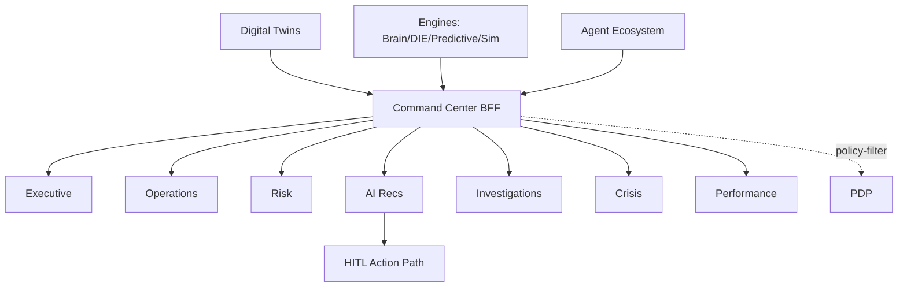

**FR-CMD (selected):** role-based, policy-filtered dashboards · drill-through to evidence/provenance · action only via HITL · graceful read-only degradation · real-time twin & alert integration.

## 37. Predictive Intelligence Engine

**Purpose.** Forward-looking, calibrated, explainable prediction as **decision support**: operational risks, security threats, project failures, resource shortages, and organizational bottlenecks — always with uncertainty and human interpretation.

**Model portfolio (categories, not black boxes).**
| Target | Approach (governed, explainable) | Consumers |
|---|---|---|
| Operational risk | time-series + driver models over operations twin | Risk agent, DIE, Command Center |
| Security threats | anomaly detection + pattern models over audit/graph signals | Intelligence/Compliance agents |
| Project failure | classification over project-twin features + historical outcomes | Operations, Executive |
| Resource shortage | forecasting over resource/asset twins | Operations, planners |
| Organizational bottlenecks | graph/flow analysis over operations twin | Operations, Brain |

**Engineering & governance.**
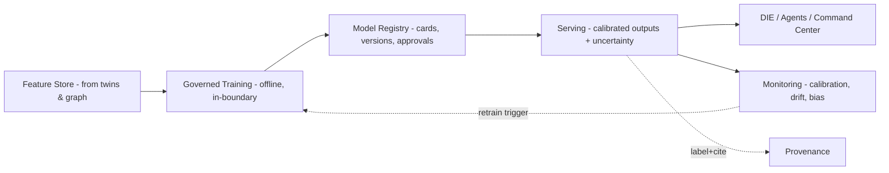

- **Calibration first.** Predictions ship with calibration metadata (e.g., Brier score, reliability); uncertainty is displayed, never hidden.
- **Explainability.** Feature attributions accompany predictions; no unexplainable prediction reaches a decision surface.
- **Drift & bias monitoring.** Continuous monitoring with retrain triggers; fairness checks where predictions affect people.
- **RAI boundary.** Predictions are advisory inputs to DIE and humans (Ch. 24, 29); they never trigger autonomous action.

**FR-PRED (selected):** calibrated predictions with uncertainty · feature-attribution explainability · registry with model cards & approvals · drift/bias monitoring with retrain triggers · outputs labeled, provenance-bearing, advisory-only.

## 38. Simulation Engine

**Purpose.** A governed "what-if" platform answering *"what happens if…"* across scenarios, operations, decisions, crises, and missions — so leaders can test choices *before* committing, against digital twins and predictive models.

**Simulation modes.**
| Mode | Question | Basis |
|---|---|---|
| Scenario analysis | "What if condition X changes?" | Twins + assumptions + predictive models |
| Operational simulation | "How does the operation behave under load Y?" | Operations twin + flow/queueing models |
| Decision simulation | "What are the likely outcomes of options A/B/C?" | DIE options + predictive outcome models |
| Crisis simulation | "How does this incident evolve; what response is best?" | Crisis twin + response models |
| Mission simulation | "Can we achieve objective Z under constraints?" | Mission model + resource/asset twins |

**Architecture.**
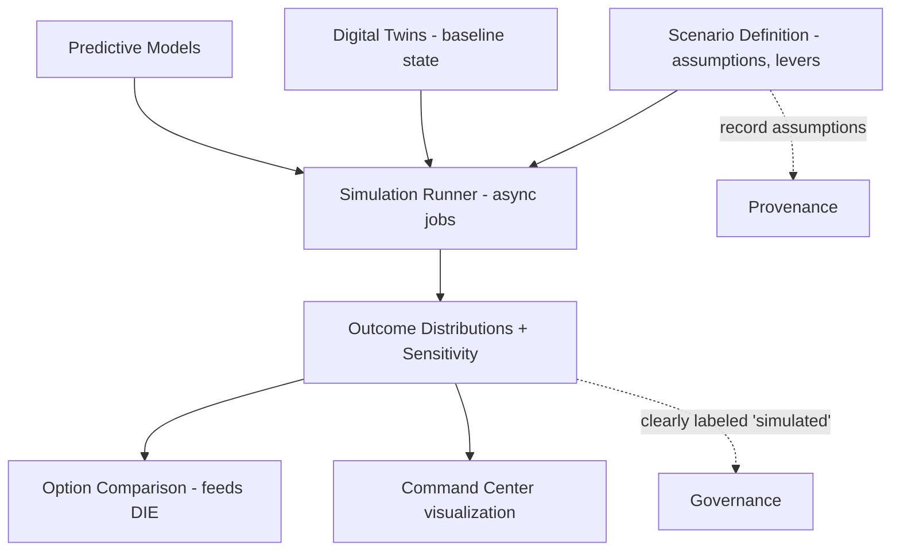

- **Provenance of assumptions.** Every simulation records its assumptions, levers, twin baseline version, and model versions, so results are reproducible and interpretable.
- **Clear labeling.** Simulation outputs are unambiguously labeled *simulated / hypothetical* to prevent them being mistaken for observed reality (Risk R12).
- **Fidelity caveats.** Results ship with fidelity/confidence context; high-consequence simulations feed HITL, never automated action.

**FR-SIM (selected):** five simulation modes over twins + predictive models · reproducible with recorded assumptions & versions · outcome distributions + sensitivity analysis · explicit "simulated" labeling · async job execution · feeds DIE & Command Center; advisory-only.

## 39. Zero Trust Security — Enterprise Expansion

Extends Ch. 10 to full enterprise-grade, accreditation-ready security.

**Expanded controls.**
- **Identity Federation** — federate with multiple enterprise/government IdPs (OIDC/SAML/WS-Fed) under the owning organization's trust policies; brokered identity with attribute mapping; workload identity for services and agents.
- **Privileged Access Management (PAM)** — vaulted, just-in-time, time-boxed privileged access; session recording for admin and audit-agent actions; no standing privilege.
- **ABAC + RBAC** — RBAC for coarse role assignment, **ABAC + mandatory labels** for fine-grained, context-aware, node/edge/property decisions; policy authored, versioned, and simulated (Ch. 22).
- **Confidential Computing** — hardware-based trusted execution (enclaves) for the most sensitive processing (e.g., cross-compartment fusion, key operations), so data is protected *in use*, not only at rest/in transit; attestation required before workloads run.
- **Encryption** — TLS 1.3 in transit; AES-256 at rest; field-level encryption for the most sensitive properties; FIPS 140-3 validated modules; keys in vault/HSM with rotation and split-knowledge.
- **Immutable Audit Logs** — append-only, hash-chained, optionally WORM-backed and externally anchored; tamper-evident; streamed to SIEM; covers every read/write/inference/decision/access.
- **Data Sovereignty** — deployable wholly within a national/organizational boundary; residency enforced at the Data Fabric; no data or telemetry egress in the air-gap profile.
- **AI Governance** — model registry, approvals, evals, guardrails, red-teaming, and prediction calibration as governed controls (Ch. 23, 37); agent charters (Ch. 34); grounding contract enforced platform-wide.

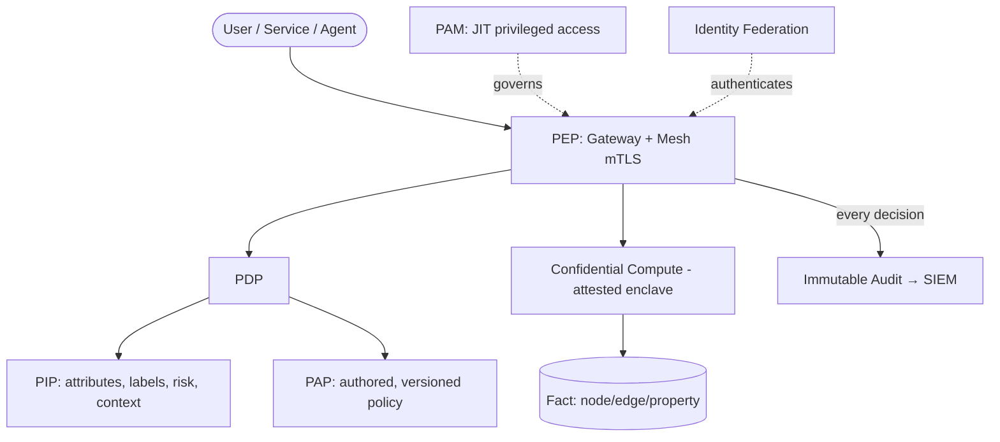

**FR-SEC+ (selected):** federated identity brokering · JIT PAM with session recording · RBAC+ABAC+labels · attested confidential computing for sensitive processing · FIPS crypto with HSM · hash-chained immutable audit to SIEM · sovereign, egress-controlled deployment · platform-wide AI governance.

## 40. National / Enterprise Integration Framework

**Purpose.** A secure, **platform-agnostic** framework that lets an owning organization integrate its *own authorized* systems — under its own governance, security policy, and legal authority. EMG provides the *capability*; the organization performs and authorizes the *integrations*.

**Design principles.**
- **Owning-org authority only.** No integration is hard-coded and none is performed by the vendor. Each connection is configured, authorized, and governed by the organization that owns both systems, according to its security policy and legal authority.
- **Platform-agnostic connectors.** A connector framework with typed adapters (databases, APIs, message buses, files, streaming) — no baked-in dependency on any specific external system.
- **Contract-governed.** Every integration is defined by a data contract (schema, classification, purpose, retention, quality, allowed use) reviewed under Ch. 22 governance.
- **Zero-Trust boundary.** All inbound/outbound flows pass the PEP; mTLS, ABAC, egress control, and full audit apply; classification is asserted at ingress and enforced thereafter.
- **Least data / purpose limitation.** Integrations pull the minimum necessary data for a declared purpose; virtualization (Ch. 32) avoids unnecessary copies and honors residency.

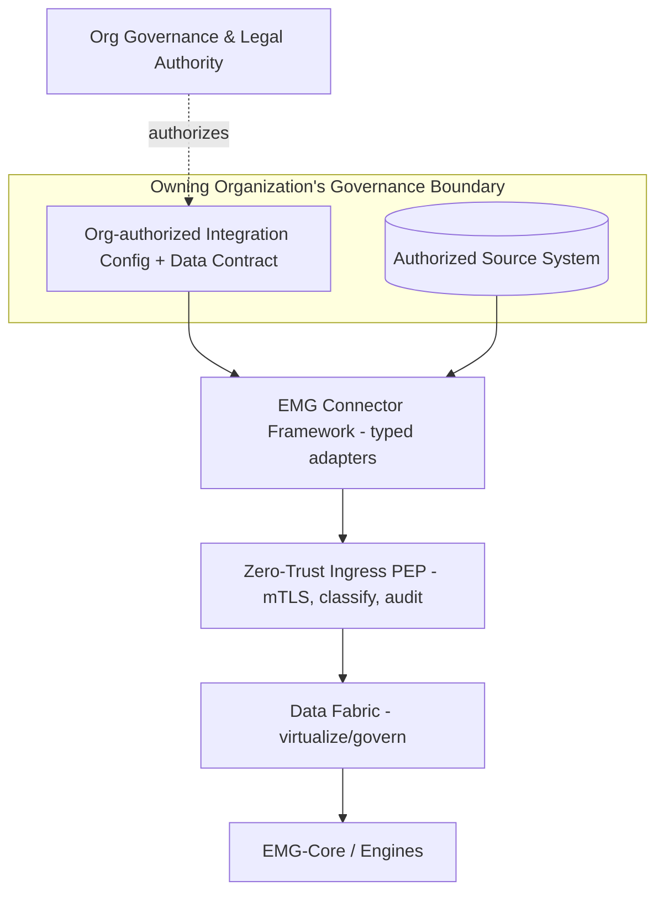

**FR-NIF (selected):** typed, platform-agnostic connector framework · integrations configured & authorized only by the owning org · per-integration data contract & classification · Zero-Trust ingress with audit · least-data/purpose-limited/residency-aware pulls · no vendor-performed or hard-coded integrations.

**Explicit constraint.** This framework describes *how* an organization may integrate its own systems securely. It does not define, assume, or require integration with any specific external or national system; all such decisions and authorizations rest solely with the owning organization.

## 41. Enterprise Architecture — Expanded Diagrams

### 41.1 Context Diagram (platform)
```mermaid
flowchart TB
  Exec([Executive]) --> EIP
  Analyst([Analyst]) --> EIP
  Steward([Steward]) --> EIP
  Gov([Governance Officer]) --> EIP
  EIP["EMG™ Enterprise Intelligence Platform"]
  Sys[(Owner-authorized Source Systems)] --> EIP
  IdP[Federated Identity Providers] --> EIP
  SIEM[SIEM / Audit] <-- EIP
  Models[Self-hosted / Approved Models] <-- EIP
```

### 41.2 Container Diagram (platform)
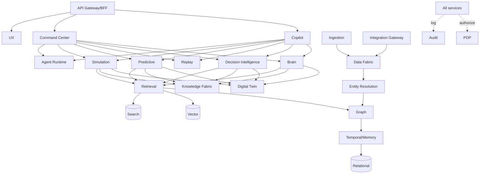

### 41.3 Deployment / Infrastructure Diagram
```mermaid
flowchart TB
  subgraph Cluster["Kubernetes (per environment; air-gap profile identical)"]
    subgraph Mesh["Service Mesh - mTLS"]
      SVC[EIP Microservices + Engines]
      GPU[GPU Node Pool - model serving, sim]
    end
    STORES[(Graph/Relational/Vector/Search/Object/Event via operators)]
    OBS[Observability: OTel/Prom/Grafana/Loki/Tempo]
    SEC[Vault / IdP broker / PDP / Confidential Compute nodes]
  end
  INGRESS[Ingress + PEP] --> Mesh
  GITOPS[GitOps] --> Cluster
  REG[Private Registry/Mirror] --> Cluster
  DR[(DR Site / Backup)] <-- Cluster
```

### 41.4 Integration Diagram
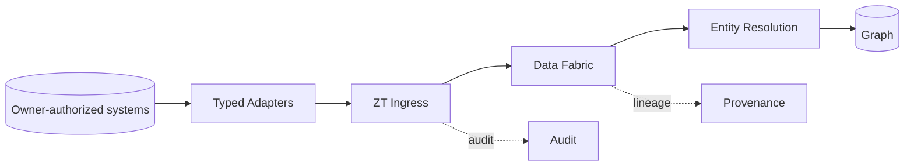

### 41.5 AI Flow Diagram
```mermaid
flowchart LR
  Q[Question/Task] --> GUARD1[Input Guardrails] --> PLAN[Planner] --> RET[Retrieval + Policy Filter] --> CTX[Grounded Context + Citations] --> MG[Model Gateway] --> LLM[Model] --> GUARD2[Grounding/Citation Check] --> OUT[Cited Output + Confidence] --> AUD[Audit]
  OUT -.consequential.-> HITL[HITL]
```

### 41.6 Knowledge Flow Diagram
```mermaid
flowchart LR
  SRC[Sources] --> CAP[Capture] --> CUR[Curate/Classify] --> CONN[Connect to Graph] --> PROD[Knowledge Products] --> DEL[Deliver: Copilot/Command/Agents] --> USE[Decisions] --> LESS[Lessons] --> CAP
```

### 41.7 Decision Flow Diagram
```mermaid
flowchart LR
  FRAME[Frame Decision] --> EV[Evidence + Analogues] --> OPT[Options] --> PRED[Predict Outcomes] --> RISK[Assess Risk] --> SIM[Simulate What-if] --> REC[Recommend + Steelman] --> HITL[Human Decision] --> REC2[Record + Approvals] --> OUT[Outcome] --> QUAL[Decision Quality] --> LEARN[Institutional Learning] --> FRAME
```

### 41.8 Sequence Diagram — Executive Decision Support
```mermaid
sequenceDiagram
  participant E as Executive
  participant C as Copilot
  participant B as Brain
  participant D as Decision Intelligence
  participant P as Predictive
  participant S as Simulation
  participant H as HITL
  participant A as Audit
  E->>C: Should we do X?
  C->>B: Frame situation (policy-filtered)
  B->>D: Options + evidence + analogues
  D->>P: Predict outcomes per option
  D->>S: Simulate high-consequence options
  D-->>C: Ranked options + uncertainty + steelman (cited)
  C-->>E: Decision brief
  E->>H: Approve option (T3)
  H->>A: Record proposal, evidence, approver, rationale
```

## 42. Lab Prototype v1 (Realistic, Enterprise-Faithful)

**Goal.** Demonstrate the platform's differentiated value on a small but *real* dataset — no production shortcuts, security and provenance present and enforced — covering the eight required demonstrations.

**Demonstration scope (all required):**
1. **Knowledge Graph** — resolved entities/relationships with provenance and (at least valid-time) temporality; entity profiles and link view.
2. **AI Decision Replay** — reconstruct a seeded past decision *as-of* its time (info available, options, rejected alternatives, approvals, outcome, lessons).
3. **AI Agents** — at least Executive, Investigation, and Risk agents operating under charters, PDP-authorized, producing cited proposals.
4. **Executive Dashboard** — role-based Command Center panel with drill-through to evidence.
5. **Semantic Search** — hybrid, policy-filtered, cited.
6. **Decision Timeline** — bitemporal timeline of a decision and its context.
7. **Lessons Learned** — an institutional-learning product derived from replay + outcomes.
8. **Risk Dashboard** — risk twin view with at least one predicted risk (calibrated, explained).

**Non-negotiables (no shortcuts):** mTLS between services · PDP-enforced ABAC + one classification label reaching property level · Policy Filter keeps unauthorized facts out of AI context · tamper-evident audit reconstruction · self-hosted model · runs from IaC on Kubernetes · answers with external network blocked.

**Deferred (honestly out of Lab scope):** full bitemporality across all engines · full agent roster · confidential computing · multi-tenant · sharding · full simulation modes (one mode demonstrated) · DR.

**Acceptance = binary per demonstration**, plus the Ch. 25 security/grounding criteria (no partial credit on security or grounding).

## 43. MVP — Enterprise Readiness

The MVP is the first version deployable into a **controlled pilot** for a real regulated use case, single tenant, private-cloud (air-gap-ready design).

**Included:** full **bitemporal** memory + as-of across engines · **entity resolution** with reversible human review · **provenance/lineage** UI · **ABAC + RBAC + labels** to property level with redaction · **Data Fabric** (virtualization + metadata + MDM + lineage + quality) · **Knowledge Fabric** (knowledge-product lifecycle) · **Decision Intelligence + Decision Replay** (production-grade) · **core Digital Twins** (organization, operations, risk, incident) · **Agent Ecosystem** (Executive, Investigation, Risk, Compliance, Audit, at minimum) · **Enterprise Copilot** · **Command Center** (executive, operations, risk, AI-recs, investigations dashboards) · **one Predictive** category live (calibrated, monitored) · **HITL** across all consequential paths · **immutable audit** with reconstruction · **Zero-Trust** (federated identity, PAM, encryption, mesh) · observability/SLOs · backup/restore · **Integration Framework** with typed connectors (owner-authorized).

**Deferred to production:** full simulation roster · confidential computing at scale · multi-tenant isolation · horizontal sharding at billions-scale · full predictive portfolio · full accreditation package · 24/7 operability.

**Exit criterion:** passes a security review and a real pilot use case with complete audit trails and grounded, cited intelligence.

## 44. Production Platform (Governments & Large Enterprises)

The full Enterprise Intelligence Platform, accreditation-ready and operable at scale.

**Delivered at production:**
- **Sovereign deployment** — on-prem, private/sovereign cloud, and **air-gapped** profiles, identical images, config-only differences; data and telemetry never leave the boundary in air-gap.
- **Full Zero-Trust & accreditation** — federated identity, JIT PAM, RBAC+ABAC+labels to property level, **confidential computing** for sensitive processing, FIPS crypto + HSM, hash-chained immutable audit to SIEM; complete accreditation package.
- **All twelve engines** at production grade with full **Agent Ecosystem** (all ten agents, charters, separation of duties), full **Simulation** roster, full **Predictive** portfolio (calibrated, monitored), **Decision Intelligence + Replay**, **Digital Twins** across the catalog, **Command Center** with all dashboards, **Executive Copilot**.
- **Scale** — graph partitioning/sharding to billions of nodes/edges; async job platform for simulation/prediction; GPU pools for model serving.
- **DR & resilience** — RPO ≤ 15 min, RTO ≤ 1 h; tested cross-site failover; graceful degradation (intelligence engines can fail without losing core memory read).
- **Governance in production** — Data Fabric governance, Knowledge Fabric lifecycle, Responsible-AI eval gates in CI, model/prediction governance board, data-sovereignty enforcement, decision-quality analytics.
- **Multi-tenant isolation** where required (per-organization boundaries), each fully sovereign.
- **Integration Framework** — typed connector catalog; every integration owner-authorized, contract-governed, Zero-Trust-mediated, audited.
- **Operability** — runbooks, SLOs/error budgets, supply-chain security (signing, SBOM, attestation), 24/7 operations, upgrade/rollback discipline.

```mermaid
flowchart TB
  subgraph Prod["Production EIP (sovereign, per-tenant)"]
    EXP[Copilot + Command Center + UX]
    ENG[12 Intelligence Engines + Agent Ecosystem]
    MEM[EMG-Core + Knowledge Fabric]
    DATA[Data Fabric + Polyglot Stores]
    NIF[Integration Framework - owner-authorized]
    TRUST[Zero Trust + Confidential Compute + Immutable Audit + Governance + RAI]
  end
  EXP --> ENG --> MEM --> DATA
  NIF --> DATA
  TRUST -. enforces across all .- Prod
```

---

## Approval Gate (v2.0)

This completes the v2.0 architecture (Part I Ch. 1–26 carried forward and strengthened; Part II Ch. 27–44 added). **No code has been written and none will be until this is approved.**

Recommended next steps on approval:
1. **ADRs** — pin the graph store, model-serving stack, authorization engine, data-virtualization technology, confidential-compute approach, and event backbone.
2. **Reference-model ratification** — architecture board sign-off on the engine contract (Ch. 27) and Zero-Trust expansion (Ch. 39).
3. **Sequenced build** — proven, secured memory core first (Part I P0–P2), then intelligence engines layered on top (Ch. 44 / §C), never before.

Please indicate: (a) approval to proceed; (b) any changes to scope, engine priority, target deployment profile, or mandated compliance/accreditation regime; and (c) which real use case anchors the MVP pilot (which sharpens ontology, twins, agents, and HITL tiers).
