# EMG™ — System Architecture Design (SAD)
### Master Engineering Blueprint · Version 1.0

| Field | Value |
|---|---|
| Document | System Architecture Design (SAD) v1.0 |
| Derives from | Enterprise Architecture v2.0 (approved) |
| Status | **For engineering handoff** — no application code herein |
| Owners | Chief Systems Engineer · Lead Enterprise Architect · CISO · Principal SW Engineer · Principal Data Architect · Knowledge Graph Architect |
| Audience | Enterprise architects, CTOs, security architects, government technical review boards, delivery team leads |
| Contract | This SAD is the authoritative interface between architecture and implementation. Where a team needs a decision not fixed here, it is raised as an ADR (App. B), not resolved locally. |

> **Scope discipline.** This SAD specifies *structure, contracts, data models, flows, and acceptance criteria* to a level where independent teams build without ambiguity. It contains schemas, interface contracts, API specifications, and diagrams as **design artifacts**. It contains **no application/implementation code**. Illustrative JSON and field tables are contract specifications, not code.

> **Naming conventions used throughout.** Services are named `<domain>-svc` (e.g., `graph-svc`). Async topics are `emg.<domain>.<event>` (e.g., `emg.ingest.document-received`). All timestamps are UTC ISO-8601. All IDs are ULIDs unless stated. "Fact" = any node, edge, or property assertion in the memory graph. "Subject" = an authenticated principal (human, service, or agent).

---

## 1. System Overview

### 1.1 Platform objectives
EMG™ is a sovereign **Enterprise Intelligence Platform** that provides an organization with governed institutional **memory**, cross-domain **reasoning**, **decision** support and replay, **prediction**, and **simulation** — with humans retaining authority over consequential action and full auditability throughout. The SAD realizes the twelve engines defined in EA v2.0 as an implementable system of cooperating microservices on Kubernetes, deployable on-premises, in private/sovereign cloud, and air-gapped.

### 1.2 Major capabilities
Grounded knowledge memory (bitemporal, provenance-tracked) · entity resolution · hybrid retrieval (graph + vector + lexical) with a policy filter · grounded, cited AI (GraphRAG) · specialized AI agents · executive copilot · decision intelligence and full decision replay · digital twins · predictive intelligence · simulation · enterprise command center · Zero-Trust security to the property level · immutable audit · owner-authorized integration.

### 1.3 System boundaries
**Inside the boundary:** all EMG services, engines, data stores, model serving, UX, and the integration gateway — all within a single sovereignty/deployment boundary.
**Outside the boundary (integrated via contracts, never owned by EMG):** source systems (systems-of-record), enterprise/federated identity providers, SIEM/audit sinks, and (optionally, where policy permits) approved external model APIs. In the air-gapped profile, only self-hosted models and no external egress exist.

```mermaid
flowchart TB
  subgraph EMG["EMG Boundary (sovereign)"]
    UX[UX Surfaces] --> GW[api-gateway]
    GW --> ENGINES[Engines + Core Services]
    ENGINES --> STORES[(Data Stores)]
    NIF[integration-gateway] --> STORES
  end
  SRC[(Owner-authorized Source Systems)] --> NIF
  IDP[Federated IdP] --> GW
  SIEM[SIEM/Audit Sink] <-- ENGINES
  MODELS[Self-hosted / Approved Models] <-- ENGINES
```

### 1.4 External dependencies
| Dependency | Purpose | Failure posture |
|---|---|---|
| Federated IdP (OIDC/SAML) | Human & workload authentication | Fail-closed for new sessions; existing short-lived tokens valid until expiry |
| SIEM/Audit sink | Long-term audit egress | Local hash-chained audit continues; buffered replay on recovery |
| Approved external models (non-air-gap only) | Optional model capacity | Degrade to self-hosted models; feature-flagged |
| Source systems (via integration-gateway) | Ingestion | Ingestion pauses per-connector; platform read path unaffected |

### 1.5 Assumptions
Sovereign self-hostable deployment · an enterprise IdP exists to federate · sufficient self-hosted open LLMs are available · source systems remain systems-of-record · ontologies co-developed with SMEs · high-consequence actions require human authority · integrations are configured and authorized only by the owning organization.

### 1.6 Constraints
Security and audit gate every feature · air-gap profile has zero external runtime dependency · data and telemetry never leave the sovereignty boundary · no training on customer data by default · performance budgets (§17) must hold with security enforcement in-path · long accreditation timelines require auditability front-loaded.

---

## 2. Functional Decomposition

EMG decomposes into the modules below. Each module maps to one or more services (§3) and is owned by a single delivery team to enable independent work. Modules communicate only via published contracts (APIs/events); no module reaches into another's store.

| # | Module | Definition | Primary services |
|---|---|---|---|
| M01 | **Identity** | AuthN, federation, workload/agent identity, session | `identity-svc`, `api-gateway` |
| M02 | **Knowledge** | Ontology, knowledge products, knowledge fabric flow | `knowledge-svc`, `ontology-svc` |
| M03 | **Memory** | Bitemporal versioning, as-of queries, provenance | `memory-svc`, `provenance-svc` |
| M04 | **Graph Engine** | Property-graph CRUD, traversal, pathfinding | `graph-svc` |
| M05 | **Decision Intelligence** | Decision Records, options, scoring, quality | `decision-svc` |
| M06 | **Decision Replay** | As-of reconstruction of past decisions | `replay-svc` |
| M07 | **AI Agents** | Specialized agent runtime & orchestration | `agent-runtime-svc`, `agent-orchestrator-svc` |
| M08 | **Enterprise Copilot** | Grounded executive assistant | `copilot-bff` |
| M09 | **Risk Intelligence** | Risk twin, risk scoring, predictive risk | `risk-svc`, `predictive-svc` |
| M10 | **Investigation** | Case/link analysis, hypotheses, evidence | `investigation-svc` |
| M11 | **Reporting** | Report/brief generation, exports | `reporting-svc` |
| M12 | **Administration** | Tenants, users↔roles, feature flags | `admin-svc` |
| M13 | **Monitoring** | Health, metrics, tracing, AI/security monitoring | `observability stack` (§14) |
| M14 | **Configuration** | Policy, ontology, agent charters, thresholds | `config-svc`, `policy-svc` |
| M15 | **Integration** | Owner-authorized connectors, data fabric ingress | `integration-gateway`, `ingestion-svc`, `data-fabric-svc` |
| M16 | **Notification** | Tasks, approvals, alerts to humans | `notification-svc`, `workflow-svc` |
| M17 | **Search** | Hybrid retrieval + policy filter + citations | `retrieval-svc`, `embedding-svc` |
| M18 | **Audit** | Immutable tamper-evident logging & reconstruction | `audit-svc` |

Cross-cutting engines not tied to a single module: `brain-svc` (Organizational Brain), `twin-svc` (Digital Twins), `simulation-svc`, `model-gateway`, `policy-decision-svc (PDP)`.

---

## 3. Service Architecture

Every service is independently deployable, stateless where possible, owns its data, and calls the PDP for authorization and `audit-svc` for logging. Sync APIs are REST/GraphQL over mTLS; async is via the event backbone (Kafka/Redpanda) with the outbox pattern and idempotent consumers.

**Legend:** *Deps* = upstream services it calls; *Failure* = dominant failure mode and mitigation.

| Service | Purpose / Responsibilities | Inputs | Outputs | Deps | Failure scenario & mitigation |
|---|---|---|---|---|---|
| `api-gateway` | Edge PEP: authN, routing, rate limit, request shaping, per-field authZ delegation | HTTP(S) requests, tokens | Routed calls, shaped responses | identity-svc, PDP | Gateway down → no external access; run ≥3 replicas behind LB, health-gated |
| `identity-svc` | Federate IdPs, issue/verify short-lived tokens, workload & agent identity | OIDC/SAML assertions | Access tokens, claims | Federated IdP | IdP unreachable → fail-closed new sessions; cache JWKS; existing tokens valid |
| `ingestion-svc` | Connector runs, ETL, IE extraction, quarantine | Source data, jobs | `emg.ingest.*` events, staged objects | integration-gateway, data-fabric-svc | Source outage → per-connector pause, backoff, resume; dead-letter queue |
| `data-fabric-svc` | Virtualization, federated query, metadata, MDM, quality, lineage | Connector data, queries | Governed datasets, lineage | PDP, provenance-svc | Virtualization source slow → cache + circuit breaker; degrade to cached |
| `entity-resolution-svc` | Deterministic + probabilistic matching, reversible merge/split, review queue | Extracted entities | same-as/different-from assertions | graph-svc, PDP | Match model error → route low-confidence to human review; never auto-merge |
| `graph-svc` | Property-graph CRUD, traversal, pathfinding, pattern queries | Assertions, queries | Graph reads/writes | memory-svc, PDP | Graph store partition → read-only mode from replica; queue writes |
| `memory-svc` | Bitemporal versioning, as-of queries, tombstoning | Fact writes/reads | Versioned facts, as-of views | PostgreSQL | Version conflict → optimistic concurrency + retry; system-of-record in RDB |
| `provenance-svc` | Capture & query lineage for every fact/answer | Fact events | Lineage graphs | PostgreSQL | Async write lag → outbox guarantees eventual capture; block on read if missing |
| `embedding-svc` | Vectorize text/entities; manage embedding lifecycle | Text/entities | Vectors → Qdrant | model-gateway | Model slow → batch + backpressure; queue; degrade retrieval to lexical+graph |
| `retrieval-svc` | Hybrid retrieval, **policy filter (pre-rank)**, fusion, citations | Query + subject context | Ranked, cited, authorized results | graph-svc, Qdrant, OpenSearch, PDP | Any retriever down → degrade gracefully across the other two; never drop policy filter |
| `model-gateway` | Route model calls, prompt/response logging, quotas, version pinning | Prompts | Completions/embeddings | Model servers | Model server down → route to healthy replica/pool; queue; feature-flag AI |
| `ai-orchestrator-svc` | GraphRAG, prompt orchestration, guardrails, grounding contract | Tasks, context | Grounded outputs + confidence | retrieval-svc, model-gateway, PDP | Guardrail failure → fail-closed (refuse) not fail-open |
| `agent-runtime-svc` | Execute a single agent's mission within its charter | Agent task | Proposals, tool calls | ai-orchestrator, PDP | Runaway loop → step/time/cost budget caps; kill switch |
| `agent-orchestrator-svc` | Route missions, arbitrate, enforce separation-of-duties | Multi-agent tasks | Coordinated outputs | agent-runtime-svc, PDP | Deadlock → orchestration timeout + compensation; audit all |
| `brain-svc` | Cross-domain reasoning, institutional learning, exec recommendations | Context, replay corpus | Assessments, options | retrieval-svc, decision-svc | Reasoning overrun → bounded hops + timeout; return partial + flag |
| `decision-svc` | Decision Records, option scoring, analogue retrieval, quality scoring | Framing, evidence | Ranked options, records | predictive-svc, simulation-svc | Predictor unavailable → return options w/o forecast, flagged incomplete |
| `replay-svc` | As-of reconstruction of a decision (info/options/approvals/outcome) | Decision ID | Reconstruction package | memory-svc, workflow-svc, audit-svc | Missing history → explicit gap report, never fabricate |
| `predictive-svc` | Calibrated predictions + uncertainty + attributions | Features (from twins) | Predictions + calibration | twin-svc, model-registry | Drift detected → flag + retrain trigger; block stale model |
| `simulation-svc` | Scenario/operational/decision/crisis/mission simulation (async jobs) | Scenario + twin baseline | Outcome distributions | twin-svc, predictive-svc | Long job → async + progress + cancellation; resource quotas |
| `twin-svc` | Governed digital-twin projections + freshness/drift | Graph + feeds | Twin state | graph-svc, data-fabric-svc | Staleness → freshness SLA breach flag; reconcile job |
| `risk-svc` | Risk register, exposure, mitigation options | Risk twin, predictions | Risk assessments | predictive-svc, twin-svc | Predictor down → last-known + staleness marker |
| `investigation-svc` | Cases, link analysis, hypotheses, evidence packages | Analyst actions | Investigation artifacts | graph-svc, retrieval-svc | — standard; all writes are proposals to review where consequential |
| `knowledge-svc` | Knowledge-product lifecycle, fabric flow | Documents, lessons | Knowledge products | ontology-svc, graph-svc | — standard |
| `ontology-svc` | Ontology/schema authoring, versioning, migration | Ontology changes | Active schema | config-svc | Bad migration → additive/reversible only; blocked by review gate |
| `policy-svc` | Author/version/simulate access & governance policy | Policy edits | Policy bundles → PDP | config-svc | Bad policy → policy simulation gate + staged rollout |
| `policy-decision-svc` (PDP) | Evaluate ABAC/RBAC/label policy per request | Subject/resource/action/context | allow/deny + obligations | policy-svc, PIP | PDP down → **fail-closed** (deny); run HA; decision cache with short TTL |
| `workflow-svc` | HITL approval workflows, task routing, SoD | Proposals | Decisions, task state | notification-svc, audit-svc | Stuck task → SLA timers + escalation; durable state |
| `notification-svc` | Deliver tasks/approvals/alerts | Events | Notifications | — | Delivery fail → retry + dead-letter; in-app fallback |
| `reporting-svc` | Reports/briefs/exports (drafts) | Content requests | Report drafts | brain-svc, retrieval-svc | — drafts only; human approval before distribution |
| `copilot-bff` | Executive assistant façade: intent routing, composition | User turns | Cited responses | agent-orchestrator, retrieval-svc | Engine down → degrade to grounded search + citations |
| `command-center-bff` | Read-optimized dashboard composition | Dashboard requests | Panels (policy-filtered) | twin-svc, engines | Engine down → read-only situational awareness from graph |
| `admin-svc` | Tenants, users↔roles, feature flags | Admin actions | Config state | identity-svc, PDP | — standard; privileged, PAM-gated |
| `config-svc` | Central config, thresholds, agent charters | Config edits | Versioned config | — | Bad config → versioned + staged + rollback |
| `audit-svc` | Immutable hash-chained logging + reconstruction | All events | Audit records/queries | WORM/PG, SIEM | Sink down → local chain continues; buffered SIEM replay |
| `integration-gateway` | Owner-authorized connector ingress under Zero-Trust | External flows | Classified inbound data | PDP, data-fabric-svc | Contract violation → reject + quarantine + alert |

---

## 4. Component Architecture (per module)

Each service follows **hexagonal (ports & adapters)**: `inbound adapters` (REST/GraphQL/event consumers) → `application` (use-cases/ports) → `domain` (entities, invariants) → `outbound adapters` (stores, clients). State is owned per service; cross-service state is never shared directly.

**4.1 Memory Engine (`memory-svc`)**
- Components: *Version Manager* (open/close bitemporal versions), *As-Of Resolver* (point-in-time reconstruction), *Tombstone/Retention Manager*, *Conflict Detector* (concurrent assertions).
- Interfaces: `AssertFact`, `ReadFactAsOf(validTime, txTime)`, `ListVersions`, `Tombstone`. Events consumed: `emg.graph.fact-asserted`.
- State: authoritative bitemporal tables in PostgreSQL; no in-memory authoritative state.
- Internal comms: sync to `graph-svc` for materialization; emits `emg.memory.version-closed`.

**4.2 Graph Engine (`graph-svc`)**
- Components: *Write Coordinator* (validates against ontology + provenance + labels), *Traversal Engine* (neighborhood/path/pattern), *Materializer* (current view from committed assertions), *Policy-Aware Query Executor* (applies PDP obligations to results).
- Interfaces: `UpsertNode/Edge`, `Traverse`, `ShortestPath`, `PatternMatch`. All reads carry subject context for filtering.
- State: property graph (current view) + cache; system-of-record for history is `memory-svc`.

**4.3 Retrieval / Search (`retrieval-svc`)**
- Components: *Query Planner* (graph vs vector vs lexical strategy), ***Policy Filter*** (removes unauthorized facts **before** ranking), *Retrievers* (graph/vector/lexical), *Fusion & Rank* (RRF + graph-aware re-rank), *Citation Assembler*.
- Interfaces: `Retrieve(query, subjectContext) → {results[], citations[]}`.
- State: stateless; reads graph/Qdrant/OpenSearch.

**4.4 AI Orchestration (`ai-orchestrator-svc`)**
- Components: *Input Guardrails*, *Planner*, *Grounding Enforcer* (only answer from authorized retrieved context), *Output Guardrails* (citation verification, safety, schema), *Confidence Scorer*, *Inference Logger*.
- State: per-session ephemeral; durable inference logs in PostgreSQL.

**4.5 Agent subsystem (`agent-runtime-svc`, `agent-orchestrator-svc`)**
- Runtime components: *Charter Loader* (mission, tool allow-list, data scope), *Tool Broker* (PDP-authorizes each tool call), *Budget Governor* (step/time/cost caps), *Proposal Emitter*.
- Orchestrator components: *Mission Router*, *Separation-of-Duties Enforcer*, *Arbiter* (conflicting proposals), *Shared-Context Manager* (§9).
- State: mission/session state in Redis (ephemeral, TTL) + durable audit of every step.

**4.6 Decision Intelligence & Replay (`decision-svc`, `replay-svc`)**
- Decision components: *Framer*, *Evidence Retriever*, *Analogue Retriever*, *Option Generator*, *Multi-Criteria Scorer* (explicit versioned weights), *Decision-Quality Scorer*.
- Replay components: *Record Loader*, *As-Of Info Reconstructor*, *Approval-Chain Loader*, *Outcome/Lesson Linker*, *After-Action Packager*.
- State: Decision Records persisted as first-class graph objects (bitemporal); replay is read-only.

**4.7 Twin / Predictive / Simulation (`twin-svc`, `predictive-svc`, `simulation-svc`)**
- Twin: *Projection Builder*, *State Model*, *Freshness/Drift Monitor*, *Reconciler*.
- Predictive: *Feature Assembler*, *Model Server client*, *Calibrator*, *Attribution*, *Drift/Bias Monitor*.
- Simulation: *Scenario Compiler*, *Runner (async jobs)*, *Sensitivity Analyzer*, *Result Labeler* ("simulated").
- State: twins are projections (rebuildable); simulation results stored with assumptions + versions.

**4.8 Security services (`policy-decision-svc`, `policy-svc`, `identity-svc`)**
- PDP components: *Policy Evaluator* (RBAC+ABAC+labels), *PIP client* (attributes/labels/risk/context), *Obligation Emitter* (masking/redaction), *Decision Cache* (short TTL).
- State: policy bundles versioned; decision cache ephemeral.

**Internal communication summary:** sync request/response for read/decision paths (low-latency, PDP in-path); async events for ingestion→resolution→graph→index and for audit/notification; sagas with compensation for multi-step writes; no service reads another's database.

---
## 5. System Flows (Sequence Diagrams)

### 5.1 User Login (federated, Zero-Trust)
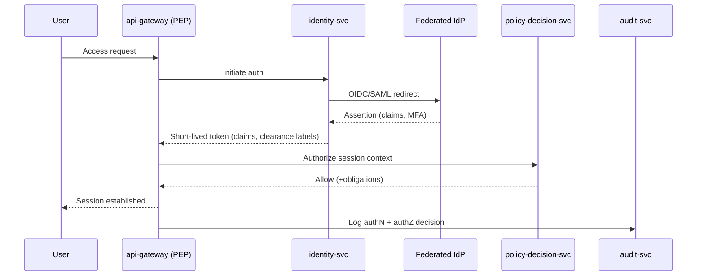

### 5.2 Knowledge Ingestion
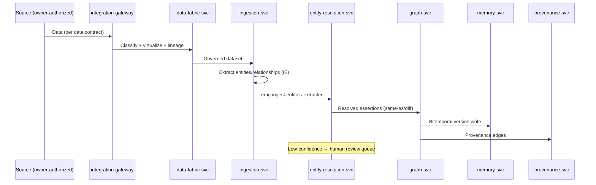

### 5.3 Document Processing
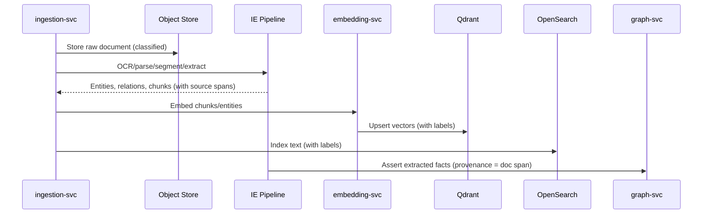

### 5.4 Decision Replay
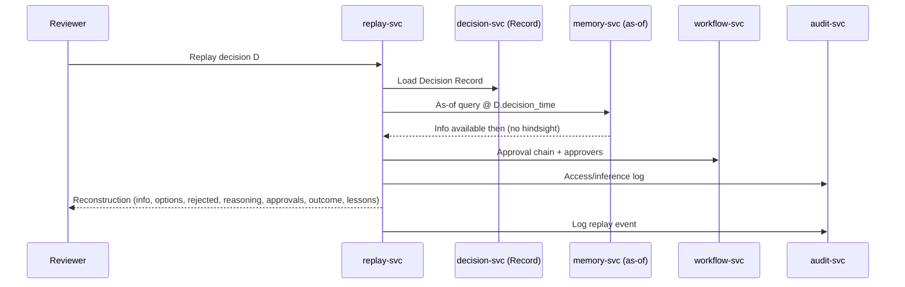

### 5.5 Semantic Search
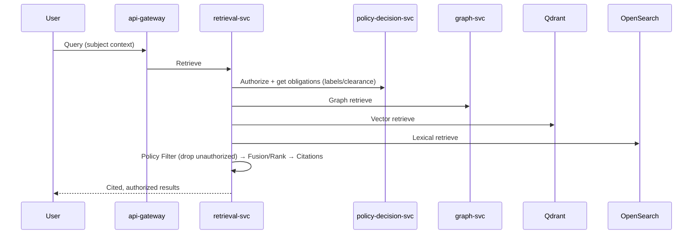

### 5.6 AI Recommendation (grounded)
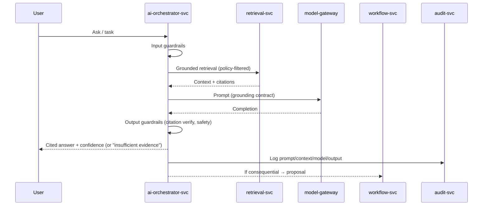

### 5.7 Risk Analysis
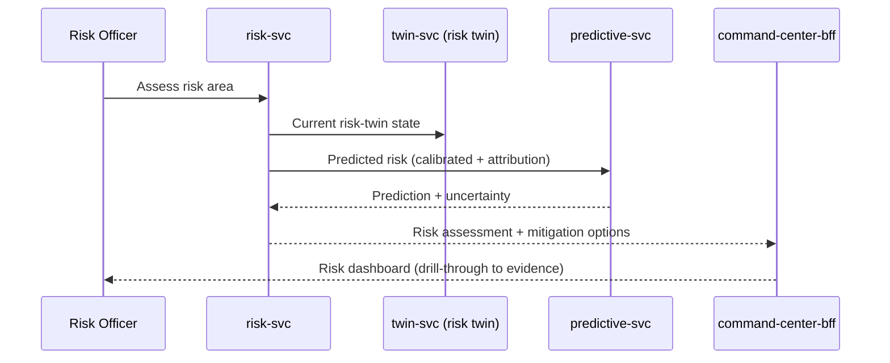

### 5.8 Executive Dashboard
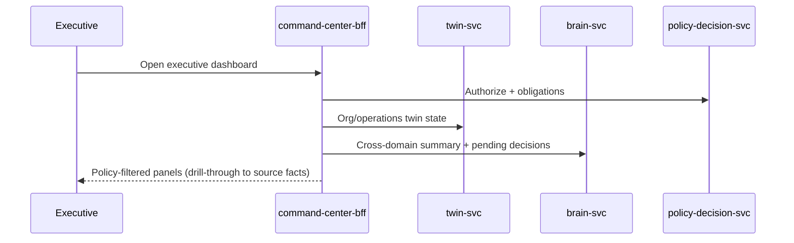

### 5.9 Lessons Learned
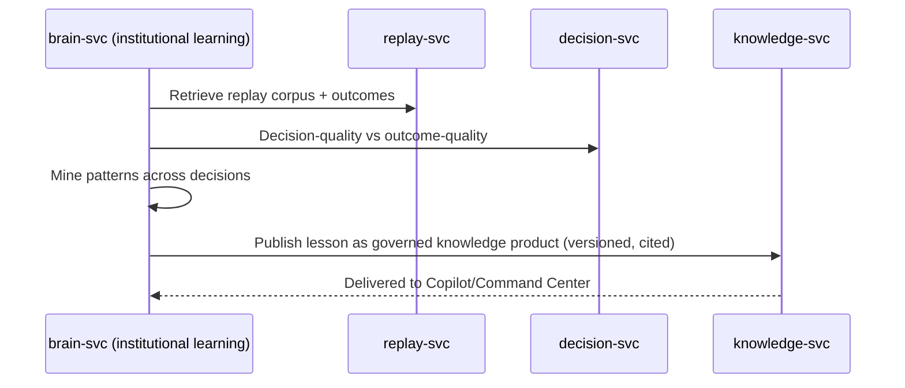

### 5.10 Investigation
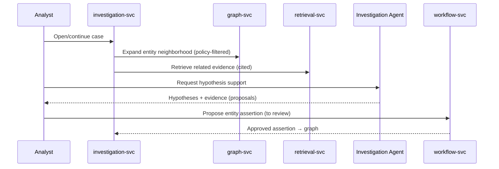

---

## 6. Knowledge Graph Design

### 6.1 Node types (core ontology; extended per domain)
`Person`, `Organization`, `Asset`, `Location`, `Event`, `Document`, `Case`, `DecisionRecord`, `Risk`, `Policy`, `KnowledgeProduct`, `Source`, `Agent`, `Twin`. Every node carries mandatory system properties.

**Mandatory node properties (system-managed):**
| Property | Type | Meaning |
|---|---|---|
| `id` | ULID | Canonical node id |
| `type` | enum | Node type |
| `classification` | label set | Classification + compartments (drives access) |
| `valid_from` / `valid_to` | timestamp | Valid-time (real-world) |
| `tx_from` / `tx_to` | timestamp | Transaction-time (system-known) |
| `confidence` | float [0,1] | Assertion confidence |
| `provenance_ref` | id | Link to provenance record |
| `created_by` | subject id | Asserting identity/agent |

### 6.2 Relationship (edge) types
Edges are first-class, time-scoped, provenance-bearing. Examples: `KNOWS`, `MEMBER_OF`, `OWNS`, `LOCATED_AT`, `INVOLVED_IN`, `ASSERTED_BY`, `DERIVED_FROM`, `SAME_AS`, `DIFFERENT_FROM`, `PART_OF_CASE`, `DECIDED_IN`, `MITIGATES`, `GOVERNED_BY`, `PROJECTS_TO` (twin). Each edge carries the same mandatory system properties as nodes (classification, bitemporal, confidence, provenance).

### 6.3 Labels
Two label planes: **(a) type labels** (ontology classes) and **(b) security labels** (classification level + compartment/caveat set). Security labels are mandatory, immutable post-assertion (a change creates a new version), and are the enforcement handle for the PDP.

### 6.4 Indexes
| Index | On | Purpose |
|---|---|---|
| Unique id index | `id` | Node/edge lookup |
| Type index | `type` | Type-scoped scans |
| Composite temporal index | `(type, valid_from, tx_from)` | As-of and time-window queries |
| Classification index | `classification` | Policy-filtered traversal pruning |
| Full-text (external) | text props → OpenSearch | Lexical search |
| Vector (external) | embeddings → Qdrant | Semantic search |
| Property lookup indexes | high-cardinality business keys (e.g., identifiers) | Deterministic ER + lookups |

### 6.5 Traversal strategies
Bounded-depth neighborhood expansion with **policy-pruning at each hop** (unauthorized nodes/edges are pruned before expansion, not after); shortest/weighted path with classification-aware edges; pattern matching for known relationship motifs (e.g., investigative link patterns); as-of traversal (traverse the graph state at a given time pair). All traversals accept subject context and are bounded (max depth, max nodes, timeout) to protect latency (§17).

### 6.6 Ontology
Ontology is authored/versioned in `ontology-svc`. Each class/relationship declares: allowed properties + types, default classification, default retention, matching rules (for ER), and cardinality constraints. Ontology changes are **additive and reversible**; breaking changes are prohibited without a governed migration.

### 6.7 Knowledge evolution
Facts evolve via new versions (never overwrite). Entity identity evolves via reversible `SAME_AS`/`DIFFERENT_FROM` assertions. Ontology evolves via versioned additive migrations. Conflicting assertions coexist and are resolved (or left explicitly unresolved) by policy/stewardship, with the resolution itself recorded as a provenance-bearing decision.

---

## 7. Database Design

### 7.1 Store responsibilities
| Store | Role | System-of-record for |
|---|---|---|
| PostgreSQL | Bitemporal facts, provenance, Decision Records, catalog, workflow, config, inference logs | History & governance state |
| Neo4j (or open equivalent) | Materialized current property graph | Traversal/query performance (derived) |
| Redis/Valkey | Cache, sessions, agent ephemeral state, PDP decision cache | Ephemeral only |
| Qdrant | Vector embeddings (with classification payload) | Semantic index (derived) |
| OpenSearch | Lexical/full-text index | Lexical index (derived) |
| MinIO | Raw documents/blobs | Raw source artifacts |
| Kafka/Redpanda | Event backbone | In-flight events (retained per policy) |
| WORM/hash-chained store | Immutable audit | Audit trail |

**Rule:** Neo4j, Qdrant, and OpenSearch are **derived** and fully rebuildable from PostgreSQL + object store. This makes recovery and re-indexing deterministic.

### 7.2 Representative PostgreSQL bitemporal model (specification, not DDL)
`fact_version` table (conceptual fields): `fact_id`, `subject_node_id`, `predicate`, `object_value|object_node_id`, `classification`, `confidence`, `provenance_id`, `valid_from`, `valid_to`, `tx_from`, `tx_to`, `created_by`. Current version = row where `tx_to` is open and `valid` window contains "now". As-of read = select the row whose `valid` and `tx` windows both contain the requested `(validTime, txTime)`.

`provenance` table: `provenance_id`, `source_system`, `source_ref`, `ingest_job_id`, `transform_ref`, `asserting_subject`, `captured_at`.

`decision_record` table: `decision_id`, `framing`, `options_json`, `evidence_refs`, `stakeholders`, `predicted_outcomes_json`, `risk_profile_json`, `recommendation`, `human_decision`, `rationale`, `approval_chain_ref`, `realized_outcome_json`, `decision_quality_score`, bitemporal columns.

### 7.3 Storage strategy
Hot (recent/active facts) on fast storage; warm/cold history on tiered storage; raw objects in MinIO with lifecycle policies; embeddings sized/quantized to control vector-store footprint.

### 7.4 Partitioning
PostgreSQL: partition `fact_version` and audit by time (monthly) + optionally by classification domain. Graph: partition/shard by domain subgraph or entity-type community (deferred to production scale). Qdrant/OpenSearch: shard by tenant/domain; collections carry classification payload for filtering.

### 7.5 Replication
PostgreSQL: synchronous replica for HA + async replica for read scale/DR. Neo4j: causal cluster (core + read replicas) or equivalent. Qdrant/OpenSearch: replicated shards. Kafka: replication factor ≥3. Redis: replicated with sentinel/cluster.

### 7.6 Backup
PostgreSQL: continuous WAL archiving + periodic base backups (PITR). Object store: versioned + replicated. Audit: WORM-anchored. Derived stores: backup optional (rebuildable), but snapshot for fast recovery. Air-gap: signed backup export bundles.

### 7.7 Recovery
RPO ≤ 15 min (PITR on PostgreSQL + object versioning). RTO ≤ 1 h: restore PostgreSQL + object store, then **rebuild** graph/vector/lexical indexes from the system-of-record deterministically. Recovery runbooks and quarterly restore drills are mandatory (§16).

### 7.8 Retention
Per-class retention schedules from governance (Ch. 22 EA). Logical deletion (tombstone) by default; hard purge only via governed, audited process respecting legal hold. Event backbone retention bounded; audit retention per regulatory requirement (often multi-year, immutable).

---
## 8. AI Architecture

### 8.1 LLM Gateway (`model-gateway`)
Single abstraction for all model calls. Responsibilities: model routing (self-hosted pools first; approved external only where policy permits and never in air-gap), version pinning, prompt/response logging (to inference log + audit), quota/rate control per subject and tenant, and safety-tap for guardrails. Serves both completion and embedding models. Health-checks and pools model replicas; on failure routes to a healthy replica or degrades the dependent feature via a flag.

### 8.2 RAG / GraphRAG
Retrieval fuses three retrievers (graph traversal, vector similarity, lexical) via `retrieval-svc`. The **Policy Filter runs before ranking** so no unauthorized fact ever reaches the ranker or the model context. Fusion uses reciprocal-rank fusion plus graph-aware re-ranking (relationship proximity boosts relevance and yields explainable retrieval paths). Every retrieved item carries a citation (node/edge id + source).

### 8.3 Embedding pipeline (`embedding-svc`)
Chunk (with source spans preserved) → embed via model-gateway → upsert to Qdrant **with classification payload** → maintain embedding version + model version for reproducibility. Re-embedding is a governed batch job on model change. Backpressure and batching protect model capacity.

### 8.4 Reasoning pipeline
`ai-orchestrator-svc` enforces the **grounding contract**: the model may answer only from authorized retrieved context; if evidence is insufficient it returns "insufficient grounded evidence." Multi-hop reasoning (via `brain-svc`) is bounded (max hops, timeout) and every inferred claim is traceable to source facts. No free-form speculation is surfaced.

### 8.5 Memory management (AI context)
Three tiers: **short-term** (per-session context in Redis, TTL-bound), **working** (task/mission context assembled per request, policy-filtered), **long-term** (the memory graph itself — the durable institutional memory). AI never treats retrieved content as instructions (injection defense); context is data. Cross-session persistence happens only through governed writes to the graph, never as hidden model state.

### 8.6 Prompt orchestration
Templated, versioned prompts (in config, reviewed like code). Orchestration assembles: system constraints + grounded context + citations contract + task. Prompt/response pairs are logged with model + version for reproducibility and eval. Prompt changes pass the evaluation harness before release.

### 8.7 Agent orchestration
`agent-orchestrator-svc` routes missions to specialized agents (§9), enforces separation of duties, arbitrates conflicting proposals, and manages shared context. Each agent runs in `agent-runtime-svc` under a signed charter with a tool allow-list; **every tool call is PDP-authorized and audited**; budget governors cap steps/time/cost; agents emit proposals, never consequential actions.

### 8.8 Inference lifecycle
`request → input guardrails → plan → policy-filtered retrieval → grounded prompt → model call → output guardrails (citation verify, safety, schema) → confidence scoring → response (or refusal) → audit log → [if consequential] HITL proposal`. Every stage is observable (traced) and every failure is **fail-closed** (refuse) rather than fail-open.

---

## 9. AI Agent Collaboration

### 9.1 Roster & charters
Ten specialized agents (Executive, Investigation, Risk, Compliance, Audit, Intelligence, Crisis, Knowledge, Policy, Operations) per EA v2.0 Ch. 34. Each has a signed **charter**: mission, allowed tools, data scope (clearance ceiling + compartments), escalation rules, and separation-of-duties constraints (e.g., Audit agent is independent of Operations).

### 9.2 Collaboration workflow
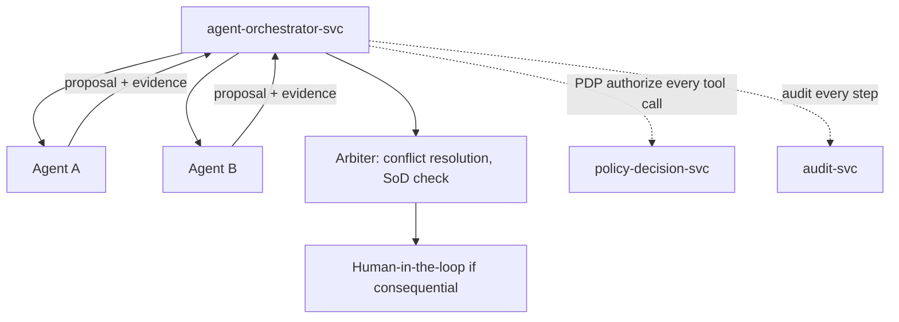
Missions are decomposed by the orchestrator; agents work in parallel where independent, in sequence where dependent (e.g., Investigation → Intelligence → Executive). All inter-agent messages are provenance-bearing.

### 9.3 Escalation
Confidence below threshold, cross-compartment fusion needed, consequence tier T2/T3, or budget exhaustion → escalate to a human (via `workflow-svc`). Agents cannot self-authorize escalation past their clearance ceiling; the orchestrator enforces this.

### 9.4 Memory sharing
Agents share a **task-scoped shared context** (Redis, TTL, policy-filtered to the *minimum common clearance* of participants) managed by the Shared-Context Manager. No agent injects a fact into shared context that another participant is not cleared to see. Durable knowledge is shared only through governed writes to the graph/knowledge fabric, never through hidden cross-agent state.

### 9.5 Context passing
Structured context envelopes carry: task, grounded evidence (with citations + classification), constraints, and provenance of prior agent contributions. Envelopes are validated at each hop (schema + classification) so context cannot silently leak across boundaries.

### 9.6 Decision approval
Any agent output that would drive a consequential action becomes a **proposal** routed to the HITL tiered model (EA Ch. 24). The approval workflow records proposal, contributing agents, evidence, approver identity, decision, and rationale to immutable audit. Agents never execute the approved action; a human-authorized path does.

---

## 10. API Design

### 10.1 Conventions
- **Transport:** HTTPS (TLS 1.3) externally; mTLS internally via mesh. Edge exposes REST (commands/admin/integration) and GraphQL (graph-shaped reads with per-field authZ).
- **AuthN:** every request carries a short-lived bearer token (OIDC) with claims + clearance labels; workload/agent calls use workload identity.
- **AuthZ:** `api-gateway` is the PEP; it calls the PDP; obligations (masking/redaction/field-denial) are applied to responses. GraphQL enforces **per-field** authorization.
- **Versioning:** URI-versioned REST (`/api/v1/...`); GraphQL schema evolves additively with deprecation + sunset headers. Breaking changes require a new major version and a migration window.
- **Pagination:** cursor-based (`cursor`, `limit`); **idempotency:** `Idempotency-Key` header on writes; **correlation:** `X-Correlation-Id` propagated for tracing.
- **Errors:** RFC 7807 problem+json (`type`, `title`, `status`, `detail`, `correlation_id`). Never leak internal detail or unauthorized existence (return `404`/generic where disclosure of existence is itself sensitive).

### 10.2 Standard error codes
`400` validation · `401` unauthenticated · `403` denied by policy · `404` not found / not disclosable · `409` conflict (concurrency) · `422` semantic validation · `429` rate limited · `500` internal · `503` dependency unavailable (with `Retry-After`).

### 10.3 Representative endpoints (specifications)

**Search (M17)** — `POST /api/v1/search`
Request: `{ "query": "string", "filters": { "type": [...], "time_as_of": "ISO8601?" }, "limit": 25, "cursor": "opt" }`
Response: `{ "results": [ { "node_id": "...", "type": "...", "snippet": "...", "score": 0.87, "citations": [ { "source_ref": "...", "provenance_id": "..." } ], "classification": "..." } ], "next_cursor": "..." }`
AuthZ: policy-filtered pre-rank; results contain only authorized facts.

**Graph read (M04)** — `POST /api/v1/graph/traverse`
Request: `{ "start_node": "id", "max_depth": 3, "edge_types": ["INVOLVED_IN"], "time_as_of": "ISO8601?", "max_nodes": 500 }`
Response: `{ "nodes": [...], "edges": [...], "truncated": false }` (unauthorized nodes/edges pruned).

**Grounded AI (M08/M07)** — `POST /api/v1/copilot/ask`
Request: `{ "session_id": "opt", "message": "string", "mode": "answer|brief|investigate" }`
Response: `{ "answer": "string", "confidence": 0.0-1.0, "citations": [...], "insufficient_evidence": false, "proposal_id": "if consequential" }`

**Decision (M05)** — `POST /api/v1/decisions` (create framing) → `GET /api/v1/decisions/{id}/options` (scored options) → `POST /api/v1/decisions/{id}/record` (human decision + rationale).

**Replay (M06)** — `GET /api/v1/decisions/{id}/replay`
Response: `{ "timeline": [...], "information_available": {...as-of...}, "options": [...], "rejected": [...], "approvals": [...], "outcome": {...}, "lessons": [...], "gaps": [...] }`

**Ingestion (M15)** — `POST /api/v1/ingest/jobs` (register owner-authorized connector job under a data contract) → `GET /api/v1/ingest/jobs/{id}` (status, quarantine counts).

**Risk (M09)** — `GET /api/v1/risk/assessments?area=...` → returns assessment + calibrated prediction + uncertainty + mitigations.

**Audit (M18)** — `GET /api/v1/audit/reconstruct?entity_id=...&from=...&to=...` (privileged) → returns who-saw/asserted/decided-what-when.

**Admin (M12)** — `POST /api/v1/admin/roles`, `POST /api/v1/admin/feature-flags` (PAM-gated, privileged).

All endpoints: authenticated, PDP-authorized, audited, rate-limited, and contract-tested (consumer-driven).

---

## 11. Security Design

### 11.1 Zero Trust (NIST SP 800-207)
Never trust, always verify; least privilege; assume breach. Every request re-authenticated and re-authorized; mTLS on all service-to-service traffic via the mesh; default-deny network policy; micro-segmentation; continuous verification with session/context risk.

### 11.2 RBAC + ABAC + labels
RBAC assigns coarse roles; **ABAC + mandatory classification labels** make the fine-grained, context-aware decision to **node/edge/property** granularity. PDP evaluates `(subject attrs, resource labels, action, context)` → allow/deny + obligations (mask/redact/deny-field). Policies are authored/versioned/simulated in `policy-svc` and deployed as signed bundles.

### 11.3 Secrets
Centralized vault; no secrets in images/code/config; dynamic short-lived credentials where possible; automatic rotation; split-knowledge for the most sensitive keys.

### 11.4 Encryption
TLS 1.3 in transit; AES-256 at rest; **field-level encryption** for the most sensitive properties; FIPS 140-3 validated modules (option); keys in vault/HSM with rotation. **Confidential computing** (attested enclaves) for the highest-sensitivity processing (e.g., cross-compartment fusion, key ops).

### 11.5 Immutable audit
Append-only, hash-chained (each record chains the prior hash), optionally WORM-backed and externally anchored; streamed to SIEM; covers every read/write/inference/decision/access; tamper-evident and reconstructable.

### 11.6 Identity Federation
Broker multiple enterprise/government IdPs (OIDC/SAML/WS-Fed) under the owning org's trust policy; attribute/claim mapping to EMG clearance labels; workload identity for services and agents; MFA enforced for humans; JIT PAM for privileged access with session recording.

### 11.7 Secure APIs
PEP at the gateway; per-field GraphQL authZ; input validation and output obligations; rate limiting and quotas; idempotency; no unauthorized existence disclosure; contract tests include negative (authZ) cases.

### 11.8 Threat model (STRIDE summary)
| Threat | Example | Mitigation |
|---|---|---|
| Spoofing | Forged identity/agent | Federated authN, mTLS, workload identity |
| Tampering | Alter facts/audit | Bitemporal no-overwrite, hash-chained audit |
| Repudiation | Deny an action | Immutable audit with approver identity |
| Information disclosure | Unauthorized fact leak (incl. via AI) | ABAC+labels to property level, Policy Filter in retrieval, compartment-aware fusion |
| Denial of service | Overload | Rate limits, quotas, budgets, autoscaling, circuit breakers |
| Elevation of privilege | Agent/user over-reach | Least privilege, PDP on every call, PAM, SoD |
| Prompt injection / exfiltration | Malicious content in data | Treat retrieved content as data; input/output guardrails; egress control; tool allow-lists |
| Model poisoning | Tainted training/inputs | No customer-data training by default; governed data; eval + red-team gates |

---
## 12. UI Architecture

### 12.1 Approach
A single design-system-driven web application with role-based surfaces, all consuming the same policy-filtered APIs (no UI ever bypasses the PDP). SPA with server-driven authorization; state via a predictable store; every data view shows classification and offers drill-through to provenance. WCAG 2.1 AA. Air-gap-friendly (no external CDNs; assets bundled).

### 12.2 Surfaces
| Surface | Purpose | Key components | State |
|---|---|---|---|
| Executive Dashboard | Cross-domain KPIs, pending decisions | KPI tiles, situation summary, decision queue | Read models from `command-center-bff` |
| Enterprise Copilot | Grounded assistant | Chat panel, citation viewer, confidence chip, proposal launcher | Session store (ephemeral) |
| Graph Explorer | Link analysis | Canvas (nodes/edges), filters, time slider, expand-with-policy-pruning | Client graph view; server authoritative |
| Decision Replay | Reconstruct decisions | Timeline, info-as-of panel, options/rejected, approvals, outcome, lessons | Read-only reconstruction |
| Knowledge Timeline | Bitemporal history | Dual-axis (valid/tx) timeline, version diff | Read models |
| Risk Center | Risk posture | Risk register, exposure trends, predicted risks (with uncertainty) | Read models |
| Operations Center | Live ops | Ops twin view, throughput, alerts, bottlenecks | Streaming read models |
| Administration | Config & governance | Users↔roles, feature flags, policy authoring, agent charters | Server config (PAM-gated) |

### 12.3 Cross-cutting UI rules
Every record displays its classification; unauthorized fields render as explicit "restricted" (never silently blank); AI content is labeled and always shows citations + confidence; consequential actions always open the HITL workflow (never one-click execute); drill-through to source facts and provenance is available everywhere.

---

## 13. Deployment Architecture

### 13.1 Environments
Dev → Test → Lab → Staging → Production, plus an isolated **Air-gap** production profile. Identical container images across all; only configuration and network posture differ. Promotion is GitOps-driven with gates (§18).

### 13.2 Substrate
Kubernetes everywhere (on-prem via vanilla/OpenShift/Rancher; private/sovereign cloud). Service mesh for mTLS + policy. Namespace-per-domain with default-deny network policy. Separate GPU node pools for model serving and simulation. Stateful stores via operators.

### 13.3 On-prem / private cloud / air-gap
- **On-prem / private cloud:** multi-node, multi-AZ where available; operator-managed replicated stores.
- **Air-gap:** private registry/mirror; all images, charts, and models imported via signed, scanned bundles; offline model serving; zero outbound dependency; no telemetry egress.

### 13.4 High availability
≥3 replicas for stateless services behind LB; PDP and gateway HA (fail-closed but never single-point); synchronous DB replica; causal graph cluster; replicated Kafka/Qdrant/OpenSearch/Redis.

### 13.5 Disaster recovery
Cross-site replication/backup; RPO ≤ 15 min, RTO ≤ 1 h; derived stores rebuilt from system-of-record on recovery; documented runbooks; quarterly DR drills; air-gap backup export path.

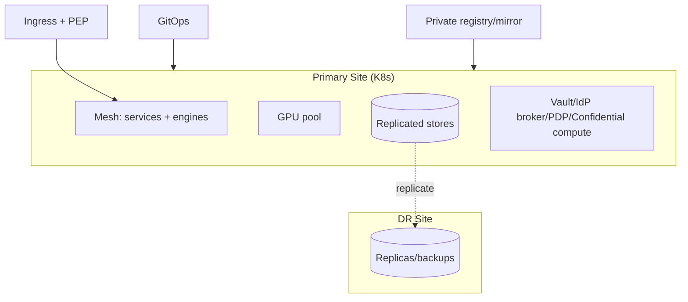

---

## 14. Monitoring

### 14.1 Observability stack
OpenTelemetry (traces) + Prometheus (metrics) + Grafana (dashboards) + Loki (logs) + Tempo (trace store). Every request carries a correlation id end-to-end.

### 14.2 Coverage
- **Logging:** structured, correlated, classification-aware (no sensitive payloads in logs).
- **Tracing:** distributed across all services and engines; span attributes include service, decision id, model version.
- **Metrics:** RED (rate/errors/duration) per service + domain KPIs (retrieval quality, grounding rate, refusal rate, ER precision/recall).
- **Health:** liveness/readiness probes; dependency health; synthetic checks per critical flow.
- **AI monitoring:** grounding/citation-verification rate, hallucination-guardrail triggers, prediction calibration (Brier), drift/bias, model latency, quota usage.
- **Security monitoring:** authN/authZ decisions, denied accesses, anomalous access patterns, PAM sessions → SIEM.
- **Performance monitoring:** SLO dashboards + error budgets + alerting against §17 targets.

---

## 15. Scalability

| Dimension | Strategy |
|---|---|
| Horizontal scaling | Stateless services autoscale (HPA) on RED + queue depth |
| Graph scaling | Read replicas; domain-subgraph partitioning/sharding at production scale; bounded traversals; caching hot neighborhoods |
| AI scaling | Model replica pools + GPU node pools; batching for embeddings; request queuing + backpressure; separate interactive vs batch pools |
| Database scaling | Read replicas; time/domain partitioning; connection pooling; CQRS-style read models for dashboards |
| Message queues | Partitioned topics; consumer groups scale with lag; idempotent consumers |
| Caching | Redis for sessions, PDP decisions (short TTL), hot reads; cache invalidation on version close |

---

## 16. Availability

High availability via multi-replica + LB + health-gating; **PDP and gateway fail-closed** (deny/unavailable rather than open). Load balancing at ingress and mesh. Failover: automatic to replicas; DB promotion of synchronous replica. Backup & recovery per §7.6–7.7. Business continuity: graceful degradation ladder — AI/engines can fail without losing core graph read; Command Center degrades to read-only situational awareness; ingestion pauses per-connector without affecting reads. Quarterly BC/DR exercises with documented outcomes.

---

## 17. Performance Targets (SLOs)

| Metric | Target |
|---|---|
| Access-decision (PDP) latency | p99 < 50 ms |
| Semantic/search latency | p95 < 800 ms |
| Graph query latency (bounded traversal) | p95 < 1.0 s; p99 < 2.0 s |
| Entity-profile load | p95 < 1.5 s |
| AI grounded response (self-hosted) | p95 < 8 s |
| Decision replay (bounded decision) | p95 < 5 s |
| Simulation | async (job) — progress + completion notification, not interactive |
| Concurrent users (production) | ≥ 5,000 concurrent interactive sessions (scale target; sized per deployment) |
| Availability (core read path) | ≥ 99.9% (private cloud) |
| RPO / RTO | ≤ 15 min / ≤ 1 h |

Targets must hold **with security enforcement in-path**. SLOs are tracked with error budgets; regressions block release (§18).

---

## 18. Engineering Standards

- **Coding standards:** per-language linters + formatters enforced in CI; no merge on lint failure; hexagonal layering respected (no domain→adapter leakage).
- **Naming:** services `<domain>-svc`; topics `emg.<domain>.<event>`; APIs `/api/v<major>/<resource>`; env-agnostic config keys; ubiquitous language from the ontology.
- **Documentation:** every service ships a README (purpose, contracts, runbook), an OpenAPI/GraphQL/AsyncAPI contract, and ADRs for significant choices; diagrams as code (Mermaid) in-repo.
- **Testing:** unit + **consumer-driven contract tests** + integration + end-to-end for critical flows (§5) + **security tests** (authZ negative cases) + **AI evaluation harness** (grounding, citation accuracy, refusal, bias) gating AI changes. Coverage floors defined per service; no release below floor.
- **Review process:** mandatory peer review; security-sensitive changes require security-architect review; ontology/policy changes require governance review; two-person rule for privileged config.
- **Git workflow:** trunk-based with short-lived branches; signed commits; protected main; conventional commit messages; every change traceable to a work item.
- **CI/CD:** build → test (all above) → SAST/DAST/dependency & container scan → SBOM → sign → progressive deploy (canary/blue-green) with auto-rollback on SLO/eval regression. Air-gap: export signed, scanned bundles for import.

---

## 19. Acceptance Criteria (per subsystem, measurable)

| Subsystem | Acceptance criteria (binary/measurable) |
|---|---|
| Identity | Federated login works; short-lived tokens; MFA enforced; every authN/authZ logged; unauthorized session fails-closed |
| Memory | As-of query returns correct historical value; no overwrite (version count increments); as-of read p95 < 1.5 s |
| Graph | CRUD + bounded traversal within §17; unauthorized nodes pruned pre-expansion (verified by test) |
| Provenance | Every fact resolves to source/job/transform/subject; lineage query returns complete chain |
| Search | Hybrid results returned; **Policy Filter keeps unauthorized facts out of results and AI context** (negative test passes); every result cited |
| AI / Copilot | Answers only from authorized context; "insufficient evidence" when unsupported; citation-verification ≥ target; injection tests blocked |
| Agents | Every tool call PDP-authorized + audited; charter scope enforced; budget caps stop runaway; SoD enforced; outputs are proposals |
| Decision Intelligence | Decision Record persisted (bitemporal); options scored with explicit weights; decision-quality vs outcome-quality separated |
| Decision Replay | Reconstruction uses as-of info (no hindsight leakage — verified); full options/approvals/outcome; gaps reported, never fabricated |
| Predictive | Predictions carry calibration + uncertainty + attribution; drift monitor triggers; no stale model served |
| Simulation | Reproducible with recorded assumptions/versions; outputs labeled "simulated"; feeds DIE |
| Risk | Assessment + predicted risk + mitigations; staleness marked when predictor down |
| Investigation | Policy-filtered expansion; consequential writes routed to review |
| Reporting | Drafts only; require human approval before distribution; sources included |
| Security | mTLS everywhere; ABAC+labels to property level; PDP fail-closed; hash-chained audit tamper-evident; STRIDE mitigations tested |
| Integration | Only owner-authorized, contract-governed connections; Zero-Trust ingress; classification asserted at ingress; violations quarantined |
| Monitoring | Every request traced end-to-end; SLO dashboards live; AI + security monitoring feeding SIEM |
| Availability/DR | HA verified via replica failover; DR drill meets RPO/RTO; derived stores rebuilt from system-of-record |
| Deployment | Runs from IaC on K8s with mTLS + self-hosted model; **operates with external network blocked (air-gap readiness)** |

Security and grounding criteria accept **no partial credit**.

---

## 20. Appendices

### Appendix A — Glossary
**As-of query** — reading the graph as it was at a past (valid-time, transaction-time). **Bitemporal** — valid-time + transaction-time on every fact. **Compartment** — a caveat/need-to-know grouping within a classification. **Decision Record** — canonical, bitemporal object capturing a decision and its context. **Fact** — any node/edge/property assertion. **Grounding contract** — AI may answer only from authorized retrieved context. **PDP/PEP/PIP/PAP** — policy decision/enforcement/information/administration points. **Policy Filter** — retrieval-time removal of unauthorized facts before ranking. **Provenance** — source/lineage of a fact. **Twin** — governed projection modeling an organizational reality. **HITL** — human-in-the-loop consequential-action gate.

### Appendix B — Architecture Decisions (ADR index; to be authored on kickoff)
ADR-001 Graph store selection (Neo4j vs open alternatives) · ADR-002 Model-serving stack · ADR-003 Authorization engine (policy language) · ADR-004 Data-virtualization technology · ADR-005 Confidential-compute approach · ADR-006 Event backbone (Kafka vs Redpanda) · ADR-007 Vector store · ADR-008 Bitemporal storage pattern · ADR-009 API style split (REST/GraphQL) · ADR-010 Multi-tenancy isolation model. Each ADR: context, options, decision, consequences, revisit trigger.

### Appendix C — Technology Rationale
Choices favor **open, self-hostable, air-gap-capable** components (PostgreSQL, OpenSearch, MinIO, Qdrant, Kafka/Redpanda, Keycloak-class IdP, OPA-class PDP, self-hosted model serving) behind **hexagonal adapters** so no vendor is load-bearing and sovereignty is preserved. Property graph chosen for traversal performance + developer ergonomics; RDF/OWL retained for interchange. Bitemporality in PostgreSQL (system-of-record) with derived, rebuildable graph/vector/lexical indexes for deterministic recovery. **Versions are pinned in ADRs, not here, because product versions drift and this SAD must remain valid across them.**

### Appendix D — Future Roadmap
Post-GA: graph sharding to billions of nodes/edges · full ten-agent roster + full simulation modes · expanded predictive portfolio · multi-tenant sovereign isolation at scale · additional connector catalog (owner-authorized) · continuous RAI eval expansion · confidential-compute broadening. Sequencing rule (unchanged): a proven, secured memory core first; intelligence engines layered on top, never before.

---

## Sign-off

This SAD is ready for engineering handoff. It fixes structure, contracts, data models, flows, and measurable acceptance criteria to a level supporting independent, parallel team delivery. Open technology choices are deliberately deferred to the ADRs in Appendix B, to be authored at kickoff.

**No application code has been written.** On approval of this SAD, the recommended first engineering step is to author ADR-001…010 and stand up the **walking skeleton** (gateway → one service → store, with federated authN, PDP authorization, hash-chained audit, and end-to-end tracing already in-path), before any feature service is built.
