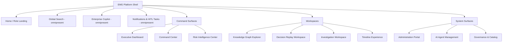

# EMG™ — Enterprise UX Architecture & Design System
### Interaction Architecture & Design Standards · Version 1.0

| Field | Value |
|---|---|
| Document | Enterprise UX Architecture & Design System v1.0 |
| Derives from | EA v2.0 · SAD v1.0 · EDA v1.0 · API Architecture v1.0 (all approved) |
| Relationship | **Complements, does not modify** the approved documents. On any conflict, EA/SAD/EDA/API prevail and a governed change request is raised. |
| Status | **For Design & Architecture Review Board** — no code, no React |
| Owners | Chief Experience Officer · Enterprise UX Architect · Design System Lead · Principal Product Designer · Government Digital Experience Architect · Human Factors Specialist |
| Audience | Design & architecture review boards, product, engineering, accessibility & security reviewers, government/defense human-factors reviewers |

> **Scope discipline.** This document specifies **interaction architecture, information architecture, workflows, usability, accessibility, and design-system standards**. It contains **no implementation code and no React components**. Design tokens, component specifications, and layouts are expressed as **specification tables and diagrams**, which engineering realizes under the frontend design system.

> **Non-negotiable UX invariants (inherited from the approved stack).** Every data view is **classification-aware** (shows its label; unauthorized fields render as explicit `restricted`, never silent blanks; unauthorized existence is never implied). Every AI output shows **citations + confidence** and is labeled AI-generated. Every **consequential action opens the human-in-the-loop (HITL) workflow** — never one-click execute. **Provenance/as-of drill-through** is available wherever facts are shown. The UI **never bypasses the PDP** and works **fully air-gapped** (no external fonts/CDNs/telemetry).

---

## 1. UX Vision

**Vision.** *EMG's experience makes institutional memory and machine intelligence trustworthy and actionable — every screen answers not just "what," but "how do we know," "when was it true," "who is accountable," and "what should we consider" — so that people decide faster and with more confidence, never less.*

The experience is designed for **high-consequence, high-scrutiny work**: analysts, investigators, operators, and executives making decisions that are audited, contested, and remembered. It optimizes for **clarity, trust, and defensibility** over novelty or density-for-its-own-sake. Intelligence is presented as **grounded assistance a human commands**, not an oracle a human obeys.

**Experience pillars:** *Grounded* (nothing shown without provenance) · *Legible* (classification, time, and confidence are always visible) · *Accountable* (every consequential path routes through a human) · *Calm under load* (usable in crisis and on 24/7 operations floors) · *Sovereign* (fully functional air-gapped, accessible to all).

---

## 2. Design Principles

1. **Show the evidence, not just the answer.** Facts carry sources; AI carries citations and confidence; users can always drill to provenance and to the as-of state.
2. **Truth is time-scoped.** Time context (valid-time vs transaction-time) is a first-class, visible dimension, not a hidden filter.
3. **Classification is visible and honest.** Every artifact shows its label; restricted content is explicitly marked; the UI never fabricates completeness or hints at hidden existence.
4. **AI proposes; humans decide.** Consequential actions are always reviewed by an authorized human, with evidence in view.
5. **Progressive disclosure.** Lead with the decision-relevant summary; let expertise pull detail on demand. Complexity is available, not imposed.
6. **Consistency is a safety feature.** One pattern per problem across all surfaces; predictability reduces error in high-stakes work.
7. **Design for stress and fatigue.** Legible under low light, on video walls, during incidents, and for long shifts (human factors, §28).
8. **Accessible by default.** WCAG 2.1 AA minimum; no capability gated behind an inaccessible interaction.
9. **Density with dignity.** Support expert information density without clutter; whitespace and hierarchy do the work.
10. **Sovereign and self-contained.** No external dependency; works offline/air-gapped; performance budgets respected.

---

## 3. Information Architecture

The IA organizes the platform into **workspaces** (where sustained work happens), **command surfaces** (where situational awareness and oversight happen), and **system surfaces** (administration, governance). All are unified by **global search**, the **copilot**, and the **notification/task center**, which are omnipresent.

**IA principles:** shallow and predictable (max ~3 levels to any task); the same entity is reachable from search, graph, timeline, case, and copilot with consistent affordances; **classification scoping** is applied at every node so navigation never surfaces unauthorized structure; every surface exposes the same cross-cutting affordances (classification chip, time control where temporal, provenance drill-through, copilot, task center).

**Object model in the UI (mirrors the ontology, EDA §5/§8):** Entity (Person/Org/Asset/Location), Event, Document, Case, Decision, Risk, Policy, Knowledge Product, Twin, Lesson — each has a canonical **object profile** pattern reused everywhere.

---

## 4. Navigation Model

**Shell structure:**
- **Primary rail (left):** top-level destinations (Home, Command, Workspaces, System), role-filtered so users see only what they're authorized for.
- **Global bar (top):** global search, copilot toggle, time-context control (when in a temporal surface), notification/task bell, subject/clearance indicator, environment/classification banner.
- **Contextual panel (right):** copilot, details, provenance, or task panel — context-sensitive, dismissible.
- **Workspace canvas (center):** the active surface.

**Navigation patterns:** persistent **breadcrumb + object trail** (how you got here); **deep-linkable** objects and states (every entity/decision/case/as-of view has a stable URL, respecting authorization); **cross-surface handoff** (from a graph node → open in timeline / open case / ask copilot / replay related decision) via a consistent object action menu; **command palette** (keyboard-driven navigation and actions for expert users).

**Classification banner:** a persistent, unmissable banner communicates the classification context of the current session/view (required in government/defense environments); it updates as the user moves between differently classified content.

---

## 5. User Personas

| Persona | Goals | Context & constraints | Key needs |
|---|---|---|---|
| **Executive / Decision-maker** | Situational awareness, decide, approve | Time-poor, high-consequence, mobile/desktop | Cited briefs, pending approvals, drill-to-evidence, confidence at a glance |
| **Analyst / Investigator** | Explore, connect, build cases | Long sessions, high density, expert | Graph exploration, timeline, search, hypothesis tools, citations |
| **Operator / Case Officer** | Act on knowledge under process | Operational tempo, procedure-bound | Clear tasks, HITL flows, status, guardrails |
| **Risk Officer** | Assess & monitor risk | Analytical, forward-looking | Risk register, predictions with uncertainty, mitigations |
| **Crisis Commander** | Command a live incident | High stress, real-time, shared displays | Live twin, response options, decision log, comms |
| **Data Steward** | Quality, resolution, classification | Detail-oriented, governance | Review queues, merge/split, lineage, quality |
| **Security / Governance Officer** | Policy, access, audit | Compliance, oversight | Policy authoring/simulation, audit reconstruction |
| **Administrator** | Users, roles, config, connectors | Privileged, careful | PAM-gated admin, two-person controls, clear consequences |
| **AI Platform Engineer** | Models, agents, guardrails, evals | Technical, governance-bound | Agent charters, model registry, eval dashboards |

Personas map to **roles** (RBAC, EDA §11–12); a real user may hold several roles and switch context explicitly (with re-authorization).

---

## 6. Role-based Experiences

**Principle:** the experience is **composed from authorized capabilities**, not gated after the fact. A user's rail, landing page, available surfaces, object actions, and dashboards are assembled from their roles, clearance, and compartments — the UI never renders an action the user cannot take, and never implies data they cannot see.

| Role | Landing | Emphasized surfaces | Restricted |
|---|---|---|---|
| Executive | Executive Dashboard | Command Center, approvals, copilot briefs | Admin, stewardship internals |
| Analyst | Workspace home (recent cases/searches) | Graph, Timeline, Search, Investigation | Admin, policy authoring |
| Operator | Task/queue home | Command Center, HITL tasks, notifications | Model/agent config |
| Risk Officer | Risk Intelligence Center | Risk, predictions, Command Center risk | Investigation internals (unless assigned) |
| Steward | Steward console | Review queues, lineage, ER, quality | Executive approvals |
| Governance/Security | Governance console | Policy, audit, classification | Operational action execution |
| Admin | Admin Portal | Users/roles, connectors, flags (PAM) | Case content (least privilege) |

**Context switching** (e.g., an analyst who is also a steward) is explicit, labeled, and re-authorized; the classification banner and available actions update accordingly. **Least privilege is visible** — users understand the boundary of their authority rather than hitting silent walls.

---

## 7. User Journeys

Representative end-to-end journeys (each is classification-aware, cited, and HITL-gated where consequential).

**J1 — Executive decision & approval.** Login (federated, MFA) → Executive Dashboard shows a pending decision → open decision brief (options, predictions with uncertainty, **steelman against the recommendation**, citations) → drill to evidence/provenance → approve via HITL (rationale recorded) → decision + approver written to audit.

**J2 — Analyst investigation.** Global search for an entity → entity profile → expand in Graph Explorer (policy-pruned) → pivot to Timeline (as-of) → open/attach to Case → ask Copilot for hypothesis support (cited) → propose a new link → routed to steward review.

**J3 — Decision replay / after-action.** Open a past decision → Replay Workspace reconstructs **as-of** state (information available then, options, rejected alternatives, approvals, outcome, lessons, and explicit **gaps**) → export after-action package (governed).

**J4 — Risk monitoring.** Risk Center → risk register → open a risk → view predicted trajectory (uncertainty + calibration + attribution) → review mitigations → propose action → HITL.

**J5 — Crisis response.** Alert → Command Center crisis view → live incident twin → response options from agents (proposals) → commander decides (logged) → shared display keeps the team aligned.

**J6 — Stewardship.** Review queue → low-confidence match → compare candidates with provenance → merge/split (reversible, audited) → quality remediation.

**J7 — Governance/audit.** Governance console → reconstruct "who saw/asserted/decided what, when" for an entity → verify audit integrity → author/simulate a policy change before rollout.

Each journey has a defined **entry, happy path, error/edge paths (§32), empty states (§31), and exit**, and is measured against usability criteria (§37).

---

## 8. Screen Inventory

Screens are instances of a small set of **reusable surface archetypes**, which keeps the platform learnable despite its scope.

**Surface archetypes:** *Dashboard* (composed panels) · *Object Profile* (entity/decision/case/risk detail) · *Explorer* (graph/timeline canvas) · *Workspace* (multi-panel task environment) · *Queue/List* (tasks, reviews, registers) · *Composer* (brief/report/policy authoring) · *Console* (admin/governance) · *Modal/Flow* (HITL, guided actions).

| # | Screen | Archetype | Primary role(s) |
|---|---|---|---|
| S01 | Role Landing / Home | Dashboard | All |
| S02 | Global Search Results | Explorer/List | Analyst, all |
| S03 | Entity Profile | Object Profile | Analyst, exec |
| S04 | Executive Dashboard | Dashboard | Executive |
| S05 | Command Center (multi-view) | Dashboard | Operator, commander |
| S06 | Risk Intelligence Center | Dashboard/Profile | Risk officer |
| S07 | Knowledge Graph Explorer | Explorer | Analyst |
| S08 | Timeline | Explorer | Analyst, all |
| S09 | Decision Replay Workspace | Workspace | Reviewer, exec |
| S10 | Investigation Workspace | Workspace | Analyst |
| S11 | Decision Detail / Brief | Object Profile/Composer | Exec, analyst |
| S12 | Copilot (panel + full) | Workspace/Panel | All |
| S13 | Notification & Task Center | Queue | All |
| S14 | HITL Approval Flow | Modal/Flow | Approvers |
| S15 | Steward Console (queues, ER, quality) | Console/Queue | Steward |
| S16 | Governance Console (policy, audit) | Console | Governance |
| S17 | Administration Portal | Console | Admin |
| S18 | AI Agent Management | Console | AI engineer, governance |
| S19 | Report/Brief Composer | Composer | Exec, analyst |
| S20 | Knowledge Product / Lesson viewer | Object Profile | All |

Every screen inherits the shell (§4), the cross-cutting affordances, and the applicable states (§31–33).

---
## 9. Dashboard Architecture

Dashboards are **composed from authorized panels** over a responsive grid. A panel is the reusable unit: it declares a data source (via API), a required authorization, a classification behavior, a default/expanded state, and drill-through targets.

**Panel anatomy:** header (title, classification chip, time-context, freshness, info/provenance action) · body (visualization/list/summary) · footer (citations/source count, "as-of" indicator) · actions (drill-through, add to case, ask copilot, export-draft).

**Grid & composition:** 12-column responsive grid; panels span defined sizes; layouts are role-default but user-customizable (saved per role, governed); panels lazily load and **degrade independently** (one failing panel shows an error state, never breaks the board — SAD §16).

**Cross-cutting dashboard rules:** every panel shows its **classification and freshness**; **AI-derived panels** show confidence and citations; drill-through always leads to the underlying object profile and provenance; **no panel implies data the user isn't cleared to see** (unauthorized panels are absent, not blanked misleadingly); refresh is explicit or streamed (§6) with clear "live vs snapshot" indication.

---

## 10. Executive Dashboard

**Purpose.** At-a-glance, trustworthy situational awareness and the executive's action queue. Optimized for **fast, confident, defensible decisions**.

**Primary user:** Executive/Decision-maker. **Key jobs:** understand the situation, see what needs a decision, drill to evidence, approve.

**Zones:**
- **Situation summary** — cross-domain, cited, uncertainty-qualified brief (from the Brain/Executive agent), with an explicit "as-of" and confidence.
- **Pending decisions & approvals** — the HITL queue: each item shows the decision framing, recommended option, **steelman**, evidence count, and confidence; one click opens the approval flow (§14, §35-HITL).
- **Key indicators** — cross-domain KPIs with trend and drill-through; predicted risks with uncertainty.
- **Watch items** — entities/events/cases the executive is tracking.

**Interactions:** every metric drills to evidence; every AI element shows citations/confidence; approvals never execute inline (always the HITL flow); briefs are **draft** until the executive acts. **Human factors:** legible at a glance, low cognitive load, no more than the decision-relevant few items surfaced by default; depth on demand.

---

## 11. Enterprise Copilot Experience

**Purpose.** The omnipresent, grounded assistant — the primary conversational interface to platform intelligence (EA Ch. 35). Available as a **dockable right panel** everywhere and as a **full workspace** (S12).

**Interaction model:**
- **Grounded turns:** every response shows inline **citations** (click → source fact/provenance) and a **confidence indicator**; when unsupported, it explicitly says *"insufficient grounded evidence"* rather than guessing.
- **Context-aware:** the copilot knows the current object/case/dashboard and offers relevant actions ("brief me on this entity," "find analogous decisions").
- **Modes:** answer · brief · investigate — each with appropriate output structure.
- **Streaming:** responses stream (§6) with a clear generating state; users can stop generation.
- **Consequential outputs:** anything actionable becomes a **proposal** with a visible path to HITL — the copilot never executes.
- **Transparency:** AI content is always labeled; the retrieval path can be revealed ("show me how you know this"); classification of the answer is shown and restricted content is marked.

**Trust affordances:** citation viewer, confidence chip, "as-of" awareness, "why not more?" (explains refusals/gaps), and a persistent reminder that the copilot assists rather than decides.

---

## 12. Knowledge Graph Explorer

**Purpose.** Visual, interactive exploration of the memory graph for analysis and investigation (S07).

**Canvas & interaction:** node-link canvas with **policy-pruned expansion** (unauthorized nodes/edges are never rendered or hinted); expand/collapse neighborhoods; pathfinding between entities; pattern/motif highlighting; filtering by type, taxonomy, classification (within clearance), and **time (as-of slider)**.

**Object affordances:** selecting a node opens the detail panel (profile, provenance, actions: open in timeline, add to case, ask copilot, replay related decision). Edges show relationship type, time-scope, confidence, and provenance.

**Legibility at scale:** clustering/aggregation for dense graphs; focus+context (fisheye/mini-map); bounded expansion with clear "truncated — refine" affordances (never dump thousands of nodes); layout stability so the user's mental map is preserved.

**Trust:** every node/edge shows classification and confidence; every fact drills to provenance; the time control makes it explicit that the graph is being viewed *as of* a chosen moment. **Human factors:** color is never the sole encoder (accessibility, §28); high information density handled with progressive disclosure.

---

## 13. Decision Replay Workspace

**Purpose.** Reconstruct a past decision faithfully for accountability, after-action review, and learning (S09; EA Ch. 30).

**Layout (multi-panel):**
- **Timeline panel** — the bitemporal sequence of the decision and its context (dual axis: what happened / when known).
- **Information-available panel** — the **as-of** knowledge the organization actually had at the decision time (no hindsight leakage — visibly labeled as such).
- **Options panel** — chosen and **rejected** alternatives with their at-the-time scores and trade-offs.
- **Reasoning & approvals panel** — recorded rationale, evidence (cited), the HITL approval chain and approvers.
- **Outcome & lessons panel** — realized outcome, decision-quality vs outcome-quality, derived lessons.
- **Gaps** — explicitly shown where information is missing (never fabricated).

**Interaction:** scrub the timeline to see the evolving picture; toggle "as-of" vs "as-known-now" to compare (clearly labeled); drill any fact to provenance; export a governed after-action package. **Read-only** — replay cannot alter history. **Human factors:** the distinction between *what was known then* and *what we know now* is the central, unmissable design concern here.

---

## 14. Investigation Workspace

**Purpose.** The analyst's sustained work environment for building and validating cases (S10).

**Layout:** case context (members, status, owner) · **evidence board** (cited evidence packages) · **hypothesis tracker** (statements with supporting/contradicting evidence and status) · integrated graph/timeline/search panels · copilot investigation support.

**Interaction:** pull entities/events/documents into the case; build and test hypotheses (evidence linked with citations); propose new links/assertions → **routed to steward review** (never direct destructive writes); annotate; collaborate (with classification-consistent sharing). All artifacts are versioned (non-destructive, EDA §29).

**Trust:** evidence retains provenance; classification enforced at case and element level; hypotheses show confidence and the evidence for and against — the design actively surfaces **disconfirming** evidence to counter confirmation bias (human factors).

---

## 15. Risk Intelligence Center

**Purpose.** Assess, monitor, and act on risk (S06).

**Zones:** risk register (filterable/paged) · risk profile (drivers, exposure, controls) · **predicted risk** (trajectory with **uncertainty band, calibration, and feature attribution** — never a bare number) · mitigation options (→ HITL to act) · risk twin view.

**Interaction:** drill from register → risk → drivers/evidence (provenance) → predicted trajectory → mitigations → propose action (HITL). Staleness is explicit when a predictor is unavailable (last-known + staleness marker).

**Human factors:** uncertainty is communicated honestly and legibly (bands, ranges, calibration language) so predictions are read as **advisory**, not certain; the design resists over-trust in model output.

---

## 16. Command Center

**Purpose.** The multi-role operations and crisis cockpit, usable on desktops **and shared video walls** (S05; EA Ch. 36).

**Views (role-scoped tabs):** Executive · Operations · Risk · AI Recommendations · Investigations · Crisis · Performance — each a composed dashboard (§9).

**Crisis mode:** live incident twin, response options (agent proposals), decision log, resource status, and team-shared display state. **Actions never execute from a panel** — they open the HITL flow; the decision log records every command with approver and rationale.

**Human factors (critical here):** designed for **stress, low light, glance-ability, and 24/7 shifts** — high-contrast mode, large legible type at distance, alarm/alert hierarchy that avoids alarm fatigue (severity-ranked, deduplicated), and graceful **read-only degradation** (if intelligence engines fail, core situational awareness from the graph remains, clearly indicated).

---

## 17. Administration Portal

**Purpose.** Privileged configuration: users↔roles/clearance, feature flags, connectors, policy (S17).

**Design for consequence:** every privileged action shows its **blast radius and consequence** before confirmation; **two-person rule** for the most sensitive changes (dual-approval UX); **JIT PAM** context is visible (session is recorded, time-boxed); policy changes run through **simulation/impact preview** before rollout (EDA §30); connector authorization makes the **owner-authorization** explicit.

**Human factors:** admin is deliberately **slower and more explicit** than analyst workflows — friction is a feature where irreversibility and privilege are involved; clear undo/reversibility where it exists, unmistakable warnings where it does not.

---

## 18. AI Agent Management

**Purpose.** Configure and oversee the agent ecosystem (S18; EA Ch. 34).

**Surfaces:** agent roster with **charters** (mission, allowed tools, data scope/clearance ceiling, escalation rules) · agent activity/audit (every tool call, PDP-authorized) · budgets (step/time/cost caps) · **evaluation dashboards** (grounding, citation accuracy, refusal correctness, bias, calibration) · model registry (cards, versions, approvals).

**Interaction:** review/version a charter (governed change); pause/disable an agent (kill switch); inspect a mission's step-by-step trace; review eval results before promoting a model/prompt. **Separation of duties** is enforced and visible (e.g., the Audit agent's independence).

**Trust:** the design makes agent **boundaries and accountability legible** — a reviewer can always see what an agent is allowed to do, what it did, and why, and that it only ever proposed.

---

## 19. Notification Center

**Purpose.** The unified inbox for notifications, alerts, and **HITL tasks** (S13).

**Structure:** task queue (approvals/reviews assigned to the subject, with priority and SLA) · alerts (risk/crisis/system, severity-ranked) · informational notices. Real-time via stream (§6).

**Interaction:** acknowledge; open a task → the relevant HITL flow (§14/§35) with evidence in view; snooze/route (with audit); filter by type/priority/classification. **Alert hierarchy** prevents fatigue (dedup, severity ranking, quiet informational tier).

**Human factors:** critical/consequential tasks are unmistakable and never lost in noise; SLA/urgency is clear; the design distinguishes "requires your decision" from "for your awareness."

---

## 20. Global Search Experience

**Purpose.** The omnipresent entry point to everything (S02); hybrid, grounded, policy-filtered.

**Interaction:** single query box (natural language or keyword) → results fused from graph, semantic, and lexical retrieval, **policy-filtered pre-rank** (unauthorized results never appear) → each result shows type, snippet, **citations/provenance**, classification, and relevance; typed **filters** (§22-API) and **as-of** time; pivot from any result into graph/timeline/case/copilot.

**Trust & legibility:** results carry sources; the search never implies unauthorized existence; "no results" is honest (it may mean *nothing you're cleared to see*, communicated carefully without leaking). Query assistance (suggestions, entity recognition) respects classification. **Keyboard-first** for expert speed (command palette integration).

---

## 21. Timeline Experience

**Purpose.** Bitemporal, classification-aware temporal view of events and fact-versions (S08; EDA §32).

**Design:** **dual-axis** timeline — *valid-time* (what happened when) and *transaction-time* (when it became known) — with the difference (late-arriving knowledge) made visible. Scrub/zoom across time; filter by type/entity/classification; set an **as-of** point that other surfaces respect.

**Interaction:** select an event → detail + provenance; compare "what we knew then" vs "now" (clearly labeled); export a temporal view. Policy-filtered (unauthorized events excluded, not misleadingly blanked).

**Human factors:** the *occurrence vs knowledge* distinction is the core design challenge; visual encoding must make it immediately legible without training, since it underpins replay and accountability.

---
## 22. Design System

**Purpose.** A single, governed source of truth for the platform's look, behavior, and interaction language — comparable in rigor to Fluent, Carbon, Material, Lightning, and Palantir's system, but tuned for **classified, high-consequence, sovereign** environments.

**Structure (token → component → pattern → template):**
- **Design tokens** (§24–27) — the atomic, themeable values (color, type, space, elevation, motion) expressed as **semantic roles**, not raw values, so themes (light/dark/high-contrast) and accessibility variants swap cleanly.
- **Components** (§23) — reusable, accessible, stateful building blocks with defined anatomy, states, and behavior.
- **Patterns** (§30) — solutions to recurring interaction problems (search, drill-through, HITL, empty/error/loading).
- **Templates** — the surface archetypes (§8).

**Governance:** the design system is **versioned and owned** (Design System Lead); changes are additive-by-default with deprecation; every component ships with accessibility and usage guidance; **contribution and review** are governed like APIs (§API-38 analogue). **Air-gap:** all assets (fonts, icons) are **self-hosted** — no external CDN/font services; the system functions fully offline.

**Theming:** semantic tokens support light, dark, and **high-contrast** themes and a **command-center/video-wall** density theme, without changing component structure.

---

## 23. Component Library

Each component specifies: **anatomy, variants, states (default/hover/focus/active/disabled/loading/error/read-only/restricted), behavior, accessibility, and content guidance.** No component is "done" without its accessible keyboard and screen-reader behavior.

**Core inventory:**
| Group | Components |
|---|---|
| Foundational | Button, Icon Button, Link, Input, Select, Combobox, Checkbox, Radio, Toggle, Textarea, Date/Time picker, Tag/Chip |
| Data display | Table (sortable, virtualized, paged), List, Key-Value, Stat/KPI tile, Badge, **Classification chip**, **Confidence indicator**, **Citation reference** |
| Navigation | Primary rail, Top bar, Breadcrumb, Tabs, Command palette, Pagination (cursor) |
| Feedback | Toast, Inline alert, Banner (incl. **classification banner**), Progress, Skeleton, Empty state, Error state |
| Overlay | Modal, Drawer/Panel, Popover, Tooltip, Confirmation (with **consequence/blast-radius**), Dual-approval dialog |
| Domain | Entity card, Graph canvas, Timeline, Evidence/Provenance viewer, Copilot message, Option/decision card, Risk gauge (with uncertainty), Review/merge comparator, Agent charter card |

**Signature EMG components (unique to this platform):**
- **Classification chip** — always-present label; consistent color/shape encoding (never color-only, §28); shows compartments on demand.
- **Confidence indicator** — standardized visual for AI/prediction confidence with plain-language and uncertainty bands.
- **Citation reference** — inline, clickable, opens the provenance viewer.
- **Provenance viewer** — the lineage/as-of drill-through, reused everywhere facts appear.
- **HITL approval card/flow** — the consequential-action pattern with evidence-in-view.
- **Restricted-field marker** — explicit representation of an authorized-but-withheld field (never a silent blank).

---

## 24. Color System

Color is defined as **semantic roles** mapped to theme values; components reference roles, never raw hex, so themes and accessibility variants are swappable. **Color never carries meaning alone** (paired with icon/text/shape) — a hard accessibility rule (§28).

**Semantic role set (illustrative; values set per theme, all AA-verified):**
| Role | Purpose |
|---|---|
| `surface` / `surface-raised` / `surface-sunken` | Backgrounds and layering |
| `content-primary/secondary/tertiary` | Text hierarchy |
| `border-subtle/strong/focus` | Separation and focus ring |
| `action-primary/secondary/danger` | Interactive emphasis |
| `status-success/warning/critical/info` | State signaling (always + icon/text) |
| `ai-accent` | AI-generated content signaling (consistent, distinct) |
| `classification-*` | Classification level encoding (shape + label + color, never color-only) |
| `confidence-high/med/low` | Confidence encoding (+ text/band) |
| `selection/highlight` | Focus and match highlighting |

**Rules:** all text/background pairings meet WCAG AA (≥4.5:1 normal, ≥3:1 large); focus indicators meet non-text contrast (≥3:1); a dedicated **high-contrast theme** exceeds AA; **classification colors** are standardized platform-wide and reinforced by shape/label so they remain unambiguous for color-blind users and on video walls.

---

## 25. Typography

**Type system:** one primary sans-serif family (self-hosted for air-gap) plus a monospace family for identifiers, code-like values, and data. A modular **type scale** with defined roles.

| Role | Use |
|---|---|
| Display / H1–H4 | Page and section titles |
| Body-lg / Body / Body-sm | Reading text at densities |
| Label / Caption | Field labels, metadata, timestamps |
| Mono | IDs, hashes, technical values |
| Data-dense | Tables and high-density panels |

**Rules:** minimum body size ensures legibility (and larger defaults for command-center/at-distance viewing); line-length and line-height tuned for long analyst sessions; **type scales with user zoom to 200%** without loss (§28); numerals are tabular in data contexts; language/RTL support is built in (localization-ready); never rely on weight/size alone to convey status (pair with role/icon).

---

## 26. Iconography

**System:** one coherent, self-hosted icon set (line-based, consistent grid and stroke), covering navigation, objects, actions, and status. Icons are **functional, not decorative**.

**Rules:** every meaningful icon has a text label or accessible name (never icon-only for critical actions without a label/tooltip); status icons pair with color and text (§28); **domain icons** are standardized (entity types, classification, provenance, AI, HITL, risk) so meaning is consistent across surfaces; icons scale crisply for video walls and high-DPI; no external icon fonts/CDNs.

---

## 27. Spacing System

**Base unit** and a defined **spacing scale** (e.g., a 4/8-based progression) applied consistently to padding, margins, gaps, and grid gutters. Layout uses a **responsive 12-column grid** with defined breakpoints (§29).

**Density modes:** *comfortable* (default), *compact* (expert/analyst high-density), and *wall* (command-center at-distance) — implemented via token swaps, not per-screen overrides, so density is consistent and switchable. Rules: consistent rhythm; adequate **touch/click targets** (min target size for accessibility, §28); whitespace used deliberately to establish hierarchy in dense expert views.

---

## 28. Accessibility (WCAG)

**Standard: WCAG 2.1 AA minimum**, platform-wide; **no capability is gated behind an inaccessible interaction**. Government/defense deployments may require additional conformance (e.g., national accessibility mandates) — the system is designed to meet AA and exceed it in the high-contrast theme.

**Commitments:**
- **Perceivable:** AA contrast for text and non-text; **color never sole encoder** (icon+text+shape); scalable text to 200%; captions/alternatives for any media; meaningful reading order.
- **Operable:** full **keyboard operability** (every action reachable and a visible focus indicator); command palette for expert keyboard flows; no keyboard traps; sufficient time (no forced timeouts that lose work; session expiry warns and preserves state); reduced-motion support; adequate target sizes.
- **Understandable:** consistent navigation and patterns; plain-language errors and AI explanations; predictable behavior; input assistance and clear labels.
- **Robust:** semantic structure and ARIA roles so **screen readers** convey classification, confidence, citations, restricted fields, and live regions (alerts/streaming) correctly.

**Human-factors extensions (beyond WCAG):** legibility under low light and at distance (command center); fatigue-aware defaults for long shifts; alarm hierarchy to prevent alert fatigue; stress-resilient layouts (critical actions unmistakable). Accessibility is an **acceptance gate** (§37), audited per release.

---

## 29. Responsive Strategy

**Primary target: desktop/large-screen** (analyst workstations, multi-monitor, command-center walls) — the platform is a professional tool, designed density-first for large canvases. Secondary: **tablet** (executive review, field). **Mobile: focused subset** (approvals, notifications, briefs, situational awareness) — not the full analyst toolset.

**Approach:** responsive 12-column grid with defined breakpoints; **content priority** reflows (decision-relevant content first on smaller viewports); complex surfaces (graph, timeline, multi-panel workspaces) are large-screen-first and offer read/summary modes on small screens rather than cramped full functionality; **video-wall mode** (very large, at-distance, glanceable) as a first-class responsive target. All responsive states preserve the non-negotiable invariants (classification, citations, HITL).

---

## 30. Interaction Patterns

Canonical, reused solutions (one pattern per problem, platform-wide):
- **Object drill-through** — from any reference to the object profile to its provenance/as-of, consistently.
- **Progressive disclosure** — summary → detail → evidence, on demand.
- **Search-to-pivot** — from a result into graph/timeline/case/copilot.
- **Provenance-on-demand** — every fact exposes "how do we know this."
- **As-of time control** — a consistent temporal control across temporal surfaces.
- **Classification-aware rendering** — labels present; restricted fields explicit; existence protected.
- **Ask-copilot-in-context** — invoke grounded assistance about the current object.
- **Propose→review** — consequential writes are proposals routed to HITL/steward review.
- **Consequence confirmation** — irreversible/privileged actions show blast radius; dual approval where required.
- **Bulk-with-care** — bulk actions require explicit scope confirmation and are audited.

---

## 31. Empty States

Empty states are **informative, honest, and actionable** — never dead ends, and never misleading about classification.
- **First-use / no data yet:** explain the surface's purpose and the first useful action.
- **No results (search/filter):** distinguish "nothing matches" from **"nothing you're cleared to see"** — communicated carefully without leaking existence; offer to broaden or adjust filters.
- **No tasks/notifications:** a calm "you're up to date" state (positive, not alarming).
- **Not-yet-configured (admin/agent):** guide the privileged user to the governed setup path.
- **Cleared/completed queues:** confirm completion; avoid implying missing work.

Every empty state has a title, a brief explanation, and (where applicable) a primary action; tone is professional and reassuring.

---

## 32. Error Handling

User-facing errors are **clear, safe, and non-leaking** (mirrors API §20; RFC 7807 underneath).
- **Validation errors:** inline, field-level, specific and actionable; never lose the user's input.
- **Authorization (`403`) / not-disclosable (`404`):** communicated without revealing why or implying hidden existence; offer a legitimate next step (e.g., request access via governed process).
- **Conflict (`409`):** explain that data changed (versioning), show the difference, offer to reload/merge.
- **Dependency unavailable (`503`):** graceful degradation messaging (e.g., "AI assistance temporarily unavailable — core data remains"); retry guidance.
- **System (`500`):** honest, calm message + **correlation id** for support; never a stack trace or internal detail.

**Principles:** every error is traceable by correlation id (§API-37); errors never leak internal structure, unauthorized existence, or sensitive data; tone is respectful and non-blaming; critical safety paths (HITL, audit) fail **visibly and safely**, never silently.

---

## 33. Loading States

- **Skeletons** for structured content (tables, cards, profiles) to preserve layout and reduce perceived latency.
- **Progress** for determinate operations; **indeterminate** spinners only for short waits.
- **Streaming** (copilot, dashboards): show partial content as it arrives with a clear "generating/live" indicator and a **stop** control.
- **Async jobs** (simulation, exports, reconstruction): show job status, allow the user to leave and be notified on completion (§19).
- **Independent panel loading:** each dashboard panel loads and errors independently (§9); the board never blocks on the slowest panel.
- **Perceived performance:** progressive rendering (show authorized, ready content first); respect performance budgets (SAD §17) and reduced-motion preferences.

---
## 34. AI Interaction Guidelines

The rules that make AI trustworthy in the interface (realizing EA Ch. 23/35, SAD §8, API §26).

1. **Always grounded, always cited.** No AI claim appears without inline citations that drill to source facts/provenance. If it can't be grounded, the AI says *"insufficient grounded evidence"* — never fabricates.
2. **Always labeled.** AI-generated content is visually and programmatically distinct (consistent `ai-accent`, screen-reader-announced) so users never mistake it for asserted fact.
3. **Confidence, honestly.** Confidence and uncertainty are shown in plain language and standardized visuals; predictions show uncertainty bands and calibration — never a bare certain-looking number.
4. **Explainable on demand.** "Show me how you know this" reveals the retrieval path and evidence; "why not more?" explains refusals, gaps, and classification-based withholding.
5. **Classification-respecting.** AI never surfaces or fuses content the user isn't cleared for; restricted content is marked; existence is protected.
6. **Proposes, never executes.** Any actionable AI output is a **proposal** with a visible HITL path; the interface makes it impossible to act on AI output without human review.
7. **Interruptible and correctable.** Users can stop generation, correct context, and give feedback; disagreement is easy and captured.
8. **No dark patterns / no over-trust.** The design actively resists automation bias — it presents the **steelman against** AI recommendations and never nudges users toward blind acceptance.
9. **Injection-safe presentation.** Retrieved/third-party content shown to the user (and to the model) is treated as data, clearly delineated, and never rendered as executable instruction.

---

## 35. Human-in-the-Loop UX

The interaction pattern for consequential decisions — the accountability core of the platform (EA Ch. 24, API §34).

**Tiered treatment (matches decision tiers):**
| Tier | UX treatment |
|---|---|
| T0 informational | Shown with citations; no action needed |
| T1 low/reversible | One-click accept/reject with easy undo; audited |
| T2 significant/reversible | Review-then-approve; evidence-in-view; reviewer identity captured |
| T3 high/irreversible | Deliberate flow: full evidence, **steelman**, consequence/blast-radius, **dual approval** where required, mandatory rationale; no fast path |

**The HITL flow (approval card → decision):** presents the **proposal** (what/why), the **evidence** (cited, drill-through), the **AI recommendation and its steelman**, the **consequence** (what will happen, reversibility), and the **decision controls** (approve / reject / **override-with-justification**). Every decision records proposal, evidence, approver identity, decision, and rationale to immutable audit; **override is always available to authorized humans and always justified**.

**Design commitments:** consequential actions are **never** one-click and **never** buried; authority is checked at approval time (a user without authority sees why, and the governed escalation path); the human is always given enough context to decide responsibly; friction is proportional to consequence (deliberately higher for T3).

---

## 36. Prototype Scope (UX)

The Lab Prototype demonstrates the **experience spine** on the SAD/EDA/API foundation, no visual shortcuts on the invariants.

**In scope (demonstrated):**
- Platform shell (rail, global bar, **classification banner**, notification/task center, copilot panel).
- **Global search** (policy-filtered, cited) → **Entity profile** (with provenance drill-through).
- **Knowledge Graph Explorer** (policy-pruned expansion, as-of slider).
- **Timeline** (dual-axis bitemporal).
- **Decision Replay Workspace** (as-of information, options/rejected, approvals, outcome, lessons, gaps).
- **Enterprise Copilot** (grounded, cited, confidence, streaming, "insufficient evidence" behavior).
- **Executive Dashboard** (situation summary + **pending approvals**) and a **Risk** panel (prediction with uncertainty).
- One end-to-end **HITL approval** flow (T2/T3) with audit.
- Core **design-system tokens/components** (classification chip, confidence indicator, citation reference, provenance viewer, HITL card) in light + **high-contrast** themes; **WCAG AA** verified on prototype surfaces; runs **air-gapped** (self-hosted assets).

**Deferred (post-prototype):** full Command Center multi-view + crisis mode; full Investigation Workspace; Admin/Agent-management consoles at depth; full responsive/mobile subset; wall/density theme polish; full localization/RTL.

**Prototype non-negotiables:** every shown fact is cited and classification-labeled; unauthorized content is explicitly restricted (verified by test); the consequential path routes through HITL; AA passes on prototype surfaces.

---

## 37. Usability Acceptance Criteria (measurable)

| Area | Acceptance criteria |
|---|---|
| Invariants | Every data view shows classification; restricted fields explicit (never silent blank); unauthorized existence never implied (verified by test) |
| Grounded AI | 100% of AI outputs show citations + confidence + AI label; "insufficient evidence" shown when unsupported; drill-to-provenance works everywhere |
| HITL | No consequential action is one-click; T3 requires full evidence + rationale (+ dual approval where configured); every decision audited with approver identity |
| Information architecture | Any core task reachable in ≤3 levels; the same entity reachable consistently from search/graph/timeline/case/copilot |
| Navigation | Role-filtered rail (no unauthorized destinations rendered); deep links respect authorization; breadcrumb/object trail present |
| Time legibility | Valid-time vs transaction-time visibly distinguished; as-of control consistent across temporal surfaces; replay shows info-as-of without hindsight (verified) |
| Search | Policy-filtered pre-rank (unauthorized results never shown — verified); results cited; "no results" honest without leaking |
| Dashboards | Panels load/degrade independently; freshness + classification shown; AI panels show confidence/citations |
| Accessibility | WCAG 2.1 AA verified on all released surfaces; full keyboard operability; visible focus; screen reader conveys classification/confidence/citations/restricted; 200% zoom without loss; color never sole encoder |
| Human factors | Command Center legible at distance/low light; alert hierarchy prevents fatigue; critical actions unmistakable; long-session ergonomics validated |
| States | Every surface has defined empty/error/loading states; errors non-leaking + correlation id; input never lost on error |
| Responsive | Desktop/wall-first surfaces functional; mobile subset (approvals/notifications/briefs) usable; invariants preserved on all viewports |
| Design system | Components reference semantic tokens (no raw values); themes (light/dark/high-contrast/wall) swap cleanly; all assets self-hosted (air-gap) |
| Trust & anti-over-trust | Steelman shown on AI recommendations; disagreement/feedback easy; no dark patterns; provenance always reachable |
| Task performance | Usability testing meets target task-success and time-on-task per journey (§7); error rate below threshold; SUS/qualitative trust targets met |

Classification, grounding/citation, HITL, and accessibility criteria accept **no partial credit**.

---

## Appendix — Cross-References
EA v2.0: engines, HITL (Ch. 24), Copilot (Ch. 35), Command Center (Ch. 36), Responsible AI (Ch. 23). · SAD v1.0: UI architecture (§12), performance SLOs (§17), degradation (§16). · EDA v1.0: classification (§11), provenance (§13), bitemporality/timeline (§17, §32), confidence/uncertainty in models (§21, §28). · API v1.0: search/graph/AI/replay/notification contracts (§23–34), error/response standards (§19–20). This document is the experience layer over those; on any conflict, the approved documents prevail and a change request is raised.

---

## Sign-off

This Enterprise UX Architecture & Design System is the authoritative **interaction architecture and design standard** for EMG™. It complements — and does not modify — the approved EA v2.0, SAD v1.0, EDA v1.0, and API Architecture v1.0.

**No implementation code or React components are included** — engineering realizes these tokens, components, and patterns in the frontend design system, verified against this document's usability and accessibility acceptance criteria in CI and in usability testing. On approval, the recommended next step is to **establish the design-system foundations (tokens + the signature EMG components: classification chip, confidence indicator, citation reference, provenance viewer, HITL card) and validate them for WCAG AA and air-gap**, then build the prototype experience spine (§36) on the walking-skeleton services — before broad feature UI.
