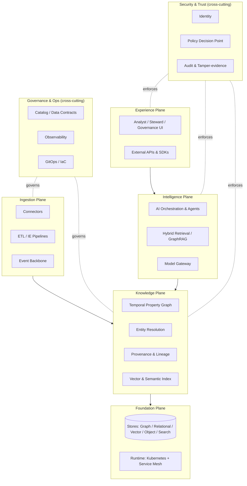
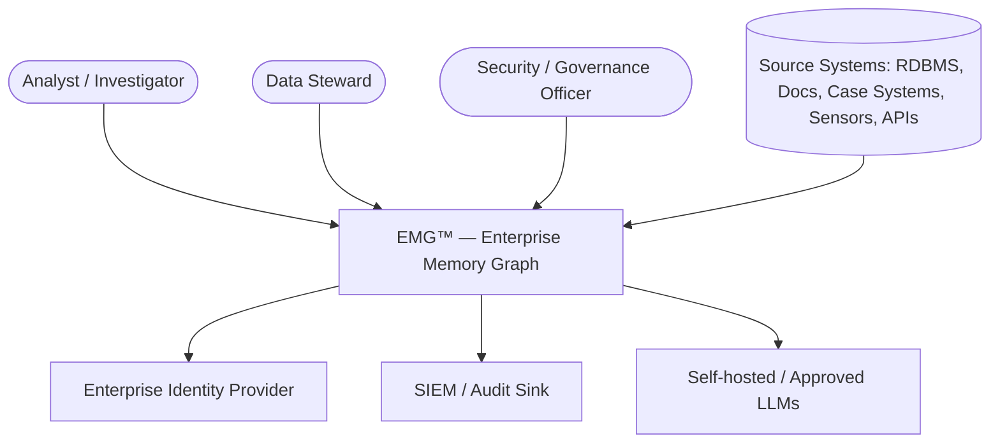
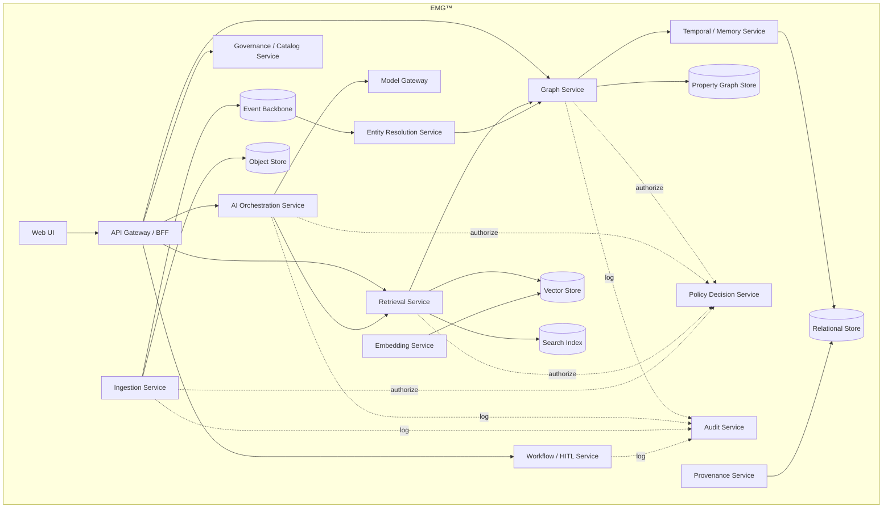
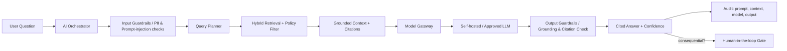
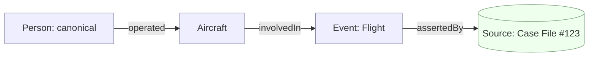
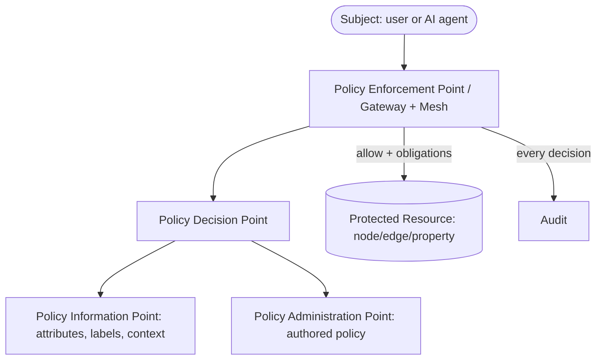
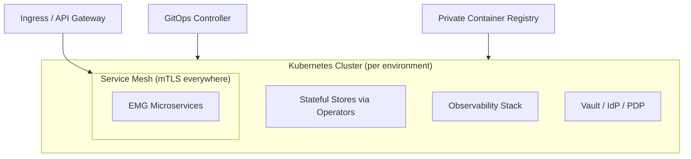

# EMG™ — Enterprise Memory Graph
## Enterprise Architecture & Implementation Package

| Field | Value |
|---|---|
| Document | Architecture Package v1.0 (Pre-Build) |
| Status | **Draft for Approval** — no code to be written until sign-off |
| Owner | CTO / Enterprise Solution Architect / AI Architect |
| Audience | Executive sponsors, security authority, data governance board, engineering leads |
| Classification | Structured for deployment up to controlled/classified environments (labeling per §22) |
| Deployment targets | Secure on-premises, private cloud, and air-gapped |

> **Note on scope of this document.** This is the design-first deliverable. It defines *what we are building and why*, *how it is structured*, and *the sequence to build it safely*. No production or placeholder code is included. Technology named below is a recommendation set with pluggable adapters so no single vendor is load-bearing; final version pinning happens at the Architecture Decision Record (ADR) stage after approval.

---

## 0. Executive Summary

EMG™ is a secure, governed, **temporal knowledge-graph platform** that serves as an organization's persistent institutional memory. It ingests structured and unstructured data from across an enterprise, resolves it into a canonical, provenance-tracked, time-versioned graph of entities, relationships, and events, and exposes that graph to **both humans and AI systems** as a single grounded, auditable source of truth.

What makes EMG different from a plain knowledge graph or a vector database is the combination of five properties, none of which is optional in the target markets:

1. **Bitemporal memory** — every fact carries *when it was true* and *when the system knew it*, enabling "as-of" reasoning and reconstruction of past states.
2. **Provenance and lineage on every fact** — each node, edge, and property is traceable to its source, transformation, and the identity/agent that asserted it.
3. **Zero-Trust security to the property level** — attribute- and label-based access control down to individual nodes, edges, and fields, suitable for classified and regulated data.
4. **AI grounded in the graph** — retrieval-augmented and agentic reasoning that cites the graph, with hallucination controls and human-in-the-loop gates for high-consequence decisions.
5. **Full auditability** — immutable, tamper-evident logs of every read, write, inference, and access decision.

Target sectors — government, defense, aviation, public safety, financial services, and large enterprises — share three constraints that drive the entire design: **regulated/classified data**, **high-consequence decisions**, and **long-lived institutional knowledge**. EMG is built for those constraints first, and for developer convenience second.

---

## 1. Product Vision

**Vision statement.**
> *EMG™ is the trusted, permanent memory of the enterprise — a living graph that remembers what happened, who said it, when it was true, and why it matters, and that lets people and AI reason over that memory safely, transparently, and with full accountability.*

**The problem.** Institutional knowledge is fragmented across databases, documents, emails, case files, sensor feeds, and people's heads. It decays, loses provenance, and cannot be safely handed to AI systems because those systems hallucinate, cannot cite sources, and cannot respect classification. Analysts re-investigate what was already known; decisions are made without the full historical context; and "who knew what, when" cannot be reconstructed for audit or accountability.

**The solution.** A governed memory graph that (a) unifies fragmented knowledge into one canonical, connected model; (b) preserves time and provenance so nothing is silently overwritten; (c) enforces access at the fact level so classified and sensitive data can coexist safely; and (d) grounds AI in that memory so answers are cited, bounded, and auditable — with humans retaining authority over consequential actions.

**Product principles.**
- **Truth is time-scoped.** Facts are never blindly overwritten; they are versioned. History is queryable.
- **Every fact has a source.** No provenance, no fact.
- **Security is not a layer, it is the substrate.** Access decisions are made per request, per fact, continuously.
- **AI proposes, humans decide** for anything consequential.
- **Explainability over cleverness.** A defensible, cited, auditable answer beats an impressive, opaque one.
- **Sovereign by default.** The platform runs fully self-hosted and air-gapped without loss of core capability.

**North-star outcomes.** Reduced time-to-insight for analysts; reconstructable decision trails for audit; safe, grounded AI assistance; and a durable knowledge asset that appreciates rather than decays.

---

## 2. Product Requirements Document (PRD)

**Primary users / personas.**
- **Analyst / Investigator** — explores the graph, asks questions, builds link charts, receives AI-assisted leads with citations.
- **Operator / Case Officer** — acts on knowledge; needs consequential-action workflows with human sign-off.
- **Data Steward** — manages ingestion, entity resolution review, data quality, retention, and classification.
- **Security / Governance Officer** — sets policies, reviews audit trails, manages access and data contracts.
- **AI Platform Engineer** — configures models, retrieval, guardrails, and evaluation.
- **Integration Engineer** — builds and maintains connectors to source systems.
- **Executive / Decision-maker** — consumes summaries and dashboards, approves high-consequence actions.

**Top jobs-to-be-done.**
1. "Given an entity (person, org, aircraft, account, event), show me everything known about it, with sources and time context."
2. "Answer my natural-language question grounded in the graph, and cite exactly where the answer came from."
3. "Show me how these two entities are connected, and how that connection changed over time."
4. "Reconstruct what we knew at a specific past date (as-of query) for audit or after-action review."
5. "Ingest a new source safely, resolve its entities against what we already know, and flag conflicts for review."
6. "Enforce that a classified fact is never returned to an unauthorized subject or AI context."
7. "Let AI propose an action; require a human with the right authority to approve it; log the whole chain."

**In scope (product).** Ingestion & connectors; entity resolution; temporal property graph; provenance/lineage; hybrid retrieval (graph + vector + keyword); grounded AI copilot and agents; policy-based access control; audit; governance/catalog; human-in-the-loop workflows; analyst UI; admin & observability.

**Out of scope (initially).** Being a system-of-record for source transactions (EMG references, it does not replace ERP/CRM/case systems); real-time streaming analytics at telemetry scale (batched/near-real-time first); autonomous action without human approval; public multi-tenant SaaS (private/single-tenant first).

**Success metrics (product KPIs).** Time-to-answer for analyst queries; % of AI answers with valid citations; entity-resolution precision/recall; % of consequential actions with complete audit chains; ingestion connector count and freshness SLA; access-decision latency (p99); zero unauthorized-disclosure incidents.

---

## 3. Functional Requirements

Grouped by capability. IDs are stable references for the roadmap and acceptance criteria.

**FR-ING — Ingestion**
- FR-ING-1: Ingest structured (RDBMS, CSV, APIs) and unstructured (documents, PDFs, email, transcripts) sources via connectors.
- FR-ING-2: Support batch, scheduled, and near-real-time (event/stream) ingestion.
- FR-ING-3: Extract entities, relationships, and events from unstructured text (NLP/IE pipeline).
- FR-ING-4: Attach source metadata (system, timestamp, operator, classification) to every ingested item.
- FR-ING-5: Quarantine and route ingestion failures and low-confidence extractions to a review queue.

**FR-ER — Entity Resolution**
- FR-ER-1: Deterministic and probabilistic matching to canonical entities.
- FR-ER-2: Human review/merge/split workflow with full reversibility (unmerge preserves history).
- FR-ER-3: Configurable matching rules per entity type and per domain.
- FR-ER-4: Maintain "same-as" and "different-from" assertions with provenance.

**FR-GR — Graph & Memory**
- FR-GR-1: Create/read/update/version nodes, edges, and properties in a property-graph model.
- FR-GR-2: Bitemporal versioning (valid-time + transaction-time) on all facts.
- FR-GR-3: "As-of" queries returning the graph state at any past point in time.
- FR-GR-4: Graph traversal, pathfinding, neighborhood, and pattern queries.
- FR-GR-5: Never hard-delete by default; support logical deletion (tombstone) with retention policy.

**FR-PROV — Provenance & Lineage**
- FR-PROV-1: Trace any fact to source system, ingestion job, transformation, and asserting identity/agent.
- FR-PROV-2: Represent conflicting assertions from different sources without silently choosing one.
- FR-PROV-3: Expose lineage graphs to users and auditors.

**FR-RET — Retrieval & Search**
- FR-RET-1: Hybrid retrieval combining graph traversal, vector similarity, and keyword search.
- FR-RET-2: Retrieval respects access policy — no unauthorized fact enters a result set or AI context.
- FR-RET-3: Return citations (node/edge IDs + source) with every retrieved answer.

**FR-AI — AI Reasoning**
- FR-AI-1: Natural-language Q&A grounded in the graph (GraphRAG) with mandatory citations.
- FR-AI-2: Agentic workflows (multi-step retrieval, summarization, hypothesis generation) with tool boundaries.
- FR-AI-3: Confidence scoring and explicit "insufficient grounded evidence" responses.
- FR-AI-4: All AI outputs recorded with prompt, retrieved context, model, and version.

**FR-SEC — Security & Access**
- FR-SEC-1: Attribute- and label-based access control (ABAC + mandatory labels) to node/edge/property granularity.
- FR-SEC-2: Every access is a policy decision (allow/deny) that is logged.
- FR-SEC-3: Redaction/masking of fields based on subject clearance and purpose.

**FR-HITL — Human-in-the-loop**
- FR-HITL-1: Route consequential actions to an approval workflow keyed to authority level.
- FR-HITL-2: Record proposal, evidence, approver identity, decision, and rationale.
- FR-HITL-3: Allow override with mandatory justification, fully audited.

**FR-GOV — Governance**
- FR-GOV-1: Data catalog with classification, ownership, retention, and data contracts.
- FR-GOV-2: Configurable retention and purge policies per data class.
- FR-GOV-3: Policy authoring, versioning, and simulation ("what would this policy change break?").

**FR-AUD — Audit**
- FR-AUD-1: Immutable, tamper-evident log of all reads, writes, inferences, and access decisions.
- FR-AUD-2: Reconstruct "who saw/asserted/decided what, when" for any entity.

**FR-UI — Experience**
- FR-UI-1: Entity profile, link-analysis canvas, timeline, and search.
- FR-UI-2: AI copilot panel with visible citations and confidence.
- FR-UI-3: Steward and governance consoles.

---

## 4. Non-Functional Requirements (NFRs)

| Category | Requirement |
|---|---|
| **Security** | Zero-Trust (NIST SP 800-207); mTLS on all service-to-service traffic; encryption at rest (AES-256) and in transit (TLS 1.3); FIPS 140-3 validated crypto option; secrets in a vault, never in code/config. |
| **Compliance readiness** | Architected to support SOC 2, ISO 27001, GDPR, and sector regimes (e.g., defense accreditation frameworks, financial regulatory audit). Data residency and sovereignty enforceable. |
| **Availability** | Core query/read path target 99.9% (private cloud); graceful degradation of AI features before core graph read fails. |
| **Performance** | Access-decision p99 < 50 ms; typical entity-profile load p95 < 1.5 s; grounded AI answer p95 < 8 s (model-dependent, self-hosted). |
| **Scalability** | Horizontal scale of stateless services; graph partitioning/sharding path defined; billions of nodes/edges as a design target (not day-one). |
| **Portability** | Runs on Kubernetes on-prem, in private cloud, and air-gapped. No hard dependency on any single cloud provider's managed services. |
| **Observability** | Full distributed tracing, metrics, structured logs; every request correlatable across services. |
| **Maintainability** | Domain-driven modular services; hexagonal architecture; contract-tested APIs; IaC for all environments. |
| **Data integrity** | No silent overwrite; bitemporal history; referential and provenance integrity enforced. |
| **Recoverability** | RPO ≤ 15 min, RTO ≤ 1 h for core stores; tested backup/restore and disaster recovery. |
| **Explainability** | Every AI answer and access decision explainable and reproducible from logs. |
| **Interoperability** | Standards-based APIs; support for standard graph/semantic exchange formats where required. |
| **Accessibility** | UI targets WCAG 2.1 AA. |

---

## 5. Enterprise Architecture

EMG is organized as five horizontal planes plus two cross-cutting planes. This separation keeps security and governance orthogonal to features, which is essential for accreditation.



**Plane responsibilities.**
- **Experience** — UIs, external APIs, SDKs. No business logic beyond presentation and orchestration calls.
- **Intelligence** — grounded AI: retrieval, orchestration/agents, model gateway. Never bypasses the security plane.
- **Knowledge** — the memory: graph, entity resolution, provenance, semantic indexes. The system's core value.
- **Ingestion** — bring data in safely, extract structure, resolve identity, attach provenance.
- **Foundation** — runtime and persistence.
- **Security & Trust** and **Governance & Ops** — cross-cutting; enforced everywhere, owned by no single feature.

---

## 6. C4 Architecture

### C4 Level 1 — System Context



### C4 Level 2 — Containers



### C4 Level 3 — Component (example: Retrieval Service)

The Retrieval Service is decomposed into: a **Query Planner** (decides graph vs. vector vs. keyword strategy), a **Policy Filter** (removes unauthorized facts *before* ranking), a set of **Retrievers** (graph traverser, vector searcher, lexical searcher), a **Fusion & Rank** component (reciprocal-rank fusion + graph-aware re-ranking), and a **Citation Assembler** (attaches source IDs). The Policy Filter sits *inside* retrieval so that no unauthorized data ever reaches ranking, the LLM context, or the response.

*(Component decompositions for Graph, Ingestion, and AI Orchestration services follow the same pattern and are detailed at the ADR stage.)*

---

## 7. Microservices Architecture

**Style.** Domain-driven microservices, event-driven where appropriate, hexagonal (ports-and-adapters) internally so stores and models are swappable. Services are independently deployable; shared kernels are limited to well-versioned contracts.

| Service | Responsibility | Sync/Async | Owns data |
|---|---|---|---|
| API Gateway / BFF | AuthN entry, routing, request shaping, rate limiting | Sync | — |
| Ingestion | Connectors, ETL, information extraction, quarantine | Async | Staging, raw objects |
| Entity Resolution | Deterministic/probabilistic matching, merge/split | Async | Match state, decisions |
| Graph | Canonical property-graph CRUD & traversal | Sync | Graph store |
| Temporal / Memory | Bitemporal versioning, as-of queries | Sync | Version tables |
| Provenance | Lineage capture and query | Async write / sync read | Lineage store |
| Embedding | Vectorization of text/entities | Async | Vector store |
| Retrieval | Hybrid retrieval + policy filtering + citations | Sync | — (reads others) |
| AI Orchestration | GraphRAG, agents, tool routing, guardrails | Sync | Session/inference logs |
| Model Gateway | Model routing, prompt/response logging, quotas | Sync | Model registry |
| Policy Decision (PDP) | Evaluate ABAC/label policies | Sync | Policy store |
| Governance / Catalog | Catalog, classification, retention, contracts | Sync | Catalog store |
| Workflow / HITL | Approval workflows, task routing | Async | Workflow state |
| Audit | Tamper-evident logging, audit queries | Async write / sync read | Audit store |
| Admin / Config | Tenants, environments, feature flags | Sync | Config store |

**Cross-service patterns.**
- **Event backbone** (log-based) for ingestion → resolution → graph, with the outbox pattern for reliable event emission and idempotent consumers.
- **Saga/orchestration** for multi-step flows (e.g., ingest → resolve → assert → index) with compensating actions.
- **PDP as a sidecar-callable service**; every data-touching service calls it (no service self-authorizes).
- **Contract-first APIs** (OpenAPI / GraphQL SDL / AsyncAPI) with consumer-driven contract tests in CI.
- **No shared database** across service boundaries; integration is via events and APIs only.

---

## 8. AI Architecture

**Design goal:** grounded, cited, bounded, auditable AI — never an ungrounded chatbot bolted onto a database.



**Key elements.**
- **Model Gateway** abstracts all model calls. Supports self-hosted open models (served via a high-throughput inference server) for air-gapped/classified use, and approved external APIs where policy permits. Enforces per-tenant quotas, logs every prompt/response, and pins model versions.
- **GraphRAG retrieval.** Retrieval fuses graph traversal (relationships, paths, neighborhoods), vector similarity (semantic recall over embedded text/entities), and lexical search. Graph structure improves precision and gives *explainable* retrieval paths, not just similar chunks.
- **Grounding contract.** The orchestrator only lets the model answer from retrieved, authorized context. If evidence is insufficient, the system returns "insufficient grounded evidence" rather than guessing.
- **Guardrails.** Input side: prompt-injection detection, PII handling, jailbreak filters. Output side: citation verification (claims must map to retrieved facts), toxicity/safety filters, schema/format validation.
- **Agentic workflows.** Multi-step agents operate within an explicit tool allow-list; every tool call is authorized by the PDP and logged. No agent performs a consequential action; it *proposes* to the HITL gate.
- **Evaluation harness.** Offline eval sets for retrieval quality, grounding/faithfulness, citation accuracy, and refusal correctness, run in CI before any model or prompt change ships.
- **No training on customer data by default.** Fine-tuning/adaptation is opt-in, governed, and never sends data outside the sovereignty boundary.

---

## 9. Knowledge Graph Architecture

**Model.** A **labeled property graph** (nodes, typed edges, properties) governed by an **ontology/schema** per domain (e.g., person, organization, aircraft, account, event, document, location). Semantic web standards (RDF/OWL) are supported for *interchange and reasoning* where required, but the operational store is a property graph for performance and developer ergonomics.

**Core constructs.**
- **Entities** (nodes) with typed properties and mandatory classification labels.
- **Relationships** (edges) that are themselves first-class, time-scoped, and provenance-bearing.
- **Assertions.** Every fact is an assertion with: value, source, asserting identity/agent, confidence, valid-time, transaction-time. Conflicting assertions coexist; the graph does not silently pick a winner.
- **Bitemporality.** *Valid-time* (when the fact was true in the world) and *transaction-time* (when EMG recorded it) enable as-of and audit reconstruction.
- **Provenance edges** link every asserted fact to its origin and lineage.



**Ontology governance.** Schema changes are versioned and reviewed by a modeling authority. New entity/relationship types require classification defaults, retention defaults, and matching rules before activation. Backward compatibility is required; migrations are additive and reversible.

**Entity resolution linkage.** ER produces `same-as`/`different-from` assertions (with provenance and confidence) rather than destructive merges, so identity decisions are reversible and auditable — critical for watchlist, KYC, and investigative use.

---

## 10. Security Architecture (Zero Trust)

**Foundation:** NIST SP 800-207. *Never trust, always verify; least privilege; assume breach.*



**Controls.**
- **Identity.** Central IdP via OIDC/SAML; short-lived tokens; workload identity for services; MFA for humans; mutual TLS between all services via the service mesh.
- **Authorization model.** ABAC (subject/resource/action/context attributes) **plus mandatory labels** (classification/compartments) for classified environments — combining discretionary and mandatory access control. Enforcement reaches **node, edge, and property granularity**.
- **PEP/PDP/PIP/PAP separation.** Enforcement points call a central decision service; policies are authored/versioned centrally; attributes and labels are supplied by information points. Services never self-authorize.
- **Data protection.** Encryption in transit (TLS 1.3) and at rest (AES-256); field-level encryption for the most sensitive properties; FIPS-validated crypto option; keys in a vault/HSM with rotation.
- **Micro-segmentation.** Default-deny network policy between namespaces/services; egress control; air-gap support with no outbound dependencies.
- **Continuous verification.** Every request re-evaluated; session/context risk considered; anomalous access flagged to SIEM.
- **Secrets.** Centralized secrets manager; no secrets in images, code, or config; automatic rotation.
- **Tamper-evidence.** Audit log is append-only and cryptographically chained (hash-linked) so alteration is detectable.
- **AI-specific.** The retrieval Policy Filter guarantees no unauthorized fact reaches an LLM context; prompt-injection and data-exfiltration guardrails; model outputs are subject to the same access obligations (redaction/masking) as direct reads.

---

## 11. Database Architecture

**Polyglot persistence** — each store chosen for its job, all self-hostable and air-gap capable. No cross-service shared database.

| Store | Purpose | Recommended (pluggable) |
|---|---|---|
| Property graph | Canonical entities/relationships, traversal | Neo4j *or* open alternative (Memgraph / Apache AGE on PostgreSQL / JanusGraph at scale) |
| Relational | Bitemporal version tables, provenance, catalog, workflow, config | PostgreSQL |
| Vector | Embeddings for semantic retrieval | Qdrant / Milvus / pgvector |
| Search | Lexical / full-text | OpenSearch |
| Object | Documents, blobs, raw ingested files | MinIO (S3-compatible) |
| Event backbone | Ingestion/resolution/index pipeline, outbox | Apache Kafka / Redpanda |
| Cache | Hot reads, session, policy decision cache | Redis/Valkey |
| Audit | Tamper-evident append-only log | PostgreSQL (hash-chained) or WORM object store |

**Bitemporal design.** Facts are stored as versioned rows/edges with `valid_from`, `valid_to`, `tx_from`, `tx_to`. Updates *close* the current version and *open* a new one; nothing is destroyed. As-of queries select the version live at a given (valid-time, transaction-time) pair. The property graph holds the current materialized view; the relational store is the system of record for full history.

**Consistency.** Strong consistency within a service's store; eventual consistency across services via events. The graph materialization is derived from committed assertions, so it is always reconstructable.

**Backup/DR.** Per-store backup with tested restore; point-in-time recovery on relational; cross-site replication for private-cloud HA; documented air-gap backup export.

---

## 12. API Architecture

**Principles.** Contract-first, versioned, secure-by-default, no unauthorized data ever crosses the boundary.

- **Edge.** A **GraphQL** API for the rich, graph-shaped read experience (entity profiles, traversals, timelines) plus **REST** for command/admin operations and integrations. A **BFF** tailors payloads to each UI.
- **Async.** **AsyncAPI**-documented events for ingestion, resolution, and audit streaming to SIEM.
- **AuthN/Z.** Every call carries a short-lived token; the gateway is the PEP; per-field authorization for GraphQL so field-level classification is respected (a query returning an unauthorized field returns a masked/denied field, not the value).
- **Contracts & versioning.** OpenAPI/GraphQL SDL/AsyncAPI checked into source; semantic versioning; consumer-driven contract tests; deprecation policy with sunset headers.
- **Resilience.** Rate limiting, quotas, timeouts, circuit breakers, idempotency keys for writes.
- **SDKs.** Generated typed clients from contracts; no hand-drift.

---

## 13. Deployment Architecture

**Target substrate:** Kubernetes, identical across on-prem, private cloud, and air-gapped, differing only in configuration and network posture.



- **Environments.** Dev → Test → Staging → Production, plus an isolated **air-gapped** profile.
- **Air-gap.** All images, charts, and models pulled through a private registry/mirror; zero outbound internet dependency; offline model serving.
- **HA.** Multi-replica stateless services; stateful stores via operators with replication; multi-AZ/multi-node in private cloud.
- **Isolation.** Namespace-per-domain; default-deny network policies; separate node pools for AI/GPU workloads.
- **Config.** Environment-specific config and secrets injected at runtime; no environment-specific images.
- **Data residency.** Deployable wholly within a sovereignty boundary.

---

## 14. DevOps Architecture

- **GitOps.** Declarative desired state in Git; a controller reconciles clusters. All infrastructure is code (Terraform) and all runtime config is Helm/Kustomize.
- **CI/CD.** Build → unit/contract/integration tests → SAST/DAST/dependency & container scanning → SBOM generation → sign artifacts → deploy to progressively higher environments with gates. AI changes additionally run the evaluation harness (§8).
- **Supply-chain security.** Signed images, SBOMs, provenance attestation, pinned dependencies, private registry only; base images hardened and minimal.
- **Progressive delivery.** Canary/blue-green with automated rollback on SLO/eval regression.
- **Secrets & policy as code.** Vault-managed secrets; access policy (§10) and network policy stored, reviewed, and versioned like code, with policy simulation before merge.
- **Observability by default.** OpenTelemetry tracing; metrics; structured logs; SLOs and error budgets; alerting; every request correlatable end-to-end.
- **Air-gap pipeline.** A promotion path that exports signed, scanned bundles for import into the disconnected environment.

---

## 15. Folder Structure

A monorepo with clear service and shared boundaries (polyrepo is a later option once teams scale). *Structure only — no code.*

```
emg/
├─ README.md
├─ docs/
│  ├─ architecture/            # this package, ADRs, C4 diagrams
│  ├─ security/                # threat models, Zero-Trust policies
│  ├─ governance/              # data contracts, retention, RAI
│  └─ api/                     # OpenAPI / GraphQL SDL / AsyncAPI
├─ contracts/                  # shared API & event schemas (source of truth)
├─ services/
│  ├─ api-gateway/
│  ├─ ingestion/
│  ├─ entity-resolution/
│  ├─ graph/
│  ├─ temporal-memory/
│  ├─ provenance/
│  ├─ embedding/
│  ├─ retrieval/
│  ├─ ai-orchestration/
│  ├─ model-gateway/
│  ├─ policy-decision/
│  ├─ governance-catalog/
│  ├─ workflow-hitl/
│  ├─ audit/
│  └─ admin-config/
│     └─ (each service: src/ tests/ Dockerfile helm/ contract/ README)
├─ web/                        # analyst / steward / governance UI
├─ libs/                       # shared internal libraries (auth client, telemetry, schema)
├─ deploy/
│  ├─ terraform/               # infra as code
│  ├─ helm/                    # per-service charts + umbrella chart
│  ├─ gitops/                  # environment overlays (dev/test/stg/prod/airgap)
│  └─ policies/                # OPA/network policies as code
├─ ml/
│  ├─ pipelines/               # ingestion IE, embedding, ER models
│  ├─ eval/                    # RAI & retrieval evaluation harness
│  └─ model-registry/          # model cards, versions, approvals
├─ tools/                      # dev tooling, generators, local stack
└─ .ci/                        # pipeline definitions, scanners, SBOM
```

**Per-service internal layout** follows hexagonal architecture: `domain/` (entities, rules) · `application/` (use-cases/ports) · `adapters/` (inbound APIs, outbound stores/clients) · `config/` · `tests/`.

---

## 16. Development Roadmap

| Phase | Duration (indicative) | Theme | Exit criterion |
|---|---|---|---|
| **P0 — Foundations** | 4–6 wks | Repo, contracts, IaC, IdP, PDP skeleton, observability, local stack | A "walking skeleton": one request flows through gateway → service → store with auth + audit + tracing |
| **P1 — Lab Prototype v1** | 6–8 wks | Core graph + ingest one source + basic retrieval + grounded Q&A (single tenant, self-hosted model) | Meets §25 acceptance criteria |
| **P2 — MVP** | 3–4 mo | Bitemporal memory, entity resolution + review, provenance, ABAC to property level, HITL workflow, analyst UI, audit | Pilot-ready for one real use case in a controlled environment |
| **P3 — Hardening / Accreditation** | 3–4 mo | Air-gap profile, full Zero-Trust, DR, pen-test, RAI eval gates, governance console, security accreditation | Passes security review + DR test; accreditation package complete |
| **P4 — Production GA** | ongoing | Scale (sharding), more connectors, agent workflows, multi-tenant isolation, SLOs | Production scope (§19) met and operated to SLO |

---

## 17. Lab Prototype v1 Scope

**Goal:** prove the *core loop* end-to-end on a small scale, single tenant, with security and provenance present (thin but real), not stubbed.

**In.** One structured + one document connector; basic information extraction; property graph with provenance and (simplified) valid-time; embeddings + hybrid retrieval; grounded Q&A with citations via a self-hosted model; coarse ABAC (role + one classification label); append-only audit; minimal analyst UI (search, entity profile, copilot with citations).

**Out (deferred).** Full bitemporality; probabilistic entity resolution UI; property-level masking; agentic workflows; DR; multi-tenant; sharding; air-gap packaging.

**Why this scope.** It validates the riskiest assumptions early — that graph-grounded AI produces cited, defensible answers, and that access control and provenance can be present from the first line rather than retrofitted.

---

## 18. MVP Scope

Everything in v1, promoted to production-grade, plus: full **bitemporal** memory and as-of queries; **entity resolution** with human review/merge/split (reversible); **provenance/lineage** UI; **ABAC + labels to node/edge/property** granularity with redaction; **human-in-the-loop** approval workflow for consequential actions; **governance/catalog** with classification and retention; **tamper-evident audit** with reconstruction; hardened analyst + steward + governance UIs; observability and SLOs; backup/restore. Single tenant, private-cloud deployable, pilot-ready for one real regulated use case.

---

## 19. Production Scope

MVP plus: **air-gapped** deployment profile; full **Zero-Trust** posture and security accreditation package; **DR** (RPO/RTO met and tested); **horizontal scale** (graph partitioning/sharding path implemented); **agentic AI** workflows within tool allow-lists and HITL gates; **RAI evaluation gates** in CI; **multi-tenant isolation** where required; a **connector framework** with several production connectors; supply-chain security (signing, SBOM, attestation); documented runbooks and 24/7 operability; formal data governance operating model in production.

---

## 20. Key Assumptions and Constraints

**Assumptions.**
- Customers require **sovereign, self-hostable** deployment; cloud-managed convenience services cannot be assumed.
- Self-hosted open LLMs of sufficient quality are available for on-prem/air-gapped use.
- An enterprise **IdP** exists to federate with.
- Source systems remain the systems-of-record; EMG references and links, it does not replace them.
- Domain **ontologies** will be co-developed with each customer's subject-matter experts.
- High-consequence actions **require human authority** by policy and often by law/regulation.

**Constraints.**
- Regulated/classified data ⇒ security and audit are non-negotiable and gate every feature.
- Air-gap ⇒ no runtime dependency on external services or model APIs in that profile.
- Accreditation timelines are long; architecture must front-load auditability and least privilege.
- Data cannot leave the sovereignty boundary; no training on customer data by default.
- Performance budgets (§4) must hold with security enforcement *in the path*, not bypassed.

---

## 21. Major Technical Risks and Mitigations

| # | Risk | Impact | Mitigation |
|---|---|---|---|
| R1 | AI hallucination / ungrounded answers | Loss of trust; wrong decisions | Strict grounding contract, citation verification, "insufficient evidence" responses, RAI eval gates, HITL for consequences |
| R2 | Unauthorized disclosure of classified facts | Catastrophic | Policy Filter inside retrieval; property-level ABAC+labels; PEP/PDP separation; red-team + pen-test; default-deny |
| R3 | Prompt injection / data exfiltration via AI | Breach | Input/output guardrails; tool allow-lists; agents cannot act; egress control; treat all retrieved content as data, not instructions |
| R4 | Entity-resolution errors (false merges) | Wrong identity conclusions | Reversible assertions (no destructive merge); human review of low-confidence matches; precision/recall monitoring |
| R5 | Graph scale/performance | Slow queries at billions of edges | Partitioning/sharding path; caching; query planning; materialized current view separate from full history |
| R6 | Bitemporal complexity | Bugs, confusion | Encapsulate in Temporal service; rigorous tests; as-of query test suite; keep model consistent across services |
| R7 | Vendor/tech lock-in | Portability loss | Hexagonal adapters; open, self-hostable defaults; contracts abstract stores/models |
| R8 | Air-gap operability gaps | Cannot deploy where needed | Air-gap profile as a first-class environment from P3; offline model serving; private registry/mirror |
| R9 | Accreditation delay | Blocked go-live | Front-load security controls, threat models, and audit from P0; produce accreditation artifacts continuously |
| R10 | Scope creep | Never ships | Phased scopes (§17–19) with hard exit criteria; ADR discipline |

---

## 22. Data Governance Model

Aligned to established data-management practice (catalog, quality, lineage, stewardship, retention).

- **Catalog & ownership.** Every data source, entity type, and dataset has an owner, a steward, a purpose, and a data contract defining schema, quality, freshness, and classification.
- **Classification & labeling.** Mandatory classification/compartment labels on all data, applied at ingestion and inherited by derived facts; labels drive access (§10) and retrieval filtering.
- **Lineage.** End-to-end lineage from source → transformation → assertion → answer (via §9 provenance), queryable by stewards and auditors.
- **Quality.** Automated checks at ingestion; low-quality/low-confidence data quarantined for review.
- **Retention & purge.** Per-class retention schedules; logical deletion by default; hard purge only via governed, audited process (respecting legal hold).
- **Data contracts & change control.** Schema/ontology changes are versioned, reviewed, and backward-compatible.
- **Privacy.** Data protection impact assessments for personal data; minimization; purpose limitation; masking/redaction as an access obligation.
- **Roles.** Data owner (accountable), steward (operational), governance officer (policy), consumer (least-privilege access).

---

## 23. Responsible AI Controls

- **Grounding & citation.** No ungrounded claims; every AI assertion cites graph facts; unverifiable claims are suppressed.
- **Model governance.** Model registry with **model cards**, approved-model list, version pinning, and a change-approval board; no unreviewed model reaches production.
- **Evaluation & red-teaming.** Pre-deployment eval for faithfulness, citation accuracy, refusal correctness, bias, and safety; adversarial red-teaming for injection and leakage; results gate release.
- **Bias & fairness.** Testing for disparate behavior across sensitive attributes where relevant to the use case; documented limitations.
- **Transparency.** Users see confidence, citations, and "AI-generated" labeling; the system explains why it could not answer.
- **Boundaries.** Tool allow-lists; agents cannot perform consequential actions; all AI I/O logged and reproducible.
- **Data protection in AI.** No customer-data training by default; retrieved context respects classification and masking; PII handling governed.
- **Accountability.** A named owner for the AI subsystem; incident process for AI failures; continuous monitoring of grounding and refusal rates in production.

---

## 24. Human-in-the-Loop Decision Model

**Principle:** AI *proposes*, a suitably authorized human *decides*, for anything consequential. Automation is permitted only for low-consequence, reversible, well-bounded actions — and even then is logged and reviewable.

**Decision tiers.**

| Tier | Examples | Automation | Human role |
|---|---|---|---|
| T0 — Informational | Answer a query, summarize, surface a link | Auto (with citations) | Consumes; can flag |
| T1 — Low-consequence, reversible | Tag an entity, propose a match | Auto-suggest | One-click accept/reject |
| T2 — Significant, reversible | Merge entities, publish an assessment | Proposed only | Reviewer approval required |
| T3 — High-consequence / irreversible | Actions affecting people, safety, funds, operations | **Never automated** | Authorized approver + recorded rationale; often dual control |

**Workflow.** Proposal (with evidence, confidence, citations) → routed by tier and authority level → approver reviews evidence in context → approve / reject / override-with-justification → action executed by the human-authorized path → full chain (proposal, evidence, identities, decision, rationale, timestamps) written to tamper-evident audit. **Override** is always available to authorized humans and is always audited. Confidence thresholds are configurable per action type and per domain.

---

## 25. Prototype Acceptance Criteria (Lab v1)

The Lab Prototype v1 is accepted when **all** of the following are demonstrated on a representative small dataset:

1. **Ingest.** At least one structured and one document source are ingested; entities/relationships appear in the graph with attached source provenance. *(FR-ING, FR-PROV)*
2. **Graph.** Entities and relationships are queryable; an entity profile shows connected facts with sources. *(FR-GR-1/4)*
3. **Temporal (basic).** At least valid-time is recorded and a simple as-of query returns the correct historical value. *(FR-GR-2/3, simplified)*
4. **Retrieval.** Hybrid retrieval (graph + vector + keyword) returns relevant, ranked results. *(FR-RET-1)*
5. **Grounded AI.** A natural-language question is answered **only** from retrieved graph facts, with **visible citations**; when evidence is insufficient, the system says so instead of guessing. *(FR-AI-1/3)*
6. **Access control.** A user without clearance for a labeled fact **cannot** retrieve it, and it **does not** enter the AI context; the denial is logged. *(FR-SEC-1/2, FR-RET-2)*
7. **Audit.** Every read, assertion, and AI answer is recorded and reconstructable for a chosen entity. *(FR-AUD-1/2)*
8. **Explainability.** For a sample answer, the exact source facts and the retrieval path can be shown. *(FR-AI-4, FR-PROV-3)*
9. **Deployment.** The whole prototype runs on Kubernetes from IaC with mTLS between services and a self-hosted model. *(NFR: portability, security)*
10. **No unauthorized egress.** With external network blocked, the prototype still answers grounded questions (self-hosted model path works). *(Air-gap readiness signal)*

Acceptance is **binary per criterion**; partial credit is not accepted for security (6, 10) and grounding (5, 8).

---

## 26. Recommended Implementation Sequence

The order is chosen to make security, provenance, and grounding structural rather than retrofitted, and to retire the biggest risks first.

1. **Walking skeleton first (P0).** Gateway → one service → one store, with IdP auth, a PDP call, audit logging, and tracing already in the path. This proves the security/observability spine before any feature.
2. **Provenance and audit before features.** Stand up the provenance and audit services early so every subsequent fact and action is traceable from day one.
3. **Graph + one ingestion path.** Get real data into the property graph with provenance attached.
4. **Retrieval + grounded AI (the core value).** Prove graph-grounded, cited answers — the central bet — on a small scale (Lab v1, §17/§25).
5. **Access control to the fact level.** Introduce ABAC + labels and the retrieval Policy Filter; verify no unauthorized fact leaks to users or AI.
6. **Bitemporality + entity resolution (MVP).** Add full time-versioning and reversible identity resolution with human review.
7. **Human-in-the-loop + governance (MVP).** Approval workflows, catalog, classification, retention.
8. **Hardening + air-gap + DR + accreditation (P3).** Turn the pilot into an accreditable, recoverable, sovereign system.
9. **Scale + agents + connector framework (P4/GA).** Sharding, agentic workflows within HITL gates, breadth of connectors, multi-tenant isolation, SLO operations.

**Guiding rule for the whole build:** any feature that touches data must pass through authorization and land in the audit trail *before* it is considered done. Grounding, provenance, and least privilege are acceptance conditions, not later phases.

---

## Approval Gate

This completes the architecture package (sections 1–26). **No code has been written and none will be until this is approved.** On approval, the recommended next step is to convert the key decisions in this document into individual **Architecture Decision Records (ADRs)** — pinning specific technology versions, the graph store, the model-serving stack, and the authorization engine — and then to begin **P0 (the walking skeleton)**.

Please review and indicate: (a) approval to proceed, (b) any changes to scope, technology preferences, or constraints (especially target deployment profile and any mandated compliance regime), and (c) which real use case should anchor the MVP pilot.
