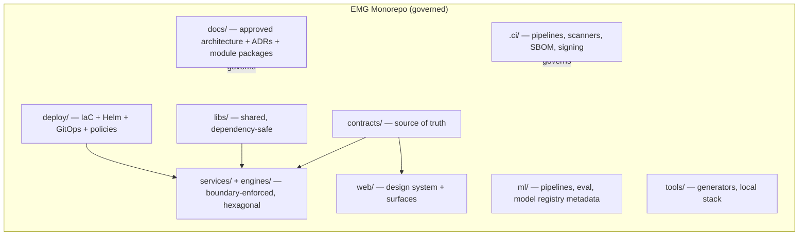
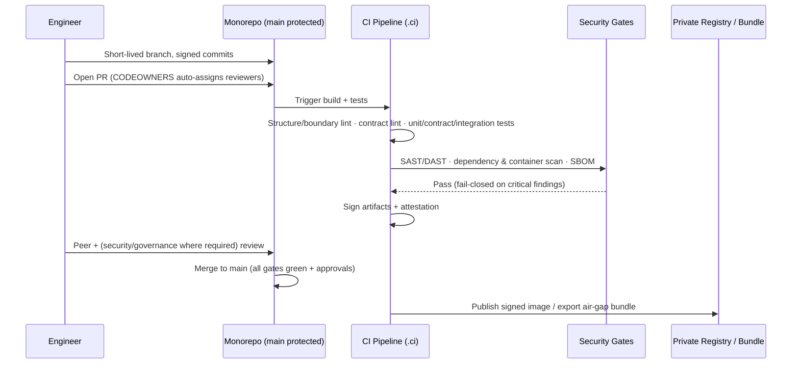
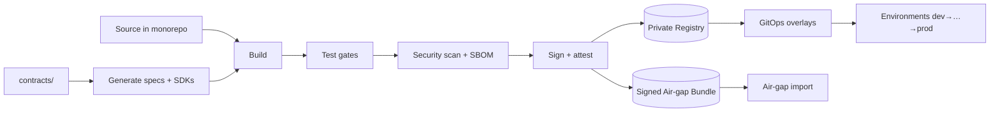

# EMG™ — Module 1: Repository Structure
### Pre-Implementation Design Package · For Approval

| Field | Value |
|---|---|
| Module | 1 of 34 — Repository Structure |
| Phase | Implementation (design-before-code gate) |
| Status | **Awaiting approval — no code generated yet** |
| Authoritative references | EA v2.0 · SAD v1.0 (esp. §7, §13–15, §18) · EDA v1.0 · API v1.0 · Zero-Trust (EA Ch. 39 / SAD §11) · UX v1.0 |
| Rule of engagement | This module **realizes** the approved architecture; it introduces **no new architectural decisions**. Any gap is raised as an ADR, not decided here. |

> **Workflow note.** Your template requests Sequence Diagram, Data Flow, and API Contracts for every module. A repository is not a runtime component, so for this module those three are honestly **mapped to their repository-level equivalents**: the *contribution & CI/CD sequence*, the *source→artifact→deploy data flow*, and *how API contracts are organized and governed in the repo*. This is called out explicitly rather than inventing runtime content that does not exist for a repo.

---

## 1. Purpose

Establish the **single, governed monorepo** that will hold every EMG artifact — services, engines, shared libraries, web surfaces, contracts, infrastructure-as-code, ML assets, and documentation — with **enforced module boundaries, clear ownership, contract-first discipline, supply-chain security, and air-gap-ready promotion** from the very first commit.

The repository is not a convenience; it is the **control plane for engineering governance**. It is where the approved architecture becomes enforceable: boundaries that the SAD mandates (no cross-service DB access, hexagonal internals, contract-first APIs) are made structurally difficult to violate, and where Zero-Trust, auditability, and provenance start — in the supply chain — before a single service runs.

---

## 2. Functional Description

The repository provides:
- A **deterministic place** for every kind of artifact, so multiple delivery teams work in parallel without ambiguity (SAD §1, §7).
- **Enforced boundaries** between services/engines (a service may not import another service's internals or reach its database — SAD §3).
- **Contract-first source of truth** (`contracts/`) from which OpenAPI/GraphQL SDL/AsyncAPI and typed SDKs are generated (API §39, SAD §12).
- **Ownership mapping** (CODEOWNERS) so each module has exactly one accountable delivery team (EDA §12 governance roles).
- **Supply-chain security by default**: signed commits, protected branches, dependency pinning, SBOM, artifact signing, scanning (SAD §14, §18).
- **Air-gap promotion**: a defined path to export signed, scanned bundles for disconnected environments (SAD §13, §14).
- **Infrastructure and GitOps as code** (`deploy/`) so environments are reproducible (SAD §13–14).

The repository does **not** contain: secrets, real classified/customer data, generated build artifacts, or environment-specific credentials.

---

## 3. Architecture (Repository Architecture)

**Decision (from SAD §15, honored, not changed): monorepo now; polyrepo remains a future option once teams scale.** Rationale: at this stage a monorepo maximizes shared-contract consistency, atomic cross-cutting changes, and unified governance — which matter more than team autonomy early on.

**Structural principles:**
1. **Boundary-enforced.** Each service/engine is a self-contained unit with a hexagonal internal layout (`domain/ application/ adapters/ config/ tests/`, SAD §4). Cross-boundary imports are blocked by tooling; integration is only via `contracts/` (APIs/events).
2. **Contract-first.** `contracts/` is the source of truth; specs and SDKs are generated from it and drift is caught in CI (API §39).
3. **Ownership-explicit.** Every path maps to an owning team via CODEOWNERS; no unowned code.
4. **Layered dependency rule.** `libs/` (shared) → may be used by services/engines; services/engines → never depend on each other's code; `web/` → depends only on `contracts/`-generated clients.
5. **IaC + GitOps.** All infra and runtime config declarative in `deploy/`; nothing provisioned by hand.
6. **Secure supply chain.** Signed commits, protected `main`, pinned dependencies, SBOM, artifact signing, scanners — enforced in `.ci/`.
7. **Air-gap first-class.** A promotion path produces signed, scanned bundles importable into disconnected environments.
8. **Docs live with code.** The approved architecture set and per-module packages live in `docs/`, versioned with the code they govern.



---

## 4. Folder Structure

Elaborates SAD §15 to the concrete service/engine set (SAD §3) and UX surfaces (UX §8), **without changing** the approved top-level layout.

```
emg/
├─ README.md                      # entry point, how to navigate, links to docs/
├─ CODEOWNERS                     # path → owning team (100% coverage required)
├─ CONTRIBUTING.md                # trunk-based flow, signed commits, review rules
├─ SECURITY.md                    # vuln reporting, supply-chain policy
├─ .gitignore / .gitattributes    # never commit secrets/artifacts; enforce LF, etc.
│
├─ docs/
│  ├─ architecture/               # the 6 approved docs (read-only source of truth)
│  ├─ adr/                        # Architecture Decision Records (ADR-001…)
│  ├─ modules/                    # per-module pre-implementation packages (this file lives here)
│  ├─ security/                   # threat models, Zero-Trust policy notes
│  ├─ governance/                 # data contracts, retention, RAI notes
│  └─ runbooks/                   # operational runbooks (grow per module)
│
├─ contracts/                     # SOURCE OF TRUTH for all interfaces
│  ├─ rest/                       # OpenAPI specs (generated + governed)
│  ├─ graphql/                    # GraphQL SDL (ontology-derived)
│  ├─ events/                     # AsyncAPI event schemas (emg.<domain>.<event>)
│  └─ shared/                     # shared components: error object, paging, classification, citation
│
├─ libs/                          # shared internal libraries (dependency-safe)
│  ├─ auth-client/                # token verification, subject-context propagation
│  ├─ pdp-client/                 # authorization calls (no self-authorization)
│  ├─ telemetry/                  # OpenTelemetry tracing/metrics/logging conventions
│  ├─ audit-client/              # hash-chained audit emission helpers
│  ├─ contracts-sdk/             # generated typed clients from contracts/
│  ├─ classification/            # label-set handling, high-water-mark rules
│  └─ common/                     # ULID, time (UTC ISO-8601), errors (RFC 7807), types
│
├─ services/                      # core platform services (hexagonal each)
│  ├─ api-gateway/                # PEP: authN, routing, per-field authZ delegation
│  ├─ identity-svc/               # federation, tokens, workload/agent identity
│  ├─ policy-decision-svc/        # PDP (RBAC+ABAC+labels)
│  ├─ policy-svc/                 # policy authoring/versioning/simulation
│  ├─ audit-svc/                  # immutable hash-chained audit
│  ├─ config-svc/                 # central config, thresholds, charters
│  ├─ admin-svc/                  # tenants, users↔roles, feature flags
│  ├─ ingestion-svc/              # connectors, ETL, IE, quarantine
│  ├─ data-fabric-svc/            # virtualization, metadata, MDM, quality, lineage
│  ├─ entity-resolution-svc/      # reversible matching/merge/split
│  ├─ graph-svc/                  # property-graph CRUD/traversal
│  ├─ memory-svc/                 # bitemporal versioning, as-of
│  ├─ provenance-svc/             # lineage capture/query
│  ├─ embedding-svc/              # vectorization lifecycle
│  ├─ retrieval-svc/              # hybrid retrieval + policy filter + citations
│  ├─ model-gateway/              # model routing, logging, quotas, pinning
│  ├─ workflow-svc/               # HITL approvals, task routing
│  ├─ notification-svc/           # notifications/alerts delivery
│  ├─ reporting-svc/              # report/brief drafts
│  └─ integration-gateway/        # owner-authorized connector ingress (Zero-Trust)
│
├─ engines/                       # intelligence engines (hexagonal each)
│  ├─ ai-orchestrator/            # GraphRAG, guardrails, grounding contract
│  ├─ agent-runtime/              # single-agent execution under charter
│  ├─ agent-orchestrator/         # mission routing, SoD, arbitration
│  ├─ brain/                      # cross-domain reasoning, institutional learning
│  ├─ decision/                   # Decision Records, scoring, quality
│  ├─ replay/                     # as-of decision reconstruction
│  ├─ predictive/                 # calibrated predictions + uncertainty
│  ├─ simulation/                 # scenario/crisis/mission simulation (async)
│  ├─ twin/                       # digital-twin projections
│  ├─ risk/                       # risk register, exposure, mitigations
│  ├─ investigation/              # cases, hypotheses, evidence
│  └─ knowledge/                  # knowledge products, lessons, fabric flow
│
├─ bff/                           # backends-for-frontend (read-optimized composition)
│  ├─ copilot-bff/
│  └─ command-center-bff/
│
├─ web/                           # frontend (design system + surfaces; UX v1.0)
│  ├─ design-system/              # tokens + signature components (classification chip,
│  │                              #   confidence indicator, citation reference,
│  │                              #   provenance viewer, HITL card, restricted marker)
│  ├─ shell/                      # app shell: rail, global bar, classification banner
│  ├─ surfaces/                   # executive-dashboard, graph-explorer, timeline,
│  │                              #   replay, investigation, risk-center, command-center,
│  │                              #   copilot, search, notifications, admin, agent-mgmt
│  └─ clients/                    # generated API clients (from contracts/)
│
├─ ml/                            # AI/ML assets (no customer-data training by default)
│  ├─ pipelines/                  # IE, embedding, ER model pipelines
│  ├─ eval/                       # RAI eval harness (grounding, citation, refusal, bias, calibration)
│  └─ model-registry/             # model cards, versions, approvals (metadata only)
│
├─ deploy/                        # infrastructure & delivery as code
│  ├─ terraform/                  # infra provisioning
│  ├─ helm/                       # per-service charts + umbrella chart
│  ├─ gitops/                     # env overlays: dev/test/lab/staging/prod/airgap
│  └─ policies/                   # OPA/network policies as code (default-deny)
│
├─ tools/                         # engineering tooling
│  ├─ generators/                 # contract→SDK/spec generation, module scaffolder
│  ├─ local-stack/                # local dev environment (Module 2 will populate)
│  └─ lint/                       # structure/boundary/contract linters
│
└─ .ci/                           # pipelines, scanners, SBOM, signing, promotion
   ├─ pipelines/                  # build→test→scan→SBOM→sign→deploy stages
   ├─ security/                   # SAST/DAST/dependency & container scan configs
   └─ airgap/                     # signed, scanned bundle export/import
```

**Per service/engine internal layout (mandatory, from SAD §4):**
```
<service>/
├─ README.md          # purpose, contracts, runbook
├─ domain/            # entities, invariants (no framework/adapter leakage)
├─ application/       # use-cases / ports
├─ adapters/          # inbound (API/event) + outbound (stores/clients)
├─ config/            # config schema (values injected at runtime)
├─ contract/          # this service's slice of contracts/ (references, tests)
├─ tests/             # unit / contract / integration
└─ helm/              # service chart (references deploy/helm conventions)
```

---

## 5. Sequence Diagram *(repository-level: contribution & CI/CD)*



**Rules realized:** trunk-based, signed commits, protected `main`, CODEOWNERS review, fail-closed security gates, no merge on lint/test/scan failure (SAD §18).

---

## 6. Data Flow *(repository-level: source → artifact → deploy)*



**Guarantees:** contracts drive generation (no hand-drift); nothing reaches an environment without passing tests + scans + signing; the air-gap path is a first-class output, not an afterthought.

---

## 7. API Contracts *(repository-level: how contracts are organized & governed)*

This module does not define runtime APIs; it defines **where contracts live and how they are governed** (API §38–39):
- `contracts/` is the **single source of truth**: `rest/` (OpenAPI), `graphql/` (SDL, ontology-derived), `events/` (AsyncAPI, `emg.<domain>.<event>`), `shared/` (error object per RFC 7807, paging meta, classification, citation — defined once, referenced everywhere).
- Specs and typed SDKs are **generated** into `libs/contracts-sdk/` and `web/clients/`; CI fails on drift between code and contract.
- Every contract has an **owner** (CODEOWNERS) and is **linted** against the API standards in CI.
- **Consumer-driven contract tests** live with consuming services and gate releases.
- **Versioning**: additive within a major; breaking changes require a new major + migration window (API §17).

---

## 8. Security Considerations

Realizing Zero-Trust / Secure-by-Design at the supply-chain layer (SAD §11, §14, §18; EDA §11–12):
- **No secrets in the repo** — enforced by pre-commit + CI secret scanning; secrets live in the vault (referenced, never stored). `.gitignore`/`.gitattributes` block credential files.
- **No real classified/customer data** in the repo — only synthetic, clearly-labeled fixtures, and only where explicitly permitted.
- **Signed commits + protected `main`** — linear history, required reviews, no force-push.
- **CODEOWNERS 100% coverage** — every path owned; security-sensitive paths (`services/policy-decision-svc`, `services/identity-svc`, `services/audit-svc`, `deploy/policies`, `contracts/shared`) require security-architect review.
- **Supply-chain integrity** — pinned dependencies, SBOM per build, artifact signing + provenance attestation, private registry/mirror only.
- **Scanning gates** — SAST, DAST, dependency and container scanning; **fail-closed on critical findings**.
- **Two-person rule** for changes to security-critical paths and CI/CD configuration.
- **Air-gap discipline** — no build step requires public internet at runtime; all external fetches occur only through the approved mirror.
- **Least privilege in CI** — pipeline credentials scoped and short-lived; no standing broad tokens.

---

## 9. Testing Strategy

For Module 1 the "system under test" is the **repository governance itself** (SAD §18):
- **Structure/boundary lint** — verifies the mandated layout exists and that no service/engine imports another's internals or DB (a boundary violation fails CI).
- **CODEOWNERS coverage test** — fails if any path is unowned.
- **Contract lint** — `contracts/` validates against the API standards; shared components resolve.
- **Secret scan** — fails on any detected secret.
- **CI-config self-test** — pipelines lint clean; required gates (test, scan, SBOM, sign) are present and non-bypassable.
- **Dependency policy test** — dependencies are pinned; disallowed/unlicensed packages fail.
- **Air-gap dry-run** — a scaffold build completes with public internet blocked (using the mirror), proving air-gap readiness of the toolchain.
- **Bootstrap smoke** — the scaffolder generates a throwaway sample service that satisfies structure + contract lint (proves the template is correct) — the sample is not committed.

These become the **baseline CI gates** every later module inherits.

---

## 10. Acceptance Criteria (measurable)

| # | Criterion | Pass condition |
|---|---|---|
| AC-1 | Approved top-level layout present | `docs/ contracts/ libs/ services/ engines/ bff/ web/ ml/ deploy/ tools/ .ci/` exist and match SAD §15 (no deviation) |
| AC-2 | Ownership complete | CODEOWNERS covers 100% of paths; security-critical paths require security review |
| AC-3 | Contract source of truth | `contracts/{rest,graphql,events,shared}` present; shared error/paging/classification/citation defined once |
| AC-4 | Boundary enforcement active | Cross-service internal import or DB access fails the boundary lint (verified by a deliberate negative test) |
| AC-5 | Per-service template | Hexagonal layout (`domain/application/adapters/config/contract/tests`) enforced by scaffolder + lint |
| AC-6 | No secrets / no real sensitive data | Secret scan clean; only labeled synthetic fixtures where permitted |
| AC-7 | Supply-chain gates | Signed commits + protected main + pinned deps + SBOM + artifact signing all enforced; critical scan findings fail-closed |
| AC-8 | Air-gap readiness | Scaffold build succeeds with public internet blocked via mirror; signed bundle export path defined |
| AC-9 | Environments as code | `deploy/gitops` overlays for dev/test/lab/staging/prod/**airgap** present; `deploy/policies` default-deny present |
| AC-10 | Docs governed with code | The six approved documents + ADR folder + module packages present under `docs/` (read-only source of truth) |
| AC-11 | CI self-test green | Structure, CODEOWNERS, contract, secret, dependency, and air-gap dry-run checks all pass in CI |

Security (AC-4, AC-6, AC-7, AC-8) and ownership (AC-2) criteria accept **no partial credit**.

---

## Approval Gate

This is the complete pre-implementation package for **Module 1 — Repository Structure**, aligned to and not modifying the approved architecture.

**No code or scaffold files have been generated.** On your approval I will generate the production-quality repository scaffold that satisfies AC-1…AC-11 (the actual `README`, `CODEOWNERS`, `CONTRIBUTING`, `.gitignore`, contract folder skeletons with shared components, per-service template, `.ci` pipeline definitions with the gates above, `deploy/` overlays including the air-gap profile, and the structure/boundary/contract linters) — then stop again and **not proceed to Module 2 (Development Environment) until Module 1 is reviewed and approved.**

Please confirm one of:
1. **Approve** — generate the Module 1 scaffold as specified; or
2. **Adjust** — tell me what to change (e.g., monorepo vs polyrepo preference, tooling/language conventions to pin as ADRs, ownership/team mapping), and I will revise this package before any code.

A useful decision to make now, because it unblocks the scaffold: the **primary language/runtime conventions per tier** (backend services, engines, web) — I would capture these as ADRs (per SAD Appendix B) rather than assume them, so the scaffold's linters and templates are correct from the first commit.
