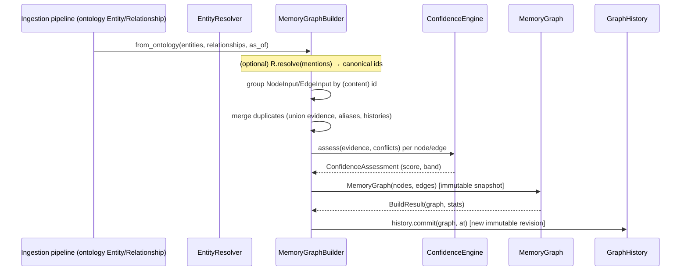
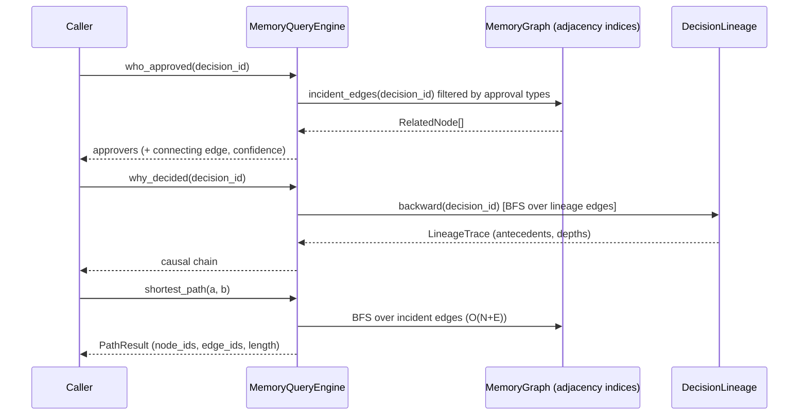

# Enterprise Memory Graph — Architecture (EPIC-05 / FEAT-05-6)

## Purpose

The Enterprise Memory Graph (EMG) Core Engine turns the structured knowledge
objects produced by earlier sprints — ontology entities/relationships from the
ingestion pipeline, version chains from the lifecycle library — into a
**persistent, temporal, evidence-linked, versioned graph** of entities,
relationships, evidence, observations and decisions. This "connected memory" is
what differentiates EMG from document stores, knowledge bases and RAG pipelines:
every assertion is traceable to evidence, every fact is time-aware and never
overwritten, and the whole graph is versioned and queryable.

Delivered **library-first** as `libs/python/emg-memory-graph`: deterministic,
immutable, storage-independent. **No** machine learning, networking, persistence
engine, scheduler, or UI (those are explicit non-goals / future sprints).

## Design principles

- **Deterministic.** Graph construction is a pure function of its inputs.
  Identifiers are content-addressed (SHA-256 of content) — no clocks, no
  counters — so the same inputs yield the same graph, and the same evidence
  deduplicates, on any machine.
- **Immutable.** Every model is a frozen pydantic v2 model
  (`ConfigDict(frozen=True, extra="forbid")`). "Mutation" produces a new
  snapshot (builder/versioning), never an in-place change.
- **Evidence-first.** No node and no edge can exist without ≥1 `EvidenceRef`
  (enforced at construction). Evidence is immutable and content-addressed.
- **Temporal.** Facts are never overwritten; each carries a valid interval and
  history is reconstructable at any past instant.
- **Compose, don't duplicate.** The engine reuses the platform's existing
  libraries instead of re-implementing them (see "Integration").
- **Bounded & typed.** Every collection/string is length-capped (`limits.py`);
  all identifiers pass the shared safe-label check (no control/bidi/injection
  surface); `mypy --strict` clean.

## Module map

```
foundations   limits · labels · errors · enums · ids · metadata
core models   evidence · temporal · nodes · edges · graph
engines       resolution · confidence · builder
traversal     temporal_query · lineage · query
versioning    versioning
integration   projection (→ semantic layer)
```

Dependency direction is acyclic and one-way: foundations ← core models ←
engines/traversal/versioning ← `__init__`. Nothing in the platform depends on
`emg-memory-graph` (it is a top-level consumer).

## The ten capabilities → modules

| Deliverable | Module(s) | Key types |
| --- | --- | --- |
| 1. Graph model | `nodes`, `edges`, `graph`, `evidence`, `temporal` | `MemoryNode`, `MemoryEdge`, `MemoryGraph`, `EvidenceRef` |
| 2. Graph builder | `builder` | `MemoryGraphBuilder`, `NodeInput`, `EdgeInput`, `BuildResult` |
| 3. Entity resolution | `resolution` | `EntityResolver`, `ResolutionConfig`, `ResolvedEntity` |
| 4. Temporal memory | `temporal`, `temporal_query` | `TemporalHistory`, `subgraph_as_of`, `attribute_at` |
| 5. Decision lineage | `lineage` | `DecisionLineage`, `LineageTrace` |
| 6. Evidence linking | `evidence` (+ enforced everywhere) | `EvidenceRef`, `EvidenceSource` |
| 7. Confidence engine | `confidence` | `ConfidenceEngine`, `ConfidenceAssessment` |
| 8. Query engine | `query`, `projection` | `MemoryQueryEngine`, `MemoryGraphExecutor` |
| 9. Graph versioning | `versioning` | `GraphRevision`, `GraphHistory`, `diff_graphs` |
| 10. Integration | `builder.from_ontology`, `projection` | — |

## Construction flow (sequence)



## Query flow (sequence)



## Complexity (major operations)

| Operation | Complexity |
| --- | --- |
| `MemoryGraph` construction + index build | O(N + E) |
| `node` / `edge` / `has_*` lookup | O(1) |
| `out_edges` / `in_edges` / `neighbors` | O(deg) |
| `MemoryGraphBuilder.build` / `extend` | O(N + E) + per-element confidence |
| `EntityResolver.resolve` | O(K · α(K)) union-find over K match keys (near-linear; **not** O(n²)) |
| `DecisionLineage.forward/backward` | O(V + E) over reachable sub-graph |
| `MemoryQueryEngine.shortest_path` | O(N + E) BFS |
| `content_hash` / `diff_graphs` | O((N + E) log(N + E)) / O(N + E) |
| `subgraph_as_of` | O(N + E) |

No operation is O(n²) over the whole graph. All collections are normalized to
sorted-unique tuples for deterministic equality/serialization.

## Security posture

Malformed models are rejected at construction (`pydantic.ValidationError`);
operational failures raise the typed `MemoryGraphError` hierarchy. Identifiers
and labels pass `ensure_safe_label` (control/bidi/NUL rejected — no injection
surface). No secrets are modelled: evidence carries opaque locators and
provenance references only. Every collection is bounded (`limits.py`).

## Extension points

- **Resolver** (`Protocol`) — a future ML-assisted resolver can implement the
  same `resolve(...)` signature without changing callers; the shipped engine is
  strictly deterministic.
- **ConfidencePolicy** — swap thresholds / reuse a different trust `ScoringPolicy`.
- **Node/edge `type`** — free-form `SafeLabel`; the `MemoryNodeType`/`EdgeType`
  enums are the canonical vocabulary but not a closed set, so new domain concepts
  are added without a breaking change.
- **Semantic projection** — `to_semantic_graph` / `MemoryGraphExecutor` expose
  the graph to the platform's generic query model (and future visualization).
```
