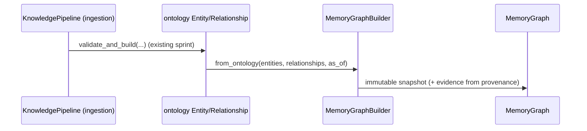

# Enterprise Memory Graph — Integration Guide (FEAT-05-6)

The memory graph is an **assembly layer**: it consumes the outputs of existing
pipelines and composes existing libraries rather than duplicating them. It adds
`emg-ontology`, `emg-knowledge-pipeline`, `emg-knowledge-lifecycle`,
`emg-trust-scoring` and `emg-semantic-layer` as dependencies; **nothing depends on
it** (no cycles), and no existing package was modified.

## Ontology (`emg-ontology`)

The ontology defines the canonical entity/relationship vocabulary, provenance and
classification. The memory graph:

- Adapts `Entity` → `MemoryNode` (`MemoryNode.from_entity`) and `Relationship` →
  `MemoryEdge` (`MemoryEdge.from_relationship`), reusing ids, types,
  classification, trust score and effective windows.
- Bridges `ProvenanceReference` → `EvidenceRef` (`EvidenceRef.from_provenance`),
  carrying the audit `event_id` / `correlation_id` into graph evidence.
- Does **not** redefine entity types; `node_type`/`edge_type` are free-form and
  the ontology vocabulary flows straight through.

## Knowledge Pipeline (`emg-knowledge-pipeline`)

The pipeline produces validated ontology `Entity`/`Relationship` objects (its
idempotent, content-addressed ids). The builder consumes them directly:

No ingestion logic is re-implemented; the builder only *reads* the pipeline's
output. `from_ontology(..., base=existing_graph)` performs incremental updates.

## Knowledge Lifecycle (`emg-knowledge-lifecycle`)

Lifecycle `VersionChain`/`KnowledgeVersion` describe a knowledge entity's
versions and their effective windows. The memory graph preserves that history:

- A version's `effective_from`/`effective_to` map onto a `TemporalHistory` (a
  node attribute timeline) or an edge's `TemporalValidity` — so "owner changed
  from Ahmed to Mohammed" becomes two adjacent intervals, never an overwrite.
- Graph-level immutable revisions (`GraphHistory`) mirror the lifecycle's
  append-only, never-overwrite philosophy at whole-graph granularity.

## Trust Scoring (`emg-trust-scoring`)

The `ConfidenceEngine` **wraps** `emg_trust_scoring.evaluate`: it translates an
assertion's evidence (source types, distinct-source count, conflicts, provenance)
into `TrustSignals` and returns the composite score. Scoring weights stay in
trust-scoring (single authority); the memory graph only maps evidence → signals
and derives a readable band.

## Semantic Layer (`emg-semantic-layer`)

`to_semantic_graph(graph)` projects the memory graph into a `SemanticGraph`, and
`MemoryGraphExecutor` implements the `SemanticQueryExecutor` protocol for node
selection / filtering / ordering / pagination — making the memory graph queryable
through the platform's generic model and ready for future visualization. Native
multi-hop traversal (lineage, shortest path) is served by `MemoryQueryEngine`
directly over the adjacency indices.

## Universal Connector Framework (`emg-connectors`)

Connectors produce neutral source records that a downstream binding projects onto
ontology entities (Sprint 14's design). Those entities flow into the builder as
above; the originating system becomes graph **evidence** via `EvidenceSource`
(`SHAREPOINT`, `TEAMS`, `JIRA`, `EMAIL`, …) and the connector's principal becomes
the evidence `source_principal`. The memory graph does **not** depend on
`emg-connectors` directly — integration is through the shared ontology contract,
keeping the dependency graph acyclic.

## Backward compatibility

- No existing package, model, or public API was changed. The full pre-existing
  test suite (840 passed / 16 skipped) is unchanged; the combined suite is now
  **984 passed / 16 skipped** (+144 new tests).
- `emg-memory-graph` is additive and not wired into any running service this
  sprint (contracts + engine only), consistent with the library-first roadmap.
