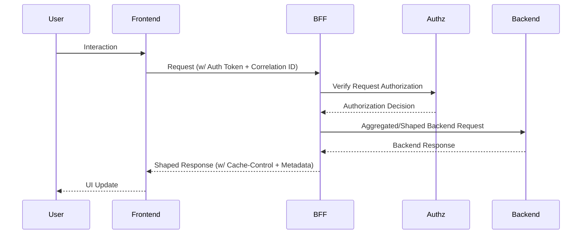

# Frontend API Architecture

## Purpose
This specification establishes the authoritative standard for all data exchange between the EMG™ Frontend presentation layer and the Backend-for-Frontend (BFF) services. Its primary purpose is to decouple frontend development from backend module complexity, enforce platform-wide Zero Trust security, guarantee performance through optimized data shaping, and provide a unified, predictable developer experience across all user-facing surfaces.

## Scope
This document covers all facets of the client-to-BFF API interface. It applies to all frontend applications, web or native, that consume EMG™ platform capabilities. It explicitly excludes direct-to-backend communication, which is strictly prohibited by [ADR-014](../../architecture/EMG_ADR-014_Enterprise_Presentation_Architecture.md).

## Responsibilities
- **Frontend Engineering:** Responsible for client-side API consumption, implementing resilient error handling, managing UI-scoped state, and adhering to the shared design-system-based data contracts.
- **BFF Engineering:** Responsible for the implementation, performance, security, and schema governance of the BFF services; ensuring backend module APIs are safely aggregated, filtered, and shaped for specific frontend surface needs.
- **Platform Architecture Board:** Responsible for governing the API contract definitions, ensuring adherence to the [Architecture Baseline](../../architecture/EMG_Architecture_Baseline_v1.0_Final.md), and reviewing breaking changes.

## Dependencies
- **[ADR-014: Enterprise Presentation Architecture](../../architecture/EMG_ADR-014_Enterprise_Presentation_Architecture.md)**: The foundational architectural directive.
- **[Enterprise API Architecture](../../architecture/reference/EMG_Enterprise_API_Architecture.md)**: The underlying REST/GraphQL standards.
- **[Module 4: Identity & Authentication](../../services/identity/README.md)**: The source of truth for session and user context.
- **[Module 5: Authorization & Policy Platform](../../services/authz/README.md)**: The source of truth for request authorization.

## Architecture Alignment
This document is a direct operational implementation of ADR-014. It enforces the "Backend parity, not backend exposure" principle by mandate. No frontend surface is permitted to bypass the BFF layer to interact with backend services directly. This alignment ensures that frontend clients remain ignorant of backend module complexity, and that the platform's security posture is enforced uniformly at the BFF boundary.

---

## 1. Request Lifecycle & BFF Interaction
Every frontend-to-BFF request must follow a standardized, strictly governed lifecycle.

### The Request Lifecycle


The BFF serves as the intelligent gateway. Frontend clients emit requests designed for specific UI components (e.g., "Get Evidence Card"). The BFF fetches required data from multiple backend modules, shapes it into the exact structure the UI component expects, and returns it. This eliminates client-side request orchestration logic.

## 2. Authentication & Authorization Flows
The platform employs a strict Zero Trust model, where identity is verified at every hop, including the frontend-to-BFF boundary.

### Authentication Flow
1. **Session Establishment:** Upon login, the frontend receives a short-lived, encrypted, `HttpOnly` cookie containing the session token issued by Module 4.
2. **Request Inclusion:** For every request to the BFF, the frontend includes this cookie.
3. **Validation:** The BFF validates the session token against Module 4. If invalid, the request is rejected with a `401 Unauthorized` status, and the frontend must trigger a re-authentication flow.

### Authorization Flow
1. **Request Context:** The BFF extracts the identity and request context.
2. **Policy Enforcement:** The BFF forwards this context to the Module 5 Policy Enforcement Point (PEP).
3. **Decision:** The PEP evaluates the request against current organizational policies and returns a decision.
4. **Enforcement:** If authorized, the BFF proceeds; if denied, a `403 Forbidden` response is returned. The frontend *must* handle this gracefully by rendering "Access Denied" states rather than crashing or revealing internal state.

## 3. API Mechanics
### API Versioning
All BFF APIs must be versioned. The version is included in the URL path (e.g., `/api/v1/search/`). Breaking changes require a new version (e.g., `/v2/`).

### Pagination
All collection-returning endpoints must support cursor-based pagination.
- **Request Parameters:** `?cursor=...&limit=...`
- **Response Structure:** Must include metadata containing `next_cursor` and `total_count`.

### Streaming
For high-volume AI responses or real-time event updates, BFFs must support Server-Sent Events (SSE) or WebSockets, depending on the interactivity level required, adhering strictly to the authentication protocols mentioned above.

## 4. Operational Considerations
### Correlation IDs
Every request must include a `X-Correlation-ID` header, generated by the frontend at the initiation of a user action. This ID must be propagated by the BFF to all downstream backend services to facilitate end-to-end distributed tracing.

### Error Handling
The BFF must return standardized error envelopes:
```json
{
  "error": {
    "code": "ENTITY_NOT_FOUND",
    "message": "The requested entity could not be located.",
    "correlation_id": "uuid-123",
    "timestamp": "2026-07-22T..."
  }
}
```
Frontend applications are required to consume these envelopes to present meaningful error messages to the user.

### Retry Strategy
Frontend clients must implement an exponential backoff retry strategy for transient network errors. The BFF may advise on retryable states via the `Retry-After` header.

### Caching
BFF responses should include `Cache-Control` headers. Frontend clients are permitted to cache responses for UI-scoped state, but *never* system-of-record data, which must always be re-validated or re-fetched.

## 5. Security Considerations
- **Classification-Aware Rendering:** BFFs must not return restricted property values unless the user is explicitly authorized.
- **Redaction:** Frontend clients must implement client-side redaction logic as a defense-in-depth measure, as specified in ADR-014.
- **CSRF Protection:** Since we use cookies for authentication, strict CSRF protection (e.g., `SameSite=Strict`, custom headers) is mandatory for all BFF requests.

## 6. Guidelines

### Best Practices
- **Strict Typing:** Share TypeScript interfaces between BFF and Frontend using a shared contract library.
- **Robust Cancellation:** Always use `AbortController` to cancel pending requests when a component unmounts or a user navigates away.
- **Performance:** Keep the BFF thin; it should not execute complex business logic that belongs in backend modules.

### Anti-Patterns
- **Direct Backend Access:** Direct requests to Module 7–10 APIs are strictly forbidden.
- **"God" BFFs:** Do not create a single monolithic BFF for the entire platform. Each capability area must have its own, scoped BFF.
- **Client-Side Business Logic:** Never reimplement backend business logic (e.g., authorization rules, data transformation) in the frontend.

## 7. Implementation Examples

### Standardized BFF Request (TypeScript)
```typescript
interface EvidenceRequest {
  entityId: string;
  contextId: string;
}

// Client-side call
const fetchEvidence = async (req: EvidenceRequest): Promise<EvidenceData> => {
  const response = await fetch('/api/v1/evidence', {
    method: 'POST',
    headers: {
      'Content-Type': 'application/json',
      'X-Correlation-ID': crypto.randomUUID()
    },
    body: JSON.stringify(req)
  });

  if (!response.ok) throw await handleApiError(response);
  return response.json();
};
```

## Future Extensions
- **GraphQL Federation:** Transition BFF aggregation layer to a federated GraphQL approach.
- **Advanced Telemetry:** Deep integration with [ADR-015](../../architecture/EMG_ADR-015_Unified_Enterprise_Observability.md) for real-time frontend performance monitoring.
