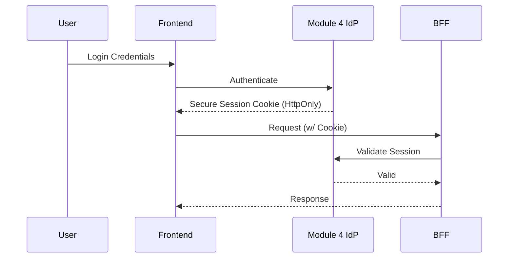

# Frontend Authentication

## Purpose
The EMG™ Frontend Authentication specification defines the mandatory protocols for managing user sessions securely on the frontend. Its purpose is to implement the platform's Zero Trust identity model, ensuring that all frontend interactions are authenticated, authorized, and ephemeral, with no persistent credential exposure.

## Scope
This specification governs session lifecycle management, token handling, frontend security regarding credential exposure, and the communication protocol between frontend clients and the authentication service.

## Responsibilities
- **Frontend Engineering:** Responsible for securely managing session tokens, implementing secure cookie handling, and orchestrating the login/logout/renewal flows.
- **Security Team:** Responsible for defining security policies (e.g., token lifetimes, cookie security flags) and auditing implementation.
- **Module 4 (Identity & Authentication) Team:** Responsible for maintaining the authoritative identity provider (IdP) service.

## Dependencies
- **[Module 4: Identity & Authentication](../../services/identity/README.md)**: The authoritative IdP.
- **[ADR-014: Enterprise Presentation Architecture](../../architecture/EMG_ADR-014_Enterprise_Presentation_Architecture.md)**: Establishes client-side security posture requirements.

## Architecture Alignment
This specification strictly adheres to the platform's Zero Trust posture. ADR-014 mandates that clients are never issued standing credentials broader than the active session. This specification ensures that identity is bound to the ephemeral browser session, not the underlying device.

## Architecture Rationale
Why secure, HttpOnly cookies?
1. **Protection against XSS:** `HttpOnly` cookies are inaccessible to JavaScript, effectively neutralizing session hijacking via XSS attacks.
2. **Standardization:** Using standard cookie mechanisms ensures consistent CSRF protection and secure session management across different frontend framework implementations.
3. **Statelessness:** Decoupling session management from client-side state enables robust, platform-wide authentication scalability.

## Implementation Guidelines

### 1. Authentication Flow


### 2. Implementation Example (TypeScript Session Hook)
```typescript
// @/hooks/useSession.ts
import { createContext, useContext } from 'react';

export const SessionContext = createContext<{ isAuthenticated: boolean }>({ isAuthenticated: false });

export const useSession = () => {
  const context = useContext(SessionContext);
  if (!context) throw new Error('useSession must be used within SessionProvider');
  return context;
};
```

## Security Considerations
- **Cookie Security:** All authentication cookies must be set with the `Secure`, `HttpOnly`, and `SameSite=Strict` flags.
- **Session Timeout:** Sessions must implement both absolute (e.g., 8 hours) and idle (e.g., 30 minutes) timeouts.
- **CSRF:** Strict CSRF mitigation must be implemented at the BFF level to ensure cookie-based auth is secure.

## Performance Considerations
- **Token Validation:** Token validation is performed at the BFF boundary for every request; caching mechanisms at the BFF level (using short-lived session caches) may be used to minimize IdP load.

## Scalability Considerations
- **Distributed Identity:** The authentication flow must be designed to work across distributed infrastructure, ensuring that a user can maintain a session across multiple frontend surfaces and BFFs.

## Operational Considerations
- **Audit Logging:** Every successful login and logout event must be audited by Module 6 (Audit/Provenance) for compliance.

## Governance Rules
- Changes to authentication token lifetime or security flags require CISO approval.
- No frontend surface may store, log, or transmit authentication credentials beyond the initial login flow.

## Best Practices
- **Short-Lived Sessions:** Minimize the window of risk by utilizing short-lived session tokens.
- **Secure Logout:** Logout must trigger a full session revocation at the IdP level, not just a client-side deletion.

## Anti-Patterns & Common Mistakes
- **localStorage for Tokens:** Storing authentication tokens in `localStorage` is strictly forbidden due to high XSS exposure.
- **Implicit Login:** Allowing sessions to persist silently without periodic active re-validation.
- **Credential Logging:** Accidentally logging credentials during the authentication flow.

## Review Checklist
- [ ] Are cookies configured with `Secure`, `HttpOnly`, and `SameSite=Strict`?
- [ ] Is logout fully revoking the session at the IdP?
- [ ] Are idle and absolute timeouts configured?
- [ ] Has CISO approved the token configuration?

## Definition of Done (DoD)
- Authentication flows are tested against both successful and failing IdP responses.
- Session termination and timeout behavior is verified.
- Cookie security flags are confirmed in browser development tools.
- Audit logs correctly record authentication events.

## Future Extensions
- **MFA:** Integration with platform-wide multi-factor authentication requirements.
- **Biometric Auth:** Secure implementation of web-authn for supported client devices.
