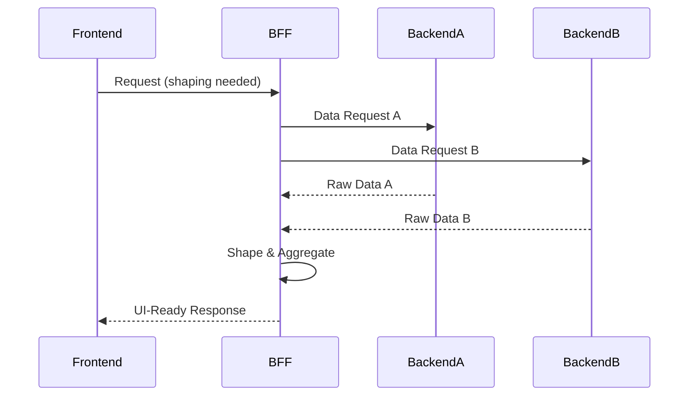

# Frontend BFF Guide

## Purpose
The EMG™ Frontend Backend-for-Frontend (BFF) Guide defines the mandatory architecture and implementation standards for BFF services. Its purpose is to operationalize the BFF pattern established in [ADR-014](../../architecture/EMG_ADR-014_Enterprise_Presentation_Architecture.md), ensuring that backend complexity is hidden from frontend clients, API traffic is optimized for specific UI surface needs, and a uniform security and observability boundary is enforced platform-wide.

## Scope
This guide applies to all BFF services developed for the EMG™ platform. It covers the BFF service responsibility boundary, request aggregation, data shaping, security enforcement, and integration with the backend service mesh.

## Responsibilities
- **BFF Engineering:** Responsible for the implementation, performance, security, and schema governance of the BFF services; ensuring backend module APIs are safely aggregated, filtered, and shaped.
- **Frontend Engineering:** Responsible for defining the data requirements for UI surfaces, which are then implemented as BFF endpoints.
- **Platform Architecture Board:** Responsible for governing the BFF service boundaries and ensuring they do not become "shadow" business logic layers.

## Dependencies
- **[ADR-014: Enterprise Presentation Architecture](../../architecture/EMG_ADR-014_Enterprise_Presentation_Architecture.md)**: Defines the requirement for the BFF pattern.
- **[ADR-015: Unified Enterprise Observability](../../architecture/EMG_ADR-015_Unified_Enterprise_Observability.md)**: Specifies the observability requirements for all services, including BFFs.
- **[Module 5: Enterprise Authorization & Policy Platform](../../services/authz/README.md)**: Source of truth for request authorization at the BFF boundary.

## Architecture Alignment
The BFF guide is the direct implementation of the BFF strategy mandated by ADR-014. It enforces the "Backend parity, not backend exposure" principle by explicitly prohibiting BFFs from containing business logic. BFFs must be thin, presentation-oriented aggregation layers.

## Architecture Rationale
Why the BFF pattern?
1. **Optimization:** Aggregating multiple backend calls into a single BFF response significantly improves frontend performance, especially in network-constrained (air-gapped) environments.
2. **Security:** The BFF acts as a hardened security proxy, validating authentication tokens and forwarding authorization context to backend PEPs (Policy Enforcement Points) before any data is fetched.
3. **Frontend-Backend Decoupling:** Backend module schemas can evolve independently of frontend UI component requirements.

## Implementation Guidelines

### 1. BFF Aggregation Flow


### 2. Implementation Example (TypeScript Node.js)
```typescript
// @/bff/evidence-aggregator.ts
import { fetchEvidence, fetchProvenance } from '../services/backend-client';

export const getEvidenceCard = async (entityId: string) => {
  // Parallel aggregation
  const [evidence, provenance] = await Promise.all([
    fetchEvidence(entityId),
    fetchProvenance(entityId),
  ]);

  // Shaping
  return {
    title: evidence.title,
    citation: provenance.citationLink,
    confidence: evidence.confidenceScore,
  };
};
```

## Security Considerations
- **Request/Response Filtering:** BFFs must explicitly filter sensitive fields from backend responses before returning them to the frontend.
- **CSRF Protection:** All BFF endpoints must enforce the same CSRF protections as defined in the Frontend API Architecture.
- **Authentication Propagation:** The BFF is responsible for propagating the end-user's identity context to backend services using secure, internally scoped headers.

## Performance Considerations
- **Statelessness:** BFFs must be completely stateless to allow for efficient horizontal scaling.
- **Caching:** Implement response caching at the BFF level using standardized caching headers, but respect strict classification-aware constraints.

## Scalability Considerations
- **Horizontal Scaling:** BFFs must be designed to scale independently of the backend modules they consume, based on traffic patterns specific to the UI surfaces they serve.

## Operational Considerations
- **Observability:** BFFs must emit telemetry (SLIs/SLOs) compliant with [ADR-015](../../architecture/EMG_ADR-015_Unified_Enterprise_Observability.md).
- **Incident Response:** Must include request correlation IDs in logs to facilitate debugging across frontend-to-backend calls.

## Governance Rules
- BFF endpoints must be approved by the API governance committee to prevent "scope creep" where business logic leaks into the BFF layer.
- Breaking changes to BFF endpoints require a coordinated update to the corresponding frontend consumption contracts.

## Best Practices
- **Thin Services:** If a BFF endpoint requires more than 50 lines of "shaping" or aggregation, it is likely a sign of leaked business logic that should be moved to a backend module.
- **Contract-First Development:** BFF schemas must be defined via contract-first development to ensure frontend alignment before backend development begins.

## Anti-Patterns & Common Mistakes
- **Logic Leakage:** Implementing authorization rules, data transformation, or validation that should belong to the backend module.
- **Chatty BFFs:** Making too many backend calls for a single UI response, leading to BFF-to-backend congestion.
- **Stateful BFFs:** Storing session-scoped state (e.g., in memory) in the BFF, which breaks scalability and session management.

## Review Checklist
- [ ] Is all domain-specific logic in the backend, not the BFF?
- [ ] Are all backend responses filtered and shaped?
- [ ] Is the service stateless and horizontally scalable?
- [ ] Is observability instrumentation (ADR-015) in place?

## Definition of Done (DoD)
- BFF endpoint is functionally verified with backend mocks.
- API contract is documented and signed off by the consuming frontend team.
- Security and observability requirements are implemented and tested.
- Automated tests covering aggregation, shaping, and error handling exist.

## Future Extensions
- **BFF Federation:** Moving toward a standardized, federated aggregation layer if required by enterprise architectural evolution.
- **Performance Monitoring:** Deep integration with platform-wide observability for real-time BFF latency tracking.
