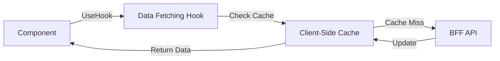

# Frontend Data Fetching

## Purpose
The EMG™ Frontend Data Fetching specification defines the mandatory patterns for retrieving and managing server-derived data on the client. Its purpose is to ensure consistent, performant, and secure data handling, leveraging caching mechanisms that respect the platform's security and classification constraints, and ensuring the UI remains highly responsive.

## Scope
This specification governs client-side data fetching mechanisms, caching policies, reactivity, request deduplication, and cache invalidation logic for all frontend applications consuming BFF APIs.

## Responsibilities
- **Frontend Engineering:** Responsible for implementing fetching logic using standardized libraries, managing cache invalidation, and ensuring robust error handling in data fetching hooks.
- **Platform Architecture Board:** Responsible for governing data fetching standards, particularly those affecting backend load and security classification compliance.

## Dependencies
- **[FRONTEND_API_ARCHITECTURE.md](./FRONTEND_API_ARCHITECTURE.md)**: Defines the API contract and BFF interaction pattern.
- **[ADR-014: Enterprise Presentation Architecture](../../architecture/EMG_ADR-014_Enterprise_Presentation_Architecture.md)**: Mandates classification-aware data handling.

## Architecture Alignment
This specification strictly enforces the BFF pattern, ensuring all data fetching is directed through the BFF layer. It also aligns with the requirement for classification-aware rendering, meaning that cache policies must consider data sensitivity.

## Architecture Rationale
Why standardized data fetching?
1. **Consistency:** Using a centralized library (e.g., React Query) ensures uniform handling of loading, error, and success states across the entire application.
2. **Performance:** Advanced caching strategies (Stale-While-Revalidate) significantly improve UI responsiveness and reduce unnecessary network traffic.
3. **Reactivity:** Centralized fetching ensures that UI components are automatically updated when underlying data changes, reducing manual state management complexity.

## Implementation Guidelines

### 1. Data Fetching Lifecycle


### 2. Implementation Example (Custom Fetching Hook)
```typescript
// @/hooks/useEvidence.ts
import { useQuery } from '@tanstack/react-query';
import { getEvidenceCard } from '@/bff/evidence-aggregator';

export const useEvidence = (entityId: string) => {
  return useQuery({
    queryKey: ['evidence', entityId],
    queryFn: () => getEvidenceCard(entityId),
    staleTime: 5000, // 5 seconds
  });
};
```

## Security Considerations
- **Classification-Aware Caching:** Caching policies must be sensitive to data classification. Highly restricted data may require a `no-cache` or `private` directive to prevent unauthorized client-side exposure.
- **Sensitive Data:** Avoid caching responses containing sensitive, user-specific data that might persist across different user sessions on the same device.

## Performance Considerations
- **Request Deduplication:** Fetching libraries must automatically deduplicate concurrent requests for the same data to minimize backend load.
- **Optimistic Updates:** For user-triggered changes (e.g., entity status update), implement optimistic updates to provide instant UI feedback while the backend processes the change.

## Scalability Considerations
- **Query Invalidation:** Implement granular query invalidation strategies to ensure the UI stays updated without forcing global re-fetches.

## Operational Considerations
- **Error Reporting:** All data fetching errors must be reported to the observability system (ADR-015) with the relevant query key and correlation ID.

## Governance Rules
- All new data fetching hooks must be strongly typed and share the platform's API contract definitions.
- Caching strategies for restricted data domains must be pre-approved by the Security Team.

## Best Practices
- **Stale-While-Revalidate:** Prioritize SWR patterns to keep the UI snappy while updating data in the background.
- **Type Safety:** Always use strongly typed interfaces for data fetching to ensure consistency between BFF responses and UI components.

## Anti-Patterns & Common Mistakes
- **Manual Fetching:** Using raw `fetch` calls in components rather than standardized fetching hooks.
- **Global Invalidation:** Invaliding the entire cache when only a small slice of data changes.
- **Ignoring Loading States:** Failing to implement appropriate loading/skeleton states, leading to poor UX during fetching.

## Review Checklist
- [ ] Is the data fetching hook strongly typed?
- [ ] Is the caching policy appropriate for the data's classification?
- [ ] Is error handling and reporting implemented?
- [ ] Are optimistic updates correctly managed?

## Definition of Done (DoD)
- Data fetching hook is functionally verified against BFF.
- Caching/invalidation strategy is tested and validated.
- Loading, error, and success states are visually verified against Design System guidelines.

## Future Extensions
- **Advanced Pre-fetching:** Implementing intelligent pre-fetching strategies based on user interaction behavior patterns to further reduce perceived latency.
