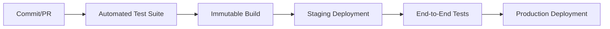

# Frontend Deployment

## Purpose
The EMG™ Frontend Deployment specification defines the mandatory standards and procedures for the continuous integration, continuous delivery (CI/CD), and deployment of frontend applications. Its purpose is to guarantee reliable, repeatable, and secure deployments that adhere to the platform's immutable build requirements.

## Scope
This specification governs all aspects of frontend delivery, including build artifact creation, containerization, environment-specific configurations, deployment pipelines, and post-deployment verification.

## Responsibilities
- **Frontend Engineering:** Responsible for maintainable CI configurations and ensuring all code passes CI tests prior to delivery.
- **DevOps/SRE:** Responsible for managing the CI/CD pipeline infrastructure, environment configurations, and ensuring compliance with the platform's deployment model.

## Dependencies
- **[ADR-017: Enterprise Capacity & Scalability Model](../../architecture/EMG_ADR-017_Enterprise_Capacity_Scalability_Model.md)**: Establishes environment requirements for scaling.
- **[Service CI Template](../../tools/ci-templates/service-ci-template.yml)**: The foundational CI pipeline structure.

## Architecture Alignment
This specification aligns with the platform's enterprise deployment model, which mandates immutable build artifacts, strict environment parity, and automated testing gates across all platform services.

## Architecture Rationale
Why immutable builds?
1. **Consistency:** An immutable build artifact ensures that exactly what was tested in staging is what is deployed to production.
2. **Rollback Speed:** Immutable artifacts allow for near-instant rollback to a known good state by simply re-deploying the previous version.
3. **Auditability:** Every deployed artifact is cryptographically traceable to the commit that generated it, simplifying compliance and auditing.

## Implementation Guidelines

### 1. CI/CD Pipeline Flow


### 2. Implementation Example (CI Template Reference)
```yaml
# Simplified CI step (refer to tools/ci-templates/service-ci-template.yml)
jobs:
  build:
    runs-on: ubuntu-latest
    steps:
      - uses: actions/checkout@v4
      - run: npm install
      - run: npm run build
      - run: npm run test
      - name: Build Artifact
        run: docker build -t emg-frontend:${{ github.sha }} .
```

## Security Considerations
- **Artifact Signing:** All production build artifacts must be cryptographically signed to prevent tampering.
- **Dependency Scanning:** CI pipelines must automatically scan for vulnerabilities in third-party dependencies.

## Performance Considerations
- **CDN Distribution:** Frontend assets must be delivered via a global CDN with aggressive caching strategies, versioned by build ID.

## Scalability Considerations
- **Blue/Green Deployment:** The deployment model supports Blue/Green deployments to ensure zero-downtime releases for production services.

## Operational Considerations
- **Deployment Monitoring:** Deployment success must be verified by automated post-deployment smoke tests that check critical paths in production.

## Governance Rules
- Deployment to production requires an automated sign-off, conditioned on the successful completion of the CI pipeline, including security and performance checks.

## Best Practices
- **Continuous Delivery:** Aim for small, frequent releases to minimize risk and simplify troubleshooting.
- **Environment Parity:** Staging and production environments must be functionally identical to ensure tests are representative.

## Anti-Patterns & Common Mistakes
- **Manual Hotfixes:** Applying manual changes directly to production environments (bypassing the pipeline).
- **Flaky Tests:** Allowing flaky tests to block the pipeline, leading to "false negatives" that undermine confidence in the deployment process.

## Review Checklist
- [ ] Has the pipeline successfully passed security scanning?
- [ ] Is the build artifact immutable and tagged with the commit SHA?
- [ ] Have post-deployment smoke tests passed?

## Definition of Done (DoD)
- CI pipeline passes successfully in staging.
- Security and performance automated checks are verified.
- Deployment artifact is promoted to production according to platform standards.

## Future Extensions
- **Multi-Region Deployment:** Supporting geo-distributed production deployments.
- **Canary Releases:** Implementing automated, traffic-weighted canary deployments.
