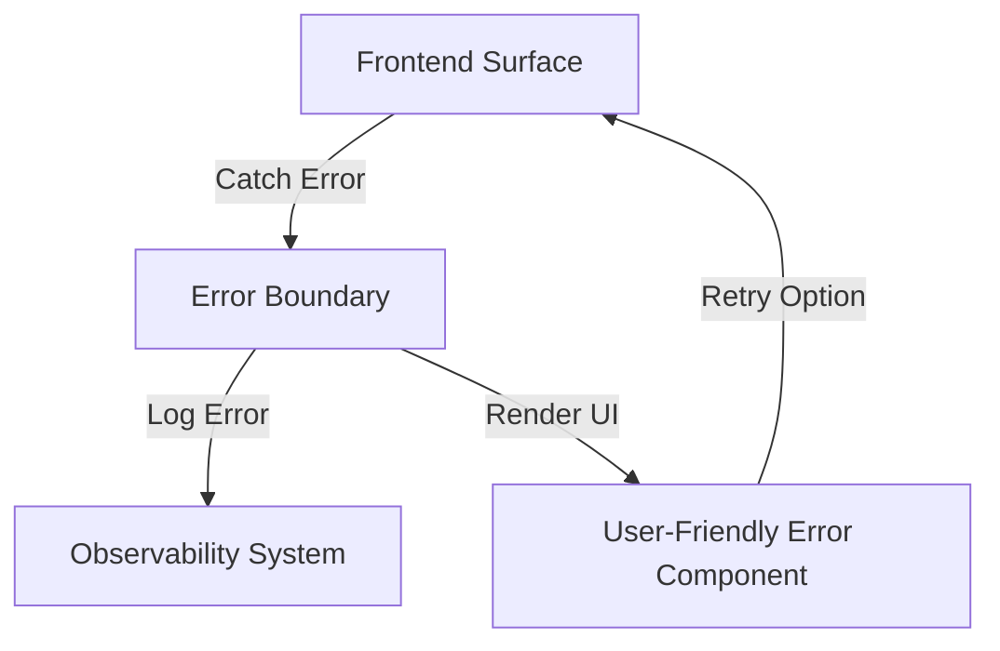

# Frontend Error Handling

## Purpose
The EMG™ Frontend Error Handling specification defines the mandatory approach for managing, surfacing, and recovering from client-side errors. Its purpose is to guarantee a consistent, user-friendly, and non-disruptive experience even when backend services fail or network connectivity is degraded, ensuring that users always have a clear path forward.

## Scope
This specification governs all frontend error scenarios, including:
- **Application-Level Errors:** Caught by React Error Boundaries.
- **Service/API Errors:** Errors returned by the BFF.
- **Degraded States:** Scenarios where service availability is limited (e.g., offline mode).
- **Empty States:** Scenarios where no data is returned.

## Responsibilities
- **Frontend Engineering:** Responsible for implementing robust error handling boundaries, designing actionable error UI, and ensuring errors are correctly reported to observability tools.
- **UX Design Team:** Responsible for defining the visual language and interaction patterns for error, empty, and degraded states to ensure they conform to the Design System.

## Dependencies
- **[Design System](../../enterprise-design/DESIGN_SYSTEM.md)**: Defines the visual components for errors.
- **[ADR-015: Unified Enterprise Observability](../../architecture/EMG_ADR-015_Unified_Enterprise_Observability.md)**: Defines requirements for error telemetry reporting.

## Architecture Alignment
This specification aligns with ADR-014's requirement that the presentation layer must provide an explainable and reliable user experience, even under failure conditions. Error handling is structured to hide underlying platform complexity while maintaining user agency.

## Architecture Rationale
Why a centralized error approach?
1. **Consistency:** Users must receive a consistent error message regardless of whether the error originated in search, authoring, or decision support.
2. **Actionability:** Errors must not be "dead ends"; they must always offer the user a way to retry, contact support, or understand the issue contextually.
3. **Security:** Centralization ensures that no raw stack traces or internal platform details are accidentally exposed in error messages.

## Implementation Guidelines

### 1. Error Handling Flow


### 2. Implementation Example (Error Boundary)
```tsx
// @/components/error/ErrorBoundary.tsx
import { Component, ReactNode } from 'react';

export class ErrorBoundary extends Component<{ children: ReactNode }> {
  state = { hasError: false };

  static getDerivedStateFromError() { return { hasError: true }; }

  componentDidCatch(error: Error) {
    // Report to ADR-015 Observability
    reportErrorToTelemetry(error);
  }

  render() {
    if (this.state.hasError) return <ErrorPlaceholder />;
    return this.props.children;
  }
}
```

## Security Considerations
- **Information Disclosure:** Under no circumstances may raw stack traces, backend API endpoints, or database errors be displayed in the UI. All error components must mask internal technical details.
- **Sanitization:** Error messages returned by the BFF must be sanitized before being displayed to ensure no malicious payload is rendered.

## Performance Considerations
- **Reporting Overhead:** Telemetry reporting of errors should be handled asynchronously to ensure that error logging does not block the UI from rendering the error state.

## Scalability Considerations
- **Feature Isolation:** Error handling must be scoped by feature boundary. A failure in the "Graph" component should be isolated and not crash the entire "Search" page.

## Operational Considerations
- **Observability:** Every error caught by an Error Boundary must be reported with the correlation ID, the component stack, and the user context, as mandated by ADR-015.

## Governance Rules
- All critical user paths must have defined error recovery scenarios.
- The UX Design Team must approve all error message wording to ensure consistency and tone.

## Best Practices
- **Retryability:** Always provide a clear "Retry" action if the error is potentially transient.
- **Contextual Clarity:** If the error is specific to a piece of data (e.g., an evidence citation), display the error *within the context of that data* rather than crashing the whole page.

## Anti-Patterns & Common Mistakes
- **Swallowing Errors:** Catching errors without logging them, making them invisible to the observability system.
- **Vague Errors:** Displaying "An unexpected error occurred" without a correlation ID or actionable next step.
- **Exposing Secrets:** Leaking sensitive context or secrets in error logs sent to the observability system.

## Review Checklist
- [ ] Is an Error Boundary wrapping all major feature surfaces?
- [ ] Do error components mask sensitive system information?
- [ ] Are error events reported to the telemetry system (ADR-015)?
- [ ] Are all error states actionable?

## Definition of Done (DoD)
- Error handling logic is verified against mocked backend failures.
- Error components are aligned with Design System tokens.
- Telemetry reporting is validated in the observability dashboard.

## Future Extensions
- **AI-Powered Diagnostics:** Utilizing AI to analyze error context and provide actionable user guidance during complex failures.
- **Offline Mode:** Advanced error recovery flows specifically designed for air-gapped/disconnected environments (ADR-014, Section 7).
