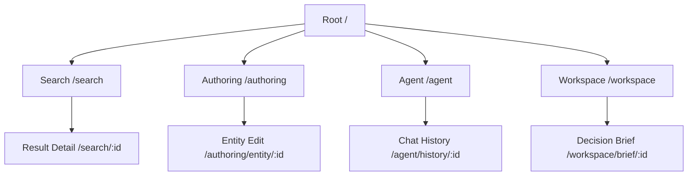

# Frontend Navigation Model

## Purpose
The EMG™ Frontend Navigation Model defines the authoritative structure for user traversal across all platform surfaces (Search, Knowledge Authoring, Agent Interaction, and Decision Workspace). Its purpose is to ensure a predictable, highly consistent, and discoverable experience, adhering to the [Enterprise UX Architecture & Design System](../enterprise-design/DESIGN_SYSTEM.md).

## Scope
This model governs all client-side routing, breadcrumb generation, top-level navigation, sidebar patterns, and contextual navigation logic within all frontend applications in the EMG™ ecosystem.

## Responsibilities
- **Frontend Engineering:** Implementation of the routing infrastructure, ensuring performance and accessibility.
- **Design Team:** Defining UX navigation patterns, iconography, and information architecture hierarchy.
- **Platform Architecture Board:** Governance of route structure changes, particularly those impacting cross-surface navigation.

## Dependencies
- **[ADR-014: Enterprise Presentation Architecture](../../architecture/EMG_ADR-014_Enterprise_Presentation_Architecture.md)**: Defines the screen families that navigation must support.
- **[Enterprise UX Architecture & Design System](../enterprise-design/DESIGN_SYSTEM.md)**: Governs visual components for navigation elements.

## Architecture Alignment
This model strictly aligns with ADR-014's "One design language, many surfaces" principle. Navigation must not be treated as a surface-specific concern; it is a platform-wide governance concern to prevent fragmenting the user experience.

## Architecture Rationale
Why a centralized model?
1. **Consistency:** Users must not learn new navigation paradigms when switching from a search surface to a decision workspace.
2. **Deep Linking & Provenance:** Predictable routing is essential for the citation-based provenance (Module 6) to link back to the exact source.
3. **Authorization-Aware Routing:** Navigation must be dynamic based on the user's role and the authorization context (Module 5), not just hardcoded UI structure.

## Implementation Guidelines

### 1. Routing Pattern
The application uses the Next.js App Router. Routes are structured by capability, not by backend module internals, reinforcing the decoupling principle.



### 2. Implementation Example (TypeScript Configuration)
Navigation is defined as a centralized configuration object to enable dynamic, role-based rendering.

```typescript
// @/config/navigation.ts
export interface NavItem {
  id: string;
  label: string;
  path: string;
  requiredRole: 'analyst' | 'steward' | 'executive';
}

export const NAVIGATION_SCHEMA: NavItem[] = [
  { id: 'search', label: 'Search', path: '/search', requiredRole: 'analyst' },
  { id: 'authoring', label: 'Authoring', path: '/authoring', requiredRole: 'steward' },
  // ...
];
```

## Security Considerations
- **Authorization-Aware Routing:** Navigation items that the user is not authorized to access must not be rendered. The router must enforce path-level authorization checks via Middleware before the page component is rendered.
- **Deep Link Protection:** Any URL entered directly into the browser must undergo the same authorization checks as navigation initiated through the UI.

## Performance Considerations
- **Code Splitting:** Navigation routes must be code-split automatically by the framework to minimize initial bundle size.
- **Prefetching:** Navigation prefetching should be restricted to critical paths to avoid over-utilizing bandwidth and client-side resources.

## Scalability Considerations
- The model must support adding new screen families without refactoring the core navigation engine. This is achieved by registering new route modules in the centralized navigation configuration rather than embedding them directly in the main layout.

## Operational Considerations
- **Telemetry:** All navigation events must be tracked via the observability framework defined in [ADR-015](../../architecture/EMG_ADR-015_Unified_Enterprise_Observability.md) to understand user journey patterns.

## Governance Rules
- All new top-level routes or major navigation pattern changes require review by the Platform Architecture Board.
- Navigation patterns must be strictly additive; breaking an existing route structure requires a deprecation strategy and formal ADR.

## Best Practices
- **Shallow Navigation:** Avoid nesting more than 3 levels deep.
- **Semantic Routing:** URLs should be human-readable and reflect the entity being accessed (e.g., `/search/evidence/123-abc`).
- **Contextual Navigation:** Always provide a clear way back to the parent surface.

## Anti-Patterns & Common Mistakes
- **Hardcoding UI Paths:** Embedding strings directly in components instead of using the centralized navigation configuration.
- **Bypassing Authorization:** Relying solely on UI hiding to restrict navigation instead of enforcing authorization in Middleware.
- **Implicit Navigation:** Actions that result in navigation without clear user intent or visual feedback.

## Review Checklist
- [ ] Are all route paths defined in `NAVIGATION_SCHEMA`?
- [ ] Is path-level authorization implemented in Middleware?
- [ ] Are breadcrumbs correctly updating based on state?
- [ ] Are analytics events firing for all major route transitions?

## Definition of Done (DoD)
- Feature is reachable via deep link and navigation menu.
- Authorization checks are verified for the new path.
- Breadcrumbs accurately reflect the new route hierarchy.
- Analytics events are validated in the dev environment.
- Responsive behavior is tested across all supported viewport sizes.

## Future Extensions
- Support for complex, dynamic navigation based on session-scoped context memory (Module 9, Section 8).
- Implementation of personalized navigation views based on user behavior analysis.
