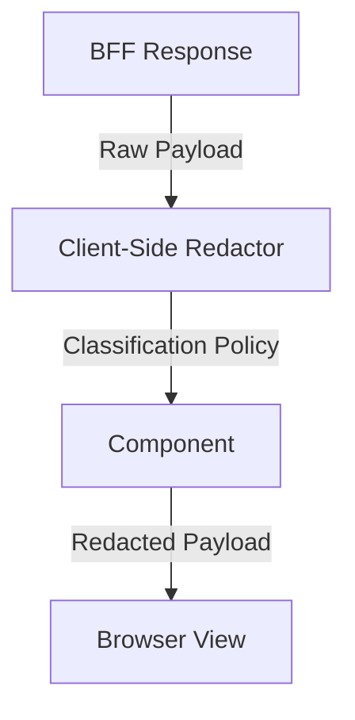

# Frontend Security

## Purpose
The EMG™ Frontend Security specification establishes mandatory security controls for all frontend implementations. Its purpose is to uphold the platform's Zero Trust posture by treating the frontend as an untrusted environment, ensuring that data is protected, rendered appropriately based on security classification, and defended against common client-side attack vectors.

## Scope
This specification governs all frontend security controls, including client-side input sanitization, data redaction based on security classification, Content Security Policy (CSP) enforcement, and defenses against client-side vulnerabilities.

## Responsibilities
- **Frontend Engineering:** Responsible for implementing mandatory security controls, adhering to classification-aware rendering, and conducting regular security self-assessments.
- **Security Team:** Responsible for defining the platform's security policies, conducting penetration testing, and managing automated security scanning tools.

## Dependencies
- **[ADR-014: Enterprise Presentation Architecture](../../architecture/EMG_ADR-014_Enterprise_Presentation_Architecture.md)**: Mandates classification-aware rendering and secure client posture.
- **[Module 4: Identity & Authentication](../../services/identity/README.md)**: Defines the authentication and session context.

## Architecture Alignment
This specification strictly enforces ADR-014’s "Client Security" requirements. The frontend is treated as an extension of the platform's Zero Trust boundary. Security is not an "add-on" but is baked into the component composition model.

## Architecture Rationale
Why a Zero Trust frontend?
1. **Defense-in-Depth:** Even if the BFF is compromised or a backend service misbehaves, classification-aware redaction at the UI layer ensures that sensitive content is not inadvertently exposed.
2. **Untrusted Client:** The browser is fundamentally insecure; therefore, all UI inputs must be treated as malicious until sanitized.

## Implementation Guidelines

### 1. Data Redaction Flow


### 2. Implementation Example (Redaction Component)
```typescript
// @/components/security/RedactedField.tsx
interface RedactedFieldProps {
  value: string;
  isRestricted: boolean;
}

export const RedactedField = ({ value, isRestricted }: RedactedFieldProps) => {
  return isRestricted ? <span className="redacted">[REDACTED]</span> : <span>{value}</span>;
};
```

## Security Considerations
- **Content Security Policy (CSP):** All applications must implement a strict CSP that disallows inline scripts, restricts script sources to trusted domains, and blocks non-HTTPS connections.
- **Input Sanitization:** All user-provided data must be sanitized before rendering to prevent XSS.

## Performance Considerations
- **Redaction Overhead:** Client-side redaction logic must be lightweight, as it runs for every field on every render cycle. Use memoization where appropriate.

## Scalability Considerations
- **Policy Propagation:** Security classification policies must be propagated from the backend through the BFF, ensuring the frontend always has the current policy context.

## Operational Considerations
- **Security Monitoring:** All security-related events, including failed sanitization attempts or policy violations, must be logged for forensic analysis.

## Governance Rules
- All frontend surfaces are subject to mandatory automated security scanning as part of the CI/CD pipeline.
- Major UI changes must include a security impact assessment.

## Best Practices
- **Least Privilege UI:** Only render components and data that are explicitly required for the user's authorized role and task context.
- **Input Validation:** Perform thorough validation on both frontend and backend for all forms.

## Anti-Patterns & Common Mistakes
- **Trusting the Backend:** Assuming the backend has already redacted all sensitive content (the frontend must enforce redaction independently).
- **Disabling CSP:** Disabling CSP to "fix" script loading issues rather than properly configuring trusted sources.

## Review Checklist
- [ ] Is a strict CSP policy in place?
- [ ] Are all sensitive fields wrapped in the `RedactedField` component?
- [ ] Has the latest security scan passed?
- [ ] Is all user input sanitized before rendering?

## Definition of Done (DoD)
- Mandatory security controls are implemented and peer-reviewed.
- Automated security scans show zero critical/high vulnerabilities.
- Classification-aware redaction is verified in all security contexts.

## Future Extensions
- **Runtime Security Monitoring:** Implementation of advanced client-side runtime security agents to detect and report unauthorized script execution in real-time.
