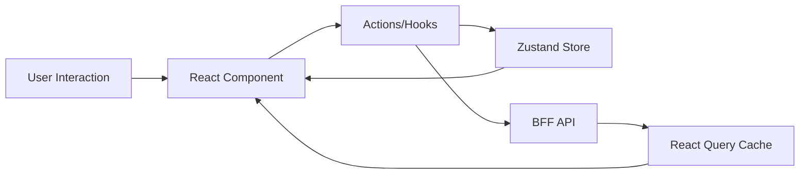

# Frontend State Management

## Purpose
The EMG™ Frontend State Management specification establishes the standards for managing transient UI and session-scoped state within the frontend application. Its purpose is to ensure state predictability, optimize application performance by minimizing unnecessary re-renders, and guarantee that the frontend strictly obeys the platform's principle that no durable system-of-record data resides client-side.

## Scope
This specification covers all client-side state, including:
- **Transient UI State:** Temporary state such as modal visibility, form input values, and dropdown states.
- **Session-Scoped UI State:** State that must persist during the current user session (e.g., active task context, navigation history).
- **Server-Cached State:** Read-only data fetched from the BFF that is cached temporarily for performance.
This specification strictly excludes any durable business logic, user-specific authorization tokens, or organizational data that constitutes a system-of-record, which must reside in the backend.

## Responsibilities
- **Frontend Engineering:** Responsible for selecting the appropriate state management tool based on scope, maintaining store integrity, and implementing performance-optimized state updates.
- **Platform Architecture Board:** Responsible for auditing state management practices for architectural violations, specifically ensuring no system-of-record data leakage into the client.

## Dependencies
- **[ADR-014: Enterprise Presentation Architecture](../../architecture/EMG_ADR-014_Enterprise_Presentation_Architecture.md)**: Establishes the restriction on client-side caching of durable data.
- **[Module 9: AI Orchestration](../services/ai-orchestration/README.md)**: Specifically Section 8 regarding Session Memory lifecycle.

## Architecture Alignment
This specification is a direct enforcement of ADR-014's principle: "State is scoped as narrowly as possible." It mandates the segregation of transient UI concerns from server-derived data, ensuring that frontend components remain stateless or UI-stateful, delegating all domain-specific logic to the BFF and backend modules.

## Architecture Rationale
Why strict scoping?
1. **Security:** Reducing the client-side footprint of sensitive data minimizes the blast radius of XSS attacks or improper browser data exposure.
2. **Consistency:** By forbidding system-of-record data to be stored client-side, we prevent the "split-brain" scenario where the UI shows stale or conflicting data compared to the backend.
3. **Performance:** Narrow scoping allows for highly efficient React re-rendering, as components only subscribe to the minimal necessary slice of state.

## Implementation Guidelines

### 1. State Categories & Tooling
| State Type | Scope | Recommended Tool |
| :--- | :--- | :--- |
| **Component Local** | Component | `useState`, `useReducer` |
| **Transient UI** | Feature | `React Context` |
| **Session-Scoped** | Global | `Zustand` (lightweight) |
| **Server-Cached** | Global/Feature | `React Query` (caching, hydration) |

### 2. State Flow Diagram


### 3. Implementation Example (Zustand)
```typescript
import { create } from 'zustand';

interface SessionState {
  activeTaskId: string | null;
  setActiveTask: (id: string | null) => void;
}

export const useSessionStore = create<SessionState>((set) => ({
  activeTaskId: null,
  setActiveTask: (id) => set({ activeTaskId: id }),
}));
```

## Security Considerations
- **Memory Safety:** Sensitive UI state must be cleared immediately upon session termination or user logout.
- **XSS Prevention:** Never store sensitive information in `localStorage` or `sessionStorage` where it is vulnerable to XSS. All session-relevant state must remain in component memory.

## Performance Considerations
- **Selective Subscriptions:** Use Zustand's selector pattern to ensure components only re-render when their required slice of state changes.
- **Query Invalidation:** Configure appropriate `staleTime` and `gcTime` in React Query to ensure cached server state is fresh without unnecessary refetching.

## Scalability Considerations
- As the application grows, avoid creating a single "global" state object. Feature-based stores allow for isolated development, testing, and easier maintenance.

## Operational Considerations
- **State Snapshots:** Implement debugging tools to capture the current state store snapshot during an incident to facilitate faster triage.

## Governance Rules
- The creation of new global stores requires an architecture review to prevent the "Global State Bloat" anti-pattern.
- Stores must not contain any data mapping directly to system-of-record records (e.g., entity definitions from Module 7).

## Best Practices
- **Derived State:** Calculate derived data (e.g., filtered lists) in selectors or components, do not store it in the state store.
- **Immutability:** Always treat state as immutable.
- **Lifting State:** Only lift state when strictly necessary (i.e., when multiple non-parent components need access).

## Anti-Patterns & Common Mistakes
- **"God" Stores:** Combining UI state, server data, and business logic into one monolithic store.
- **State Duplication:** Mirroring backend data in the frontend store instead of using a caching library.
- **Prop Drilling:** Using excessive prop drilling instead of appropriate state management tools.

## Review Checklist
- [ ] Is the state scoped to the narrowest possible requirement?
- [ ] Does the store contain any forbidden durable data?
- [ ] Is selective subscription used in components?
- [ ] Are sensitive state values cleared on session end?

## Definition of Done (DoD)
- New store or state slice is implemented with explicit types.
- Selectors are optimized to prevent unnecessary component re-renders.
- State is cleared on session termination.
- Unit tests cover state updates and selector logic.

## Future Extensions
- Integration with the centralized Session Memory lifecycle as defined in Module 9, Section 8, ensuring the UI state automatically aligns with the server-side session context.
