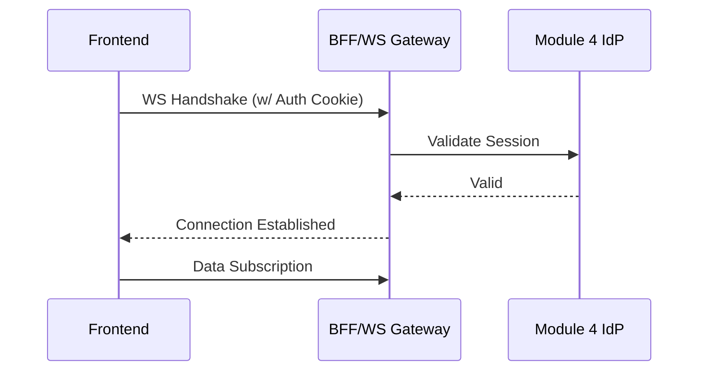

# Frontend WebSocket Architecture

## Purpose
The EMG™ Frontend WebSocket Architecture specification defines the standards for implementing real-time, bidirectional communication between frontend applications and the platform’s backend services. Its purpose is to enable high-performance, real-time UX updates (e.g., agent interaction streams, live decision-dashboard updates) while strictly maintaining the platform’s Zero Trust authentication and security model.

## Scope
This specification governs WebSocket handshake protocols, authentication mechanisms, message structuring, connection lifecycle management, and security constraints for all real-time frontend features.

## Responsibilities
- **Frontend Engineering:** Responsible for implementing robust WebSocket client-side logic, managing connection lifecycles, and ensuring real-time UI updates adhere to the Design System.
- **Platform Engineering:** Responsible for the WebSocket infrastructure, load balancing, and enforcing real-time communication security policies.

## Dependencies
- **[ADR-014: Enterprise Presentation Architecture](../../architecture/EMG_ADR-014_Enterprise_Presentation_Architecture.md)**: Mandates the secure, authenticated presentation layer.
- **[Module 4: Identity & Authentication](../../services/identity/README.md)**: Authoritative source for session authentication during the initial handshake.

## Architecture Alignment
WebSockets must strictly adhere to the Zero Trust posture defined in ADR-014. Authentication is not bypassed; the initial handshake must be fully authenticated, and the resulting connection must be explicitly scoped to the user's current session and authorization context.

## Architecture Rationale
Why WebSockets for EMG™?
1. **Real-Time UX:** AI agent interactions and complex decision-intelligence dashboards require sub-second, bidirectional communication that polling cannot reliably provide.
2. **Efficiency:** Persistent, bidirectional streams are more network-efficient than repeated HTTP polling, reducing latency and resource consumption in constrained (air-gapped) environments.

## Implementation Guidelines

### 1. Authenticated Handshake Flow


### 2. Implementation Example (TypeScript WebSocket Wrapper)
```typescript
// @/hooks/useRealTime.ts
import { useEffect, useRef } from 'react';

export const useRealTime = (url: string) => {
  const ws = useRef<WebSocket | null>(null);

  useEffect(() => {
    ws.current = new WebSocket(url);
    ws.current.onmessage = (event) => {
      // Handle incoming real-time data
    };
    return () => ws.current?.close();
  }, [url]);

  return ws.current;
};
```

## Security Considerations
- **Handshake Authentication:** The initial WebSocket handshake must be authenticated using the platform's standard session cookies (enforced by the BFF/Gateway).
- **Payload Sanitization:** All messages received over the WebSocket must be treated as untrusted and sanitized before being rendered to the DOM to prevent XSS.

## Performance Considerations
- **Heartbeat:** To prevent silent connection timeouts, implement a standardized application-level heartbeat (ping/pong) mechanism.
- **Message Frequency:** Limit the frequency of WebSocket messages to avoid overwhelming the browser’s main thread and UI rendering engine.

## Scalability Considerations
- **Distributed Connections:** The infrastructure must support distributing WebSocket connections across multiple gateway instances, ensuring session stickiness where necessary for real-time state.

## Operational Considerations
- **Monitoring:** WebSocket connection health, latency, and message throughput must be monitored in real-time and alerted on (ADR-015).

## Governance Rules
- All new real-time features must include an architecture review to evaluate the impact on gateway load and security.

## Best Practices
- **Graceful Degradation:** The UI must be able to fall back to a safe, read-only state if the WebSocket connection is interrupted or restricted.
- **Reconnection Logic:** Robust, exponential backoff reconnection logic is mandatory for all clients.

## Anti-Patterns & Common Mistakes
- **Unauthenticated Connections:** Attempting to establish a WebSocket connection without explicit session validation.
- **Huge Payload Streams:** Sending massive data payloads over WebSockets, which can saturate the client's network and UI resources.

## Review Checklist
- [ ] Is the initial handshake authenticated via session cookies?
- [ ] Is there robust reconnection logic with exponential backoff?
- [ ] Is the connection health monitored via heartbeats?
- [ ] Are all messages sanitized before rendering?

## Definition of Done (DoD)
- Connection handshake is verified as authenticated.
- Message handling logic is tested, including connection interruptions.
- Real-time updates are visually validated and adhere to the Design System.

## Future Extensions
- **Delta-Only Updates:** Implementing binary message formats (e.g., Protocol Buffers) to send only the changed data, further optimizing network throughput for complex knowledge graph updates.
