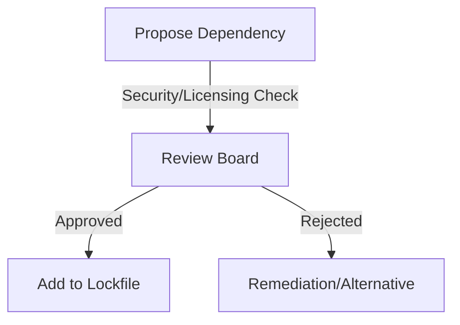

# Frontend Dependency Policy

## Purpose
The EMG™ Frontend Dependency Policy establishes the mandatory framework for introducing, managing, and maintaining third-party software dependencies. Its purpose is to mitigate supply-chain security risks, ensure architectural stability, and guarantee compliance with the platform’s licensing and performance requirements.

## Scope
This policy governs all third-party libraries, frameworks, tools, and infrastructure dependencies consumed by frontend projects, covering the full lifecycle: selection, security review, licensing compliance, integration, and maintenance (including updates and deprecation).

## Responsibilities
- **Frontend Engineering:** Responsible for proposing new dependencies, assessing their impact, and maintaining up-to-date versions within the workspace.
- **Security Team:** Responsible for performing security vulnerability analysis on new and existing dependencies.
- **Legal/Compliance:** Responsible for validating license compatibility with the platform's open-source policy.

## Dependencies
- **[Secure Coding Baseline](../../engineering/coding-standards.md#secure-coding-baseline)**: The foundational requirement for secure development practices.

## Architecture Alignment
This policy aligns with the platform's Zero Trust posture by treating third-party code as a potential attack vector. It ensures dependencies are vetted, monitored, and periodically audited to prevent the introduction of compromised or non-compliant code.

## Architecture Rationale
Why a strict dependency policy?
1. **Supply-Chain Security:** Modern frontend applications rely heavily on external ecosystems (npm). Vetting is critical to prevent malicious code (e.g., dependency confusion or typosquatting attacks).
2. **License Compliance:** Unauthorized licenses can expose the platform to legal risk.
3. **Architectural Stability:** Uncontrolled dependency proliferation ("dependency hell") makes upgrading, debugging, and maintaining the codebase exponentially more difficult.

## Implementation Guidelines

### 1. Dependency Approval Flow

### 2. Implementation Guidelines
- **Locked Versions:** Use exact versions (no `^` or `~`) in lockfiles to ensure build reproducibility.
- **Minimalism:** Prioritize native platform capabilities over adding a dependency if the implementation is straightforward.

## Security Considerations
- **Vulnerability Monitoring:** All dependencies must be monitored via automated scanners (e.g., `npm audit` or platform-integrated scanners) in CI/CD pipelines.
- **SBOM:** Generate a Software Bill of Materials (SBOM) for every release build to facilitate rapid vulnerability impact analysis.

## Performance Considerations
- **Bundle Size:** Dependencies are a primary contributor to frontend bundle bloat. Every dependency added must be evaluated for its impact on LCP (Largest Contentful Paint) and overall application performance.

## Scalability Considerations
- **Consolidation:** Periodically audit the dependency tree to identify and consolidate overlapping or redundant libraries.

## Operational Considerations
- **Updating:** Dependencies must be updated regularly to patch vulnerabilities, not just for feature updates.

## Governance Rules
- All new dependencies require explicit security and legal approval.
- A library must have a healthy maintainer ecosystem (active updates, community support, open issues management) to be considered.

## Best Practices
- **Prefer Standard Libraries:** Favor well-maintained, standard-compliant libraries over specialized, niche alternatives.
- **Tree-Shaking:** Ensure any added library is compatible with modern tree-shaking mechanisms.

## Anti-Patterns & Common Mistakes
- **Dependency Proliferation:** Adding a massive dependency for a trivial, easily implemented feature.
- **Ignoring Security Alerts:** Failing to remediate high/critical vulnerabilities identified by automated scanners in CI.

## Review Checklist
- [ ] Has the license been verified as compliant?
- [ ] Does the library have active maintenance?
- [ ] Is there a lighter alternative?
- [ ] Does it introduce security risks?

## Definition of Done (DoD)
- Dependency security audit passed.
- License compliance validated.
- Dependency is added to lockfile and monitored by CI.

## Future Extensions
- **Automated Dependency Updates:** Implementing automated PRs for dependency updates (e.g., Renovate or Dependabot).
