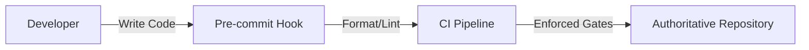

# Frontend Standards

## Purpose
The EMG™ Frontend Standards specification defines the mandatory coding and quality standards for all frontend codebases. Its purpose is to ensure a unified development experience, maximize code maintainability, and guarantee that the frontend surface area adheres to the platform's stringent quality and security requirements.

## Scope
This specification governs coding styles, linting, formatting, type safety, documentation, and quality assurance processes for all frontend packages, applications, and services.

## Responsibilities
- **Frontend Engineering:** Responsible for strictly adhering to the defined standards, maintaining local lint/format configurations, and participating in cross-team code reviews.
- **Platform Architecture Board:** Responsible for governing the evolution of these standards, ensuring alignment with platform-wide engineering goals.

## Dependencies
- **[Coding Standards](../../engineering/coding-standards.md)**: Defines the platform-wide engineering standards.

## Architecture Alignment
These frontend standards are a direct implementation of the platform-wide engineering standards. They ensure that frontend code is as robust, secure, and maintainable as the backend services.

## Architecture Rationale
Why strict frontend standards?
1. **Maintainability:** Standardized code is easier to review, refactor, and maintain across the multi-team development model.
2. **Developer Experience:** Clear, enforced standards reduce cognitive load when switching between frontend features.
3. **Quality Assurance:** Automated linting and formatting gates in CI catch common errors before they reach production.

## Implementation Guidelines

### 1. Enforcement Lifecycle


### 2. Implementation Example (Lint/Format Config)
```json
// @/apps/web/.eslintrc.json
{
  "extends": ["@emg/eslint-config"],
  "rules": {
    "react/prop-types": "off",
    "@typescript-eslint/explicit-function-return-type": "error"
  }
}
```

## Security Considerations
- **Secure Coding:** Adhere to OWASP guidelines for frontend development, specifically regarding XSS mitigation and secure API interactions.
- **Dependency Management:** Regularly update third-party dependencies to address known vulnerabilities identified by automated scanners.

## Performance Considerations
- **Clean Code:** Prioritize readable, modular, and performant code over "clever" one-liners that may degrade over time or be difficult to optimize.

## Scalability Considerations
- **Modularity:** Enforce small, single-responsibility files to ensure the codebase remains navigable as it scales.

## Operational Considerations
- **CI Gates:** Standards must be enforced automatically in CI. PRs that violate linting or formatting standards cannot be merged.

## Governance Rules
- All new frontend projects must use the standardized scaffolding template.
- Significant changes to linting rules require Platform Architecture Board approval.

## Best Practices
- **Type Safety:** Always prioritize strong, explicit typing (`typescript-eslint` enforced).
- **Documentation:** Every public function, component, and class requires a docstring following established JSDoc standards.

## Anti-Patterns & Common Mistakes
- **Hacks/Workarounds:** Using `ts-ignore` or `any` types to bypass type checks instead of fixing underlying issues.
- **Excessive Complexity:** Creating overly generic components that are difficult to understand and test.

## Review Checklist
- [ ] Are all types explicit and valid?
- [ ] Is formatting and linting consistent?
- [ ] Does documentation clearly state intent?
- [ ] Are security vulnerabilities addressed in dependencies?

## Definition of Done (DoD)
- Code passes all linting and formatting checks in CI.
- Type coverage is compliant with `mypy/tsc --strict` requirements.
- Docstrings are present for all public symbols.

## Future Extensions
- **Automated Accessibility Audits:** Integrating tool-based accessibility checks into the CI pipeline (e.g., `axe-core`).
