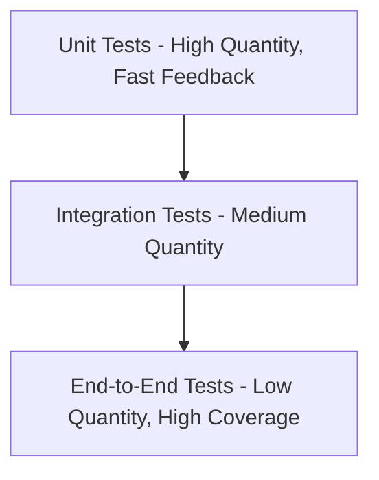

# Frontend Testing Strategy

## Purpose
The EMG™ Frontend Testing Strategy defines the mandatory testing standards required to ensure the platform’s frontend surfaces are stable, maintainable, and secure. Its purpose is to provide a robust testing framework that enables high-confidence deployments, minimizes regression risks, and empowers developers to refactor with assurance.

## Scope
This specification governs all frontend testing layers, including unit testing for components and utilities, integration testing for feature modules and API interactions, and end-to-end (E2E) testing for critical user paths.

## Responsibilities
- **Frontend Engineering:** Responsible for writing and maintaining high-quality tests, adhering to the testing pyramid, and ensuring comprehensive coverage.
- **Platform Engineering:** Responsible for providing the testing infrastructure (CI pipelines, test runners, mocking tools) and ensuring consistent execution.

## Dependencies
- **[Testing Strategy](../../engineering/testing-strategy.md)**: The foundational testing philosophy for the platform.

## Architecture Alignment
This strategy follows the platform's "Test-by-Construction" philosophy, ensuring that testing is an integral part of the development lifecycle, not an afterthought.

## Architecture Rationale
Why a layered testing approach?
1. **Confidence:** A multi-layered strategy (Unit/Integration/E2E) ensures that defects are caught at the earliest possible stage, significantly reducing remediation costs.
2. **Refactoring:** Comprehensive test suites are essential for maintaining architectural modularity and enabling safe, iterative improvements to the codebase.
3. **Regression Prevention:** Automated E2E tests for critical paths are the primary defense against breaking changes in production.

## Implementation Guidelines

### 1. The Testing Pyramid


### 2. Implementation Example (Component Unit Test)
```tsx
// @/components/ui/Button.test.tsx
import { render, screen } from '@testing-library/react';
import { Button } from './Button';

test('renders button label correctly', () => {
  render(<Button label="Click Me" />);
  expect(screen.getByText('Click Me')).toBeInTheDocument();
});
```

## Security Considerations
- **Isolated Testing:** Test suites must not use production credentials or access sensitive data. Use appropriately configured test environments and mocks.
- **Vulnerability Testing:** Incorporate automated scanning into the testing pipeline to identify security regressions.

## Performance Considerations
- **Test Execution Speed:** Unit tests must be fast (sub-millisecond/test) to facilitate rapid CI feedback. Utilize mocking and parallelization to scale integration and E2E tests.

## Scalability Considerations
- **Test Infrastructure:** As the codebase grows, the testing infrastructure must scale horizontally to prevent CI pipeline bottlenecks.

## Operational Considerations
- **Test Reporting:** Test results (including coverage reports) must be published in the CI pipeline for auditability and to track quality metrics.

## Governance Rules
- All new features and bug fixes require a corresponding test case.
- Mandatory minimum code coverage thresholds must be enforced in CI.

## Best Practices
- **Prioritize Unit Tests:** Focus the majority of efforts on fast, focused unit tests.
- **E2E Critical Paths:** Only E2E test the most critical user journeys.
- **Mocking Strategy:** Use robust, contract-validated mocks for backend/BFF service interactions.

## Anti-Patterns & Common Mistakes
- **Brittle E2E Tests:** Relying on E2E tests for low-level component logic, leading to slow and flaky test suites.
- **Testing Implementation Details:** Over-testing internal component implementation details instead of testing component behavior.
- **Ignoring Failures:** Allowing tests to fail without immediate remediation, undermining the team's testing culture.

## Review Checklist
- [ ] Do tests cover critical user paths?
- [ ] Is test coverage meeting mandatory thresholds?
- [ ] Are mocks accurate and validated against API contracts?
- [ ] Are E2E tests running in a production-like environment?

## Definition of Done (DoD)
- Unit and integration tests pass for the new feature.
- Test coverage meets the platform’s minimum requirement.
- E2E test cases are documented and running in CI.

## Future Extensions
- **Visual Regression Testing:** Automating the detection of visual UI discrepancies in components and screens (e.g., using Chromatic or Percy).
