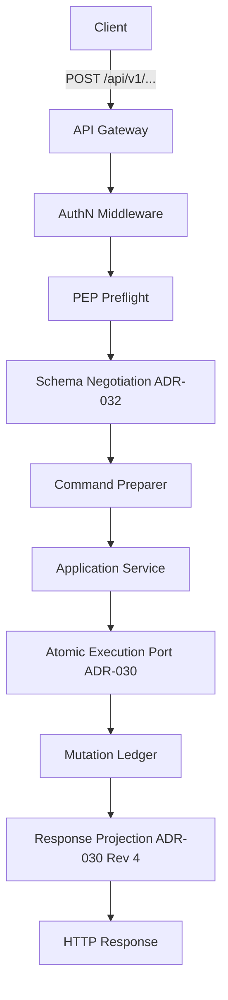
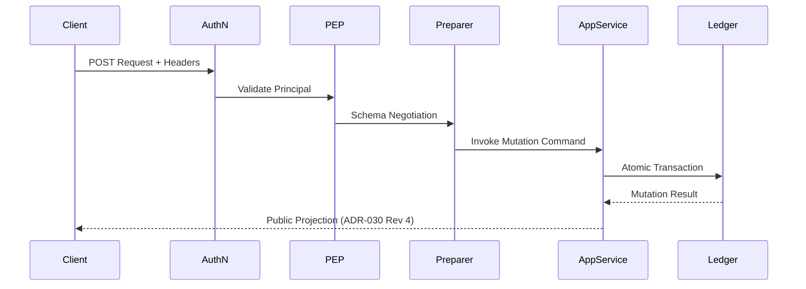

# ADR-033 Phase 4
## HTTP/API Delivery Layer
### Implementation Design Package

---

## 1. Purpose
The objective of Phase 4 is to expose the ratified Knowledge Graph mutation capability via a secure, robust, and performant HTTP/API delivery layer. This document serves as the authoritative implementation specification for the engineering team.

## 2. Scope
*   **Included:** FastAPI route implementation, schema negotiation infrastructure, AuthN/AuthZ preflight middleware, application layer wiring to existing `MutationCommand` handlers, and mapping of internal ledger results to public response projections.
*   **Not Included:** Business logic modification, persistence layer changes, GraphStore redesign, authentication service implementation, or frontend UI components.
*   **Constraint:** This design preserves all existing accepted ADRs (025–032) without modification.

## 3. Architecture Overview
The API layer adheres to Clean Architecture principles, acting as the Infrastructure Layer that translates HTTP requests into domain-specific `MutationCommand` objects.

## 4. API Versioning Strategy
*   **Versioning:** Path-based (`/api/v1/...`).
*   **Compatibility:** Additive changes only. Breaking changes require a version bump.
*   **Schema Negotiation:** Clients negotiate the schema version via the `Preferred-Schema-Version` header. The server validates negotiation against the authoritative `CompatibilityMatrix` (ADR-032).

## 5. Endpoint Inventory

| Operation | Method | URI | AuthN | AuthZ Policy |
| :--- | :--- | :--- | :--- | :--- |
| Create Entity | POST | `/api/v1/entities` | JWT | `knowledge-graph.entity:create` |
| Replace Entity | PUT | `/api/v1/entities/{id}` | JWT | `knowledge-graph.entity:update` |
| Retire Entity | POST | `/api/v1/entities/{id}/retire` | JWT | `knowledge-graph.entity:retire` |
| Merge Entities | POST | `/api/v1/entities/{survivor_id}/merge` | JWT | `knowledge-graph.entity:merge` |
| Create Relationship | POST | `/api/v1/relationships` | JWT | `knowledge-graph.relationship:create` |
| Replace Relationship | PUT | `/api/v1/relationships/{id}` | JWT | `knowledge-graph.relationship:update` |
| Close Relationship | POST | `/api/v1/relationships/{id}/close` | JWT | `knowledge-graph.relationship:retire` |

## 6. Request Flow

## 7. Error Catalogue (RFC 7807)
Every error response returns a Problem Details object with: `type`, `title`, `status`, `detail`, `instance`, `trace_id`, `correlation_id`, and `audit_reference`.

| Status | Title | Usage |
| :--- | :--- | :--- |
| 400 | Bad Request | Schema validation, missing headers. |
| 401 | Unauthorized | Authentication failure. |
| 403 | Forbidden | AuthZ/Classification denial. |
| 404 | Not Found | Resource does not exist. |
| 409 | Conflict | Idempotency key/fingerprint mismatch. |
| 422 | Unprocessable | Business logic/command rejection. |
| 429 | Too Many Requests | Rate limit exceeded. |
| 500 | Internal Server Error | Unexpected service failure. |

## 8. Observability
*   **Tracing:** `X-Correlation-ID` header required; propagated to all downstream calls.
*   **Logging:** Structured JSON logs at every layer, including `trace_id` and `audit_reference`.
*   **Metrics:** `mutation_requests_total`, `mutation_latency_seconds`, `idempotency_hits_total`, `authorization_denials_total`.

## 9. Security Model
*   **Authorization:** Preflight evaluation via `PolicyEnforcementPoint` (ADR-025/026).
*   **Idempotency:** Strict key-fingerprinting; mismatch results in `409 Conflict`.
*   **Zero Trust:** All identity and classification claims are derived from validated JWT claims; server *never* trusts client-provided identity/tenant claims.

## 10. Testing Strategy
*   **Unit Tests:** DTO mapping logic.
*   **API Contract Tests:** Schema/Negotiation enforcement.
*   **Integration Tests:** End-to-end mutation flow (AuthZ -> Persistence -> Ledger).
*   **Concurrency Tests:** Idempotency key locking scenarios.
*   **Security Regression:** Classification enforcement tests.

## 11. Phase Breakdown

| Phase | Scope | Acceptance Criteria |
| :--- | :--- | :--- |
| **4A** | Infrastructure/Negotiation | Routes scaffolded; Schema negotiation endpoints live. |
| **4B** | Entity Mutations | Create/Replace/Retire/Merge implemented; AuthZ preflight active. |
| **4C** | Rel Mutations | Create/Replace/Close implemented; AuthZ preflight active. |
| **4D** | Response/Audit | ADR-030 Rev 4 projection enabled; Audit link verified. |
| **4E** | Validation/Hardening | All API integration tests pass; load testing complete. |

## 12. Definition of Done
*   All mutation endpoints fully functional, authorized, and compliant.
*   `IResourceMetadataReader` integrated into preflight pipeline.
*   Response projections match ADR-030 Revision 4 exactly.
*   Correlation/Traceability headers correctly propagated.
*   No new architectural debt created.

## 13. Future Work
*   Bulk/Batch mutation endpoints.
*   Advanced query capability over the mutation ledger (Stage 5).
*   Tenant-specific self-service recovery portal.

## 14. Appendix
*   **Referenced ADRs:** ADR-025, ADR-026, ADR-027 (Revision 4), ADR-030 (Revision 4), ADR-032.
*   **Referenced Modules:** `emg-knowledge-graph-api`, `emg-auth-client`, `emg-policy-engine`, `emg-persistence`.
