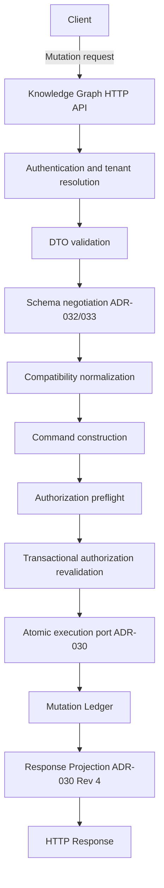
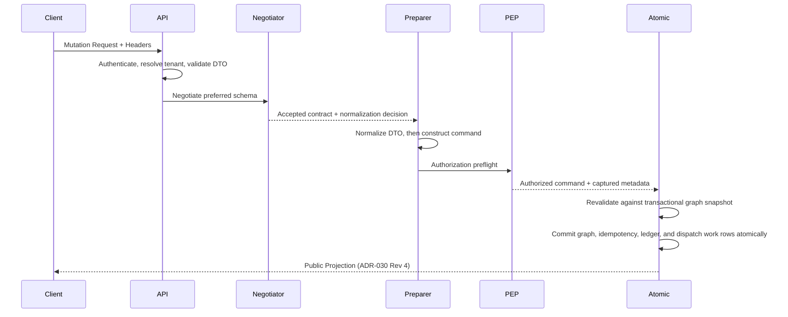

# ADR-027 Revision 5
## Stage 4 — Phase 4A
### HTTP/API Delivery Conformance Package

---

## 1. Purpose
The objective of ADR-027 Revision 5 Stage 4 Phase 4A is to expose the ratified Knowledge Graph mutation capability through a secure, robust, and performant HTTP/API delivery layer. This document is the conformance package for that delivery phase.

### 1.1 Implementation Status
ADR-027 Revision 5 Stage 4 Phase 4A is implemented. The five approved mutation routes are registered, schema negotiation is live on each mutation request, and this package records the final Phase 4A conformance state: identity normalization is an explicit always-run step, OpenAPI metadata reflects the live contract, and focused acceptance evidence covers the transport boundary. This status does not authorize new routes, commands, schema versions, or normalizers.

### 1.2 Phase Identity
The phase names belong to two distinct accepted plans and are not interchangeable:

*   **ADR-027 Revision 5 Stage 4 Phase 4A** is the HTTP/API delivery conformance phase governed by this package.
*   **ADR-033 Revision 2 Phase 4** is the future schema-registry phase that introduces the first genuine second schema version and its production normalizer. It has not started and is outside this package.

## 2. Scope
*   **Included:** FastAPI route implementation, schema negotiation infrastructure, authenticated transport and authorization-preflight dependency wiring, application-layer wiring to existing `MutationCommand` handlers, and mapping of internal ledger results to public response projections.
*   **Not Included:** Business logic modification, persistence layer changes, GraphStore redesign, authentication service implementation, or frontend UI components.
*   **Constraint:** This design preserves ADR-025, ADR-026, ADR-027 Revision 5, ADR-029, ADR-030 Revision 4, ADR-032, and ADR-033 Revision 2 without modification.

## 3. Architecture Overview
The API layer adheres to Clean Architecture principles, acting as the Infrastructure Layer that translates HTTP requests into domain-specific `MutationCommand` objects.

After authentication and tenant resolution, the accepted mutation pipeline order is normative and must not vary:

`DTO validation` → `schema negotiation` → `normalization` → `command construction` → `authorization preflight` → `transactional revalidation` → `atomic execution`.

## 4. API Versioning Strategy
*   **Versioning:** Path-based (`/api/v1/...`).
*   **Compatibility:** Additive changes only. Breaking changes require a version bump.
*   **Schema Negotiation:** Clients negotiate the schema version via the `Preferred-Schema-Version` header. The server validates negotiation against the authoritative compatibility catalog defined by ADR-032 and ADR-033.
*   **Negotiation Surface:** “Schema negotiation endpoints live” means that negotiation runs on every approved mutation request. It does not define or authorize a standalone negotiation endpoint.
*   **Schema Discovery:** ADR-033 calls for a supported-schema discovery surface, but its URI, authentication model, and response DTO are not ratified. Discovery is governance-blocked and deferred; ADR-027 Stage 4 Phase 4A must not invent an endpoint.

## 5. Endpoint Inventory

| Operation | Method | URI | AuthN | AuthZ Policy |
| :--- | :--- | :--- | :--- | :--- |
| Create Entity | POST | `/api/v1/entities` | JWT | `knowledge-graph.entity:create` |
| Replace Entity | PUT | `/api/v1/entities/{entity_id}` | JWT | Action-dependent: `knowledge-graph.entity:update`, `knowledge-graph.entity:retire`, `knowledge-graph.entity:restore`, or `knowledge-graph.entity:reclassify` |
| Merge Entities | POST | `/api/v1/entities/{survivor_id}/merge` | JWT | `knowledge-graph.entity:merge` |
| Replace Relationship | PUT | `/api/v1/relationships/{edge_id}` | JWT | `knowledge-graph.relationship:update` |
| Close Relationship | POST | `/api/v1/relationships/{edge_id}/close` | JWT | `knowledge-graph.relationship:retire` |

This is the complete mutation transport surface approved by ADR-027 Revision 5. Entity retirement, restoration, and reclassification are actions of Replace Entity; they are not independent routes or commands. Create Relationship is not part of the approved HTTP surface.

## 6. Request Flow

## 7. Current Error Contract
Application errors currently use the repository-standard `ApiResponse`/`ApiError` envelope, with a stable error code, safe public message, and correlation identifier. Framework-level request validation retains FastAPI's existing HTTP 422 response behavior. ADR-027 Stage 4 Phase 4A does not redesign this contract and does not mandate RFC 7807. Adopting RFC 7807 or another unified error representation requires a separate governance decision and coordinated API-contract migration.

| Status | Usage |
| :--- | :--- |
| 400 | Invalid mutation command or path/body identity mismatch. |
| 401 | Authentication failure. |
| 403 | Authorization or classification denial. |
| 404 | Resource metadata or requested resource does not exist. |
| 409 | Authorization revalidation, idempotency, or persistence conflict. |
| 422 | Transport validation, unsupported client schema, or mutation build rejection. |
| 503 | Idempotency contention or unsupported fingerprint version; retry metadata is preserved where defined by ADR-030. |
| 500 | Unexpected service, replay-integrity, or compatibility-adapter failure. |

## 8. Observability
*   **Tracing:** `X-Correlation-ID` is optional. Existing middleware accepts a caller-supplied value or generates one when absent, then returns and propagates it.
*   **Logging:** Structured JSON logs at every layer, including correlation and audit metadata where available.
*   **Metrics:** `mutation_requests_total`, `mutation_latency_seconds`, `idempotency_hits_total`, and `authorization_denials_total` remain later ADR-027 delivery-hardening targets; ADR-033 negotiation metrics retain their accepted definitions.

## 9. Security Model
*   **Authorization:** Preflight evaluation via `PolicyEnforcementPoint` (ADR-025/026), followed by revalidation against the exact graph snapshot inside the transaction.
*   **Idempotency:** Strict key-fingerprinting; mismatch results in `409 Conflict`.
*   **Zero Trust:** All identity and classification claims are derived from validated JWT claims; server *never* trusts client-provided identity/tenant claims.

## 10. Testing Strategy
*   **Unit Tests:** DTO mapping and compatibility-normalization logic.
*   **API Contract Tests:** Schema-negotiation enforcement, headers, OpenAPI, path/body identity, and zero-dispatch rejection behavior.
*   **Integration Tests:** End-to-end mutation flow through authorization, transactional revalidation, persistence, and ledger.
*   **Concurrency Tests:** Idempotency-key locking scenarios.
*   **Security Regression:** Classification enforcement and authorization-race tests.

## 11. ADR-027 Stage 4 Delivery Status

| Phase | Scope | Status |
| :--- | :--- | :--- |
| **4A** | HTTP/API delivery conformance | **Implemented.** Five ADR-027 Revision 5 routes registered; schema negotiation live on mutation requests; always-run normalization, OpenAPI, and focused acceptance evidence complete. Merged to `develop` at `aefc82c`. |
| **4B** | Mutation-path observability emission | **Approved, not started.** `mutation_requests_total`, `mutation_latency_seconds`, `idempotency_hits_total`, `authorization_denials_total`, and safe structured-log field completion at the mutation boundary. No new route, no new command, no DTO change, no payload or classification content in metric labels, no metrics backend, no dashboards, no alerts, no tracing collector, no production-readiness work. Emission only; ADR-015 / FEAT-12-3 owns collection and alerting. |
| **4C** | — | **Closed as not required (D-A-004, 2026-08-01).** A batch mutation HTTP route is rejected for the current Stage 4 scope. The five-route surface in §5 remains authoritative and complete. Batch semantics (ADR-027 §11.1, §10.5) remain accepted and unexposed; any future transport requires a new Board decision and ADR-027 Revision 6. |
| **4D** | — | **Closed as not required (D-A-004, 2026-08-01).** Deployment documentation and rollout remain ADR-027 Stage 5; infrastructure, secrets, observability backends, HA/DR, dashboards, and alerting remain in the production-readiness track. |
| **4E** | Stage 4 governance and conformance closure | **Approved, not started.** Documentation and register reconciliation only; no new capability. |

Stage 4 scope was resolved by decision D-A-004 (Architecture Board,
2026-08-01; accountable owner: Chief Data Officer). This package records that
resolution; it does not create or amend an ADR.

## 12. Definition of Done
*   All five approved mutation endpoints fully functional, authorized, and compliant.
*   `IResourceMetadataReader` integrated into the preflight pipeline.
*   Response projections match ADR-030 Revision 4 exactly.
*   Correlation/Traceability headers correctly propagated.
*   No new architectural debt created.

## 13. Future Work
*   Bulk/Batch mutation endpoints — **rejected for the current Stage 4 scope by D-A-004 (2026-08-01)**; batch semantics remain accepted at ADR-027 §11.1 and §10.5 and unexposed. Any future transport requires a new Architecture Board decision and ADR-027 Revision 6.
*   Advanced query capability over the mutation ledger (Stage 5).
*   Tenant-specific self-service recovery portal — no UI is authorized in ADR-027 Stage 4 (D-A-004, BD-6).
*   Supported-schema discovery surface, after its transport contract is ratified (T-A-002; outside Stage 4 per D-A-004, BD-7).

## 14. Appendix
*   **Governing delivery ADR:** ADR-027 Revision 5, Stage 4 Phase 4A.
*   **Consumed schema ADR:** ADR-033 Revision 2, implemented through its Phase 3. Its distinct Phase 4—the first genuine second schema version and production normalizer—has not started and is outside this package.
*   **Other referenced ADRs:** ADR-025, ADR-026, ADR-029, ADR-030 Revision 4, and ADR-032.
*   **Referenced Modules:** `emg-knowledge-graph-api`, `emg-auth-client`, `emg-policy-engine`, `emg-persistence`.
